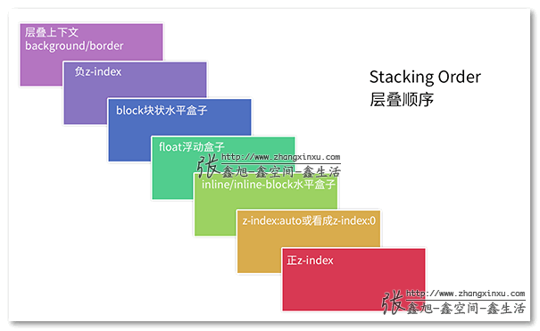
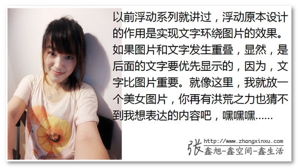
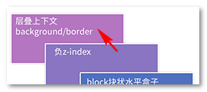

> 转载于  [张鑫旭](https://www.zhangxinxu.com/wordpress/2016/01/understand-css-stacking-context-order-z-index/)

### 简短总结

#### 什么是层叠上下文

​	层叠上下文，英文称作”stacking context”. 是HTML中的一个三维的概念。简单来说就是一个容器，比普通元素高一个层级

如何产生一个层叠上下文

#### 如何创建[层叠上下文(MDN)](https://developer.mozilla.org/zh-CN/docs/Web/Guide/CSS/Understanding_z_index/The_stacking_context?spm=taofed.bloginfo.blog.3.19585ac8FPDXDu)

1. 文档根元素（`<html>`）；
2. [`position`](https://developer.mozilla.org/zh-CN/docs/Web/CSS/position) 值为 `absolute`（绝对定位）或 `relative`（相对定位）且 [`z-index`](https://developer.mozilla.org/zh-CN/docs/Web/CSS/z-index) 值不为 `auto` 的元素；
3. [`position`](https://developer.mozilla.org/zh-CN/docs/Web/CSS/position) 值为 `fixed`（固定定位）或 `sticky`（粘滞定位）的元素（沾滞定位适配所有移动设备上的浏览器，但老的桌面浏览器不支持）；
4. flex ([`flexbox`](https://developer.mozilla.org/zh-CN/docs/Web/CSS/flexbox)) 容器的子元素，且 [`z-index`](https://developer.mozilla.org/zh-CN/docs/Web/CSS/z-index) 值不为 `auto`；
5. grid ([`grid`](https://developer.mozilla.org/zh-CN/docs/Web/CSS/grid)) 容器的子元素，且 [`z-index`](https://developer.mozilla.org/zh-CN/docs/Web/CSS/z-index) 值不为 `auto`；
6. [`opacity`](https://developer.mozilla.org/zh-CN/docs/Web/CSS/opacity) 属性值小于 `1` 的元素（参见 [the specification for opacity](http://www.w3.org/TR/css3-color/#transparency)）；
7. [`mix-blend-mode`](https://developer.mozilla.org/zh-CN/docs/Web/CSS/mix-blend-mode) 属性值不为 `normal` 的元素；
8. 以下任意属性值不为`none`的元素：
   - [`transform`](https://developer.mozilla.org/zh-CN/docs/Web/CSS/transform)
   - [`filter`](https://developer.mozilla.org/zh-CN/docs/Web/CSS/filter)
   - [`perspective`](https://developer.mozilla.org/zh-CN/docs/Web/CSS/perspective)
   - [`clip-path`](https://developer.mozilla.org/zh-CN/docs/Web/CSS/clip-path)
   - [`mask`](https://developer.mozilla.org/zh-CN/docs/Web/CSS/mask) / [`mask-image`](https://developer.mozilla.org/zh-CN/docs/Web/CSS/mask-image) / [`mask-border`](https://developer.mozilla.org/zh-CN/docs/Web/CSS/mask-border)
9. [`isolation`](https://developer.mozilla.org/zh-CN/docs/Web/CSS/isolation) 属性值为 `isolate` 的元素；
10. [`-webkit-overflow-scrolling`](https://developer.mozilla.org/zh-CN/docs/Web/CSS/-webkit-overflow-scrolling) 属性值为 `touch` 的元素；
11. [`will-change`](https://developer.mozilla.org/zh-CN/docs/Web/CSS/will-change) 值设定了任一属性而该属性在 non-initial 值时会创建层叠上下文的元素（参考[这篇文章](http://dev.opera.com/articles/css-will-change-property/)）；
12. [`contain`](https://developer.mozilla.org/zh-CN/docs/Web/CSS/contain) 属性值为 `layout`、`paint` 或包含它们其中之一的合成值（比如 `contain: strict`、`contain: content`）的元素。

#### 层叠上下文内部元素的顺序


#### 不同层叠上下文的层叠顺序

1. 如果层叠上下文元素不依赖`z-index`数值，则其层叠顺序是`z-index:auto`可看成`z:index:0`级别；
2. 如果层叠上下文元素依赖`z-index`数值，则其层叠顺序由`z-index`值决定。
3. 后台居上

#### 拓展：层叠图层和复合图层有什么区别和联系呢

##### 了解层

首先说明，这里讨论的是 WebKit，描述的是 Chrome 的实现细节，而并非是 web 平台的功能，因此这里介绍的内容不一定适用于其他浏览器。

- Chrome 拥有两套不同的渲染路径(rendering path)：硬件加速路径和旧软件路径(older software path)
- Chrome 中有不同类型的层： RenderLayer(渲染层)和GraphicsLayer(图形层，也称复合图层)，只有 GraphicsLayer 是作为纹理(texture)上传给GPU的。

浏览器中图层一般包含两大类：渲染图层（普通图层）以及复合图层

- 渲染图层，是页面普通的[文档流](https://blog.csdn.net/wangfeijiu/article/details/106563074)。我们**虽然可以通过绝对定位，相对定位，浮动定位脱离文档流**，但它**仍然属于默认渲染图层**，共用同一个绘图上下文对象（GraphicsContext）。
  - 满足形成层叠上下文条件的 LayoutObject 一定会**为其创建新的独立的渲染层**
- 复合图层，又称图形层。它会单独分配系统资源，每个复合图层都有一个独立的GraphicsContext。（当然也会脱离普通文档流，这样一来，不管这个复合图层中怎么变化，也不会影响默认复合层里的回流重绘）

> [淘宝的文章描述的很清楚](https://fed.taobao.org/blog/taofed/do71ct/performance-composite/)

***************

### 以下是转载原文

在这个世界上，凡事都有个先后顺序，凡物都有个论资排辈。比方说食堂排队打饭，对吧，讲求先到先得，总不可能一拥而上。再比如说话语权，老婆的话永远是对的，领导的话永远是对的。

在CSS届，也是如此。只是，一般情况下，大家歌舞升平，看不出什么差异，即所谓的众生平等。但是，当发生冲突发生纠葛的时候，显然，是不可能做到完全等同的，先后顺序，身份差异就显现出来了。例如，杰克和罗斯，只能一人浮在木板上，此时，出现了冲突，结果大家都知道的。那对于CSS世界中的元素而言，所谓的“冲突”指什么呢，其中，很重要的一个层面就是“层叠显示冲突”。

默认情况下，网页内容是没有偏移角的垂直视觉呈现，当内容发生层叠的时候，一定会有一个前后的层叠顺序产生，有点类似于真实世界中论资排辈的感觉。

而要理解网页中元素是如何“论资排辈”的，就需要深入理解CSS中的层叠上下文和层叠顺序。

我们大家可能都熟悉CSS中的`z-index`属性，需要跟大家讲的是，`z-index`实际上只是CSS层叠上下文和层叠顺序中的一叶小舟。

### 一、什么是层叠上下文

层叠上下文，英文称作”stacking context”. 是HTML中的一个三维的概念。如果一个元素含有层叠上下文，我们可以理解为这个元素在z轴上就“高人一等”。

这里出现了一个名词-**z轴**，指的是什么呢？

表示的是用户与屏幕的这条看不见的垂直线（参见下图示意-红线）：


层叠上下文是一个概念，跟「[块状格式化上下文(BFC)](http://www.zhangxinxu.com/wordpress/?p=4588)」类似。然而，概念这个东西是比较虚比较抽象的，要想轻松理解，我们需要将其具象化。

怎么个具象化法呢？

你可以**把「层叠上下文」理解为当官**：网页中有很多很多的元素，我们可以看成是真实世界的芸芸众生。真实世界里，我们大多数人是普通老百姓们，还有一部分人是做官的官员。OK，这里的“官员”就可以理解为网页中的层叠上下文元素。

换句话说，页面中的元素有了层叠上下文，就好比我们普通老百姓当了官，一旦当了官，相比普通老百姓而言，离皇帝更近了，对不对，就等同于网页中元素级别更高，离我们用户更近了。


### 二、什么是层叠水平

再来说说层叠水平。“层叠水平”英文称作”stacking level”，决定了同一个层叠上下文中元素在z轴上的显示顺序。level这个词很容易让我们联想到我们真正世界中的三六九等、论资排辈。真实世界中，每个人都是独立的个体，包括同卵双胞胎，有差异就有区分。例如，双胞胎虽然长得像Ctrl+C/Ctrl+V得到的，但实际上，出生时间还是有先后顺序的，先出生的那个就大，大哥或大姐。网页中的元素也是如此，页面中的每个元素都是独立的个体，他们一定是会有一个类似的排名排序的情况存在。而这个排名排序、论资排辈就是我们这里所说的“层叠水平”。层叠上下文元素的层叠水平可以理解为官员的职级，1品2品，县长省长之类；对于普通元素，这个嘛……你自己随意理解。

于是，显而易见，所有的元素都有层叠水平，包括层叠上下文元素，层叠上下文元素的层叠水平可以理解为官员的职级，1品2品，县长省长之类。然后，对于普通元素的层叠水平，我们的探讨仅仅局限在当前层叠上下文元素中。为什么呢？因为否则没有意义。

这么理解吧~ 上面提过元素具有层叠上下文好比当官，大家都知道的，这当官的家里都有丫鬟啊保镖啊管家啊什么的。所谓打狗看主人，A官员家里的管家和B官员家里的管家做PK实际上是没有意义的，因为他们牛不牛逼完全由他们的主子决定的。一人得道鸡犬升天，你说这和珅家里的管家和七侠镇娄知县县令家里的管家有可比性吗？李总理的秘书是不是分分钟灭了你村支部书记的秘书（如果有）。

翻译成术语就是：普通元素的层叠水平优先由层叠上下文决定，因此，层叠水平的比较只有在当前层叠上下文元素中才有意义。


需要注意的是，诸位千万不要把层叠水平和CSS的z-index属性混为一谈。没错，某些情况下z-index确实可以影响层叠水平，但是，只限于定位元素以及flex盒子的孩子元素；而层叠水平所有的元素都存在。

### 三、什么是层叠顺序

再来说说层叠顺序。“层叠顺序”英文称作”stacking order”. 表示元素发生层叠时候有着特定的垂直显示顺序，注意，这里跟上面两个不一样，上面的**层叠上下文和层叠水平是概念**，而这里的**层叠顺序是规则**。

在CSS2.1的年代，在CSS3还没有出现的时候（注意这里的前提），层叠顺序规则遵循下面这张图：


有人可能有见过类似图，那个图是很多很多年前老外绘制的，英文内容。而是更关键的是国内估计没有同行进行过验证与实践，实际上很多关键信息缺失。上面是我自己手动重绘的中文版同时补充很多其他地方绝对没有的重要知识信息。如果想要无水印高清大图，点击这里购买(0.5元)。

缺失的关键信息包括：

1. 位于最低水平的`border`/`background`指的是层叠上下文元素的边框和背景色。每一个层叠顺序规则适用于一个完整的层叠上下文元素。
2. 原图没有呈现inline-block的层叠顺序，实际上，inline-block和inline水平元素是同等level级别。
3. z-index:0实际上和z-index:auto单纯从层叠水平上看，是可以看成是一样的。注意这里的措辞——“单纯从层叠水平上看”，实际上，两者在层叠上下文领域有着根本性的差异。

下面我要向大家发问了，大家有没有想过，为什么内联元素的层叠顺序要比浮动元素和块状元素都高？


为什么呢？我明明感觉浮动元素和块状元素要更屌一点啊。

嘿嘿嘿，我就不卖关子了，直接看下图的标注说明：


诸如`border`/`background`一般为装饰属性，而浮动和块状元素一般用作布局，而内联元素都是内容。网页中最重要的是什么？当然是内容了哈，对不对！

因此，一定要让内容的层叠顺序相当高，当发生层叠是很好，重要的文字啊图片内容可以优先暴露在屏幕上。例如，文字和浮动图片重叠的时候：



上面说的这些层叠顺序规则还是老时代的，如果把CSS3也牵扯进来，科科，事情就不一样了。

### 四、务必牢记的层叠准则

下面这两个是层叠领域的黄金准则。当元素发生层叠的时候，其覆盖关系遵循下面2个准则：

1. **谁大谁上：**当具有明显的层叠水平标示的时候，如识别的z-indx值，在同一个层叠上下文领域，层叠水平值大的那一个覆盖小的那一个。通俗讲就是官大的压死官小的。
2. **后来居上：**当元素的层叠水平一致、层叠顺序相同的时候，在DOM流中处于后面的元素会覆盖前面的元素。

在CSS和HTML领域，只要元素发生了重叠，都离不开上面这两个黄金准则。因为后面会有多个实例说明，这里就到此为止。

### 五、层叠上下文的特性

层叠上下文元素有如下特性：

- 层叠上下文的层叠水平要比普通元素高（原因后面会说明）；
- 层叠上下文可以阻断元素的混合模式（见[此文第二部分说明](http://www.zhangxinxu.com/wordpress/?p=5155)）；
- 层叠上下文可以嵌套，内部层叠上下文及其所有子元素均受制于外部的层叠上下文。
- 每个层叠上下文和兄弟元素独立，也就是当进行层叠变化或渲染的时候，只需要考虑后代元素。
- 每个层叠上下文是自成体系的，当元素发生层叠的时候，整个元素被认为是在父层叠上下文的层叠顺序中。

翻译成真实世界语言就是：

- 当官的比老百姓更有机会面见圣上；
- 领导下去考察，会被当地官员阻隔只看到繁荣看不到真实民情；
- 一个家里，爸爸可以当官，孩子也是可以同时当官的。但是，孩子这个官要受爸爸控制。
- 自己当官，兄弟不占光。有什么福利或者变故只会影响自己的孩子们。
- 每个当官的都有属于自己的小团体，当家眷管家发生摩擦磕碰的时候（包括和其他官员的家眷管家），都是要优先看当官的也就是主子的脸色。

### 六、层叠上下文的创建

卖了这么多文字，到底层叠上下文是个什么鬼，倒是拿出来瞅瞅啊！

哈哈。如同块状格式化上下文，层叠上下文也基本上是有一些特定的CSS属性创建的。我将其总结为3个流派，也就是做官的3种途径：

1. **皇亲国戚**派：页面根元素天生具有层叠上下文，称之为“根层叠上下文”。
2. **科考入选**派：z-index值为数值的定位元素的传统层叠上下文。
3. **其他当官途径**：其他CSS3属性。

//zxx: 下面很多例子是实时CSS效果，建议您去[原地址浏览](http://www.zhangxinxu.com/wordpress/?p=5115)，以便预览更准确的效果。

**①. 根层叠上下文**
指的是页面根元素，也就是滚动条的默认的始作俑者`<html>`元素。这就是为什么，绝对定位元素在`left`/`top`等值定位的时候，如果没有其他定位元素限制，会相对浏览器窗口定位的原因。

**②. 定位元素与传统层叠上下文**
对于包含有`position:relative`/`position:absolute`的定位元素，以及FireFox/IE浏览器（不包括Chrome等webkit内核浏览器）（目前，也就是2016年初是这样）下含有`position:fixed`声明的定位元素，当其`z-index`值不是`auto`的时候，会创建层叠上下文。

知道了这一点，有些现象就好理解了。

如下HTML代码：

```
<div style="position:relative; z-index:auto;">
        <-- 横妹子 -->
</div>
<div style="position:relative; z-index:auto;">
        <-- 竖妹子 -->
</div>
```


大家会发现，竖着的妹子(mm2)被横着的妹子(mm1)给覆盖了。

下面，我们对父级简单调整下，把`z-index:auto`改成层叠水平一致的`z-index:0`, 代码如下：

```
<div style="position:relative; z-index:0;">
        <-- 横妹子 -->
</div>
<div style="position:relative; z-index:0;">
        <-- 竖妹子 -->
</div>
```


大家会发现，尼玛反过来了，竖着的妹子(mm2)这回趴在了横着的妹子(mm1)身上。


为什么小小的改变会有想法的结果呢？


差别就在于，`z-index:0`所在的`<div>`元素是层叠上下文元素，而`z-index:auto`所在的`<div>`元素是一个普通的元素，于是，里面的两个``妹子的层叠比较就不受父级的影响，两者直接套用层叠黄金准则，这里，两者有着明显不一的`z-index`值，因此，遵循“**谁大谁上**”的准则，于是，`z-index`为`2`的那个横妹子，就趴在了`z-index`为`1`的竖妹子身上。

而`z-index`一旦变成数值，哪怕是`0`，都会创建一个层叠上下文。此时，层叠规则就发生了变化。层叠上下文的特性里面最后一条——自成体系。两个``妹子的层叠顺序比较变成了优先比较其父级层叠上下文元素的层叠顺序。这里，由于两者都是`z-index:0`，层叠顺序这一块两者一样大，此时，遵循层叠黄金准则的另外一个准则“**后来居上**”，根据在DOM流中的位置决定谁在上面，于是，位于后面的竖着的妹子就自然而然趴在了横着的妹子身上。对，没错，``元素上的`z-index`打酱油了！

有时候，我们在网页重构的时候，会发现，`z-index`嵌套错乱，看看是不是受父级的层叠上下文元素干扰了。然后，可能没多大意义了，但我还是提一下，算是祭奠下，IE6/IE7浏览器有个bug，就是`z-index:auto`的定位元素也会创建层叠上下文。这就是为什么在过去，IE6/IE7的`z-index`会搞死人的原因。

然后，我再提一下`position:fixed`, 在过去，`position:fixed`和`relative/absolute`在层叠上下文这一块是一路货色，都是需要`z-index`为数值才行。但是，不知道什么时候起，Chrome等webkit内核浏览器，`position:fixed`元素天然层叠上下文元素，无需`z-index`为数值。根据我的测试，目前，IE以及FireFox仍是老套路。

**③. CSS3与新时代的层叠上下文**
CSS3的出现除了带来了新属性，同时还对过去的很多规则发出了挑战。例如，CSS3 `transform`[对overflow隐藏对position:fixed定位的影响](http://www.zhangxinxu.com/wordpress/2015/05/css3-transform-affect/)等。而这里，层叠上下文这一块的影响要更加广泛与显著。

如下：

1. `z-index`值不为`auto`的`flex`项(父元素`display:flex|inline-flex`).
2. 元素的`opacity`值不是`1`.
3. 元素的`transform`值不是`none`.
4. 元素`mix-blend-mode`值不是`normal`.
5. 元素的`filter`值不是`none`.
6. 元素的`isolation`值是`isolate`.
7. `will-change`指定的属性值为上面任意一个。
8. 元素的`-webkit-overflow-scrolling`设为`touch`.

基本上每一项都有很多槽点。

**1. display:flex|inline-flex与层叠上下文**
注意，这里的规则有些~~负责~~复杂。要满足两个条件才能形成层叠上下文：条件1是父级需要是`display:flex`或者`display:inline-flex`水平，条件2是子元素的z-index不是`auto`，必须是数值。此时，这个子元素为层叠上下文元素，没错，注意了，是子元素，不是flex父级元素。

眼见为实，给大家上例子吧。

如下HTML和CSS代码：

```
<div class="box">
    <div>
    	
    </div>
</div>
.box {  }
.box > div { background-color: blue; z-index: 1; }    /* 此时该div是普通元素，z-index无效 */
.box > div > img { 
  position: relative; z-index: -1; right: -150px;     /* 注意这里是负值z-index */
}
```

结果如下：


会发现，妹子跑到蓝色背景的下面了。为什么呢？层叠顺序图可以找到答案，如下：


从上图可以看出负值z-index的层叠顺序在block水平元素的下面，而蓝色背景`div`元素是个普通元素，因此，妹子直接穿越过去，在蓝色背景后面的显示了。

现在，我们CSS微调下，增加`display:flex`, 如下：

```
.box { display: flex; }
.box > div { background-color: blue; z-index: 1; }    /* 此时该div是层叠上下文元素，同时z-index生效 */
.box > div > img { 
  position: relative; z-index: -1; right: -150px;     /* 注意这里是负值z-index */
}
```

结果：


会发现，妹子在蓝色背景上面显示了，为什么呢？层叠顺序图可以找到答案，如下：


从上图可以看出负值`z-index`的层叠顺序在当前第一个父层叠上下文元素的上面，而此时，那个`z-index`值为`1`的蓝色背景`<div>`的父元素的`display`值是`flex`，一下子升官发财变成层叠上下文元素了，于是，图片在蓝色背景上面显示了。这个现象也证实了层叠上下文元素是`flex`子元素，而不是`flex`容器元素。

另外，另外，这个例子也颠覆了我们传统的对`z-index`的理解。在CSS2.1时代，`z-index`属性必须和定位元素一起使用才有作用，但是，在CSS3的世界里，非定位元素也能和`z-index`愉快地搞基。

**2. opacity与层叠上下文**
我们直接看代码，原理和上面例子一样，就不解释了。

如下HTML和CSS代码：

```
<div class="box">
    
</div>
.box { background-color: blue;  }
.box > img { 
  position: relative; z-index: -1; right: -150px;
}
```

结果如下：


然后价格透明度，例如50%透明：

```
.box { background-color: blue; opacity: 0.5;  }
.box > img { 
  position: relative; z-index: -1; right: -150px;
}
```

结果如下：


原因就是半透明元素具有层叠上下文，妹子图片的`z-index:-1`无法穿透，于是，在蓝色背景上面乖乖显示了。

**3. transform与层叠上下文**
应用了[transform变换](http://www.zhangxinxu.com/wordpress/2010/11/css3-transitions-transforms-animation-introduction/)的元素同样具有菜单上下文。

我们直接看应用后的结果，如下CSS代码：

```
.box { background-color: blue; transform: rotate(15deg);  }
.box > img { 
  position: relative; z-index: -1; right: -150px;
}
```

结果如下：


妹子同样在蓝色背景之上。

**4. mix-blend-mode与层叠上下文**
`mix-blend-mode`类似于PS中的混合模式，之前专门有文章介绍-“[CSS3混合模式mix-blend-mode简介](http://www.zhangxinxu.com/wordpress/2015/05/css3-mix-blend-mode-background-blend-mode/)”。

元素和白色背景混合。无论哪种模式，要么全白，要么没有任何变化。为了让大家有直观感受，因此，下面例子我特意加了个原创平铺背景：

```
.box { background-color: blue; mix-blend-mode: darken;  }
.box > img { 
  position: relative; z-index: -1; right: -150px;
}
```

结果如下：


需要注意的是，目前，IE浏览器(包括IE14)还不支持`mix-blend-mode`，因此，要想看到妹子在背景色之上，请使用Chrome或FireFox。

同样的，因为蓝色背景元素升级成了层叠上下文，因此，`z-index:-1`无法穿透，在蓝色背景上显示了。

**5. filter与层叠上下文**
此处说的`filter`是CSS3中规范的滤镜，不是旧IE时代私有的那些，虽然目的类似。同样的，我之前有提过，例如[图片的灰度](http://www.zhangxinxu.com/wordpress/2012/08/css-svg-filter-image-grayscale/)或者[图片的毛玻璃效果](http://www.zhangxinxu.com/wordpress/2013/11/css-svg-image-blur/)等。

我们使用常见的模糊效果示意下：

```
.box { background-color: blue; filter: blur(5px);  }
.box > img { 
  position: relative; z-index: -1; right: -150px;
}
```

结果如下：


好吧，果然被你猜对了，妹子蓝色床上躺着，只是你眼镜摘了，看得有些不够真切罢了。

**6. isolation:isolate与层叠上下文**
`isolation:isolate`这个声明是`mix-blend-mode`应运而生的。默认情况下，`mix-blend-mode`会混合z轴所有层叠在下面的元素，要是我们不希望某个层叠的元素参与混合怎么办呢？就是使用`isolation:isolate`。由于一言难尽，我特意为此写了篇文章：“[理解CSS3 isolation: isolate的表现和作用](http://www.zhangxinxu.com/wordpress/?p=5155)”，解释了其阻隔混合模式的原理，建议大家看下。

要演示这个效果，我需要重新设计下，如下HTML结构：

```

<div class="box">
    
</div>
```

CSS主要代码如下：

```
.mode {
  /* 竖妹子绝对定位，同时混合模式 */
  position: absolute; mix-blend-mode: darken;
}    
.box {
  background: blue;         
}
.box > img { 
  position: relative; z-index: -1;
}
```

结构如下：


会发现，横妹子被混合模式了。此时，我们给妹子所在容器增加`isolation:isolate`，如下CSS所示：

```
.mode {
  /* 竖妹子绝对定位，同时混合模式 */
  position: absolute; mix-blend-mode: darken;
}    
.box {
  background: blue; isolation:isolate;         
}
.box > img { 
  position: relative; z-index: -1;
}
```

结果为：


会发现横着的妹子跑到蓝色背景上面了。这表明确实创建了层叠上下文。

**7. will-change与层叠上下文**
关于`will-change`，如果有同学还不了解，可以参见我之前写的文章：“[使用CSS3 will-change提高页面滚动、动画等渲染性能](http://www.zhangxinxu.com/wordpress/2015/11/css3-will-change-improve-paint/)”。

都是类似的演示代码：

```
.box { background-color: blue; will-change: transform;  }
.box > img { 
  position: relative; z-index: -1; right: -150px;
}
```

结果如下：


果然不出所料，妹子上了蓝色的背景。

### 七、层叠上下文与层叠顺序

本文多次提到，一旦普通元素具有了层叠上下文，其层叠顺序就会变高。那它的层叠顺序究竟在哪个位置呢？

这里需要分两种情况讨论：

1. 如果层叠上下文元素不依赖`z-index`数值，则其层叠顺序是`z-index:auto`可看成`z:index:0`级别；
2. 如果层叠上下文元素依赖`z-index`数值，则其层叠顺序由`z-index`值决定。

于是乎，我们上面提供的层叠顺序表，实际上还是缺少其他重要信息。我又花功夫重新绘制了一个更完整的7阶层叠顺序图（同样的版权所有，商业请购买，可得无水印大图）：


大家知道为什么定位元素会层叠在普通元素的上面吗？

其根本原因就在于，元素一旦成为定位元素，其`z-index`就会自动生效，此时其`z-index`就是默认的`auto`，也就是`0`级别，根据上面的层叠顺序表，就会覆盖`inline`或`block`或`float`元素。

而不支持z-index的层叠上下文元素天然`z-index:auto`级别，也就意味着，层叠上下文元素和定位元素是一个层叠顺序的，于是当他们发生层叠的时候，遵循的是“后来居上”准则。

我们可以速度测试下：

```


```


会发现，两者样式一模一样，仅仅是在DOM流中的位置不一样，导致他们的层叠表现不一样，后面的妹子趴在了前面妹子的身上。这也说明了，层叠上下文元素的层叠顺序就是`z-index:auto`级别。

**z-index值与层叠顺序**
如果元素支持z-index值，则层叠顺序就要好理解些了，比较数值大小嘛，小盆友都会，本质上是应用的“谁大谁上”的准则。在以前，我们只需要关心定位元素的z-index就好，但是，在CSS3时代，flex子项也支持`z-index`，使得我们面对的情况比以前要负复杂。然而，好的是，规则都是一样的，对于`z-index`的使用和表现也是如此，套用上面的7阶层叠顺序表就可以了。

同样，举个简单例子，看下`z-index:-1`和`z-index:1`变化对层叠表现的影响，如下两段HTML：

```
<div style="display:flex; background:blue;">
   
</div>
<div style="display:flex; background:blue;">
   
</div>
```

最后，会发现，`z-index:-1`跑到了背景色小面，而`z-index:1`高高在上。


**一个与层叠上下文相关的有趣的显示现象**
在实际项目中，我们可能会渐进使用CSS3的fadeIn淡入animation效果增强体验，于是，我们可能就会遇到类似下面的现象：

您可以狠狠地点击这里：[CSS3 fadeIn淡入animation动画有趣现象](http://www.zhangxinxu.com/study/201601/css3-fadein-animation-stacking-context.html)

有一个绝对定位的黑色半透明层覆盖在图片上，默认显示是这样的：


但是，一旦图片开始走fadeIn淡出的CSS3动画，文字跑到图片后面去了：


为什么会这样？

实际上，学了本文的内容，就很简单了！fadeIn动画本质是`opacity`透明度的变化：

```
@keyframes fadeIn {
  0% { 
    opacity: 0;
  }
  100% {
    opacity: 1;
  }
}
```

要知道，`opacity`的值不是`1`的时候，是具有层叠上下文的，层叠顺序是`z-index:auto`级别，跟没有`z-index`值的`absolute`绝对定位元素是平起平坐的。而本demo中的文字元素在图片元素的前面，于是，当CSS3动画只要不是最终一瞬间的`opacity: 1`，位于DOM流后面的图片就会遵循“后来居上”准则，覆盖文字。

这就是原因，于是，我们想要解决这个问题就很简单。

\1. 调整DOM流的先后顺序；
\2. 提高文字的层叠顺序，例如，设置`z-index:1`;

### 八、结束语

只要元素发生层叠，要解释其表现，基本上就本文的这些内容了。

我发现很多重构小伙伴都有z-index滥用，或者使用不规范的问题。我觉得最主要的原因还是对理解层叠上下文以及层叠顺序这些概念都不了解。例如，只要使用了定位元素，尤其`absolute`绝对定位，都离不开设置一个`z-index`值；或者只要元素被其他元素覆盖了，例如变成定位元素或者增加`z-index`值升级。页面一复杂，必然搞得乱七八糟。

实际上，在我看来，觉得多数常见，z-index根本就没有出现的必要。知道了内联元素的层叠水平比块状元素高，于是，某条线你想覆盖上去的时候，需要设置`position:relative`吗？不需要，`inline-block`化就可以。因为IE6/IE7 `position:relative`会创建层叠上下文，很烦的。

OK，本文已经够长了，就不多啰嗦了。