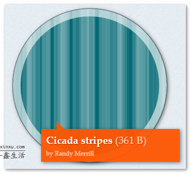

# “蝉原则”与CSS3随机多背景随机圆角等效果

## 什么是“蝉原则”？

“蝉原则”，英文称作“cicada principle”，是一种让事物的重复出现符合“自然随机性”的规则，为什么这么说呢？  

“蝉原则”源自于北美，中国似乎并未有这样的说法，这背后是有有故事的：  

北美和东亚蝉的种群是不一样的，在东亚蝉的幼虫生活在土中3年5年或7年；但是北美有一种周期蝉（Magicicada），其生命周期为十三年或十七年，也被称为十七年蝉或十三年蝉。东亚的蝉生命周期短，因此，给人感觉好像每年都有很多蝉，而北美的周期蝉的生命周期很长，因此能够让人明显感觉到每隔十几年蝉的数量就会大规模爆发一下，于是就会引发一些科学家的好奇，为什么生命周期是十三年或者十七年呢？
蝉的天敌鸟类其繁荣萧条周期是具有规律性的（一般2至6年），然后不断重复。十三年或者十七年中的13和17都是质数，而吃蝉的鸟类一般寿命都不超过13年，因此就不会遇到上一世代所遇到的天敌。  
东亚蝉的幼虫生活的年限比较短，可能与东亚的主要鸟类种群寿命不长有关，例如麻雀就2年寿命。还有一个很重要的原因，就是一片区域的蝉他不止一个种群，而使用质数作为生命周期年数就可以避免钻出泥土时可以和别种群的蝉类一起钻出，这样竞争压力就会小。例如，北美的十七年蝉和十三年蝉每221年才会出现同时爆发的情况。  

这种以质数作为循环周期来增加“自然随机性”的策略就称之为“蝉原则”。
那“蝉原则”对我们网页设计有什么启示呢？那就是可以以最小成本实现更自然的随机效果。
本文就演示两个借助“蝉原则”和CSS3特性实现随机效果的例子。

## “蝉原则”下的CSS3 multiple Backgrounds随机多背景

在著名的CSS3背景底纹站点有这么一个案例，如下截图：  

  

从名称就可以看出其背后的原理，Cicada stripes是“蝉条纹”的意思，意思是说这里的随机背景线条实际上是使用“蝉原则”实现的。代码如下：

```
.stripes {
  background-color: #026873;
  background-image: linear-gradient(90deg, rgba(255,255,255,.07) 50%, transparent 50%),
    linear-gradient(90deg, rgba(255,255,255,.13) 50%, transparent 50%),
    linear-gradient(90deg, transparent 50%, rgba(255,255,255,.17) 50%),
    linear-gradient(90deg, transparent 50%, rgba(255,255,255,.19) 50%);
  background-size: 13px, 29px, 37px, 53px;
}
```

上面CSS代码显示总共有4个渐变背景图，然后每个背景图的颜色透明度以及区域范围都不一样，然后最终的随机效果，最关键的就是控制4个背景图循环尺寸的background-size属性，其对应的4个尺寸值13px, 29px, 37px, 53px全部都是质数，于是保证了最大的自然随机，最终的随机线条效果更自然。

## “蝉原则”下的CSS3 border-radius随机圆角效果

这里随机圆角效果可以参见这个站点：<http://2016.uxlondon.com/speakers>，效果截图如下：  

  
可以看到嘉宾的头像的圆角的大小都是随机的，不规则的，有的这里扁，又是那里歪，其实现也利用的“蝉原则”。  

其实现的原理是对:nth-child进行自然随机，按照原作者的话说，其原本是想类似下面实现：  

```
list:nth-child(2n) {}
list:nth-child(3n) {}
list:nth-child(5n) {}
list:nth-child(7n) {}
list:nth-child(11n) {}
```

但是发现不能覆盖所有的列表项，反而有些不自然，因此，进行了如下的改进：  

```
list:nth-child(2n + 1) {}
list:nth-child(3n + 2) {}
list:nth-child(5n + 3) {}
list:nth-child(7n + 4) {}
list:nth-child(11n + 5) {}
```

也就是后面再加一个小一号的质数值，于是，再配合默认效果，天衣无缝的随机列表交互就实现了，拿2n+1项举例：

```
 list {
   border-radius: 87% 91% 98% 100%;
 }
 list:hover {
   border-radius: 95% 70% 100% 80%;
   transform: rotate(-2deg);
 }
 .list:nth-child(2n+1) {
   border-radius: 59% 52% 56% 59%;
   transform: rotate(-6deg);
 }
 .list:nth-child(2n+1):hover {
   border-radius: 51% 67% 56% 64%;
   transform: rotate(-4deg);
 }
```

于是效果达成！

## 质数表

```
2 3 5 7 11 13 17
19 23 29 31 37 41
43 47 53 59 61 57 
71 73 79 83 89 97
```
