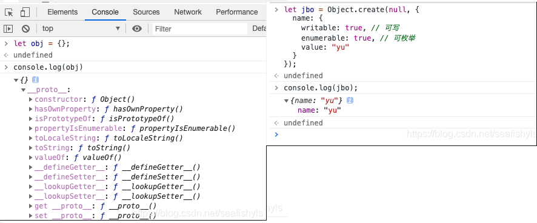
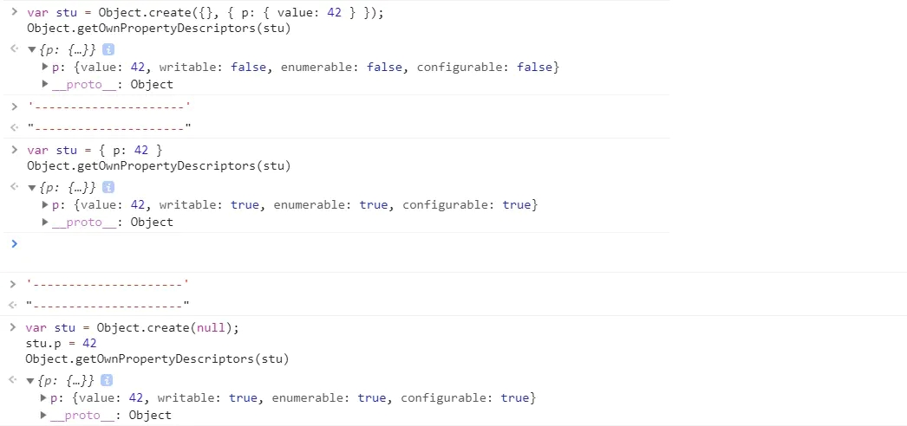
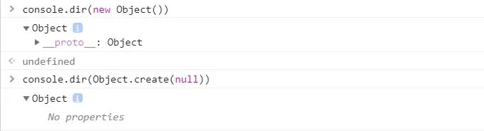
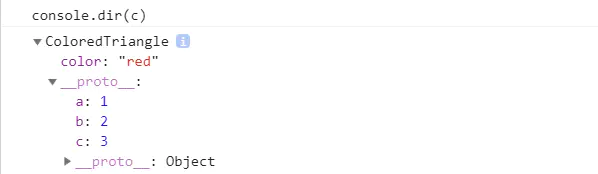

对象的详细方法见js高程第四版第八章

## 对象ES6之后方法的简单总结

本章介绍 Object 对象的新增方法。

### Object.is()

它**用来比较两个值是否严格相等，与严格比较运算符（===）的行为基本一致**。

不同之处只有两个：**一是`+0`不等于`-0`，二是`NaN`等于自身**。

```javascript
+0 === -0 //true
NaN === NaN // false

Object.is(+0, -0) // false
Object.is(NaN, NaN) // true
```

### Object.assign()

`Object.assign`方法用于对象的合并，将源对象（source）的所有**可枚举属性**，复制到目标对象（target）。

```javascript
const target = { a: 1 };

const source1 = { b: 2 };
const source2 = { c: 3 };

Object.assign(target, source1, source2);
target // {a:1, b:, c:3}
```

#### 注意点

`Object.assign`拷贝的属性是有限制的，

- 浅拷贝

- **只拷贝源对象的自身属性（不拷贝继承属性）**

- **不拷贝不可枚举的属性**（`enumerable: false`）

- `Object.assign`只能进行值的复制，无法复制取值函数，将求值后再复制

- 数组的处理

  > Object.assign([1, 2, 3], [4, 5])
  > // [4, 5, 3]

> 属性名为 Symbol 值的属性，也会被`Object.assign`拷贝。

#### 完整的复制对象

```
// 写法一 不能复制不可枚举 不能复制取值函数 
const clone2 = Object.assign(
  Object.create(Object.getPrototypeOf(obj)),
  obj
);

// 写法二  完美复制
const clone3 = Object.create(
  Object.getPrototypeOf(obj),
  Object.getOwnPropertyDescriptors(obj)
)

```

### Object.getOwnPropertyDescriptors()

ES5 的`Object.getOwnPropertyDescriptor(obj, prop)`方法会返回某个对象属性的描述对象（descriptor）。ES2017 引入了`Object.getOwnPropertyDescriptors()`方法，返回指定对象所有自身属性（**非继承属性**）的描述对象。

[描述对象MDN](https://developer.mozilla.org/zh-CN/docs/Web/JavaScript/Reference/Global_Objects/Object/defineProperty)

```javascript
const obj = {
  foo: 123,
  get bar() { return 'abc' }
};

Object.getOwnPropertyDescriptors(obj)
// { foo:
//    { value: 123,
//      writable: true,
//      enumerable: true,
//      configurable: true },
//   bar:
//    { get: [Function: get bar],
//      set: undefined,
//      enumerable: true,
//      configurable: true } }
```

### 原型链方法

JavaScript 语言的对象继承是通过原型链实现的。ES6 提供了更多原型对象的操作方法。

#### Object.setPrototypeOf()

`Object.setPrototypeOf`方法的作用与`__proto__`相同，用来设置一个对象的原型对象（prototype），返回参数对象本身。它是 **ES6 正式推荐的设置原型对象的方法**。

```javascript
// ==格式==
Object.setPrototypeOf(object, prototype)

// 用法
const o = Object.setPrototypeOf({}, null);
```

该方法等同于下面的函数。

```javascript
function setPrototypeOf(obj, proto) {
  obj.__proto__ = proto;
  return obj;
}
```

#### Object.getPrototypeOf()

该方法与`Object.setPrototypeOf`方法配套，用于读取一个对象的原型对象。

```javascript
Object.getPrototypeOf(obj);
```

### 遍历方法

`Object.keys()` `Object.values` `Object.entries`

都是不可遍历 **对象自身的（不含继承的）所有可遍历（enumerable）属性的键名**

ES5 引入了`Object.keys`方法，返回一个数组，成员是参数**对象自身的（不含继承的）所有可遍历（enumerable）属性的键名**。

```==javascript==
var obj = { foo: 'bar', baz: 42 };
Object.keys(obj)
// ["foo", "baz"]
```

ES2017 [引入](https://github.com/tc39/proposal-object-values-entries)了跟`Object.keys`配套的`Object.values`和`Object.entries`，作为遍历一个对象的补充手段，供`for...of`循环使用。

```javascript
let {keys, values, entries} = Object;
let obj = { a: 1, b: 2, c: 3 };

for (let key of keys(obj)) {
  console.log(key); // 'a', 'b', 'c'
}

for (let value of values(obj)) {
  console.log(value); // 1, 2, 3
}

for (let [key, value] of entries(obj)) {
  console.log([key, value]); // ['a', 1], ['b', 2], ['c', 3]
}
```

## Object.fromEntries()

**`Object.fromEntries()`方法是`Object.entries()`的逆操作，用于将一个键值对数组转为对象**。

```javascript
Object.fromEntries([
  ['foo', 'bar'],
  ['baz', 42]
])
// { foo: "bar", baz: 42 }
```

该方法的主要目的，是将键值对的数据结构还原为对象，因此特别适合将 Map 结构转为对象。

```javascript
// 例一
const entries = new Map([
  ['foo', 'bar'],
  ['baz', 42]
]);

Object.fromEntries(entries)
// { foo: "bar", baz: 42 }

```

## Object.create()

- 语法  
  Object.create(proto, [propertiesObject])
- 参数  
  - proto : 必须。表示新建对象的原型对象，即该参数会被赋值到目标对象(即新对象，或说是最后返回的对象)的原型上。该参数可以是null， 对象， 函数的prototype属性 （创建空的对象时需传null , 否则会抛出TypeError异常）。
  - propertiesObject : 可选。 如果没有指定为 undefined，则是要添加到新创建对象的不可枚举（默认）属性（即其自身的属性，而不是原型链上的枚举属性）对象的属性描述符以及相应的属性名称。这些属性对应Object.defineProperties()的第二个参数。
- 返回值  
  在指定原型对象上添加新属性后的对象

### 框架偏爱

很多框架源码作者使用它来初始化一个新的对象，难道是最佳实践？  
原因有二  

- 通过Object.create(null)创建出来的对象，没有任何属性，显示No properties。我们可以将其当成一个干净的 map 来使用，自主定义 toString,hasOwnProperty等方法，并且不必担心将原型链上的同名方法被覆盖。
- {...}创建的对象，使用for in遍历对象的时候，会遍历原型链上的属性，带来性能上的损耗。使用Object.create(null)则不必再对其进行遍历了。


### 案例说明

#### 1）创建对象的方式不同

new Object() 通过构造函数来创建对象, 添加的属性是在自身实例下。  
Object.create() es6创建对象的另一种方式，可以理解为继承一个对象, 添加的属性是在原型下。

```
// new Object() 方式创建
var a = {  rep : 'apple' }
var b = new Object(a)
console.log(b) // {rep: "apple"}
console.log(b.__proto__) // {}
console.log(b.rep) // {rep: "apple"}

// Object.create() 方式创建
var a = { rep: 'apple' }
var b = Object.create(a)
console.log(b)  // {}
console.log(b.__proto__) // {rep: "apple"}
console.log(b.rep) // {rep: "apple"}
```

Object.create()方法创建的对象时，属性是在原型下面的，也可以直接访问 b.rep // {rep: "apple"} ,
此时这个值不是吧b自身的，是它通过原型链**__proto__**来访问到b的值。

#### 2）创建对象属性的性质不同

```
// 创建一个以另一个空对象为原型,且拥有一个属性p的对象
o = Object.create({}, { p: { value: 42 } })

// 省略了的属性特性默认为false,所以属性p是不可写,不可枚举,不可配置的:
o.p = 24
o.p
//42

o.q = 12
for (var prop in o) {
   console.log(prop)
}
//"q"

delete o.p
//false
```

Object.create() 用第二个参数来创建非空对象的属性描述符默认是为false的，而构造函数或字面量方法创建的对象属性的描述符默认为true。看下图解析：  

  

#### 3）创建空对象时不同

  

当用构造函数或对象字面量方法创建空对象时，对象时有原型属性的，即有_proto_;
当用Object.create()方法创建空对象时，对象是没有原型属性的。

```
Object.create()   //Object prototype may only be an Object or null
Object.create('') //Object prototype may only be an Object or null
```

#### 4）__proto__ 属性

JavaScript 的对象继承是通过原型链实现的。ES6 提供了更多原型对象的操作方法。
__proto__属性，用来读取或设置当前对象的prototype对象。目前只有浏览器环境必须部署有这个属性，其他运行环境不一定要部署，因此不建议使用这个属性，而是使用下面这些来 **Object.setPrototypeOf()**（写操作,**它是 ES6 正式推荐的设置原型对象的方法**）、**Object.getPrototypeOf()**（读操作）、**Object.create()**（生成操作）代替。

##### 应用案例，原型属性的继承

```
var triangle = {a: 1, b: 2, c: 3};

function ColoredTriangle() {
  this.color = 'red';
}

//ColoredTriangle.prototype = triangle;  //ColoredTriangle.prototype.constructor === ColoredTriangle// false
Object.assign(ColoredTriangle.prototype, triangle) //ColoredTriangle.prototype.constructor === ColoredTriangle// true

var c = new ColoredTriangle();
```

打印出 实例c 看看结构是怎样的  

  

其中 color 属性在实例上，而其他的原型上。
现在来拷贝一个 实例 c2

```
var c2 = Object.assign({},c)
console.log(c2.color); //red
console.log(c2.a); //undefined
```

因为 Object.assign 是**不能拷贝到继承或原型上的方法的**。所以 实例c2 没有 a 这个属性。那要怎么要才能拷贝到原型上的方法呢？

- 第一种方法

```
var originProto = Object.getPrototypeOf(c);
var originProto2 = Object.create(originProto);
var c2 = Object.assign(originProto2, c);
//var c2 = Object.assign(Object.create(Object.getPrototypeOf(c)), c)

console.log(c2.color); // red
console.log(c2.a); // 1
```

这样就实现了原型属性的拷贝。
Object.getPrototypeOf(c) 既 originProto 得到的是原型上的 //{a: 1, b: 2, c: 3}；
Object.create(originProto) 既 originProto2 既是创建了一个 {a: 1, b: 2, c: 3} 在原型上的新对象；
Object.assign(originProto2, c) 在源对象originProto2 上合并对象 c (只能合并实例属性)；

- 第二种方法(推荐)

```
var c = new ColoredTriangle();
var c2 = Object.create(Object.getPrototypeOf(c), Object.getOwnPropertyDescriptors(c));

console.log(c2.color); // red
console.log(c2.a); // 1
```

可以把Object.create()的参数理解为：第一个参数是放在新对象的原型上的，第二个参数是放在新对象的实例上的。
Object.getPrototypeOf() 得到的是 c 对象的原型，然后作为第一个参数，所以会在新对象c2 的原型上。
Object.getOwnPropertyDescriptors() 得到是 c 对象自身的可枚举属性，作为第二个参数，放在 c2 的实例上。

**为什么说推荐这个方法呢？因为Object.assign() 方法不能正确拷贝 get ，set 属性。**
