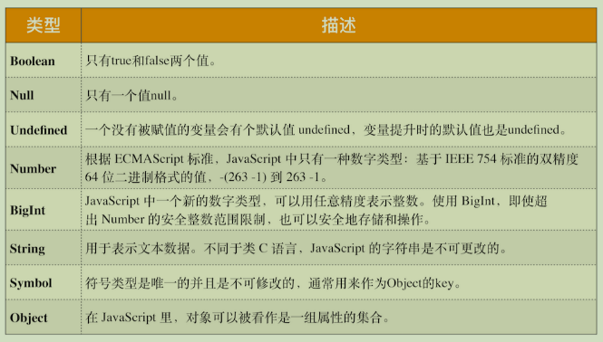
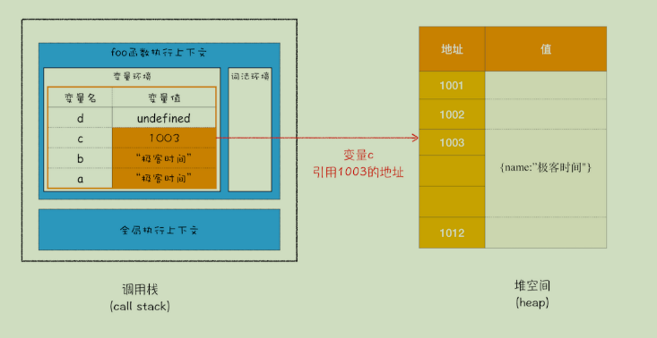
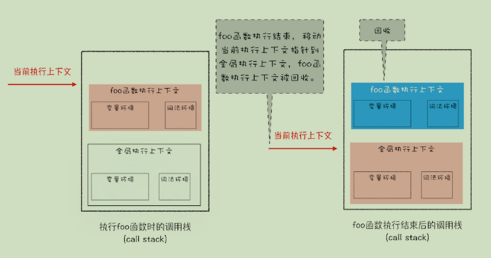
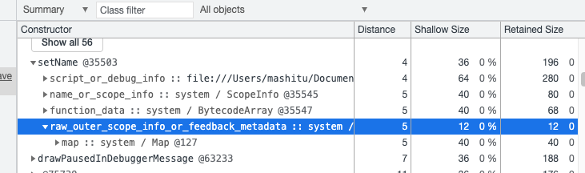

### 导言

众所众知，JavaScript是一种弱类型、动态语言。这意味着：

- **弱类型**，意味着你不需要告诉 JavaScript 引擎这个或那个变量是什么数据类型，JavaScript 引擎在运行代码的时候自己会计算出来。

- **动态**，意味着你可以使用同一个变量保存不同类型的数据。

其实 JavaScript 中的数据类型一种有 8 种，它们分别是：



我们把前面的 7 种数据类型称为**原始类型**，把最后一个对象类型称为**引用类型**，之所以把它们区分为两种不同的类型，**是因为它们在内存中存放的位置不一样**

### 内存空间

要理解 JavaScript 在运行过程中数据是如何存储的，你就得先搞清楚其存储空间的种类。下面是JavaScript 的内存模型，可以参考：


 在 JavaScript 的执行过程中， 主要有三种类型内存空间，分别是**代码空间、栈空间**和**堆空间**

#### 栈空间和堆空间

这里的栈空间就是**我们之前反复提及的调用栈，是用来存储执行上下文的**。为了搞清楚栈空间是如何存储数据的，我们还是先看下面这段代码：

```
function foo(){
 var a = " 极客时间 "
 var b = a
 var c = {name:" 极客时间 "}
 var d = c
}
foo()
```

最终分配好内存的示意图如下所示：



**可以认为简单类型的值都是存放在栈空间中，对象类型是存放在堆空间的，在栈空间中只是保留了对象的引用地址**

#### 为什么一定要分堆和栈两个存储空间

​ 这是因为 JavaScript 引擎需要用栈来维护程序执行期间上下文的状态，如果栈空间大了话，所有的数据都存放在栈空间里面，那么会影响到上下文切换的效率，进而又影响到整个程序的执行效率。

​ 下面简单介绍一下上下文的切换，比如文中的 foo 函数执行结束了，JavaScript 引擎需要离开当前的执行上下文，只需要将指针下移到上个执行上下文的地址就可以了，foo 函数执行上下文栈区空间全部回收。



#### 再谈闭包

这里简单的探讨下闭包的内存模型，看下述代码

```
function foo() {
 var myName = " 极客时间 "
 let test1 = 1
 const test2 = 2
 var innerBar = { 
  setName:function(newName){
   myName = newName
  },
  getName:function(){
   console.log(test1)
   return myName
  }
 }
 return innerBar
}
var bar = foo()
bar.setName(" 极客邦 ")
bar.getName()
console.log(bar.getName())
```

由闭包知识我们可以知道：了当 foo 函数的执行上下文销毁时，由于 foo 函数产生了闭包，所以变量 myName 和 test1 并没有被销毁，而是保存在内存中，那么应该如何解释这个现象呢？

要解释这个现象，我们就得站在内存模型的角度来分析这段代码的执行流程。

- 当 JavaScript 引擎执行到 foo 函数时，首先会编译，并创建一个空执行上下文。

- 在编译过程中，遇到内部函数 setName，JavaScript 引擎还要对内部函数做一次快速的词法扫描，发现该内部函数引用了 foo 函数中的 myName 变量，由于是内部函数引用了外部函数的变量，所以 JavaScript 引擎判断这是一个闭包，于是在堆空间创建换一个“closure(foo)”的对象（这是一个内部对象，JavaScript 是无法访问的），用来保存 myName 变量。

- 接着继续扫描到 getName 方法时，发现该函数内部还引用变量 test1，于是JavaScript 引擎又将 test1 添加到“closure(foo)”对象中。这时候堆中的“closure(foo)”对象中就包含了 myName 和 test1 两个变量了。

- 由于 test2 并没有被内部函数引用，所以 test2 依然保存在调用栈中。

- 当foo执行上下文销毁了，foo函数中的对closure(foo)的引用也断开了，但是setName和getName里面又重新建立起来了对closure(foo)引用

  > - 打开“开发者工具”
  > - 在控制台执行上述代码
  > - 然后选择“Memory”标签，点击"take snapshot" 获取V8的堆内存快照。
  > - 然后“command+f"(mac) 或者 "ctrl+f"(win),搜索“setName”，然后你就会发现setName对象下面包含了 **raw_outer_scope_info_or_feedback_metadata**，对闭包的引用数据就在这里面。（实际上也看不到闭包的数据）


