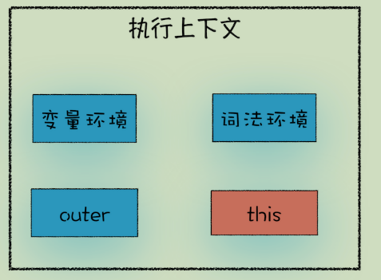

## this的由来

看下述一段代码

```

var bar = {
    myName:"time.geekbang.com",
    printName: function () {
        console.log(myName)
    }    
}
function foo() {
    let myName = "极客时间"
    return bar.printName
}
let myName = "极客邦"
let _printName = foo()
_printName()
bar.printName()
```

相信你已经知道了，在 printName 函数里面使用的变量 myName 是属于全局作用域下面的，所以最终打印出来的值都是“极客邦”

不过按照常理来说，调用bar.printName方法时，该方法内部的变量 myName 应该使用bar 对象中的，因为它们是一个整体，大多数面向对象语言都是这样设计的，以**在对象内部的方法中使用对象内部的属性是一个非常普遍的需求**。但是 JavaScript 的作用域机制并不支持这一点，基于这个需求，JavaScript 又搞出来另外一套**this 机制**。

## this到底是什么

`this` 是在运行时进行绑定的，**是和执行上下文绑定的**，并不是在编写时绑定，它的上下文取决于函数调用时的各种条件。`this`的绑定和**函数声明的位置没有任何关系，只取决于函数的调用方式**。



> 执行上下文其余相关的内容，在blog中浏览器原理中有详细介绍

## this的绑定规则

### 默认绑定

首先要介绍的是最常用的函数调用类型：**独立函数调用**。可以把这条规则看作是无法应用其他规则时的默认规则。
this指向window对象，在严格模式下指向 `undefined`

```
function foo() {      
  console.log( this.a ); 
} 
var a = 2; 
foo(); // 2
```

foo() 是直接使用不带任何修饰的函数引用进行调用的，因此只能使用默认绑定，无法应用其他规则。

### 隐式绑定

1. 另一条需要考虑的规则是调用位置是否有上下文对象，或者说是否被某个对象拥有或者包含

```
function foo() {      
  console.log( this.a ); 
} 
 
var obj = {
  a: 2,
  foo: foo
}; 
 
obj.foo(); // 2
```

2. 对象属性引用链中只有最顶层或者说**最后一层会影响调用结果**,看下例

```
function foo() {      
  console.log( this.a ); 
} 
var obj2 = {      
  a: 42,     
  foo: foo  
}; 
var obj1 = {      
  a: 2,     
  obj2: obj2  
}; 
obj1.obj2.foo(); // 42
```

3. 隐式丢失, 一个最常见的 this 绑定问题就是被隐式绑定的函数会丢失绑定对象，也就是说它会应用默认绑定，从而把 this 绑定到全局对象或者 undefined 上，取决于是否是严格模式

```
function foo() {      
  console.log( this.a ); 
} 
 
var obj = {      
  a: 2,     
  foo: foo  
}; 
 
var bar = obj.foo; // 函数别名！   
var a = "oops, global"; // a 是全局对象的属性 
bar(); // "oops, global"

```

> 虽然 bar 是 obj.foo 的一个引用，**但是实际上，它引用的是 foo 函数本身**，因此此时的 bar() 其实是一个不带任何修饰的函数调用，因此应用了默认绑定

一种更微妙、更常见并且更出乎意料的情况发生在传入回调函数时

```
function foo() {      
  console.log( this.a ); 
} 
function doFoo(fn) {     
  // fn 其实引用的是 foo 
  fn(); // <-- 调用位置！ 
} 
var obj = {      
  a: 2,     
  foo: foo  
}; 
var a = "oops, global"; // a 是全局对象的属性 
doFoo( obj.foo ); // "oops, global"
```

> 参数传递其实就是一种隐式赋值，因此我们传入函数时也会被隐式赋值，所以结果和上一个例子一样。

### 显式绑定

`call(..)` 、`apply(..)`和`bind(..)` 方法

```
function foo() {      
  console.log( this.a ); 
} 
 
var obj = {
  a:2 
}; 
 
foo.call( obj ); // 2

```

### new 绑定 （暂不深究）

在 JavaScript 中，构造函数只是一些使用 new 操作符时被调用的函数。它们并不会属于某个类，也不会实例化一个类。实际上， 它们甚至都不能说是一种特殊的函数类型，它们只是被 new 操作符调用的普通函数而已。
使用 new 来调用函数，或者说发生构造函数调用时，会自动执行下面的操作。

1. 创建（或者说构造）一个全新的对象。
2. 这个新对象会被执行 `[[ 原型 ]]` 连接。
3. 这个新对象会绑定到函数调用的 this。
4. 如果函数没有返回其他对象，那么 new 表达式中的函数调用会自动返回这个新对象

### 还有一些需要注意的示例

注意后三个示例，详细解释在 **同分类下-从ECMAScript规范解读this**中有解读

```
var value = 1;

var foo = {
  value: 2,
  bar: function () {
    return this.value;
  }
}

//示例1
console.log(foo.bar()); // 2
//示例2
console.log((foo.bar)()); // 2
//示例3
console.log((foo.bar = foo.bar)()); // 1
//示例4
console.log((false || foo.bar)()); // 1
//示例5
console.log((foo.bar, foo.bar)()); // 1
```

后三个类型，方便记忆的话，可以将其理解为隐式绑定，foo.bar被隐式的赋值了，相当于

```
var a = foo.bar
a()
```

但是需要注意第二个示例

## 关于this补充

可以帮助理解

[从ECMAScript规范解读this](https://github.com/mqyqingfeng/Blog/issues/7)

[极客时间](https://time.geekbang.org/column/article/128427)
