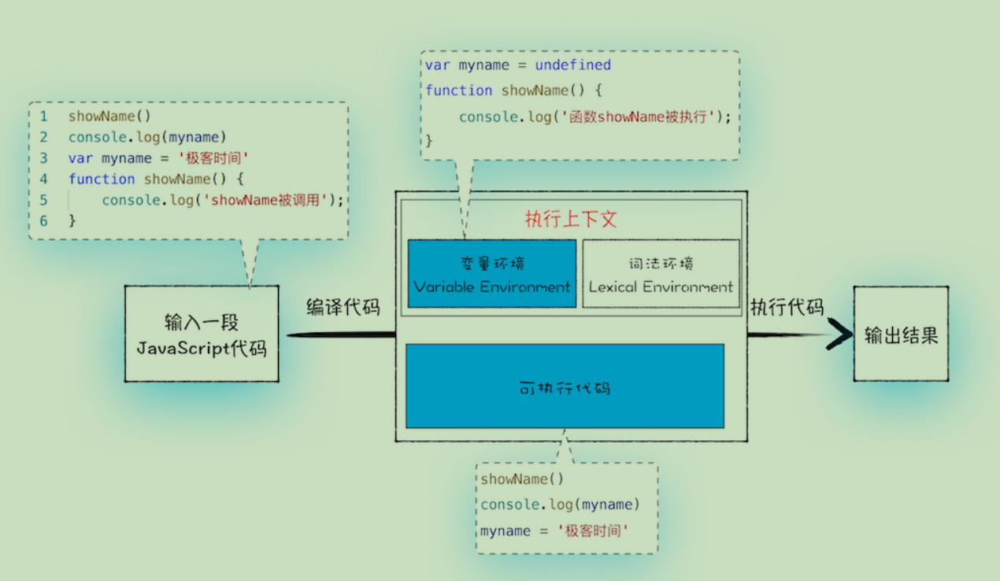

### 变量提升

```
showName()
console.log(myname)
var myname = '极客时间'
function showName() {
 console.log('函数 showName 被执行');
}
// 函数 showName 被执行
// undefined
```

最后输出的结果不太符合预期，其中的本质与js的执行过程有关，这种现象被称为变量提升

**所谓的变量提升，是指在 JavaScript 代码执行过程中，JavaScript 引擎把变量的声明部分和函数的声明部分提升到代码开头的“行为”。变量被提升后，会给变量设置默认值，这个默认值就是我们熟悉的 undefined。**

> 声明部分 指 var myname = 这部分 以及 完整的函数声明
>
> var bar = function(){} 这种与var bar = 1 并无大的区别，与function bar(){} 从编译过程来说截然不同

**实际上变量和函数声明在代码里的位置是不会改变的，而且是在编译阶段被 JavaScript 引擎放入内存中**

### 编译过程



从上图可以看出，输入一段代码，经过编译后，会生成两部分内容：**执行上下文（Execution context）和可执行代码**。

> 执行上下文也是一个特别重要的概念，会在后边具体分析

由此不难分析出打印的结果，但是如果存在**相同的命名**怎么处理，可以参考下述规则：

- 如果是同名的函数，JavaScript编译阶段会选择最后声明的那个。

- 如果变量和函数同名，那么在编译阶段，变量的声明会被忽略

### 执行上下文

#### 基本概念

执行上下文（以下简称“上下文”）的概念在 JavaScript 中是颇为重要的。变量或函数的上下文决定了它们可以访问哪些数据，以及它们的行为。每个上下文都有一个关联的**变量对象**（variable object），而这个上下文中定义的所有变量和函数都存在于这个对象上。

**执行上下文的组成代码示例：**

```text
const ExecutionContextObj = {
    VO: window, // 变量对象
    ScopeChain: {}, // 作用域链
    this: window
};
```

**执行上下文的组成图例示例：**


**上下文基本上有三类(包括ES6)**：

- 全局上下文 在浏览器环境下即为window
- 函数上下文（当代码执行流进入函数时，函数的上下文被推到一个上下文栈上。在函数执行完之后，上下文栈会弹出该函数上下文，将控制权返还给之前的执行上下文）
- eval上下文 （不考虑）

上下文中的代码在执行的时候，会创建**变量对象**的一个**作用域链**。

> 作用域链中的下一个变量对象来自包含上下文，再下一个对象来自再下一个包含上下文。以此类推直至全局上下文；全局上下文的变量对象始终是作用域链的最后一个变量对象

#### 函数上下文

**如果上下文是函数，则其活动对象（activation object）用作变量对象，下面以函数为例具体分析一下**

> 为什么称其为活动对象呢，因为只有到当进入一个执行上下文中，这个执行上下文的变量对象才会被激活，并且只有被激活的变量对象，其属性才能被访问。

以下面的例子为例，结合着之前讲的变量对象和执行上下文栈，我们来总结一下函数执行上下文中作用域链和变量对象的创建过程：

```
var scope = 'global scope';
function checkscope(s) {  
 var scope = 'local scope';  
 function f() {    
  return scope;
  }  
  return f();
}
checkscope('scope');
```

执行过程如下：

1.checkscope 函数被创建，保存作用域链到 内部属性[[scope]]

```
checkscope.[[scope]] = [
    globalContext.VO
];
```

2.执行 checkscope 函数，创建 checkscope 函数执行上下文，checkscope 函数执行上下文被压入执行上下文栈

```
ECStack = [
    checkscopeContext,
    globalContext
];
```

3.checkscope 函数并不立刻执行，开始做准备工作，第一步：复制函数[[scope]]属性创建**作用域链**

```
checkscopeContext = {
    Scope: checkscope.[[scope]],
}
```

4.第二步：用 arguments 创建活动对象，随后初始化活动对象，加入形参、函数声明、变量声明

```
checkscopeContext = {
    AO: {
        arguments: {
          0: 'scope',
          length: 1,
        },
        s: 'scope', // 传入的参数
        f: pointer to function f(),
        scope: undefined, // 此时声明的变量为undefined
    }，
    Scope: checkscope.[[scope]],
}
```

5.第三步：将活动对象压入 checkscope 作用域链顶端

```
checkscopeContext = {
    AO: {
        arguments: {
          0: 'scope',
          length: 1,
        },
        s: 'scope', // 传入的参数
        f: pointer to function f(),
        scope: undefined, // 此时声明的变量为undefined
    },
    Scope: [AO, [[Scope]]]
}
```

6.准备工作做完，开始执行函数，随着函数的执行，修改 AO 的属性值

```
checkscopeContext = {
    AO: {
        arguments: {
          0: 'scope',
          length: 1,
        },
        s: 'scope', // 传入的参数
        f: pointer to function f(),
        scope: 'local scope', // 变量赋值
    },
    Scope: [AO, [[Scope]]]
}
```

7.查找到 scope2 的值，返回后函数执行完毕，函数上下文从执行上下文栈中弹出

```
ECStack = [
    globalContext
];
```

#### 执行上下文的维护

说在执行 JavaScript 时，可能会存在多个执行上下文，那么 JavaScript 引擎是如何管理这些执行上下文的呢？

答案是**通过一种叫栈的数据结构来管理的**。

JavaScript 引擎正是利用栈的这种结构来管理执行上下文的。在执行上下文创建好后，JavaScript 引擎会将执行上下文压入栈中，通常把这种用来管理执行上下文的栈称为**执行上下文栈，又称调用栈**。

看如下代码

```
var a = 2
function add(b,c){
 return b+c
} 
function addAll(b,c){
 var d = 10
 result = add(b,c)
 return a+result+d
}
addAll(3,6)
```

**第一步，创建全局上下文，并将其压入栈底**。


**第二步是调用 addAll 函数**。当调用该函数时，JavaScript 引擎会编译该函数，并为其创建一个执行上下文，最后还将该函数的执行上下文压入栈中，如下图所示：


**第三步，当执行到 add 函数**调用语句时，同样会为其创建执行上下文，并将其压入调用栈，如下图所示：


当 add 函数返回时，该函数的执行上下文就会从栈顶弹出，并将 result 的值设置为 add函数的返回值，也就是 9。如下图所示：


紧接着 addAll 执行最后一个相加操作后并返回，addAll 的执行上下文也会从栈顶部弹出，此时调用栈中就只剩下全局上下文了。最终如下图所示：


至此，整个 JavaScript 流程执行结束了。

> 调用栈的跟踪可以借助chorme调试工具中的call stack 或者借助 console.trace()

#### 解决变量提升的弊端

ES6 通过 let const 解决了变量提升的问题，那么 ES6 又是如何在函数级作用域的基础之上，实现对块级作用域的支持呢？

变量对象应该包括 变量环境 和 词法环境

下面我们来看如下代码

```
function foo() {
  var a = 1
  let b = 2
  {
    let b = 3
    var c = 4
    let d = 5
    console.log(a)
    console.log(b)
  }
  console.log(b)
  console.log(c)
  console.log(d)
}
foo()
```

**第一步是编译并创建执行上下文**，下面是我画出来的执行上下文示意图，你可以参考下：


通过上图，我们可以得出以下结论：

- 函数内部通过 var 声明的变量，在编译阶段全都被存放到**变量环境**里面了。

- 通过 let 声明的变量，在编译阶段会被存放到**词法环境（Lexical Environment）**中。

- 在函数的作用域内部，通过 let 声明的变量并（**暂时**）没有被存放到词法环境中。

接下来，**第二步继续执行代码**，当执行到代码块里面时，变量环境中 a 的值已经被设置成了 1，词法环境中 b 的值已经被设置成了 2，这时候函数的执行上下文就如下图所示：


​ 从图中可以看出，当进入函数的作用域块时，作用域块中通过 let 声明的变量，会被存放在词法环境的一个单独的区域中，这个区域中的变量并不影响作用域块外面的变量，比如在作用域外面声明了变量 b，在该作用域块内部也声明了变量 b，当执行到作用域内部时，它们都是独立的存在。

​ 其实，**在词法环境内部，维护了一个小型栈结构**，栈底是函数最外层的变量，进入一个作用域块后，就会把该作用域块内部的变量压到栈顶；当作用域执行完成之后，该作用域的信息就会从栈顶弹出，这就是词法环境的结构。需要注意下，我这里所讲的变量是指通过 let 或者 const 声明的变量。

​ 再接下来，当执行到作用域块中的console.log(a)这行代码时，就需要在词法环境和变量环境中查找变量 a 的值了，具体查找方式是：沿着词法环境的栈顶向下查询，如果在词法环境中的某个块中查找到了，就直接返回给 JavaScript 引擎，如果没有查找到，那么继续在变量环境中查找。


当作用域块执行结束之后，其内部定义的变量就会从词法环境的栈顶弹出，最终执行上下文

如下图所示：


通过上面的分析，想必你已经理解了词法环境的结构和工作机制，**块级作用域就是通过词法环境的栈结构来实现的，而变量提升是通过变量环境来实现**，通过这两者的结合，JavaScript 引擎也就同时支持了变量提升和块级作用域了。

#### 查缺补漏--优秀blog文章

1. #### [JavaScript深入之执行上下文栈](https://github.com/mqyqingfeng/Blog/issues/4)

2. #### [JavaScript深入之变量对象](https://github.com/mqyqingfeng/Blog/issues/5)

3. #### [JavaScript深入之作用域链](https://github.com/mqyqingfeng/Blog/issues/6)

> 该作者其余文章  <https://github.com/mqyqingfeng/Blog>

#### Tips 为了防止链接失效，请看 深入执行上下文
