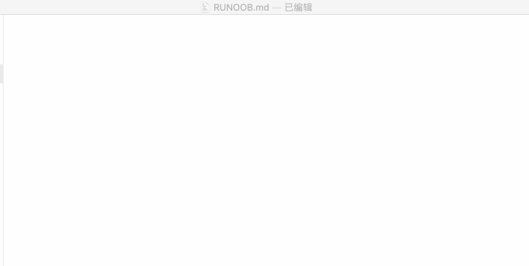
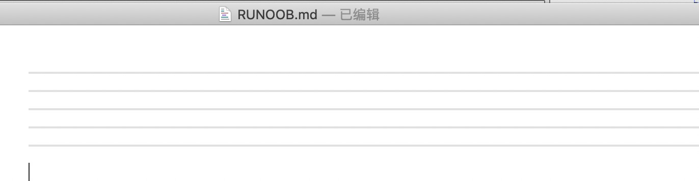

# markdown 基本使用

[markdown 基本使用](https://www.runoob.com/markdown/md-tutorial.html)

## 标题

使用 # 号可表示 1-6 级标题，一级标题对应一个 # 号，二级标题对应两个 # 号，以此类推。  

```
# 一级标题
## 二级标题
### 三级标题
#### 四级标题
##### 五级标题
###### 六级标题
```



## 段落

Markdown 段落没有特殊的格式，直接编写文字就好，段落的换行是使用两个以上空格加上回车。  


## 字体

Markdown 可以使用以下几种字体:  

```
*斜体文本*
_斜体文本_
**粗体文本**
__粗体文本__
***粗斜体文本***
___粗斜体文本___
```


## 分隔线

你可以在一行中用三个以上的星号、减号、底线来建立一个分隔线，行内不能有其他东西。你也可以在星号或是减号中间插入空格。下面每种写法都可以建立分隔线：

```
***
* * *
*****
- - -
----------
```



## 删除线

如果段落上的文字要添加删除线，只需要在文字的两端加上两个波浪线 ~~ 即可，实例如下：

```
RUNOOB.COM
GOOGLE.COM
~~BAIDU.COM~~
```


## 下划线

下划线可以通过 HTML 的 <u> 标签来实现：

<u>带下划线文本</u>


## 脚注

脚注是对文本的补充说明。

Markdown 脚注的格式如下:

[^要注明的文本]
以下实例演示了脚注的用法：  

创建脚注格式类似这样 [^RUNOOB]。  

[^RUNOOB]: 菜鸟教程 -- 学的不仅是技术，更是梦想！！！

