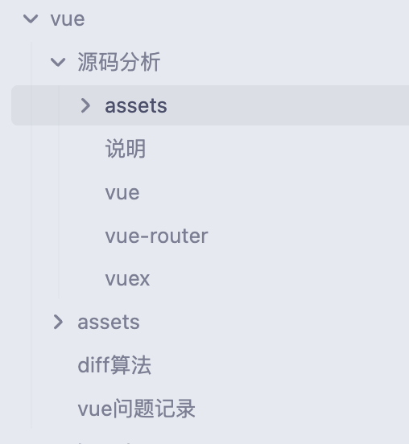

## 原因

 在写`md`文档的时候，不免插入一些图片，借助`typora`可以轻松的实现图片的插入，还可以设定文件夹，不过在`hexo`下只能存放在与`md`文档同名的文件夹下，特别混乱，尤其是借助`obsidan`浏览时。

 所有我就在文件夹下新增了一个`assets`文件夹，图片分类存放了进去，但是`hexo`无法处理，经过2天的研究终于搞定了。特记录如下：

## 方法

### 确定版本

```
"hexo": "^7.3.0",
"hexo-deployer-git": "^4.0.0",
"hexo-generator-archive": "^2.0.0",
"hexo-generator-category": "^2.0.0",
"hexo-generator-index": "^4.0.0",
"hexo-generator-searchdb": "^1.4.1",
"hexo-generator-tag": "^2.0.0",
"hexo-renderer-ejs": "^2.0.0",
"hexo-renderer-marked": "^6.3.0",
"hexo-renderer-stylus": "^3.0.1",
"hexo-server": "^3.0.0",
"hexo-theme-landscape": "^1.0.0",
"hexo-theme-next": "^8.20.0"
```

### \_config.yml

需要开启下面的配置

```yaml
post_asset_folder: true
marked:
  prependRoot: true
  postAsset: true

# 默认不会处理这类文件 需要配置下
include:
  - '**/assets/**'

```

## 修改源码

需要修改一个包的内容 `hexo-renderer-marked`，把`image`部分的处理修改一下

```JavaScript
image(href, title, text) {
    const { hexo, options } = this;
    const { relative_link } = hexo.config;
    const { lazyload, figcaption, prependRoot, postPath } = options;
    
    // ============================== 以下代码有改动 ==============================
    if (!/^(#|\/\/|http(s)?:)/.test(href) && !relative_link && prependRoot) {
      if (!href.startsWith('/') && !href.startsWith('\\') && postPath) {
        let destPath = join(postPath, '../');
        // findById requires forward slash
        destPath = destPath.replace('source/_posts', '/md-images')
        href = join(destPath, href.replace(/\\/g, '/'))
      }
    }
    let out = `';
    if (figcaption) {
      if (text) out += `<figcaption aria-hidden="true">${text}</figcaption>`;
    }
    return out;
  }
```

## md文档写法

文件组织形式

```
摄像技术/
 摄影技术.md
 拍照技术.md
 assets/
  摄影技术/
   1.png
   2.png
  拍照技术/
   1.png
```

`md`文档的写法

`!()[assets/拍照技术/1.png]`

## 部署流程

todo 多了一步流程，以后优化掉吧

`hexo build`之后，在`public`文件夹内找到`_post`文件夹（全是图片），重命名为`md-images`（与代码中的一致即可以）

执行 `hexo deploy` 就可以了

> 为什么要多此一举重命名呢，因为`_post`文件夹推送上去，访问不到，我猜是github忽略了 `_`开头的文件

## 优化部署流程

项目根目录新建一个`rename.js`帮助我们自动重命名

```javascript
const fs = require('fs');
const path = require('path');

const publicDir = path.join(__dirname, 'public');
const oldFolder = path.join(publicDir, '_posts');
const newFolder = path.join(publicDir, 'md-images');

// 检查 _posts 文件夹是否存在
fs.access(oldFolder, fs.constants.F_OK, (err) => {
  if (err) {
    console.error('Error: _posts folder does not exist.');
    process.exit(1);
  } else {
    // 重命名文件夹
    fs.rename(oldFolder, newFolder, (err) => {
      if (err) {
        console.error('Error renaming folder:', err);
        process.exit(1);
      } else {
        console.log('Folder renamed successfully.');
      }
    });
  }
});
```

修改`package.json`

```json
{
  "scripts": {
    "hexo:generate": "hexo generate",
    "rename": "node rename.js",
    "build": "npm run hexo:generate && npm run rename",
    "clean": "hexo clean",
    "deploy": "node deploy.js",
    "server": "hexo server"
  },
}
```

这样就可以在 `npm run build` 后，自动重命名了

## 完成

上去看一下，已经解决了问题，而且支持文章嵌套 ，让文章关系更加清晰，例如：vue分类下还有一个源码分析的分类。


