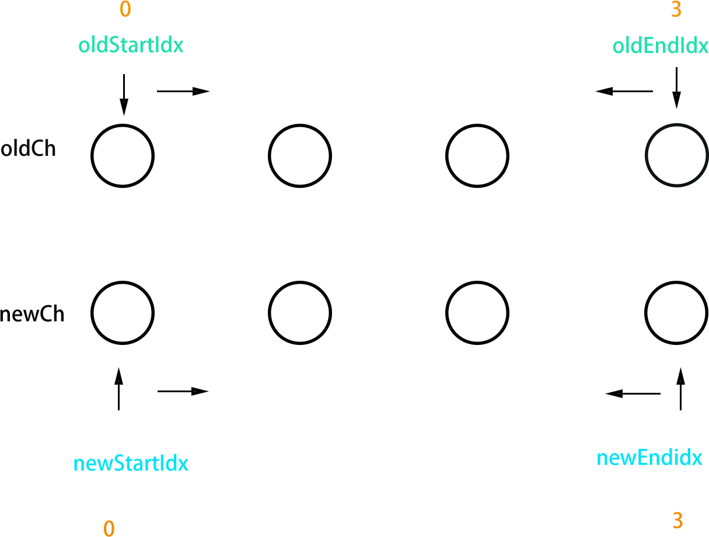
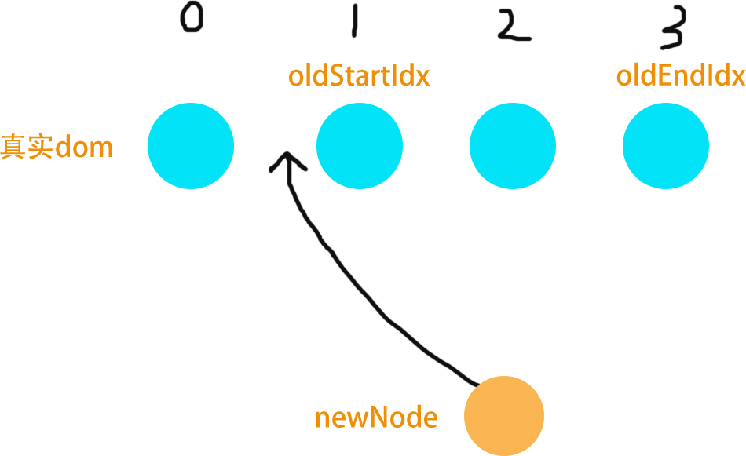
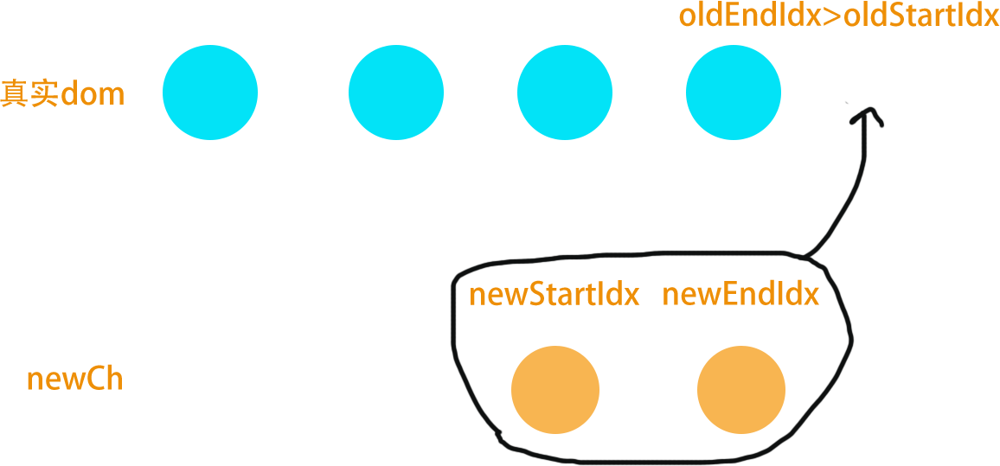
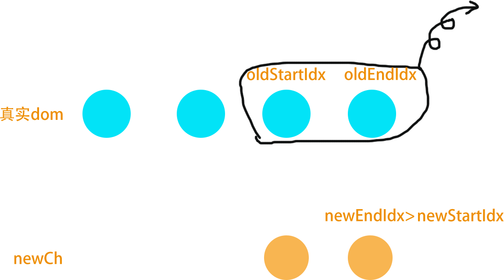
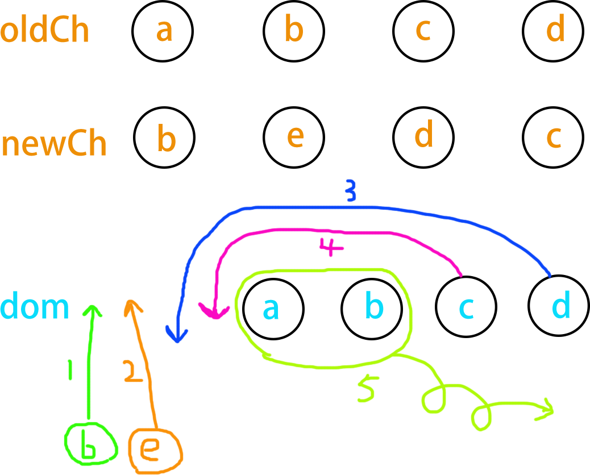
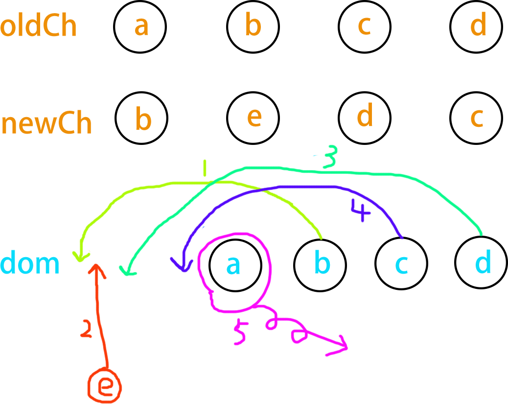

**转载至** [blog](https://github.com/aooy/blog/issues/2)
diff 算法 也可以参考[掘金小册](https://juejin.cn/book/6844733705089449991/section/6844733705232056328)
# 目录

- 前言
- virtual dom
- 分析diff
- 总结

# 前言

vue2.0加入了virtual dom，有向react靠拢的意思。vue的diff位于[patch.js](https://github.com/vuejs/vue/blob/dev/src/core/vdom/patch.js)文件中，我的一个小框架[aoy](https://github.com/aooy/aoy)也同样使用此算法，该算法来源于[snabbdom](https://github.com/snabbdom/snabbdom)，复杂度为O(n)。
了解diff过程可以让我们更高效的使用框架。
本文力求以图文并茂的方式来讲明这个diff的过程。

# virtual dom

如果不了解virtual dom，要理解diff的过程是比较困难的。虚拟dom对应的是真实dom， 使用`document.CreateElement` 和 `document.CreateTextNode`创建的就是真实节点。

我们可以做个试验。打印出一个空元素的第一层属性，可以看到标准让元素实现的东西太多了。如果每次都重新生成新的元素，对性能是巨大的浪费。

```
var mydiv = document.createElement('div');
for(var k in mydiv ){
  console.log(k)
}
```

virtual dom就是解决这个问题的一个思路，到底什么是virtual dom呢？通俗易懂的来说就是用一个简单的对象去代替复杂的dom对象。
举个简单的例子，我们在body里插入一个class为a的div。

```
var mydiv = document.createElement('div');
mydiv.className = 'a';
document.body.appendChild(mydiv);
```

对于这个div我们可以用一个简单的对象`mydivVirtual`代表它，它存储了对应dom的一些重要参数，在改变dom之前，会先比较相应虚拟dom的数据，如果需要改变，才会将改变应用到真实dom上。

```
//伪代码
var mydivVirtual = { 
  tagName: 'DIV',
  className: 'a'
};
var newmydivVirtual = {
   tagName: 'DIV',
   className: 'b'
}
if(mydivVirtual.tagName !== newmydivVirtual.tagName || mydivVirtual.className  !== newmydivVirtual.className){
   change(mydiv)
}

// 会执行相应的修改 mydiv.className = 'b';
//最后  <div class='b'></div>
```

#### 读到这里就会产生一个疑问，为什么不直接修改dom而需要加一层virtual dom呢？

很多时候手工优化dom确实会比virtual dom效率高，对于比较简单的dom结构用手工优化没有问题，但当页面结构很庞大，结构很复杂时，手工优化会花去大量时间，而且可维护性也不高，不能保证每个人都有手工优化的能力。至此，virtual dom的解决方案应运而生，**virtual dom很多时候都不是最优的操作，但它具有普适性，在效率、可维护性之间达平衡。**

virtual dom 另一个重大意义就是提供一个中间层，js去写ui，ios安卓之类的负责渲染，就像reactNative一样。

# 分析diff

一篇相当经典的文章[React’s diff algorithm](https://calendar.perfplanet.com/2013/diff/)中的图，react的diff其实和vue的diff大同小异。所以这张图能很好的解释过程。**比较只会在同层级进行, 不会跨层级比较。**

[](https://github.com/aooy/blog/blob/master/images/issues-2/diff.png?raw=true)

举个形象的例子。

```
<!-- 之前 -->
<div>           <!-- 层级1 -->
  <p>            <!-- 层级2 -->
    <b> aoy </b>   <!-- 层级3 -->   
    <span>diff</Span>
  </P> 
</div>

<!-- 之后 -->
<div>            <!-- 层级1 -->
  <p>             <!-- 层级2 -->
      <b> aoy </b>        <!-- 层级3 -->
  </p>
  <span>diff</Span>
</div>
```

我们可能期望将`<span>`直接移动到`<p>`的后边，这是最优的操作。但是实际的diff操作是移除`<p>`里的`<span>`在创建一个新的`<span>`插到`<p>`的后边。
因为新加的`<span>`在层级2，旧的在层级3，属于不同层级的比较。

## 源码分析

文中的代码位于[aoy-diff](https://github.com/aooy/aoy/blob/master/src/vdom/diff.js)中，已经精简了很多代码，留下最核心的部分。

diff的过程就是调用patch函数，就像打补丁一样修改真实dom。

```
function patch (oldVnode, vnode) {
	if (sameVnode(oldVnode, vnode)) {
		patchVnode(oldVnode, vnode)
	} else {
		const oEl = oldVnode.el
		let parentEle = api.parentNode(oEl)
		createEle(vnode)
		if (parentEle !== null) {
			api.insertBefore(parentEle, vnode.el, api.nextSibling(oEl))
			api.removeChild(parentEle, oldVnode.el)
			oldVnode = null
		}
	}
	return vnode
}
```

`patch`函数有两个参数，`vnode`和`oldVnode`，也就是新旧两个虚拟节点。在这之前，我们先了解完整的vnode都有什么属性，举个一个简单的例子:

```
// body下的 <div id="v" class="classA"><div> 对应的 oldVnode 就是

{
  el:  div  //对真实的节点的引用，本例中就是document.querySelector('#id.classA')
  tagName: 'DIV',   //节点的标签
  sel: 'div#v.classA'  //节点的选择器
  data: null,       // 一个存储节点属性的对象，对应节点的el[prop]属性，例如onclick , style
  children: [], //存储子节点的数组，每个子节点也是vnode结构
  text: null,    //如果是文本节点，对应文本节点的textContent，否则为null
}
```

需要注意的是，el属性引用的是此 virtual dom对应的真实dom，`patch`的`vnode`参数的`el`最初是null，因为`patch`之前它还没有对应的真实dom。

来到`patch`的第一部分，

```
if (sameVnode(oldVnode, vnode)) {
	patchVnode(oldVnode, vnode)
} 
```

`sameVnode`函数就是看这两个节点是否值得比较，代码相当简单：

```
function sameVnode(oldVnode, vnode){
	return vnode.key === oldVnode.key && vnode.sel === oldVnode.sel
}
```

两个vnode的key和sel相同才去比较它们，比如`p`和`span`，`div.classA`和`div.classB`都被认为是不同结构而不去比较它们。

如果值得比较会执行`patchVnode(oldVnode, vnode)`，稍后会详细讲`patchVnode`函数。

当节点不值得比较，进入else中

```
else {
		const oEl = oldVnode.el
		let parentEle = api.parentNode(oEl)
		createEle(vnode)
		if (parentEle !== null) {
			api.insertBefore(parentEle, vnode.el, api.nextSibling(oEl))
			api.removeChild(parentEle, oldVnode.el)
			oldVnode = null
		}
	}
```

过程如下：

- 取得`oldvnode.el`的父节点，`parentEle`是真实dom
- `createEle(vnode)`会为`vnode`创建它的真实dom，令`vnode.el` =`真实dom`
- `parentEle`将新的dom插入，移除旧的dom
  **当不值得比较时，新节点直接把老节点整个替换了**

最后

```
return vnode
```

patch最后会返回vnode，vnode和进入patch之前的不同在哪？
没错，就是vnode.el，**唯一的改变就是之前vnode.el = null, 而现在它引用的是对应的真实dom。**

```
var oldVnode = patch (oldVnode, vnode)
```

至此完成一个patch过程。

### patchVnode

两个节点值得比较时，会调用`patchVnode`函数

```
patchVnode (oldVnode, vnode) {
    const el = vnode.el = oldVnode.el
    let i, oldCh = oldVnode.children, ch = vnode.children
    if (oldVnode === vnode) return
    if (oldVnode.text !== null && vnode.text !== null && oldVnode.text !== vnode.text) {
        api.setTextContent(el, vnode.text)
    }else {
        updateEle(el, vnode, oldVnode)
    	if (oldCh && ch && oldCh !== ch) {
	    	updateChildren(el, oldCh, ch)
	    }else if (ch){
	    	createEle(vnode) //create el's children dom
	    }else if (oldCh){
	    	api.removeChildren(el)
	    }
    }
}
```

`const el = vnode.el = oldVnode.el` 这是很重要的一步，让`vnode.el`引用到现在的真实dom，当`el`修改时，`vnode.el`会同步变化。

节点的比较有5种情况

1. `if (oldVnode === vnode)`，他们的引用一致，可以认为没有变化。
2. `if(oldVnode.text !== null && vnode.text !== null && oldVnode.text !== vnode.text)`，文本节点的比较，需要修改，则会调用`Node.textContent = vnode.text`。
3. `if( oldCh && ch && oldCh !== ch )`, 两个节点都有子节点，而且它们不一样，这样我们会调用`updateChildren`函数比较子节点，这是diff的核心，后边会讲到。
4. `else if (ch)`，只有新的节点有子节点，调用`createEle(vnode)`，`vnode.el`已经引用了老的dom节点，`createEle`函数会在老dom节点上添加子节点。
5. `else if (oldCh)`，新节点没有子节点，老节点有子节点，直接删除老节点。

### updateChildren

```
updateChildren (parentElm, oldCh, newCh) {
    let oldStartIdx = 0, newStartIdx = 0
    let oldEndIdx = oldCh.length - 1
    let oldStartVnode = oldCh[0]
    let oldEndVnode = oldCh[oldEndIdx]
    let newEndIdx = newCh.length - 1
    let newStartVnode = newCh[0]
    let newEndVnode = newCh[newEndIdx]
    let oldKeyToIdx
    let idxInOld
    let elmToMove
    let before
    while (oldStartIdx <= oldEndIdx && newStartIdx <= newEndIdx) {
            if (oldStartVnode == null) {   //对于vnode.key的比较，会把oldVnode = null
                oldStartVnode = oldCh[++oldStartIdx] 
            }else if (oldEndVnode == null) {
                oldEndVnode = oldCh[--oldEndIdx]
            }else if (newStartVnode == null) {
                newStartVnode = newCh[++newStartIdx]
            }else if (newEndVnode == null) {
                newEndVnode = newCh[--newEndIdx]
            }else if (sameVnode(oldStartVnode, newStartVnode)) {
                patchVnode(oldStartVnode, newStartVnode)
                oldStartVnode = oldCh[++oldStartIdx]
                newStartVnode = newCh[++newStartIdx]
            }else if (sameVnode(oldEndVnode, newEndVnode)) {
                patchVnode(oldEndVnode, newEndVnode)
                oldEndVnode = oldCh[--oldEndIdx]
                newEndVnode = newCh[--newEndIdx]
            }else if (sameVnode(oldStartVnode, newEndVnode)) {
                patchVnode(oldStartVnode, newEndVnode)
                api.insertBefore(parentElm, oldStartVnode.el, api.nextSibling(oldEndVnode.el))
                oldStartVnode = oldCh[++oldStartIdx]
                newEndVnode = newCh[--newEndIdx]
            }else if (sameVnode(oldEndVnode, newStartVnode)) {
                patchVnode(oldEndVnode, newStartVnode)
                api.insertBefore(parentElm, oldEndVnode.el, oldStartVnode.el)
                oldEndVnode = oldCh[--oldEndIdx]
                newStartVnode = newCh[++newStartIdx]
            }else {
               // 使用key时的比较
                if (oldKeyToIdx === undefined) {
                    oldKeyToIdx = createKeyToOldIdx(oldCh, oldStartIdx, oldEndIdx) // 有key生成index表
                }
                idxInOld = oldKeyToIdx[newStartVnode.key]
                if (!idxInOld) {
                    api.insertBefore(parentElm, createEle(newStartVnode).el, oldStartVnode.el)
                    newStartVnode = newCh[++newStartIdx]
                }
                else {
                    elmToMove = oldCh[idxInOld]
                    if (elmToMove.sel !== newStartVnode.sel) {
                        api.insertBefore(parentElm, createEle(newStartVnode).el, oldStartVnode.el)
                    }else {
                        patchVnode(elmToMove, newStartVnode)
                        oldCh[idxInOld] = null
                        api.insertBefore(parentElm, elmToMove.el, oldStartVnode.el)
                    }
                    newStartVnode = newCh[++newStartIdx]
                }
            }
        }
        if (oldStartIdx > oldEndIdx) {
            before = newCh[newEndIdx + 1] == null ? null : newCh[newEndIdx + 1].el
            addVnodes(parentElm, before, newCh, newStartIdx, newEndIdx)
        }else if (newStartIdx > newEndIdx) {
            removeVnodes(parentElm, oldCh, oldStartIdx, oldEndIdx)
        }
}
```

代码很密集，为了形象的描述这个过程，可以看看这张图。

[](https://github.com/aooy/blog/blob/master/images/issues-2/diff2.png?raw=true)

过程可以概括为：`oldCh`和`newCh`各有两个头尾的变量`StartIdx`和`EndIdx`，它们的2个变量相互比较，一共有4种比较方式。如果4种比较都没匹配，如果设置了key，就会用key进行比较，在比较的过程中，变量会往中间靠，一旦`StartIdx>EndIdx`表明`oldCh`和`newCh`至少有一个已经遍历完了，就会结束比较。

### 具体的diff分析

设置key和不设置key的区别：
**不设key，newCh和oldCh只会进行头尾两端的相互比较，设key后，除了头尾两端的比较外，还会从用key生成的对象`oldKeyToIdx`中查找匹配的节点，所以为节点设置key可以更高效的利用dom。**

diff的遍历过程中，只要是对dom进行的操作都调用`api.insertBefore`，`api.insertBefore`只是原生`insertBefore`的简单封装。
比较分为两种，一种是有`vnode.key`的，一种是没有的。但这两种比较对真实dom的操作是一致的。

对于与`sameVnode(oldStartVnode, newStartVnode)`和`sameVnode(oldEndVnode,newEndVnode)`为true的情况，不需要对dom进行移动。

总结遍历过程，有3种dom操作：

1. 当`oldStartVnode`，`newEndVnode`值得比较，说明`oldStartVnode.el`跑到`oldEndVnode.el`的后边了。

图中假设startIdx遍历到1。

[](https://github.com/aooy/blog/blob/master/images/issues-2/diff3.png?raw=true)

1. 当`oldEndVnode`，`newStartVnode`值得比较，说明 `oldEndVnode.el`跑到了`newStartVnode.el`的前边。（这里笔误，应该是“oldEndVnode.el跑到了oldStartVnode.el的前边”，准确的说应该是oldEndVnode.el需要移动到oldStartVnode.el的前边”）

[](https://github.com/aooy/blog/blob/master/images/issues-2/diff4.png?raw=true)

1. newCh中的节点oldCh里没有， 将新节点插入到`oldStartVnode.el`的前边。

[](https://github.com/aooy/blog/blob/master/images/issues-2/diff5.png?raw=true)

在结束时，分为两种情况：

1. `oldStartIdx > oldEndIdx`，可以认为`oldCh`先遍历完。当然也有可能`newCh`此时也正好完成了遍历，统一都归为此类。此时`newStartIdx`和`newEndIdx`之间的vnode是新增的，调用`addVnodes`，把他们全部插进`before`的后边，`before`很多时候是为null的。`addVnodes`调用的是`insertBefore`操作dom节点，我们看看`insertBefore`的文档：`parentElement.insertBefore(newElement, referenceElement)`
   如果referenceElement为null则newElement将被插入到子节点的末尾。如果newElement已经在DOM树中，newElement首先会从DOM树中移除。**所以`before`为null，newElement将被插入到子节点的末尾。**

[](https://github.com/aooy/blog/blob/master/images/issues-2/diff6.png?raw=true)

1. `newStartIdx > newEndIdx`，可以认为`newCh`先遍历完。此时`oldStartIdx`和`oldEndIdx`之间的vnode在新的子节点里已经不存在了，调用`removeVnodes`将它们从dom里删除。

[](https://github.com/aooy/blog/blob/master/images/issues-2/diff7.png?raw=true)

#### 下面举个例子，画出diff完整的过程，每一步dom的变化都用不同颜色的线标出。

1. a,b,c,d,e假设是4个不同的元素，我们没有设置key时，b没有复用，而是直接创建新的，删除旧的。

[](https://github.com/aooy/blog/blob/master/images/issues-2/diff8.png?raw=true)

1. 当我们给4个元素加上唯一key时，b得到了的复用。

[](https://github.com/aooy/blog/blob/master/images/issues-2/diff9.png?raw=true)

这个例子如果我们使用手工优化，只需要3步就可以达到。

# 总结

- 尽量不要跨层级的修改dom
- 设置key可以最大化的利用节点
- diff的效率并不是每种情况下都是最优的