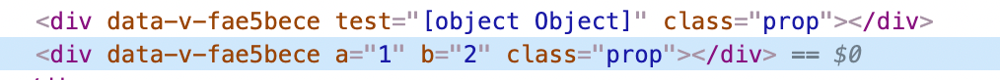

## v-model 的修饰符
### .prop
将属性绑定至dom的原生properties,看下边例子

```
<div v-bind:test="ceshiProp" class="prop"></div>
<div v-bind.prop:test="ceshiProp" class="prop"></div>
ceshiProp: {
  a:1,
  b:2	
}
```

渲染结果如下：



- Property：节点对象在内存中存储的属性，可以访问和设置。
- Attribute：节点对象的其中一个属性( property )，值是一个对象，可以通过点访问法 document.getElementById('xx').attributes 或者 document.getElementById('xx').getAttributes('xx') 读取，通过 document.getElementById('xx').setAttribute('xx',value) 新增和修改。
  在标签里定义的所有属性包括 HTML 属性和自定义属性都会在 attributes 对象里以键值对的方式存在。

太深层的暂不探究

### .number

自动将数值转换为number

## v-on 修饰符

### .passive

passive这个修饰符会执行默认方法。你们可能会问，明明默认执行为什么会设置这样一个修饰符。这就要说一下这个修饰符的本意了。

​    【浏览器只有等内核线程执行到事件监听器对应的JavaScript代码时，才能知道内部是否会调用preventDefault函数来阻止事件的默认行为，所以浏览器本身是没有办法对这种场景进行优化的。这种场景下，用户的手势事件无法快速产生，会导致页面无法快速执行滑动逻辑，从而让用户感觉到页面卡顿。】

​    通俗点说就是每次事件产生，浏览器都会去查询一下是否有preventDefault阻止该次事件的默认动作。我们加上**passive就是为了告诉浏览器，不用查询了，我们没用preventDefault阻止默认动作。**

​    这里一般用在滚动监听，@scoll，@touchmove 。因为滚动监听过程中，移动每个像素都会产生一次事件，每次都使用内核线程查询prevent会使滑动卡顿。我们通过passive将内核线程查询跳过，可以大大提升滑动的流畅度。

## 生命周期

#### 要掌握每个生命周期什么时候被调用

1. beforeCreate 在实例初始化之后，数据观测(data observer) 之前被调用。
   1. initLifecycle(vm): 主要作用是确认组件的父子关系和初始化某些实例属性。找到父组件实例赋值给`vm.$parent`，将自己`push`给父组件的`$children`；
   2. initEvents(vm): 主要作用是将父组件使用`v-on`或`@`注册的自定义事件添加到子组件的私有属性`vm._events`中；
   3. initRender(vm): 主要作用是初始化用来将`render`函数转为`vnode`的两个方法`vm._c` 和`vm.$createElement`。用户自定义的`render`函数的参数`h`就是`vm.$createElement`方法，它可以返回`vnode`。等以上操作全部完成，就会执行`beforeCreate`钩子函数，此时用户可以在函数中通过`this`访问到`vm.$parent`和`vm.$createElement`等有限的属性和方法。
2. created 实例已经创建完成之后被调用。在这一步，实例已完成以下的配置：数据观测(data observer)，属性和方法的运算，
   watch/event 事件回调。这里没有$el。这 3 个初始化方法先初始化`inject`，然后初始化`props/data`状态，最后初始化`provide`，这样做的目的是可以在`props/data`中使用`inject`内所注入的内容。
   等以上操作全部完成，就会执行`created`钩子函数，此时用户可以在函数中通过`this`访问到`vm`中的`props`，`methods`，`data`，`computed`，`watch`和`inject`等大部分属性和方法。
   1. initInjections(vm): 初始化`inject`，使得`vm`可以访问到对应的依赖；
   2. initState(vm): 初始化会被使用到的状态，状态包括`props`，`methods`，`data`，`computed`，`watch`五个选项。调用相应的`init`方法，使用`vm.$options`中提供的选项对这些状态进行初始化，其中`initData`方法会调用`observe(data, true)`，实现对`data`中属性的监听，实际上是使用`Object.defineProperty`方法定义属性的`getter`和`setter`方法；
   3. initProvide(vm)：初始化`provide`，使得`vm`可以为子组件提供依赖。
3. beforeMount 在挂载开始之前被调用：相关的 render 函数首次被调用。
4. mounted el 被新创建的 vm.$el 替换，并挂载到实例上去之后调用该钩子。
5. beforeUpdate 数据更新时调用，发生在虚拟 DOM 重新渲染和打补丁之前。
6. updated 由于数据更改导致的虚拟 DOM 重新渲染和打补丁，在这之后会调用该钩子。
7. beforeDestroy 实例销毁之前调用。在这一步，实例仍然完全可用。
8. destroyed Vue 实例销毁后调用。调用后， Vue
   实例指示的所有东西都会解绑定，所有的事件监听器会被移除，所有的子实例也会被销毁。 该钩子在服务器端渲染期间不被调用

#### 要掌握每个生命周期内部可以做什么事

1. created 实例已经创建完成，因为它是最早触发的原因可以进行一些数据，资源的请求。
2. mounted 实例已经挂载完成，可以进行一些DOM操作
3. beforeUpdate 可以在这个钩子中进一步地更改状态，这不会触发附加的重渲染过程。
4. updated 可以执行依赖于 DOM 的操作。然而在大多数情况下，你应该避免在此期间更改状态，因为这可能会导致更新无限循环。该钩子在服务器端渲染期间不被调用。
5. destroyed 可以执行一些优化操作,清空定时器，解除绑定事件

### Vue 的父组件和子组件生命周期钩子

- 加载渲染过程

父 beforeCreate -> 父 created -> 父 beforeMount -> 子 beforeCreate -> 子 created -> 子 beforeMount -> 子 mounted -> 父 mounted

- 子组件更新过程

父 beforeUpdate -> 子 beforeUpdate -> 子 updated -> 父 updated

- 子组件销毁过程

父 beforeDestroy -> 子 beforeDestroy -> 子 destroyed -> 父 destroyed

## 获取初始data
在某些情况我们可能要重置data上面的某些属性，比如在表单提交后需要清空form
```
this.$data // 组件当前data对象
this.$options.data() // 组件初始化状态下的data对象

Object.assign(this.$data, this.$options.data()) // 重置data对象到初始化状态
 
```

## 在不刷新页面的情况下，更新页面

```
// 先注册一个名为 `redirect` 的路由
<script>
export default {
  beforeCreate() {
    const { params, query } = this.$route
    const { path } = params
    this.$router.replace({ path: '/' + path, query })
  },
  render: function(h) {
    return h() // avoid warning message
  }
}
</script>


// 手动重定向页面到 '/redirect' 页面 实现更新页面
const { fullPath } = this.$route
this.$router.replace({
  path: '/redirect' + fullPath
})

```

当遇到你需要刷新页面的情况，你就手动重定向页面到`redirect`页面，它会将页面重新`redirect`重定向回来，由于页面的 key 发生了变化，从而间接实现了刷新页面组件的效果。

## 动态清除注册的路由

​	那就是动态添加的路由，并不能动态的删除。这就是导致一个问题，当用户权限发生变化的时候，或者说用户登出的时候，我们只能通过刷新页面的方式，才能清空我们之前注册的路由。

```
function resetRouter() {
 const newRouter = createRouter()
 router.matcher = newRouter.matcher // reset router
}
```

​	它的原理其实很简单，所有的 vue-router 注册的路由信息都是存放在`matcher`之中的，所以当我们想清空路由的时候，我们只要新建一个空的`Router实例`，将它的`matcher`重新赋值给我们之前定义的路由就可以了。巧妙的实现了动态路由的清除。 现在我们只需要调用`resetRouter`，就能得到一个空的路有实例，之后你就可以重新`addRoutes`你想要的路由了

