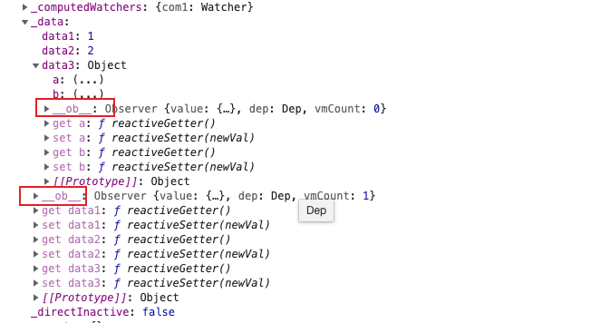
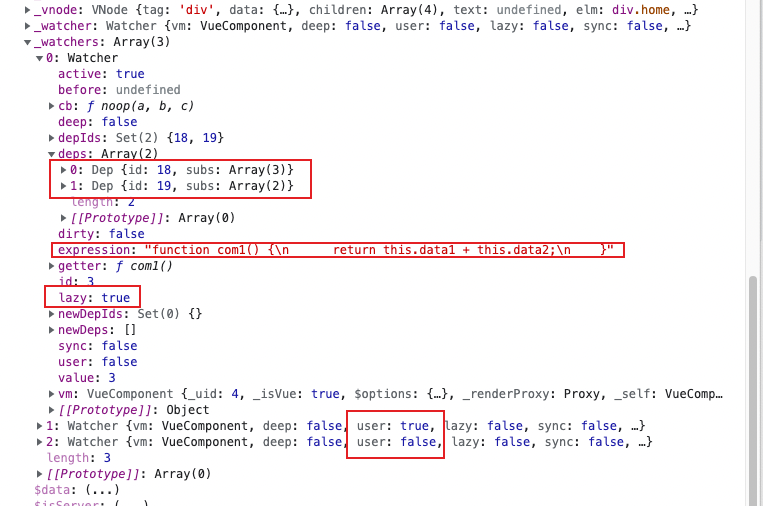

本文简单的分析一下vue从初始化到完成渲染的流程，重点还是在于响应式的分析，生命周期函数简单带过。

> 以下代码均经过不同程度的精简

### vue.init

```
Vue.prototype._init = function(options) {
  vm.$options = mergeOptions(  // 合并options
      resolveConstructorOptions(vm.constructor),
      options || {},
      vm
  )
  // ...
  initLifecycle(vm) // 开始一系列的初始化
  initEvents(vm)
  initRender(vm)
  callHook(vm, 'beforeCreate')        //执行 beforeCreate 钩子
  initInjections(vm)
  initState(vm)
  initProvide(vm)
  callHook(vm, 'created')                    //执行 created 钩子
  // ...
  // 挂载dom
  if (vm.$options.el) {
  // 可以认为是运行了 mountComponent 
    vm.$mount(vm.$options.el)
  }
}

```

其实上述代码已经包含了整个生命周期的行为，简要分析一下函数所做的事情

### 初始化到created

首先，将用户提供的`options`对象，父组件定义在子组件上的`event`、`props`(子组件实例化时)，`vm`原型方法，和`Vue`构造函数内置的选项合并成一个新的`options`对象，赋值给`vm.$options`。
接下来，执行 3 个初始化方法：

- **initLifecycle(vm)**: 主要作用是确认组件的父子关系和初始化某些实例属性。找到父组件实例赋值给`vm.$parent`，将自己`push`给父组件的`$children`；

- **initEvents(vm)**: 主要作用是将父组件使用`v-on`或`@`注册的自定义事件添加到子组件的私有属性`vm._events`中；

- **initRender(vm)**: 主要作用是初始化用来将`render`函数转为`vnode`的两个方法`vm._c` 和`vm.$createElement`。用户自定义的`render`函数的参数`h`就是`vm.$createElement`方法，它可以返回`vnode`。

  > 等以上操作全部完成，就会执行`beforeCreate`钩子函数，此时用户可以在函数中通过`this`访问到`vm.$parent`和`vm.$createElement`等有限的属性和方法。

- **触发beforeCreate**

- **initInjections(vm)**: 初始化`inject`，使得`vm`可以访问到对应的依赖；

- **initState(vm)**: 初始化会被使用到的状态，状态包括`props`，`methods`，`data`，`computed`，`watch`五个选项。调用相应的`init`方法，使用`vm.$options`中提供的选项对这些状态进行初始化，**其中`initData`方法会调用`observe(data, true)`，实现对`data`中属性的监听，实际上是使用`Object.defineProperty`方法定义属性的`getter`和`setter`方法**；

  - Computed 和 watch 初始化 会创建computed-watch和user-watch

- **initProvide(vm)**：初始化`provide`，使得`vm`可以为子组件提供依赖。

  > 这 3 个初始化方法先初始化`inject`，然后初始化`props/data`状态，最后初始化`provide`，这样做的目的是可以在`props/data`中使用`inject`内所注入的内容。等以上操作全部完成，就会执行`created`钩子函数，此时用户可以在函数中通过`this`访问到`vm`中的`props`，`methods`，`data`，`computed`，`watch`和`inject`等大部分属性和方法。

- **触发created**

### beforeMouted到mouted

此阶段即是`vm.$mount(vm.$options.el)`过程

```
运行时版本：
Vue.prototype.$mount = function(el) { // 最初的定义
    return mountComponent(this, query(el));
}
完整版：
const mount = Vue.prototype.$mount
Vue.prototype.$mount = function(el) {  // 拓展编译后的
    var options = this.$options;
    if(!options.render) {
        if(options.template) {
            ...                //一些判断
        } else if (el) {    //传入的 el 选项不为空
            options.template = getOuterHTML(el);
        }
        
        if (options.template) {
                options.render = compileToFunctions(template, ...).render    //将 template 编译成 render 函数
        }
    }
    ...
    return mount.call(this, query(el))    //即 Vue.prototype.$mount.call(this, query(el))
}
```

在完整版的`vm.$mount`方法中，如果用户未提供`render`函数，就会将`template`或者`el.outerHTML`编译成`render`函数。然后会执行`mountComponent`函数：

`mountComponent`如下：

```
export function mountComponent(
  vm,
  el,
  hydrating
) {
  vm.$el = el
  if (!vm.$options.render) {
    vm.$options.render = createEmptyVNode
    if (process.env.NODE_ENV !== 'production') {
      /* istanbul ignore if */
      if ((vm.$options.template && vm.$options.template.charAt(0) !== '#') ||
        vm.$options.el || el) {
        warn(
          'You are using the runtime-only build of Vue where the template ' +
          'compiler is not available. Either pre-compile the templates into ' +
          'render functions, or use the compiler-included build.',
          vm
        )
      } else {
        warn(
          'Failed to mount component: template or render function not defined.',
          vm
        )
      }
    }
  }
  callHook(vm, 'beforeMount')

  let updateComponent
  /* istanbul ignore if */
  if (process.env.NODE_ENV !== 'production' && config.performance && mark) {
    updateComponent = () => {
      const name = vm._name
      const id = vm._uid
      const startTag = `vue-perf-start:${id}`
      const endTag = `vue-perf-end:${id}`

      mark(startTag)
      const vnode = vm._render()
      mark(endTag)
      measure(`vue ${name} render`, startTag, endTag)

      mark(startTag)
      vm._update(vnode, hydrating)
      mark(endTag)
      measure(`vue ${name} patch`, startTag, endTag)
    }
  } else {
    updateComponent = () => {
      vm._update(vm._render(), hydrating)
    }
  }
  // updateComponent 函数包括vnode生成及挂载到真实dom

  // 生成一个watcher实例，updateComponent作为watcher函数的回调
  
  new Watcher(vm, updateComponent, noop, {
    before () {
      if (vm._isMounted) {
        callHook(vm, 'beforeUpdate')
      }
    }
  }, true /* isRenderWatcher */)
  hydrating = false

  // 挂载完成后  运行mouted
  if (vm.$vnode == null) {
    // actived 需要判断组件已经加载过了
    vm._isMounted = true
    callHook(vm, 'mounted')
  }
  return vm
}
```

- 在完整版的`vm.$mount`方法中，如果用户未提供`render`函数，就会将`template`或者`el.outerHTML`编译成`render`函数。然后会执行`mountComponent`函数：如果用户提供了`el`选项，则会获取用于挂载的真实节点，将此节点赋值给`vm.$el`属性。

- 触发`beforeMount`

- 在`mountComponent`方法中，**会实例化一个watcher，watcher执行完内部逻辑后（响应式关键）**，执行` updateComponent`方法将`vm._render()`返回的vnode挂载到真实节点中

```
// 生成一个watcher实例，updateComponent作为watcher函数的回调

  new Watcher(vm, updateComponent, noop, {
    before () {
      if (vm._isMounted) {
        callHook(vm, 'beforeUpdate')
      }
    }
  }, true /* isRenderWatcher */)
  
updateComponent = () => {
   vm._update(vm._render(), hydrating)
}
Vue.prototype._render = function() {
    const vm = this
    const { render } = vm.$options
    const vnode = render.call(vm, vm.$createElement)
    return vnode
}
```

- 触发mouted

至此vue的生命周期就结束了，下面重点介绍 `mountComponent` 实例化watcher发生了什么

### 依赖收集

再讲解依赖收集之前，我们需要先了解，Object.defineProperties是什么时候设置的

#### observer

vue会针对对象数据类型进行`observer`函数处理，方法的作用就是给非 VNode 的对象类型数据添加一个`Observer`类 

举个例子, 下面的data 会有6次observer处理，会有6个Observer类

```
data = {
 	a: 1,
 	b: 2,
 	c: [1, 2, {a: 1}],
 	d: {
 		a: {
 			b: 1
 		}
 	}
}
data 一次
c 一次
	c {a:1} 一次
d 一次
	a 一次
		b 一次
```

Observer会递归处理对象类型，有一个dep实例属性，用处在 defineReactive 中 childOb.dep.depend()，（父对象变化会影响子对象）

Observer的主要目的是对对象进行遍历并定义getter和setter，这也是依赖收集的基础，逻辑在函数 defineReactive 中

```
export class Observer {
  value: any;
  dep: Dep;
  vmCount: number; // number of vms that have this object as root $data

  constructor (value: any) {
    this.value = value
    this.dep = new Dep()
    // 在 defineReactive 中 childOb.dep.depend()
    this.vmCount = 0
    // vm._Data.__ob__ 指向这个Observer 
    def(value, '__ob__', this)
    if (Array.isArray(value)) {
      if (hasProto) {
        protoAugment(value, arrayMethods)
      } else {
        copyAugment(value, arrayMethods, arrayKeys)
      }
      this.observeArray(value)
    } else {
      this.walk(value)
    }
  }

  /**
   * Walk through all properties and convert them into
   * getter/setters. This method should only be called when
   * value type is Object.
   */
  walk (obj: Object) {
    const keys = Object.keys(obj)
    for (let i = 0; i < keys.length; i++) {
      defineReactive(obj, keys[i])
    }
  }

  /**
   * Observe a list of Array items.
   */
  observeArray (items: Array<any>) {
    for (let i = 0, l = items.length; i < l; i++) {
      observe(items[i])
    }
  }
}
```

defineReactive

```
export function defineReactive (
  obj: Object,
  key: string,
  val: any,
  customSetter?: ?Function,
  shallow?: boolean
) {
  const dep = new Dep()

  const property = Object.getOwnPropertyDescriptor(obj, key)
  if (property && property.configurable === false) {
    return
  }

  // cater for pre-defined getter/setters
  const getter = property && property.get
  const setter = property && property.set
  if ((!getter || setter) && arguments.length === 2) {
    val = obj[key]
  }

  let childOb = !shallow && observe(val)
  Object.defineProperty(obj, key, {
    enumerable: true,
    configurable: true,
    get: function reactiveGetter () {
      const value = getter ? getter.call(obj) : val
      if (Dep.target) {
        dep.depend()
        if (childOb) {
          childOb.dep.depend()
          if (Array.isArray(value)) {
            dependArray(value)
          }
        }
      }
      return value
    },
    set: function reactiveSetter (newVal) {
      const value = getter ? getter.call(obj) : val
      /* eslint-disable no-self-compare */
      if (newVal === value || (newVal !== newVal && value !== value)) {
        return
      }
      /* eslint-enable no-self-compare */
      if (process.env.NODE_ENV !== 'production' && customSetter) {
        customSetter()
      }
      if (setter) {
        setter.call(obj, newVal)
      } else {
        val = newVal
      }
      childOb = !shallow && observe(newVal)
      dep.notify()
    }
  })
}
```

这里需要注意函数每次运行都会实例化一个dep，getter 和 setter都是针对dep做出了处理

#### Dep

```
export default class Dep {
  static target: ?Watcher;
  id: number;
  subs: Array<Watcher>;

  constructor () {
    this.id = uid++
    this.subs = []
  }

  addSub (sub: Watcher) {
    this.subs.push(sub)
  }

  removeSub (sub: Watcher) {
    remove(this.subs, sub)
  }

  depend () {
    if (Dep.target) {
      // watcher addDep
      // 简单来说 就是一个watcher dep 互相持有的过程
      Dep.target.addDep(this)
    }
  }

  notify () {
    // stabilize the subscriber list first
    const subs = this.subs.slice()
    if (process.env.NODE_ENV !== 'production' && !config.async) {
      // subs aren't sorted in scheduler if not running async
      // we need to sort them now to make sure they fire in correct
      // order
      subs.sort((a, b) => a.id - b.id)
    }
    for (let i = 0, l = subs.length; i < l; i++) {
      subs[i].update()
    }
  }
}

// The current target watcher being evaluated.
// This is globally unique because only one watcher
// can be evaluated at a time.
Dep.target = null
const targetStack = []
```

`Dep` 实际上就是对 `Watcher` 的一种管理，`Dep` 脱离 `Watcher` 单独存在是没有意义的，主要看一下`depend`和`notify`

#### Watcher

上一节我们提到在`mountComponent` 函数中实例化了一个**`render watcher`** 实例，现在来重点分析一下。

**`render watcher`** 是一个比较特殊的watcher实例，会挂载到vm._watcher上，并且持有该组件响应数据所有的dep实例，所有的dep实例也会持有**`render watcher`** ，==每个组件有且仅有一个render watch==

首先看一下watcher的代码

```javascript
import { pushTarget, popTarget } from './dep';

let uid = 0
export class Watcher {
  constructor() {
    this.deps = []
    this.newDeps = []
    this.depIds = new Set()
    this.newDepIds = new Set()
    this.id = uid++
    this.value = this.get()
  }
  get () {
    pushTarget(this)
    // pushTarget 代码如下，入栈并把当前的watcher赋值给dep

    /* function pushTarget (_target) {
      if (Dep.target) targetStack.push(Dep.target)
      Dep.target = _target
    } */

    if (this.deep) {
      // 递归去访问 value，触发它所有子项的 getter
      traverse(value)
    }
    popTarget()
    this.cleanupDeps()
    return value
  }
  
  addDep (dep) {
    const id = dep.id
    if (!this.newDepIds.has(id)) {
      this.newDepIds.add(id)
      this.newDeps.push(dep)
      if (!this.depIds.has(id)) {
        dep.addSub(this)
      }
    }
  }

  update() {
    console.log("接受到更新消息");
    // 推入队列等待触发
    queueWatcher(this);
  }
  run() {

  }
}

```

首先实例化`wather`会运行`get`函数中的`pushTaget`

```javascript
pushTarget(this)
// pushTarget 代码如下，入栈并把当前的watcher赋值给dep

/* function pushTarget (_target) {
	targetStack.push(target)
  Dep.target = target
} */

// 黄轶电子书的源码 和 2.6.14的源码有出入
```

首先说明，`Dep.target`  和 `targetStack` 均为全局属性

实际上就是把 `Dep.target` 赋值为当前的**渲染 `watcher`**(貌似一个实例仅有一个) 并压栈（为了恢复用）。接着又执行了：

```js
value = this.getter.call(vm, vm)
```

`this.getter` 对应就是 `updateComponent` 函数，这实际上就是在执行：

```js
vm._update(vm._render(), hydrating)
```

它会先执行 `vm._render()` 方法，因为之前分析过这个方法会生成 渲染 VNode，并且在这个过程中会对 `vm` 上的数据访问，这个时候就触发了数据对象的 getter。

那么每个对象值的 getter 都持有一个 `dep`，在触发 getter 的时候会调用 `dep.depend()` 方法，也就会执行`Dep.target.addDep(this)`。

刚才我们提到这个时候 `Dep.target` 已经被赋值为渲染 `watcher`，那么就执行到 `addDep` 方法：

```js
addDep (dep: Dep) {
  const id = dep.id
  if (!this.newDepIds.has(id)) {
    this.newDepIds.add(id)
    this.newDeps.push(dep)
    if (!this.depIds.has(id)) {
      dep.addSub(this)
    }
  }
}
```

这时候会做一些逻辑判断（保证同一数据不会被添加多次）后执行 `dep.addSub(this)`，那么就会执行 `this.subs.push(sub)`，也就是说把当前的 `watcher` 订阅到这个数据持有的 `dep` 的 `subs` 中，这个目的是为后续数据变化时候能通知到哪些 `subs` 做准备。

所以在 `vm._render()` 过程中，会触发所有数据的 getter，这样实际上已经完成了一个依赖收集的过程。那么到这里就结束了么，其实并没有，**在完成依赖收集后**，还有几个逻辑要执行，首先是：

```js
if (this.deep) {
  traverse(value)
}
```

这个是要递归去访问 `value`，触发它所有子项的 `getter`，这个之后会详细讲。接下来执行：

```js
popTarget()
```

`popTarget` 的定义在 `src/core/observer/dep.js` 中：

```js
Dep.target = targetStack.pop()
```

实际上就是把 `Dep.target` 恢复成上一个状态，因为当前 vm 的数据依赖收集已经完成，那么对应的渲染`Dep.target` 也需要改变。最后执行：

```js
this.cleanupDeps()
```

其实很多人都分析过并了解到 Vue 有依赖收集的过程，但我几乎没有看到有人分析依赖清空的过程，其实这是大部分同学会忽视的一点，也是 Vue 考虑特别细的一点。

```js
cleanupDeps () {
  let i = this.deps.length
  while (i--) {
    const dep = this.deps[i]
    if (!this.newDepIds.has(dep.id)) {
      dep.removeSub(this)
    }
  }
  let tmp = this.depIds
  this.depIds = this.newDepIds
  this.newDepIds = tmp
  this.newDepIds.clear()
  tmp = this.deps
  this.deps = this.newDeps
  this.newDeps = tmp
  this.newDeps.length = 0
}
```

考虑到 Vue 是数据驱动的，所以每次数据变化都会重新 render，那么 `vm._render()` 方法又会再次执行，并再次触发数据的 getters，所以 `Watcher` 在构造函数中会初始化 2 个 `Dep` 实例数组，`newDeps` 表示新添加的 `Dep` 实例数组，而 `deps` 表示上一次添加的 `Dep` 实例数组。

在执行 `cleanupDeps` 函数的时候，会首先遍历 `deps`，移除对 `dep.subs` 数组中 `Wathcer` 的订阅，然后把 `newDepIds` 和 `depIds` 交换，`newDeps` 和 `deps` 交换，并把 `newDepIds` 和 `newDeps` 清空。

那么为什么需要做 `deps` 订阅的移除呢，在添加 `deps` 的订阅过程，已经能通过 `id` 去重避免重复订阅了。

考虑到一种场景，我们的模板会根据 `v-if` 去渲染不同子模板 a 和 b，当我们满足某种条件的时候渲染 a 的时候，会访问到 a 中的数据，这时候我们对 a 使用的数据添加了 getter，做了依赖收集，那么当我们去修改 a 的数据的时候，理应通知到这些订阅者。那么如果我们一旦改变了条件渲染了 b 模板，又会对 b 使用的数据添加了 getter，如果我们没有依赖移除的过程，那么这时候我去修改 a 模板的数据，会通知 a 数据的订阅的回调，这显然是有浪费的。

因此 Vue 设计了在每次添加完新的订阅，会移除掉旧的订阅，这样就保证了在我们刚才的场景中，如果渲染 b 模板的时候去修改 a 模板的数据，a 数据订阅回调已经被移除了，所以不会有任何浪费，真的是非常赞叹 Vue 对一些细节上的处理。

### 代码反推

首先看vue文件，

- data包含三个数据，其中一个是对象类型
- computed有一个，依赖于data1，data2
- wather有一个，依赖于data1

```
<template>
  <div class="home">
    <p>{{data1}}</p>
    <span>{{data2}}</span>
    <div>{{data3.a}}</div>
    <a href="">{{com1}}</a>
  </div>
</template>

<script>
// @ is an alias to /src
import SlopScope from '@/components/slotScope.vue'
export default {
  name: 'Home',
  data() {
    return {
      data1: 1,
      data2: 2,
      data3: {
        a: "1sdfds",
        b: "fasaga"
      }
    }
  },
  methods: {
    
  },
  mounted() {
    console.log("mounted");
    console.log(this);
  },
  computed: {
    com1(){
      return this.data1 + this.data2
    }
  },
  watch: {
    data1() {
      console.log(111111);
    }
  }
}
</script>
```

我们在控制台打印一下vm，先看一下_data，可见每一个对象类型均持有一个`__ob__`即Oberver实例



然后看一下water，其中有两个watcher相关的属性



- _watcher属性指向的就是render watcher，每个组件有且仅有一个（真实渲染到页面上的）
- _wathers属性是组件相关的所有watcher
  - 一个render watcher 就是 _watcher指向的那个
  - 一个computed watcher 可以看到属性中 lazy = true
  - 一个user watcher 可以看到属性 user = true
- 我们再重点关注一下computed watcher中的deps
  - 其中一个是data1对应的dep，subs存在三个watcher，对应render user computed
  - 还有一个是data2对应的dep，subs存在二个watcher，对应render  computed

### 总结

根据自己的理解，进行一个简短的总结，方便理解记忆

- vue在init阶段中的initData，对data进行初始化，针对对象类型进行递归处理，使用observer函数处理
- 每一个observer函数，都会实例化一个Observer实例，挂载到对象类型的`__ob__`上
- Observer在实例化的过程中，会针对对象的每一个key用defineReactive进行处理
- defineReactive会生成一个dep实例，并设置key的getter和setter
- 在mouted阶段，vue会初始化一个watcher实例，watcher在实例化的过程中会将Dep.target指向自身，然后运行回调函数，并且有一个入栈的操作(可能是递归处理的时候方便恢复，因为是子组件先mouted，这是我自己猜测的)
- render watch对应的回调函数就是`vm._update(vm._render(), hydrating)`，在构建虚拟dom的过程中，会触发视图依赖数据的getter函数(在构建虚拟dom的过程中，应该会深度遍历子组件，先完成子组件的依赖收集，这也是watch入栈出栈的原因吧)
- getter函数 会将数据对应的dep和当前的render watch 互相链接（持有）
- 虚拟dom及挂载完成，render watch 会进行出栈
- 执行 cleanupDeps ，用新的订阅替换旧订阅（性能优化，详细参考黄轶blog）

