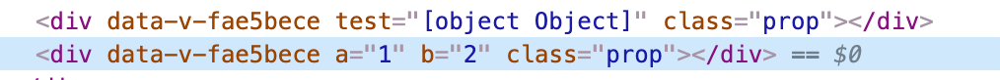

## v-model 的修饰符

### .prop

将属性绑定至dom的原生properties,看下边例子

```
<div v-bind:test="ceshiProp" class="prop"></div>
<div v-bind.prop:test="ceshiProp" class="prop"></div>
ceshiProp: {
  a:1,
  b:2 
}
```

渲染结果如下：



- Property：节点对象在内存中存储的属性，可以访问和设置。
- Attribute：节点对象的其中一个属性( property )，值是一个对象，可以通过点访问法 document.getElementById('xx').attributes 或者 document.getElementById('xx').getAttributes('xx') 读取，通过 document.getElementById('xx').setAttribute('xx',value) 新增和修改。
  在标签里定义的所有属性包括 HTML 属性和自定义属性都会在 attributes 对象里以键值对的方式存在。

太深层的暂不探究

### .number

自动将数值转换为number，和el-input type=number 一起用 会有bug

## v-on 修饰符

### .passive

passive这个修饰符会执行默认方法。你们可能会问，明明默认执行为什么会设置这样一个修饰符。这就要说一下这个修饰符的本意了。

​    【浏览器只有等内核线程执行到事件监听器对应的JavaScript代码时，才能知道内部是否会调用preventDefault函数来阻止事件的默认行为，所以浏览器本身是没有办法对这种场景进行优化的。这种场景下，用户的手势事件无法快速产生，会导致页面无法快速执行滑动逻辑，从而让用户感觉到页面卡顿。】

​    通俗点说就是每次事件产生，浏览器都会去查询一下是否有preventDefault阻止该次事件的默认动作。我们加上**passive就是为了告诉浏览器，不用查询了，我们没用preventDefault阻止默认动作。**

​    这里一般用在滚动监听，@scoll，@touchmove 。因为滚动监听过程中，移动每个像素都会产生一次事件，每次都使用内核线程查询prevent会使滑动卡顿。我们通过passive将内核线程查询跳过，可以大大提升滑动的流畅度。

## 获取初始data

在某些情况我们可能要重置data上面的某些属性，比如在表单提交后需要清空form

```
this.$data // 组件当前data对象
this.$options.data() // 组件初始化状态下的data对象

Object.assign(this.$data, this.$options.data()) // 重置data对象到初始化状态
 
```

> 实际上这个this.$options.data 是一个函数，也就是组件声明时用来初始化data的函数

## 在不刷新页面的情况下，更新页面

```
// 先注册一个名为 `redirect` 的路由
<script>
export default {
  beforeCreate() {
    const { params, query } = this.$route
    const { path } = params
    this.$router.replace({ path: '/' + path, query })
  },
  render: function(h) {
    return h() // avoid warning message
  }
}
</script>


// 手动重定向页面到 '/redirect' 页面 实现更新页面
const { fullPath } = this.$route
this.$router.replace({
  path: '/redirect' + fullPath
})

```

当遇到你需要刷新页面的情况，你就手动重定向页面到`redirect`页面，它会将页面重新`redirect`重定向回来，由于页面的 key 发生了变化，从而间接实现了刷新页面组件的效果。

## 动态清除注册的路由

 那就是动态添加的路由，并不能动态的删除。这就是导致一个问题，当用户权限发生变化的时候，或者说用户登出的时候，我们只能通过刷新页面的方式，才能清空我们之前注册的路由。

```
function resetRouter() {
 const newRouter = createRouter()
 router.matcher = newRouter.matcher // reset router
}
```

 它的原理其实很简单，所有的 vue-router 注册的路由信息都是存放在`matcher`之中的，所以当我们想清空路由的时候，我们只要新建一个空的`Router实例`，将它的`matcher`重新赋值给我们之前定义的路由就可以了。巧妙的实现了动态路由的清除。 现在我们只需要调用`resetRouter`，就能得到一个空的路有实例，之后你就可以重新`addRoutes`你想要的路由了
