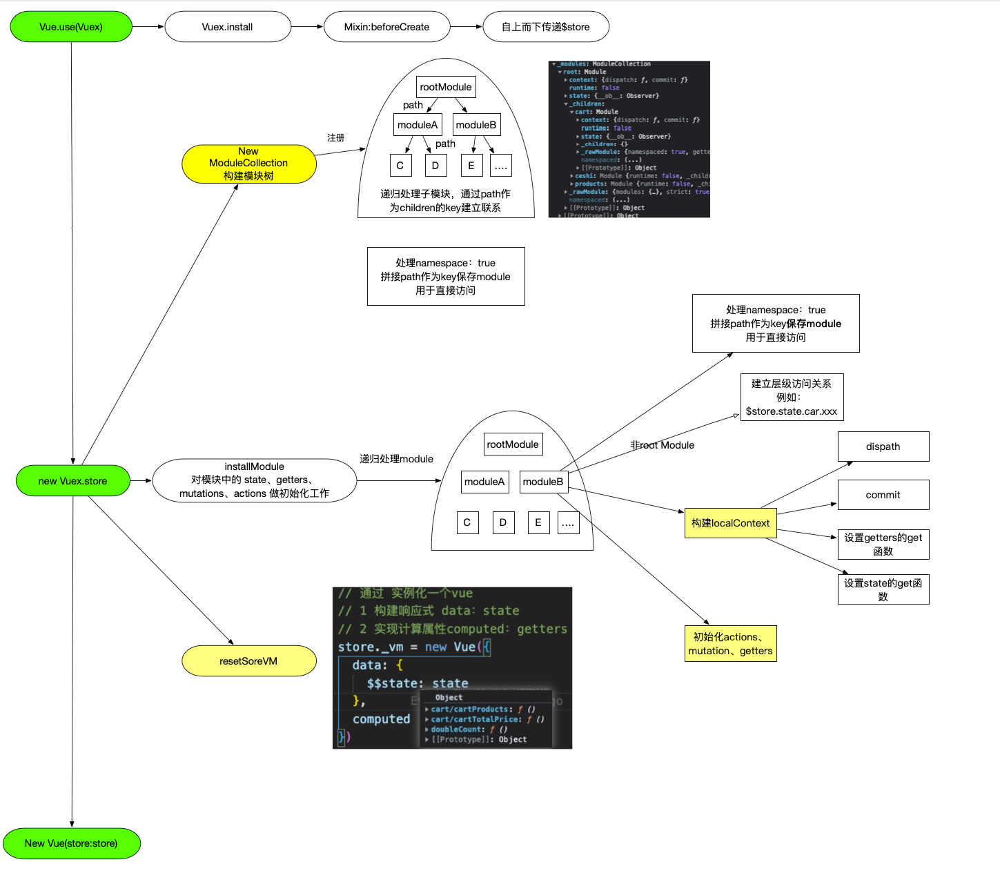
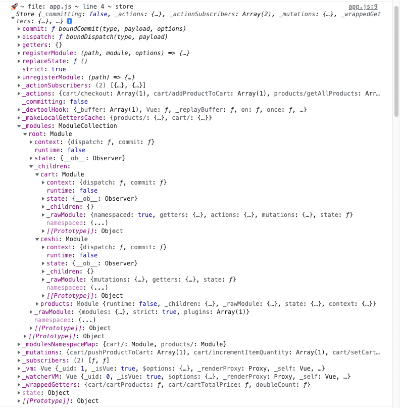
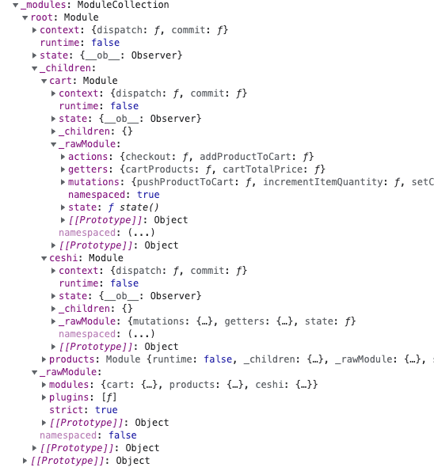
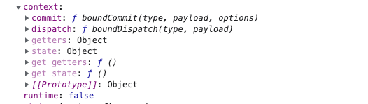
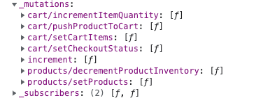

先放一张store的代码结构图



## vuex初始化

Vuex 存在一个静态的 `install` 方法，在beforeCreate混入了vuexInit，我们只看关键逻辑

````

function vuexInit () {
    const options = this.$options
    // store injection
    if (options.store) {
      this.$store = typeof options.store === 'function'
        ? options.store()
        : options.store
    } else if (options.parent && options.parent.$store) {
      this.$store = options.parent.$store
    }
  }
````

通过声明周期函数，将store挂载到每一个组件上

## Store实例化

我们把 `Store` 的实例化过程拆成 3 个部分，分别是

- 初始化模块
- 安装模块
- 初始化 `store._vm`

### 初始化模块

#### 构建module树

其实就是处理用户输入的配置，重点在于通过module层级建立联系，如下图所示



````javascript
this._modules = new ModuleCollection(options)
````

`ModuleCollection` 实例化的过程就是执行了 `register` 方法，register方法递归遍历所有module，生成`module`实例，并通过`_children`属性与path和建立下级关系

> 建立关联的代码很精妙，建议结合源码回忆

### 安装模块

    installModule(this, state, [], this._modules.root)

递归执行，它的目标就是对各个模块中的 state、getters、mutations、actions 做初始化工作

**installModule**函数主要做了下述几个事情：

#### 挂载子module state到rootState

```
f (!isRoot && !hot) {
    const parentState = getNestedState(rootState, path.slice(0, -1))
    const moduleName = path[path.length - 1]
    store._withCommit(() => {
      Vue.set(parentState, moduleName, module.state)
    })
  }
```

#### 根据namespace配置构建module映射

为了根据命名空间快速查找到对应的module

```
if (module.namespaced) {
    store._modulesNamespaceMap[namespace] = module
  }
```

#### 构造模块上下文环境



构造了一个模块上下文环境：保证模块内两种方法的正确运行和两种数据的正常访问

> 例如 模块内的dispatch("B") 会映射到 rootStore.dispatch("A/B")

#### 注册mutation action getter

其实就是把三个属性对应用户输入挂载到rootStore上去，这里也用到了**模块上下文**

举一个mutation的例子

```
 module.forEachMutation((mutation, key) => {
    const namespacedType = namespace + key
    // 在root module下 注册了 命名空间 mutation 下同
    registerMutation(store, namespacedType, mutation, local)
  })
  
  function registerMutation (store, type, handler, local) {
    const entry = store._mutations[type] || (store._mutations[type] = [])
    // 数组  说明 同一 type 的 _mutations 可以对应多个方法
    entry.push(function wrappedMutationHandler(payload) {
      // store 对应模块的store  
    handler.call(store, local.state, payload)
  })
}
```

从这里就可以看出，所有的mutations都是挂载在根store的_mutations中，并且同名mutation不会覆盖，而且推入一个队列，顺序执行，下图是实际的代码



可以看出来，开启命名空间实际上就是在mutation事件名前拼接了一个路径

这个地方也解除了我对vuex官方文档一段话的不解：

```
 默认情况下，模块内部的 action、mutation 和 getter 是注册在**全局命名空间**的——这样使得多个模块能够对同一 mutation 或 action 作出响应。

 如果希望你的模块具有更高的封装度和复用性，你可以通过添加 `namespaced: true` 的方式使其成为带命名空间的模块。当模块被注册后，它的所有 getter、action 及 mutation 都会自动根据模块注册的路径调整命名。例如：
```

### 初始化 `store._vm`

`Store` 实例化的最后一步，就是执行初始化 `store._vm` 的逻辑，它的入口代码是：

```js
resetStoreVM(this, state)
```

**`resetStoreVM` 的作用实际上是想建立 `getters` 和 `state` 的联系**

利用vue的data和computed机制实现联系，关键代码如下

```
 const wrappedGetters = store._wrappedGetters
  const computed = {}
  forEachValue(wrappedGetters, (fn, key) => {
    // use computed to leverage its lazy-caching mechanism
    computed[key] = () => fn(store)
    Object.defineProperty(store.getters, key, {
      get: () => store._vm[key],
      enumerable: true // for local getters
    })
  })

  // use a Vue instance to store the state tree
  // suppress warnings just in case the user has added
  // some funky global mixins
  const silent = Vue.config.silent
  Vue.config.silent = true
  store._vm = new Vue({
    data: {
      $$state: state
    },
    computed
  })
  Vue.config.silent = silent
```
