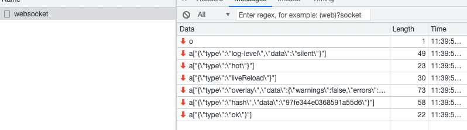
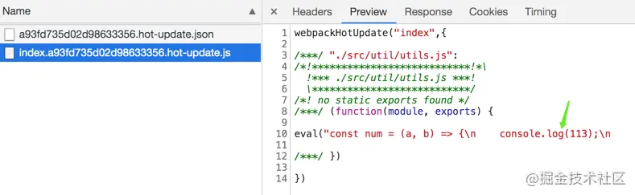

`Hot Module Replacement`，简称`HMR`，无需完全刷新整个页面的同时，更新模块。`HMR`的好处，在日常开发工作中体会颇深：**节省宝贵的开发时间、提升开发体验**。

在这里简单介绍一个 HMR 的原理

### HMR 初始化

#### webpack-dev-server

Webpack-dev-server 的执行过程，其实也是一个 HMR 开启的过程

- 修改 webpackOptions，添加两个入口文件，一个是 websocket 客户端代码，一个是热更新客户端代码(主要是用于检查更新逻辑)。

- 启动`webpack`，生成`compiler`实例。`compiler`上有很多方法，比如可以启动 `webpack` 所有**编译**工作，以及**监听**本地文件的变化。

- 使用`express`框架启动本地`server`，让浏览器可以请求本地的**静态资源**。

  - 启动 server 的时候，监听 compiler 的 done 事件，当监听到一次`webpack`编译结束，就会调用`_sendStats`方法通过`websocket`给浏览器发送通知，`ok`和`hash`事件，这样浏览器就可以拿到最新的`hash`值了，做检查更新逻辑
  - 生成 **webpack-dev-middleware** 中间件实例，保存在 this.middleware（主要是本地文件的**编译**和**输出**以及**监听**）

- 本地`server`启动之后，再去启动`websocket`服务，通过`websocket`，可以建立本地服务和浏览器的双向通信。这样就可以实现当本地文件发生变化，立马告知浏览器可以热更新代码啦！

#### webpack-dev-middleware

文件相关的操作都抽离到`webpack-dev-middleware`库了，主要是本地文件的**编译**和**输出**以及**监听**

主要流程都在下述代码中

```
 share.setOptions(context.options);
 share.setFs(context.compiler);

 context.compiler.plugin("done", share.compilerDone);
 context.compiler.plugin("invalid", share.compilerInvalid);
 context.compiler.plugin("watch-run", share.compilerInvalid);
 context.compiler.plugin("run", share.compilerInvalid);

 share.startWatch();
```

- 初始化配置，利用`memory-fs`库将文件打包到内存中(访问文件系统中的文件更快，而且也减少了代码写入文件的开销)
- 注册一系列事件。
- 开启对本地文件的监听，当文件发生变化，重新编译，编译完成之后继续监听

### 一次完整的 HMR 流程

1. 当文件发生变化，就触发重新编译。当监听到一次`webpack`编译结束，`_sendStats`方法就通过`websoket`给浏览器发送通知

   1. `hash`事件，更新最新一次打包后的`hash`值
   2. `ok`事件，进行热更新检查

   ```
    this.sockWrite(sockets, 'hash', stats.hash);
     if (stats.errors.length > 0) {
      this.sockWrite(sockets, 'errors', stats.errors);
     } else if (stats.warnings.length > 0) {
      this.sockWrite(sockets, 'warnings', stats.warnings);
     } else { this.sockWrite(sockets, 'ok'); }
   ```

   

2. 客户端接受到 ws 消息后，`hash`事件更新当前`hash`值，ok 事件触发`hotEmitter`

```
// webpack-dev-server/client/index.js
var socket = require('./socket');
var onSocketMessage = {
    hash: function hash(_hash) {
        // 更新currentHash值
        status.currentHash = _hash;
    },
    ok: function ok() {
        sendMessage('Ok');
        // 进行更新检查等操作
        reloadApp(options, status);
    },
};
// 连接服务地址socketUrl，?http://localhost:8080，本地服务地址
socket(socketUrl, onSocketMessage);

function reloadApp() {
 if (hot) {
        log.info('[WDS] App hot update...');

        // hotEmitter其实就是EventEmitter的实例
        var hotEmitter = require('webpack/hot/emitter');
        hotEmitter.emit('webpackHotUpdate', currentHash);
    }
}
```

3. web-dev-server 插入的客户端的另一个入口文件 `webpack/hot/dev-server.js`，监听`hotEmitter`事件，进行热更新检查 `check`

   ```
   // webpack/hot/dev-server.js
   var check = function check() {
     // 热更新核心代码
       module.hot.check(true)
           .then(function(updatedModules) {
               // 容错，直接刷新页面
               if (!updatedModules) {
                   window.location.reload();
                   return;
               }
               // 热更新结束，打印信息
               if (upToDate()) {
                   log("info", "[HMR] App is up to date.");
               }
       })
           .catch(function(err) {
               window.location.reload();
           });
   };

   var hotEmitter = require("./emitter");
   hotEmitter.on("webpackHotUpdate", function(currentHash) {
       lastHash = currentHash;
       check();
   });
   ```

4. `check`代码`module.hot.check`在`HotModuleReplacementPlugin.runtime.js`中

   `hotCheck`主要做了三件事

   1. 利用上一次保存的`hash`值，调用`hotDownloadManifest`发送`xxx/hash.hot-update.json`的`ajax`请求；

   2. 请求结果获取热更新模块，以及下次热更新的`Hash` 标识，并进入热更新准备阶段。

   3. 调用`hotDownloadUpdateChunk`发送`xxx/hash.hot-update.js` 请求，通过`JSONP`方式。

      

   4. 返回结果后，要立即执行`webpackHotUpdate`这个方法。

      ```
      window["webpackHotUpdate"] = function (chunkId, moreModules) {
          hotAddUpdateChunk(chunkId, moreModules);
      } ;
      ```

   5. `hotAddUpdateChunk`方法**会把更新的模块**`moreModules`赋值给全局全量`hotUpdate`。

   6. `hotUpdateDownloaded`方法会调用`hotApply`进行代码的替换。

      ```
      function hotAddUpdateChunk(chunkId, moreModules) {
          // 更新的模块moreModules赋值给全局全量hotUpdate
          for (var moduleId in moreModules) {
              if (Object.prototype.hasOwnProperty.call(moreModules, moduleId)) {
              hotUpdate[moduleId] = moreModules[moduleId];
              }
          }
          // 调用hotApply进行模块的替换
          hotUpdateDownloaded();
      }
      ```

   7. hotApply 热更新模块替换

      1. 删除过期的模块，就是需要替换的模块

      通过`hotUpdate`可以找到旧模块

      ```
      var queue = outdatedModules.slice();
      while (queue.length > 0) {
          moduleId = queue.pop();
          // 从缓存中删除过期的模块
          module = installedModules[moduleId];
          // 删除过期的依赖
          delete outdatedDependencies[moduleId];

          // 存储了被删掉的模块id，便于更新代码
          outdatedSelfAcceptedModules.push({
              module: moduleId
          });
      }
      复制代码
      ```

      2. 将新的模块添加到 modules 中

      ```
      appliedUpdate[moduleId] = hotUpdate[moduleId];
      for (moduleId in appliedUpdate) {
          if (Object.prototype.hasOwnProperty.call(appliedUpdate, moduleId)) {
              modules[moduleId] = appliedUpdate[moduleId];
          }
      }
      复制代码
      ```

      3. 通过**webpack_require**执行相关模块的代码

      ```
      for (i = 0; i < outdatedSelfAcceptedModules.length; i++) {
          var item = outdatedSelfAcceptedModules[i];
          moduleId = item.module;
          try {
              // 执行最新的代码
              __webpack_require__(moduleId);
          } catch (err) {
              // ...容错处理
          }
      }
      ```
