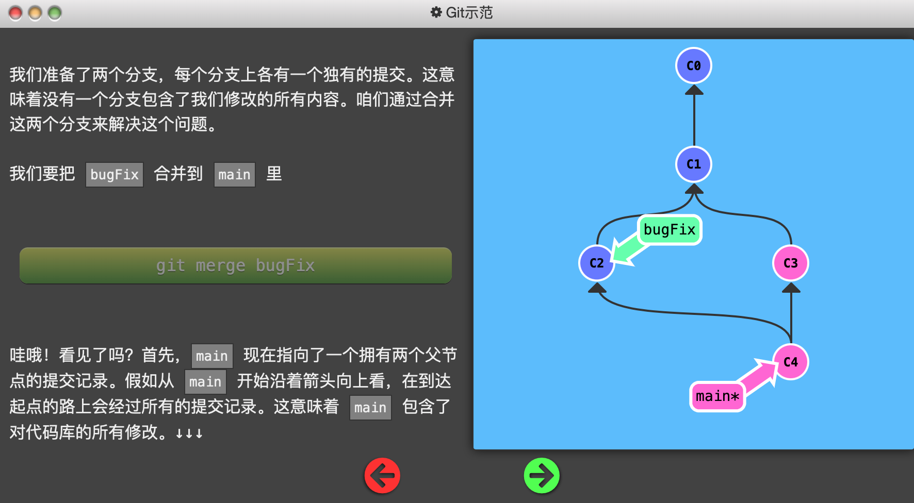
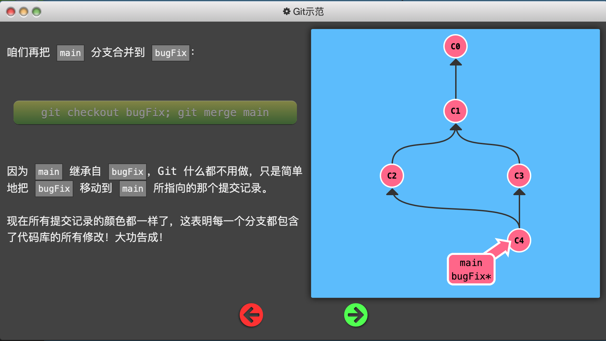
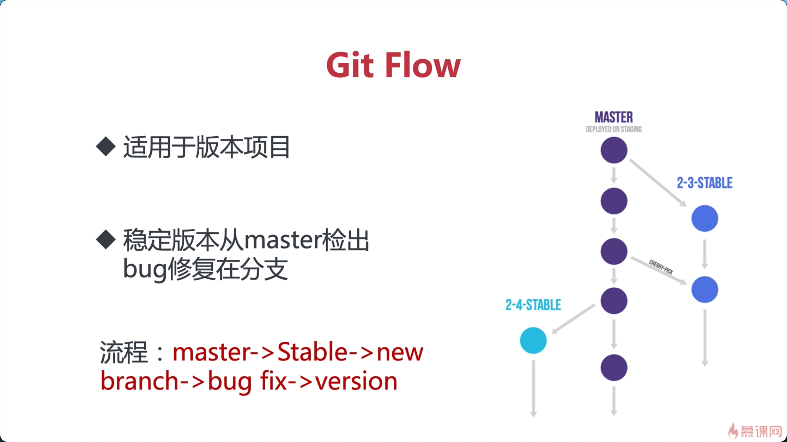

### tips
一个本地仓库可以对应多个远端仓库
git remote add origin xxx.git // 将本地仓库与远端建立联系 origin是仓库别名 可以自定义
git remote add origin1 xxx.git // 将本地仓库与另一个远端建立联系 
如果都使用origin push将一起推送至两个仓库
如果增加`-u`指令 则使用 `git push` 默认推送到设置的仓库,不使用默认则是 `git push origin master`

### git图示

 


### git命令简单介绍，后期会补全

#### 工作区命令

``` 
+ git clone 从远端仓库拉取代码
- git init 初始化
- git remote 远端建立连接
- git pull 拉取远端代码，并与本地合并
git log 查看提交记录 按空格持续加载 Q退出 
git log 可以显示所有提交过的版本信息，不包括已经被删除的 commit 记录和 reset 的操作
git reflog 可以查看**本地所有**的所有操作记录（包括分支、包括已经被删除的 commit 记录和 reset 的操作）,适合找回
git config 
	git config --global --list 查看全局的git配置
	git config --global user.name xxxx 设置全局user name
	git config --global user.email xx@xx 设置全局user.email
		1、仓库级别 local 【优先级最高】
		2、用户级别 global【优先级次之】
		3、系统级别 system【优先级最低】
git status 工作区 暂存区 远端是否需要拉取等信息
git restore 指令使得在工作空间但是不在暂存区的文件撤销更改
git restore --staged 的作用是将暂存区(add)的文件从暂存区撤出，但不会撤销修改
```

#### stage暂存区命令

```
git stash 贮藏 详细看下边
```

##### git stash

`stash`命令可用于临时保存和回复修改，**可跨分支**。

> ***注：在未`add`之前才能执行`stash`！！！！\***

- `git stash [save message]`
  保存，`save`为可选项，`message`为本次保存的注释
- `git stash list`
  所有保存的记录列表
- `git stash pop stash@{num}`
  恢复，`num`是可选项，通过`git stash list`可查看具体值。**只能恢复一次**
- `git stash apply stash@{num}`
  恢复，`num`是可选项，通过`git stash list`可查看具体值。**可回复多次**
- `git stash drop stash@{num}`
  删除某个保存，`num`是可选项，通过`git stash list`可查看具体值
- `git stash clear`
  删除所有保存

#### master命令

```
git reset --hard commitID 回退版本 相当于删除中间的版本
```

##### Git diff命令的四种用法

**`git diff`** 比较「暂存区」与「工作区」之间的差异。

**`git diff commitID`** 比较「给定提交 ID」与「工作区」的差异。

**`git diff --cached commitID`** 比较「暂存区」与「给定提交 ID」的差异

**`git diff commit1 commit2`** 比较指定的两次提交 「commit1」与 「commit2」的差异

**选项** `--stat` 显示有多少行发生变化，简洁的展示差异

#### 分支命令

##### git branch

一般用于分支的操作，比如创建分支，查看分支等等，

　	`git branch` 不带参数：列出本地已经存在的分支，并且在当前分支的前面用"*"标记

　　`git branch -r`  查看远程版本库分支列表

　　`git branch -a` 查看所有分支列表，包括本地和远程

　　`git branch dev` 创建名为dev的分支，创建分支时需要是最新的环境，创建分支但依然停留在当前分支

　　`git branch -d dev` 删除dev分支，如果在分支中有一些未merge的提交，那么会删除分支失败

 	   `git branch -D dev`：强制删除dev分支，

​		`git branch -vv`  可以查看本地分支对应的远程分支

　　`git branch -m oldName newName`  给分支重命名

##### Git checkout 

​	`git checkout master` 将分支切换到master

　`git checkout -b master` 如果分支存在则只切换分支，若不存在则创建并切换到master分支

> > 在这里只介绍分支相关的命令

##### Git 合并分支的两种方式





### Git flow

两种常见的模型




