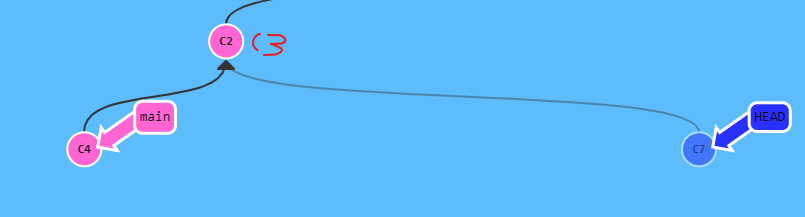

### 学习网址

这可能是学习git操作最好的网址了 --------- [learngit](https://learngitbranching.js.org/?locale=zh_CN)

### tips

一个本地仓库可以对应多个远端仓库
git remote add origin xxx.git // 将本地仓库与远端建立联系 origin是仓库别名 可以自定义
git remote add origin1 xxx.git // 将本地仓库与另一个远端建立联系 
如果都使用origin push将一起推送至两个仓库
如果增加`-u`指令 则使用 `git push` 默认推送到设置的仓库,不使用默认则是 `git push origin master`

### git图示

 


### git命令简单介绍，后期会补全

#### 工作区命令

``` 
+ git clone 从远端仓库拉取代码
- git init 初始化
- git remote 远端建立连接
- git pull 拉取远端代码，并与本地合并
git log 查看提交记录 按空格持续加载 Q退出 
git log 可以显示所有提交过的版本信息，不包括已经被删除的 commit 记录和 reset 的操作
git reflog 可以查看**本地所有**的所有操作记录（包括分支、包括已经被删除的 commit 记录和 reset 的操作）,适合找回
git config 
	git config --global --list 查看全局的git配置
	git config --global user.name xxxx 设置全局user name
	git config --global user.email xx@xx 设置全局user.email
		1、仓库级别 local 【优先级最高】
		2、用户级别 global【优先级次之】
		3、系统级别 system【优先级最低】
git status 工作区 暂存区 远端是否需要拉取等信息
git restore 指令使得在工作空间但是不在暂存区的文件撤销更改
git restore --staged 的作用是将暂存区(add)的文件从暂存区撤出，但不会撤销修改
git commit -m "msg" 暂存区提交到本地仓库
```

##### git push

​	**git push** 命令用于从将本地的分支版本上传到远程并合并。 

命令格式如下：远程分支如果不存在，则会创建一个分支

```
git push <远程主机名> <本地分支名>:<远程分支名>
```

如果本地分支名与远程分支名相同，则可以省略冒号：

```
git push <远程主机名> <本地分支名>
```

如果当前分支与多个主机存在追踪关系，则可以使用 -u 参数指定一个默认主机，这样后面就可以不加任何参数使用git push

```
git push -u origin master 
```

当遇到这种情况就是不管是否存在对应的远程分支，将本地的所有分支都推送到远程主机，这时需要 -all 选项

```
git push --all origin 
```

**实例演示**

以下命令将本地的 master 分支推送到 origin 主机的 master 分支。

```
git push origin master
```

相等于：

```
git push origin master:master
```

如果本地版本与远程版本有差异，但又要强制推送可以使用 --force 参数：

```
git push --force origin master
```

删除主机的分支可以使用 --delete 参数，以下命令表示删除 origin 主机的 master 分支：

```
git push origin --delete master
```

> **略本地分支名，也可以删除指定的远程分支**
>
> ```
> git push origin :master
> ```

##### Git fetch

简单的来说 git pull = git fetch + git merge

git fetch 命令：

```
git fetch <远程主机名> //这个命令将某个远程主机的更新全部取回本地
```

如果只想取回特定分支的更新，可以指定分支名：

```
git fetch <远程主机名> <分支名> //注意之间有空格
```

最常见的命令如取回`origin` 主机的`master` 分支：

```
git fetch origin master
```

取回更新后，会返回一个`FETCH_HEAD` ，指的是某个branch在服务器上的最新状态，我们可以在本地通过它查看刚取回的更新信息：

```
git log -p FETCH_HEAD
```

如图： 


可以看到返回的信息包括更新的文件名，更新的作者和时间，以及更新的代码（19行红色[删除]和绿色[新增]部分）。我们可以通过这些信息来判断是否产生冲突，以确定是否将更新merge到当前分支。

**代码合并示例**

```
## 在本地新建一个temp分支，并将远程origin仓库的master分支代码下载到本地temp分支；
git fetch origin master:temp

## 比较本地代码与刚刚从远程下载下来的代码的区别；
git diff temp

## 合并temp分支到本地的master分支;
git merge temp

## 如果不想保留temp分支，删除;
git branch -D temp
```


#### stage暂存区命令

```
git stash 贮藏 详细看下边
```

##### git stash

`stash`命令可用于临时保存和回复修改，**可跨分支**。

> ***注：在未`add`之前才能执行`stash`！！！！\***

- `git stash [save message]`
  保存，`save`为可选项，`message`为本次保存的注释
- `git stash list`
  所有保存的记录列表
- `git stash pop stash@{num}`
  恢复，`num`是可选项，通过`git stash list`可查看具体值。**只能恢复一次**
- `git stash apply stash@{num}`
  恢复，`num`是可选项，通过`git stash list`可查看具体值。**可回复多次**
- `git stash drop stash@{num}`
  删除某个保存，`num`是可选项，通过`git stash list`可查看具体值
- `git stash clear`
  删除所有保存

#### master命令

```
git reset --hard commitID 回退版本 相当于删除中间的版本
```

##### Git diff命令的四种用法

**`git diff`** 比较「暂存区」与「工作区」之间的差异。

**`git diff commitID`** 比较「给定提交 ID」与「工作区」的差异。

**`git diff --cached commitID`** 比较「暂存区」与「给定提交 ID」的差异

**`git diff commit1 commit2`** 比较指定的两次提交 「commit1」与 「commit2」的差异

**选项** `--stat` 显示有多少行发生变化，简洁的展示差异

##### git reset 

`git reset`  通过把分支记录回退几个提交记录来实现撤销改动

​	`git reset HEAD~1` 回退到上次提交（撤销commit），但是文件修改后的内容还是存在于工作区的

> 远程仓库做出的修改并没有回退哦，要记住

​	此时通过git log和 git reflog对比就能看出两条命令的明显区别了


##### Git Revert

虽然在你的本地分支中使用 `git reset` 很方便，但是这种“改写历史”的方法对大家一起使用的远程分支是无效的！**revert 之后就可以把你的更改推送到远程仓库与别人分享啦**。

`git revert HEAD`相当于相当于把上次提交的内容还原覆盖到工作区中，提交记录会增加一个，而不是减少，详细见下一节的示意

##### reset 和 revert对比

初始状态，切记HEAD~1和HEAD 不能混用，有意想不到的结果


`git reset HEAD~1`


`git revert HEAD`


#### 分支命令

##### git branch

一般用于分支的操作，比如创建分支，查看分支等等，

　	`git branch` 不带参数：列出本地已经存在的分支，并且在当前分支的前面用"*"标记

　　`git branch -r`  查看远程版本库分支列表

　　`git branch -a` 查看所有分支列表，包括本地和远程

　　`git branch dev` 创建名为dev的分支，创建分支时需要是最新的环境，创建分支但依然停留在当前分支

　　`git branch -d dev` 删除dev分支，如果在分支中有一些未merge的提交，那么会删除分支失败

​		`git branch -D dev`：强制删除dev分支

​		`git branch -vv`  可以查看本地分支对应的远程分支

　　`git branch -m oldName newName`  给分支重命名

​		`git branch -f main HEAD~3`  **强制修改分支位置** 向上移动3个位置

​		`git branch -f main commitID`  **强制修改分支位置**到指定commit

##### Git checkout 

​	`git checkout master` 将分支切换到master

　`git checkout -b master` 如果分支存在则只切换分支，若不存在则创建并切换到master分支

> > 在这里只介绍分支相关的命令

##### Git 合并分支的两种方式


> 我们在切换分支，和新建分支的时候，有没有想过，这些操作操作背后的工作原理是怎样的呢？最大的功臣就是.git目录下的HEAD引用,下面有对HEAD的详细解释

##### Git rebase

第二种合并分支的方法是 `git rebase`。Rebase 实际上就是取出一系列的提交记录，“复制”它们，然后在另外一个地方逐个的放下去。

Rebase 的优势就是可以创造更线性的提交历史，这听上去有些难以理解。如果只允许使用 Rebase 的话，代码库的提交历史将会变得异常清晰。

这个用图示比较清晰


### Git flow

两种常见的模型


### git HEAD

可以把HEAD理解成一个指针，HEAD指针通常会指向一个分支，如下图所示


HEAD-->master-->commitID，通常情况下，HEAD会一直跟随着当前分支，并指向分支，而分支则指向当前最新的commit

还有一种 `detached HEAD`的状态，使用`git checkout C3`即可以把HEAD指针指向C3

> 还有一种相对引用的方式，`git checkout main^`*3 或者  `git checkout main^^^` 或者 `git checkout main~3`  或者使用 `git checkout HEAD^^^`,这几种方法都是向父节点方向移动


如果此时进行commit，git的返回信息会提示我们，You are in ‘detached HEAD’ state.（你现在处于’分离头’状态）。然后会从C3节点出现一个新的节点，HEAD会指向新的节点，可以简单的理解为匿名分支（图和上边不一样，仅做示意）



我们现在有两个选择，如下：

- 丢弃这个匿名分支
  - 直接检出到任何一个别的分支，就相当于放弃了这些提交

- 保留这个匿名分支
  - 创建一个名为newtest的分支来保存这些提交
    - `git branch newtest c7`  这种方式HEAD并未指向newtest，而是指向了C7，仍是指针分离状态
    - `git checkout -b newtest`   HEAD指向了newtest，newtest指向了C7

- 与现存分支，参考分支命令章节


### git checkout

`git checkout`命令用于切换分支或恢复工作树文件，也可以指定HEAD指针的位置

除了分支命令中介绍的使用方法，还可以进行HEAD操作，详细见上一小节