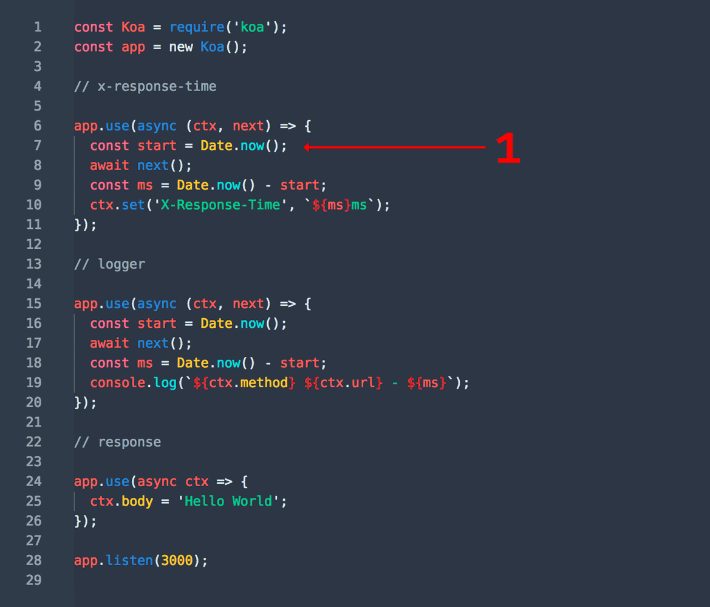
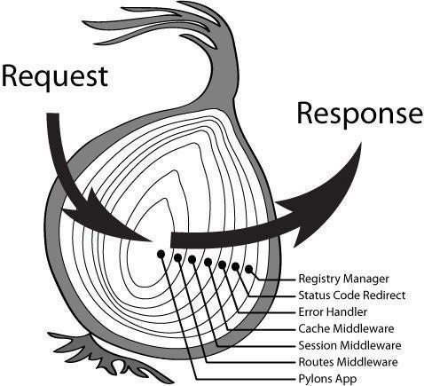

## koa入门

### 一、定义

一个简约、扩展性强，基于Node.js平台的web开发框架。

### 二、安装

```csharp
yarn add koa
npm install koa
```

### 三、koa中间件

##### 1、定义

使用app.use()注册的函数。每次客户端的请求，koa都会调用。

##### 2、基本格式


```dart
//ctx：上下文，核心对象
//next：将处理的控制权转交给下一个中间件
app.use(async (ctx, next)=>{
  //...
  await next()    //等待下个中间件运行结束，才运行当前中间件的后续代码
  //...
})
```

##### 3、基本执行流程





> PS：执行流程，好比水分进出洋葱一样，洋葱的每层相当于中间件，水分输入相当于请求，水分输出相当于相应。整个过程中，执行指针需要遍历两次中间件（除了最后一个中间件）。

##### 更加直观的体现洋葱模型

````
app.use(async (ctx, next) => {
  console.log("1 top"); // 1
  next()
  console.log("1 bottom"); // 8
})
app.use(async (ctx, next) => {
  console.log("2 top"); // 2
  next()
  console.log("2 bottom"); // 7
})
app.use(async (ctx, next) => {
  console.log("3 top"); // 3
  next()
  console.log("3 bottom"); // 6
})
app.use(async (ctx, next) => {
  console.log("4 top"); // 4
  next()
  console.log("4 bottom"); // 5
})
输出结果如下
1 top
2 top
3 top
4 top
4 bottom
3 bottom
2 bottom
1 bottom
````

> 个人觉得很像函数推栈出栈的过程 

## koa核心概念


[koa中文网](https://koa.bootcss.com/#links)  有比较详细的介绍
详细可运行的配置在 [个人git项目](https://github.com/mst123/bfe)

> 和文章略有出入（很多插件都有更新的版本）
## koa常用的中间件

- kao-router 路由相关 接口必备
- koa-combine-routers 当路由文件较多时，合并路由，只需要一个app.use就可以搞定
- koa-body 解析前端发送的数据，支持
  - can handle requests such as:
    - **multipart/form-data**
    - **application/x-www-urlencoded**
    - **application/json**
    - **application/json-patch+json**
    - **application/vnd.api+json**
    - **application/csp-report**
    - **text/xml**
  - option for patch to Koa or Node, or either
  - file uploads
  - body, fields and files size limiting
- Koa-json 美化json
- @koa-cors 跨域请求
- koa-views 渲染页面
- koa-helmet 前端安全 设置安全头
- koa-send 静态文件服务中间件 可以实现下载功能，也是koa-static的依赖
- Koa-static 静态资源服务器
- koa-compose 整合中间件 ompose[midleware, ....]  替代带多次 use() 

## 使用webpack 开发 koa 项目

- 首先需要安装webpack webpack-cli `npm install webpack webpack-cli -D`

- 安装几个webpack plugin

  - clean-webpack-plugin 清理dist目录
  - webpack-node-externals 对node_modules文件做排除处理（貌似是为了nodejs准备的）

- 安装babel相关的plugin或loader

  - @babel/core  
  - @babel/node 
  - @babel/preset-env 
  - babel-loader

- 书写webpack.config.js

  ```
  const path = require("path")
  const nodeExcternals = require("webpack-node-externals")
  const { CleanWebpackPlugin } = require("clean-webpack-plugin")
  const webpackconfig = {
  	target: "node",
  	mode: "development",
  	entry: {
  		server: path.join(__dirname, "./src/index.js")
  	},
  	output: {
  		filename: "[name].bundle.js",
  		path: path.join(__dirname, "./dist")
  	},
  	devtool: {
  		"eval-source-map"
  	},
  	modules: {
  		rules: [
  			{
  				test: /\.(js|jsx)$/,
  				use: {
  					loader: "babel-loader"
  				},
  				exclude: [path.join(__dirname, "/node-modules")]
  			}
  		]
  	},
  	externals: [nodeExcternals()],
  	plugins: [
  		new CleanWebpackPlugin(),
  		new webpack.DefinePlugin({
  			'process.env': {
  				NODE_ENV: JOSN.stringfy(process.env.NODE_ENV) (就算是字符串还是需要)类似于“‘production’”
  			}
  		})
  	],
  	node: {
  		console: true,
      global: true,
      process: true,
      __filename: true,
      __dirname: true,
      Buffer: true,
      setImmediate: true,
      path: true ?webapck 5 好像没了
  	}
  }
  ```

-  新建 `.babelrc`

  ```
  {
  	presets: [
  		[
  			"@babel/preset-env",
  			{
  				targets: {
  					node: "current"
  				}
  			}
  		]
  	]
  }
  ```

- 打包项目 `npx webpack`

- 启动项目 `npx babel-node ./src/index.js`

  - 如果需要热更新，安装nodemon

  - 然后 `npx nodemon --exec babel-node ./src/index.js`

    > ```bash
    > --watch 监听哪些文件的变化，当变化的时候自动重启
    > --exec 配置运行命令
    > ```

- 拆分webpack配置 对应开发环境及生产环境
  - 需要webpack-merge插件进行webpack配置合并
  - cross-env 设置环境变量，保证跨平台正确的环境变量
  - terser-webpack-plugin 压缩代码
- 建立三个webapck.config.env.js文件

```
 base
 const path = require("path")
const nodeExcternals = require("webpack-node-externals")
const webpack = require('webpack');
const { CleanWebpackPlugin } = require("clean-webpack-plugin")
const webpackconfig = {
	target: "node",
	mode: "development",
	entry: {
		server: path.join(__dirname, "./src/index.js")
	},
	output: {
		filename: "[name].bundle.js",
		path: path.join(__dirname, "./dist")
	},
	modules: {
		rules: [
			{
				test: /\.(js|jsx)$/,
				use: {
					loader: "babel-loader"
				},
				exclude: [path.join(__dirname, "/node-modules")]
			}
		]
	},
	externals: [nodeExcternals()],
	plugins: [
		new CleanWebpackPlugin(),
		new webpack.DefinePlugin({
			'process.env': {
				NODE_ENV: JOSN.stringfy(process.env.NODE_ENV) // (就算是字符串还是需要)类似于“‘production’”
			}
		})
	],
	node: {
		console: true,
    global: true,
    process: true,
    __filename: true,
    __dirname: true,
    Buffer: true,
    setImmediate: true,
    path: true // ?webapck 5 好像没了
	}
}
dev
const webpackMerge = require('webpack-merge');
const baseWebpackConfig = require('./webpack.config.base');
const webpackConfig = webpackMerge(baseWebpackConfig, {
	mode: 'development',
	devtool: "eval-source-map",
	stats: {
		children: false // 关闭日志消息
	}
})

module.exports = webpackConfig;
prod
const webpackMerge = require('webpack-merge');
const baseWebpackConfig = require('./webpack.config.base');
const TerserPlugin = require('terser-webpack-plugin');

const webpackConfig = webpackMerge(baseWebpackConfig, {
	mode: 'production',
	stats: {
		children: false, // 关闭日志消息
		warnings: false
	},
	optimization: {
		minimizer: [new TerserPlugin({
			terserOptions: {
				compress: {
					warnings: false,
					drop_console: false, //注释掉console
					dead_code: true,
					drop_debugger: true //注释掉debugger
				},
				output: { // 最新的貌似没这属性
					comments: false,
					beautify: false
				},
				mangle: true // 混淆
			},
			parallel: true, // 并行化执行
			sourceMap: false // 使用源映射将错误消息位置映射到模块（这会减慢编译速度）
		})],
		splitChunks: { // 视频里配的不太好，仅做示例吧
      cacheGroups: {
        commons: {
					name: 'commons',
					chunks: 'initial',
					minChunks: 3,
					enforce: true
        }
      }
    }
	},
})

module.exports = webpackConfig;
```

