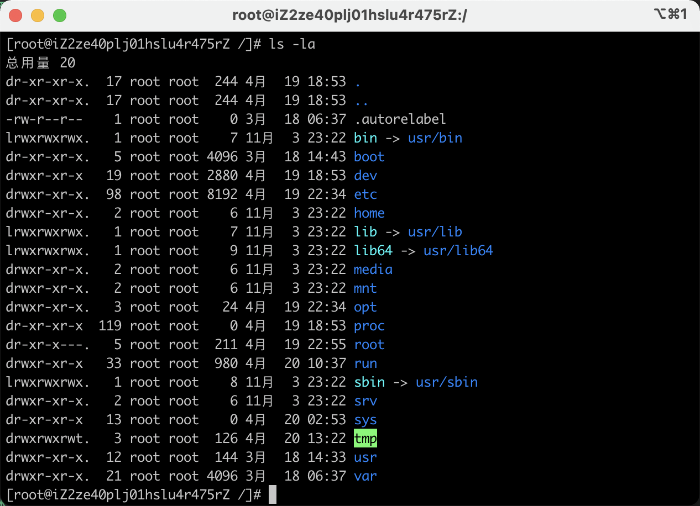
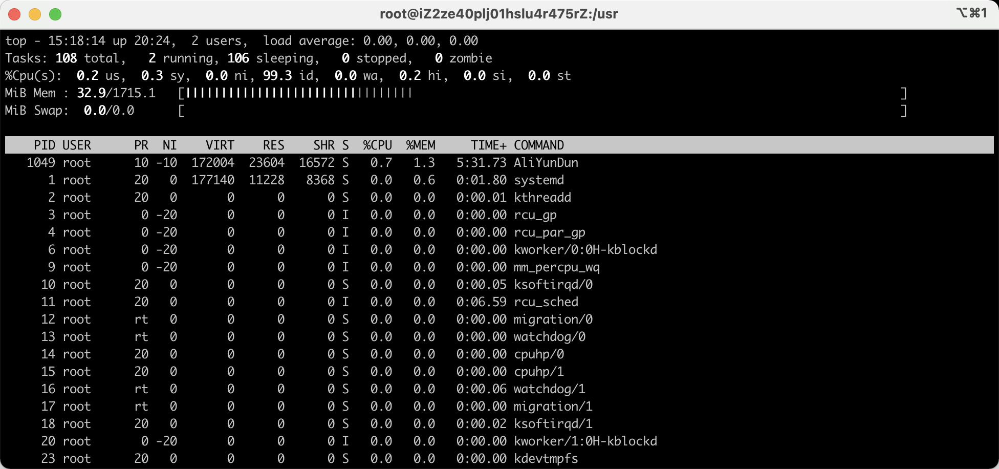

# linux基本命令

## 查看版本、内核

查看系统版本`lsp_release -a`
查看内核版本`uname -a`

## 磁盘命令

查看磁盘空间 `df -Th` 以G为单位

## linux目录&文件权限

进入根目录 `cd /`
文件目录及权限查看 `ls -la`

- 第一列代码文件的各种quanxian r-read w-write x-执行 r-remove
- home目录相当于个人目录
- etc 存放软件配置文件
- sys 系统目录
- usr 存放着系统的可执行文件
- var 日志文件

## CPU/内存/进程

查看运行中的进程`top`  可以按M看详细内存

## 文档相关

- 进入文件夹 cd 路径
- pwd 显示当前文件夹
- ls 查看文件下所有文件夹及文件
- mkdir 新建文件夹
- touch 新建文件
- vi 文件名 使用vim编辑器打开文件
  - 输入 i 进入编辑-insert--模式
  - 按esc，然后输入:wq 保存退出
    - :q! 不对其进行保存
- `echo ‘1111’  >>  test.txt` 向文件内添加内容 1111
  - `>`单箭头是覆盖内容  `>>` 是添加内容
- `rm demo.txt`  删除文件 提示是否删除 输入Y回车确认删除
- `rm -r demo/`  删除目录 提示是否删除 输入Y回车确认删除
- `rm -rf` 强制删除 尽量不要使用

## 下载/解压/安装命令

以nodejs作为例子

- 下载资源 `wget https://cdn.npm.taobao.org/dist/node/v14.16.1/node-v14.16.1.tar.gz`
  - 下载完成后，用ls查看
- 解压资源，tar格式
  - `tar zxvf node-v14.16.1.tar.gz`
    - z 是.gz结尾的压缩文件
    - x 解压
    - v 显示所有解压过程
    - f 使用归档的名字
- 压缩文件 `tar zcvf 文件名 文件目录`

## 查看进程

- 查看进程 `ps -ef | grep docker` grep 相当于搜索，限定docker程序
  - root 后面跟着的数值是进程的id，杀死进程可以用 `kill -9 id` - 9表示强制终止

## 查看服务的命令

- 查看服务状态
  - 例如查看ssh的运行状态,可以看到客户端通过ssh连接到服务器的记录 `service sshd status`

- 停止服务
  - 例如停止ssh `service sshd stop`
- 重启服务
  - 例如重启ssh `service sshd restart`

> 还有一个`systemtcl`命令
