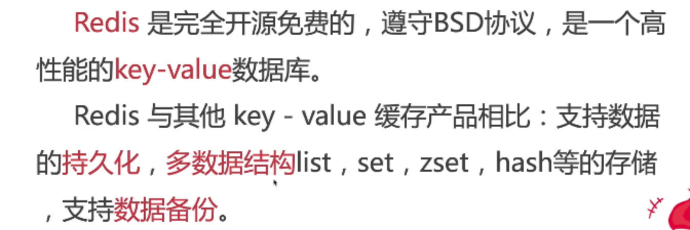

## 相关概念



### redis特点

- 高性能，可持久化
- key-value结构，支持多种数据类型
- 支持事务，数据的原子性

### 应用场景

- 缓存（读写性能优异）
- 计数&消息系统（高并发、发布/订阅阻塞队列功能）
- 分布式回话session&分布式锁（秒杀）

### redis vs mongo

- 储存方式不一样：key-value vs document
- 使用方式&可靠性不一样： MongoDB SQL & ACDI支持
- 应用场景不一样：高性能缓存 vs 海量数据分析

### 使用docker 安装redis

#### Docker-compose配置

在linux服务器中，新建`/home/redistest/docker-compose.yml`，并书写以下内容

```
version: "3"
services: 
  redis-test:
    image: "redis"
    restart: always
    container_name: "redis-test"
    ports: 
      - 15001:6379
    volumes: 
      - /home/redistest:/data // 持久化
    command: ["redis-server","--requirepass","123456"] // 设置密码
```

然后在当前目录运行`docker-compose up -d` 会自动抓取redis 并运行在15001端口

然后运行linux端口放行`firewall-cmd --zone=public --add-port=15001/tcp --permanent`

#### 使用redis-cli

[redis命令](http://doc.redisfans.com/)

- 进入容器交互终端  `docker exec -it redis-test /bin/bash`
- 输入 redis-cli 回车
- 输入 auth 123456 // 密码登陆
- 输出OK表示成功

> 想从镜像终端中出来，输入exit

##### 常用的redis命令

- ping ，如果运行正确 会返回pong

- quit 断开当前redis 服务

- auth 123456 // 登陆

- select  number 切换自动数据库，默认有0 - 15

- 设置数据

  - set key value 设置键值
  - get key 获取键值
  - incr 变量自增 例如 set index 0 ；incr inde ；// 1 计数器
  - decr 递减
  - keys 正则 （*所有）查看符合条件的键值
  - exists  key  [...key] 看键值是否存在 1 存在 0 不存在
  - del  key 删除键值 1成功 0失败

- 设置过期时间

  - set key value  'EX'  seconds

- Hash

  - hset obj key value

  - ```
    就像给一个对象设置键值对一样 
    hset brian name "brian"
    hset brian age 19
    brian = {
     name: "brian",
      age: 20
    }
    ```

  - hgetall obj  返回对象的key value对

  - ```
    hgetall brian
    name
    brian
    age
    19
    ```

  - Hmset 设置多对键值对

  - ```
    hmset brian name xxx age 19 email ueih@122
    ```

  - Hmget 获取多个键值

  - ```
    hmget brian name age
    xxx
    19
    ```

- list list操作

- pub/sub 发布订阅

- server命令

  - client list 可以查看redis-cli连接的哪些redis-client服务 通过idle空闲时间判断当前使用的
  - client kill host:port 断开
  - flushdb 清空当前数据库的数据
  - flushall 清空所有数据库

- slowlog  slow log是用来记录执行时间的日子系统

### redis备份

save 命令备份（同步任务，会阻塞，使用bgsave） 会生成一个dump.rdb，quit停止服务

CONFIG get dir 找到数据存在位置，把dump.rdb放入，重启服务就可以了

### Redis GUI

安装一个破解版的redis desktop manage，可以修改语言为中文，通过gui中的终端服务，可以很轻松的使用

### Nodejs 集成 redis

首先安装redis `npm install redis --save`

redis配置示例如下

```
import redis from "redis"
const { promisify } = require("util");
const options = {
  host: "39.106.100.189", // 切记不需要写http之类的
  port: 15001,
  password: "123456",
  detect_buffers: true, // 不转换二进制
  retry_strategy: function(options) { // 重连错误处理
    if (options.error && options.error.code === "ECONNREFUSED") {
      // End reconnecting on a specific error and flush all commands with
      // a individual error
      return new Error("The server refused the connection");
    }
    if (options.total_retry_time > 1000 * 60 * 60) {
      // End reconnecting after a specific timeout and flush all commands
      // with a individual error
      return new Error("Retry time exhausted");
    }
    if (options.attempt > 10) {
      // End reconnecting with built in error
      return undefined;
    }
    // reconnect after
    return Math.min(options.attempt * 100, 3000);
  }
}
// 创建一个redis实例
const client = redis.createClient(options)

// set方法
const setValue = (key, value) => {
   return client.set(key, value)
}

// 创建promise
const getAsync = promisify(client.get).bind(client);

// get方法
const getValue = (key) => {
  return getAsync(key)
}

export {
  client,
  setValue,
  getValue
}
```

测试

```
setValue("ceshi", 122333)
getValue("ceshi").then(res => {
  console.log(res);
})
// 122333 成功
```

get 、set方法生产模式再次封装一下

```
/ set方法
const setValue = (key, value) => {
  if (typeof value === "undefined" || value == null || value === "") {
    // == null 包含null 和 undefined
    return;
  }
  if (typeof value === "string") {
    return client.set(key, value)
  } else if (typeof value === "object") {
    // 对象层级应该只有能一层，不能多级嵌套
    Object.keys(value).forEach((keyC) => {
      client.hset(key, keyC, value[keyC], redis.print)
    })
  }
}

// 创建promise
const getAsync = promisify(client.get).bind(client);
// get方法
const getValue = (key) => {
  return getAsync(key)
}
// hash get方法
const getHValue = (key) => {
  return promisify(client.hgetall).bind(client)(key)
}
```
