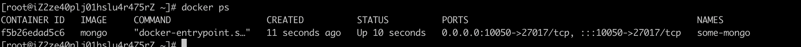
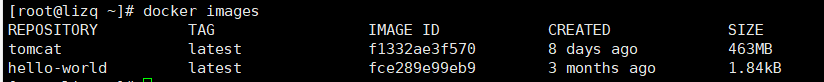
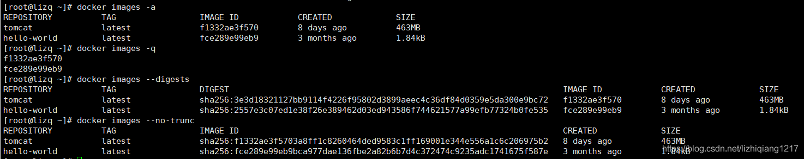
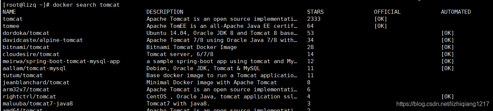

解决方案最好去官网查看

## 简短的记录一下步骤

- 申请阿里云服务器
- 创建秘钥对，然后绑定到实例
- 运行长命令
  - ssh -i {ff6b954c664adf1ba473194b3b620b7d .pem ~/.ssh/alien-linux.pem} {root}@{39.106.100.189}
  - 应该会出现权限问题
- 运行命令，获取权限 chmod 400 .pem文件的完整路径  chmod 400 ~/.ssh/alien-linux.pem
- 配置config文件 vim ~/.ssh/config

  ```
    Host Aliyun #自定义别名
    HostName 39.106.100.189 #ssh服务器公网IP
    Port 22 #ssh服务器端口，默认22
    User root #ssh服务器用户名，默认root
    IdentityFile ~/.ssh/alien-linux.pem #秘钥文件路径
  ```

- 这样差不多就ok了

## 在阿里云安装docker

[docker-install](https://github.com/docker/docker-install)

```
curl -fsSL https://get.docker.com -o get-docker.sh
sh get-docker.sh
```

然后 需要安装 docker-compose 查找linux安装方法,mac docker客户端集成了docker-compose
[compose](https://docs.docker.com/compose/install/)

```
sudo curl -L "https://github.com/docker/compose/releases/download/1.29.1/docker-compose-$(uname -s)-$(uname -m)" -o /usr/local/bin/docker-compose
```

然后需要给脚本执行权限

```
sudo chmod +x /usr/local/bin/docker-compose
```

## 安装mongo

### 下载mongo

docker pull mongo

如果失败的话，可以配置中国镜像, 编写`/etc/docker/daemon.json`

```
{
  "registry-mirrors": ["https://<my-docker-mirror-host>"]
}
{
 "registry-mirrors": ["https://registry.docker-cn.com"]
}
```

然后重启docker  `systemctl restart docker.service`

### 运行mongo

`docker run -d --name some-mongo -p 10050:27017 mongo`

- -d 表示后台运行
- -p 定义端口 10050:27017  容器端口27017映射到宿主机10050
- --name 命名
- mongo 可以接:tag 比如 mongo:4  版本4

检查docker下边运行的镜像 `docker ps`，如下图所示



## 关闭防火墙

简单粗暴法

ubuntu：service ufw stop

Centos service firewalld stop

B格高的方法，放行特定端口

ubuntu： ufw allow Port端口号

centos：`firewall-cmd --zone=public --add-port=10050/tcp --permanent`  --permanent 永久生肖

服务器提示 FirewallD is not running 未开启防火墙，先把防火墙开启（不知道有无必要）,`systemctl start firewalld`

然后继续执行上一条命令，输出success，然后运行`firewall-cmd --reload`,重启生效

现在验证是否可以访问，通过robo 3T 或者 Navicat连接测试，**需要修改阿里云安全组策略，要不然无法连接**

## 安装nodejs

1.wget <https://nodejs.org/dist/v6.10.3/node-v6.10.3-linux-x64.tar.xz> //下载最新的稳定版 v6.10.3 到本地

（最新 [https://nodejs.org/dist/v14.15.1/node-v14.15.1-linux-x64.tar.xz](https://links.jianshu.com/go?to=https%3A%2F%2Fnodejs.org%2Fdist%2Fv14.15.1%2Fnode-v14.15.1-linux-x64.tar.xz)）

2.tar xvJf node-v6.10.3-linux-x64.tar.xz                       //下载完成后, 将其解压

3.mv node-v6.10.3-linux-x64 /usr/local/node-v6                //将解压的 Node.js 目录移动到 /usr/local 目录下

4.ln -s /usr/local/node-v6/bin/node /bin/node                  //配置 node 软链接到 /bin 目录

5.ln -s /usr/local/node-v6/bin/npm /bin/npm                   //下载 node 的压缩包中已经包含了 npm , 我们只需要将其软链接到 bin 目录下即可

6.echo 'export PATH=/usr/local/node-v6/bin:$PATH' >> /etc/profile //将/usr/local/node−v6/bin目录添加到PATH′>>/etc/profile//将/usr/local/node−v6/bin目录添加到PATH 环境变量中可以方便地使用通过 npm 全局安装的第三方工具

7.source /etc/profile 有时候需要更新

> 第六、七步可能不需要，试一下npm -v 能不能ok，如果不可以的话，在运行第六步

### docker的基本命令

一、基本命令
docker version查看docker版本
docker info查看docker详细信息
docker --help查看docker命令
二、镜像命令
docker images查看docker镜像



PEPOSITORY：镜像的仓库源
TAG：镜像的标签
IMAGE ID：镜像ID
CREATED：镜像创建时间
SIZE：镜像大小
 同一个仓库源可以有多个TAG，表示这个仓库源的不同版本，我们使用REPOSITORY:TAG来定义不同的镜像。如果不指定一个镜像的版本标签，例如只使用tomcat，docker将默认使用tomcat:latest镜像
docker images -a列出本地所有的镜像
docker images -p只显示镜像ID
docker images --digests显示镜像的摘要信息
docker images --no-trunc显示完整的镜像信息



docker search tomcat从Docker Hub上查找tomcat镜像



STARS：关注度
docker search -s 30 tomcat从Docker Hub上查找关注度大于30的tomcat镜像
docker pull tomcat从Docker Hub上下载tomcat镜像。等价于：docker pull tomcat:latest
docker commit -m "提交的描述信息" -a "作者" 容器ID 要创建的目标镜像名称:[标签名]提交容器使之成为一个新的镜像。
如：docker commit -m "新的tomcat" -a "lizq" f9e29e8455a5 mytomcat:1.2
docker rmi hello-world从Docker中删除hello-world镜像
docker rmi -f hello-world从Docker中强制删除hello-world镜像
docker rmi -f hello-world nginx从Docker中强制删除hello-world镜像和nginx镜像
docker rmi -f $(docker images -p)通过docker images -p查询到的镜像ID来删除所有镜像
三、容器命令。
docker run [OPTIONS] IMAGE根据镜像新建并启动容器。IMAGE是镜像ID或镜像名称
OPTIONS说明：
 --name=“容器新名字”：为容器指定一个名称
 -d：后台运行容器，并返回容器ID，也即启动守护式容器
 -i：以交互模式运行容器，通常与-t同时使用
 -t：为容器重新分配一个伪输入终端，通常与-i同时使用
 -P：随机端口映射
 -p：指定端口映射，有以下四种格式：
  ip:hostPort:containerPort
  ip::containerPort
  hostPort:containerPort
  containerPort
docker ps列出当前所有正在运行的容器
docker ps -a列出所有的容器
docker ps -l列出最近创建的容器
docker ps -n 3列出最近创建的3个容器
docker ps -q只显示容器ID
docker ps --no-trunc显示当前所有正在运行的容器完整信息
exit退出并停止容器
Ctrl+p+q只退出容器，不停止容器
docker start 容器ID或容器名称启动容器
docker restart 容器ID或容器名称重新启动容器
docker stop容器ID或容器名称停止容器
docker kill 容器ID或容器名称强制停止容器
docker rm 容器ID或容器名称删除容器
docker rm -f 容器ID或容器名称强制删除容器
docker rm -f $(docker ps -a -q)删除多个容器
docker logs -f -t --since --tail 容器ID或容器名称查看容器日志
如：docker logs -f -t --since=”2018-09-10” --tail=10 f9e29e8455a5
 -f : 查看实时日志
 -t : 查看日志产生的日期
 --since : 此参数指定了输出日志开始日期，即只输出指定日期之后的日志
 --tail=10 : 查看最后的10条日志
docker top 容器ID或容器名称查看容器内运行的进程
docker inspect 容器ID或容器名称查看容器内部细节
docker attach 容器ID进到容器内
docker exec 容器ID进到容器内
docker cp 容器ID:容器内的文件路径 宿主机路径从容器内拷贝文件到宿主机.
如：docker cp f9e29e8455a5:/tmp/yum.log /root
