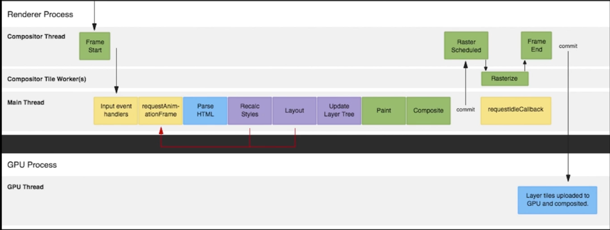

### 浏览器渲染流程


1. 触发视觉变化（不仅仅是js控制还有可能是css）
2. 浏览器对样式进行重新计算
3. 计算出新的元素布局 
4. 浏览器进行重新绘制
5. 渲染层的合成

> 浏览器初次加载会完整的走过整个流程，但是之后我们可以对这个流程进行优化，避免非必要的流程

###  布局(layouts)与绘制(paint) 

> **详细的回流重绘见下一篇文章**

- 渲染树只包含网页需要的节点（不包括meta、display：none）
- 布局计算每个节点接触的位置和大小
- 绘制是像素化每个节点的过程

**重新布局被称为reflow 回流，重新绘制被称为repaint 重绘**

1. 回流(`reflow`), 布局引擎为`frame`计算图形, 以确定对象位置, 浏览器根据各种样式来计算结果放在它该出现的位置.
   - **YaHoo!性能小组总结了一些导致`回流`发生的一些因素:**
     1. 调整窗口大小
     2. 改变字体
     3. 增加或者移除样式表
     4. 内容变化，比如用户在 input 框中输入文字, CSS3 动画等
     5. 激活 `CSS` 伪类，比如 `:hover`
     6. 操作`class`属性 
     7. 脚本操作`DOM`
     8. 计算`offsetWidth`和`offsetHeight`属性
     9. 设置 style 属性的值
   - 当不可避免的出现回流时，应该避免 layout thrashing 布局抖动
     -  避免回流（减少次数）
     - 读写分离（可以借助fastdom）
2. 重绘(`repaint`), 当计算好盒子模型的位置, 大小以及其他属性后, 浏览器就根据各自的特性进行绘制一遍, 显现出来给用户看
   - 重绘则是视觉效果变化引起的重新绘制。比如 `color` 或者 `background` 发生了变化，那就该给触发重绘的元素化化妆，化成它想要的样子。

回流与重绘两者之间的联系在于: **触发回流一定会触发重绘, 而触发重绘却不一定会触发回流**。

### 复合线程(compositor thread)与图层(layers)

详细介绍见 https://segmentfault.com/a/1190000014520786

淘宝团队的文章 https://fed.taobao.org/blog/taofed/do71ct/performance-composite/

提升到合成层的最好方法就是 用 **transfrom + opacity 搭配 will-change**

京东和淘宝的轮播容器都是采用opacity + transform 3d

```
opacity: 1;
transform: translate3d(0px, 0px, 0px);
transition: none 0s ease 0s;
```

### 优化相关的函数

一帧的声明周期


#### requestAnimationFrame

防抖应用，按照实际帧数触发

```
let flag = false;
window.addEventListener("pointermove", () => {
  if (flag) {
    return;
  }
  flag = true;
  window.requestAnimationFrame(() => {
    /* 
     * 处理事件
    */
    flag = false;
  })
})
```

#### requestIdleCallback

[mdn上的requestIdleCallback](https://developer.mozilla.org/zh-CN/docs/Web/API/Window/requestIdleCallback#Browser_compatibility)

案例： react 16 通过rAF 模拟 rIF 进行事件调度  

下图是rAF 和 rIF 的不同



