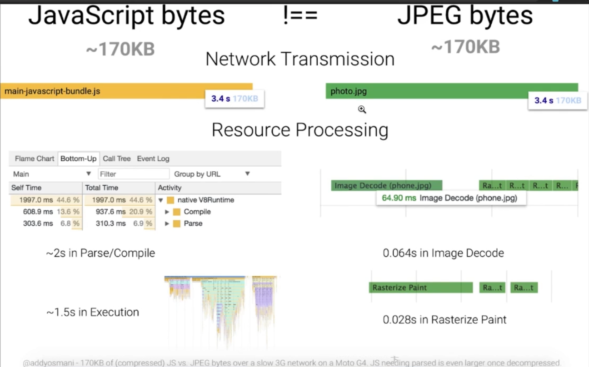
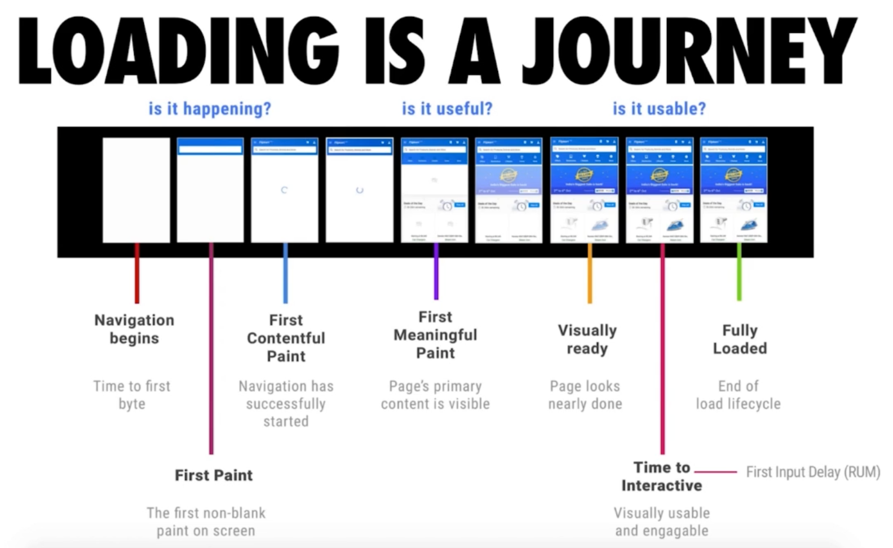
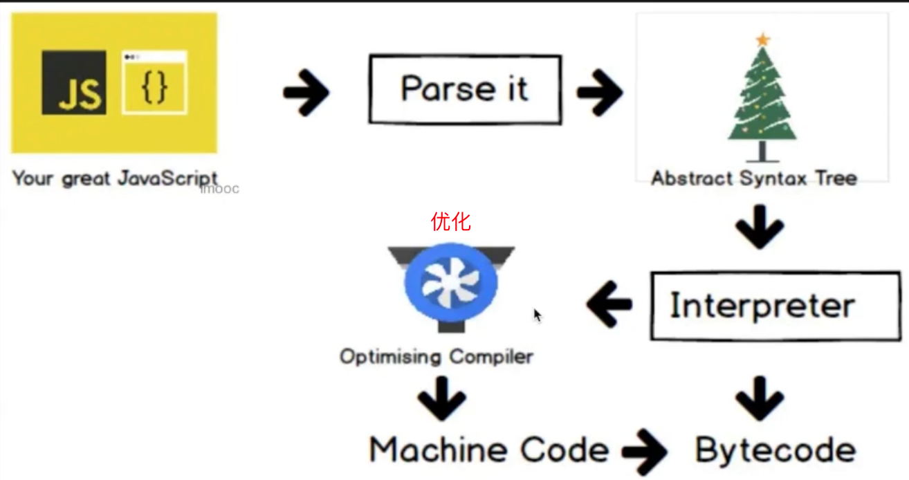

## JavaScript的开销

js的开销主要在

- 加载

- 解析&编译
- 执行

下图展示了浏览器处理同样大小的**普通资源**和 **js** 所需要的时间



### Loding is a journey



#### 减少主线程工作量（优化方案）

- 避免长任务
- 避免超过1kb的行间脚本（行内脚本，因为解析引擎无法进行优化）
- 使用rAF和rIC进行时间调度

### V8 编译原理



 一般引擎会被代码进行优化后转换为机械码，但是有些代码优化后可能不适合运行，会被回溯到源代码在进行解析，这个过程叫做逆优化，书写过程中尽量避免此类问题。

### V8优化机制

#### 脚本流

#### 字节码缓存

#### 懒解析

##### 函数的解析方式

- 懒解析 lazy parsing
- 饥饿解析 eager parsing

函数的解析方式，一般来说使用懒解析，函数使用时再进行内容的解析，但是对于立即执行的函数这种优化方式就是逆优化。我们可采取下面的方式告诉解析器直接进行饥饿解析

```
const fnc = (() => {

})
把函数体用括号包裹起来，webpack的打包已经不会把（）压缩没了
```

#### 对象优化

- 以相同顺序初始化对象成员，避免**隐藏类**的调整

  > 动态语言的弊端，解析器会根据推断赋予变量类型（21种），这种类型叫做隐藏类型（hidden class），为了保证hidden class的复用，需要按顺序初始化

- 实例化后避免添加新属性

  ```
  // In-object 属性
  const car = {color: 'red'}; 
  
  // normal/fast 属性，存储在property store里，需要通过描述数组间接查找
  car.seats = 4;  
  ```

- 尽量使用Array代替array-like对象

  > 转换的代价比类数组借用call调用数组方法要小（google推荐）

- 避免数组越界

  - 多数情况下会发生 undefined 类型转换
  - 找不到的数据，会依照原型链向上进行查找（性能相差6倍）

- 避免元素类型转换

```
const array = [3, 2, 1]; // PACKED_SMI_ELEMENTS 满的-整型-元素
array.push(4.4);  // PACKED_DOUBLE_ELEMENTS
// 对编译器而言，需要更换类型，造成额外开销
```
