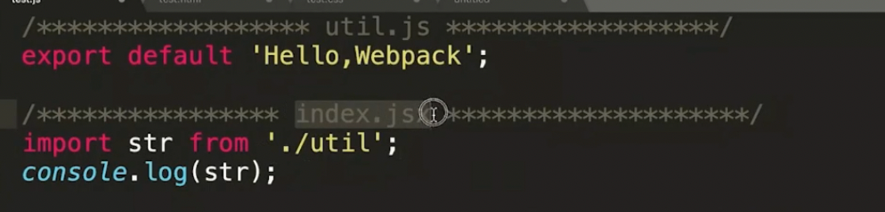
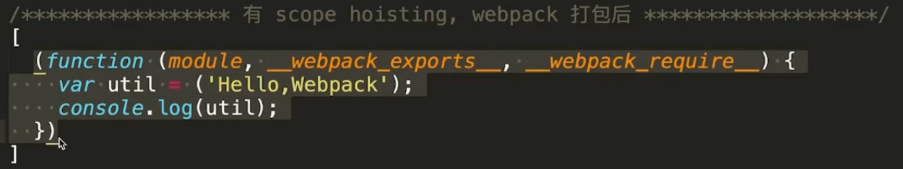

### 介绍几个主要的插件

#### tree-shaking

- 删除没有使用的代码
- 基于ES6的import export
- sideEffects选项（忽略设置，一般用于忽略一些css 或者 修改全局作用域的js）
- babel 需要设置 modules：false（保留es6语法）
- webpack 4 生产模式默认开启

#### Terser-webpack-plugin

- 压缩js代码，webpack 4 中后期替代了uglifyjs-webpack-plugin
- 支持ES6语法

#### scope hoisting（作用域提升）  ModuleConcatenationPlugin

- 代码体积减少
- 提高执行效率
- 同样需要babel的modules配置
- 基于ES6 import export
- webpack 4 生产环境 默认开启

没有启用作用域提升



启用作用域提升之后，会做一个合并



#### code spiliting 代码分割 splitchunks

- 把单个bundle文件拆分成若干个小bundles/chunks
- 缩短首屏加载时间
- **相当重要的优化选项，详细介绍见收藏夹**  
对参数做一个小小的解释

```
optimization: {
    splitChunks: {
      chunks: 'async', // async 异步 import() all 同步异步
      minSize: 30000, // 最小体积 3000B
      maxSize: 0,
      minChunks: 1, // 最少被引用了一次
      maxAsyncRequests: 5, // 限制异步模块内部的并行最大请求数的
      maxInitialRequests: 3,
      automaticNameDelimiter: '~',
      name: true,
      cacheGroups: { // cacheGroups
        vendors: {
          test: /[\\/]node_modules[\\/]/,
          priority: -10
        },
        default: {
          minChunks: 2,
          priority: -20,
          reuseExistingChunk: true
        }
      }
    }
  }
```

##### **chunk**

- chunk是webpack根据功能拆分出来的，包含三种情况：
  1. 通过import()动态引入的代码
  2. 通过splitChunks拆分出来的代码
  3. 你的项目入口（entry）

##### **cacheGroups**

> splitChunks就是根据cacheGroups去拆分模块的，包括之前说的chunks属性和之后要介绍的种种属性其实都是对缓存组进行配置的

- 入口文件本身算一个请求
- 如果入口里面有动态加载得模块这个不算在内
- 通过runtimeChunk拆分出的runtime不算在内
- 只算js文件的请求，css不算在内
- 如果同时又两个模块满足cacheGroup的规则要进行拆分，但是maxInitialRequests的值只能允许再拆分一个模块，那尺寸更大的模块会被拆分出来

##### **maxInitialRequests**

> 表示允许入口并行加载的最大请求数，之所以有这个配置也是为了对拆分数量进行限制，不至于拆分出太多模块导致请求数量过多而得不偿失

##### **maxAsyncRequests**

> 用来限制异步模块内部的并行最大请求数的，说白了你可以理解为是每个import()它里面的最大并行请求数量

- import()文件本身算一个请求
- 并不算js以外的公共资源请求比如css
- 如果同时有两个模块满足cacheGroup的规则要进行拆分，但是maxInitialRequests的值只能允许再拆分一个模块，那尺寸更大的模块会被拆分出来

##### runtimeChunk

感觉主要的作用是为了**优化持久化缓存**

> 形如`import('abc').then(res=>{})`这种异步加载的代码，在webpack中即为运行时代码。在VueCli工程中常见的异步加载路由即为runtime代码

> 设置runtimeChunk是将包含`chunks 映射关系`的 list单独从 app.js里提取出来，因为每一个 chunk 的 id 基本都是基于内容 hash 出来的，所以每次改动都会影响它，如果不将它提取出来的话，等于app.js每次都会改变。缓存就失效了。设置runtimeChunk之后，webpack就会生成一个个runtime~xxx.js的文件。
> 然后每次更改所谓的运行时代码文件时，打包构建时app.js的hash值是不会改变的。如果每次项目更新都会更改app.js的hash值，那么用户端浏览器每次都需要重新加载变化的app.js，如果项目大切优化分包没做好的话会导致第一次加载很耗时，导致用户体验变差。现在设置了runtimeChunk，就解决了这样的问题。所以`这样做的目的是避免文件的频繁变更导致浏览器缓存失效，所以其是更好的利用缓存。提升用户体验。`
> 链接：<https://www.jianshu.com/p/714ce38b9fdc>

#### Minificaiton 资源压缩

- terser 压缩js
- Mini-css-extract-plugin 压缩css
- HtmlWebpackPlugin 压缩html

#### 可持续化缓存

主要是借助hash，content-hash

#### babel 7 优化配置

- 在需要的地方引入polyfill
  - useBuiltIns:  "usage"
- 辅助函数的复用
  - 配置一个@babel/plugin-transform-runtime

### Webpack 依赖优化

#### noParse

- 提高构建速度
- 直接通知webpack忽略较大的库
- 被忽略的库不能有import require define的引入方式
- 例如 lodash

#### DllPlugin（搭配DllReferencePlugin）

- 避免打包时对不变的库重复构建
- 提高构建速度
- 不会对打包后的文件造成影响
- 开发环境的web-server 用这个更加的合适，可以提高热部署的速度

#### happypack（多线程打包）

### webpack 监测与分析

- Stats 分析与可视化图
- webpack-bundle-analyzer 进行体积分析
- Speed-measure-webpack-plugin 速度分析
