[原文地址](https://mp.weixin.qq.com/s?__biz=MzI1ODE4NzE1Nw==&mid=2247490349&idx=1&sn=139c52fb354eba09c0c3c5a92dc5ffa2&chksm=ea0d51d7dd7ad8c1be5be5b17fd79f5ccc8d84fe013040232a0861290728112c75fb6061499f&scene=178&cur_album_id=1806166719669796864#rd)

很有实际意义的一片优化文章，防止链接挂掉，特地复制下来

## 通过案例你可以学到什么

简单总结一下设计的知识点

- onload
  - DOM 的解析受 JS 加载和执行的影响，尽量对 JS 进行压缩、拆分处理（HTTP2环境下），能减少 DOMContentLoaded 时间。
  - 图片、视频、iframe 等资源，会阻塞 onload 事件的触发，需要优化资源的加载时机，尽快触发 onload。
- 性能指标
- threeshaking
- Splitchunks 拆分首屏js
- 延迟加载非必要js prefetch
- lazyload
- 图片优化
- coverage 查看首屏 js css使用比例
- CLF 页面布局抖动

## 项目背景

H5 项目是企鹅辅导的核心项目，已迭代四年多，包括了课程详情页/老师详情页/报名页/支付页面等页面，构建产物用于企鹅辅导 APP/H5（微信/QQ/浏览器），迭代过程中了也累积了一些性能问题导致页面加载、渲染速度变慢，为了提升用户体验，近期启动了 “H5 性能优化” 项目，针对页面加载速度，渲染速度做了专项优化，下面是对本次优化的总结，包括以下几部分内容：

1. 性能优化效果展示
2. 性能指标及数据采集
3. 性能分析方法及环境准备
4. 性能优化具体实践

## 一、性能指标及数据采集

企鹅辅导 H5 采用的性能指标包括：

\1. 页面加载时间 —— 页面以多快的速度加载和渲染元素到页面上，具体如下：

- [First contentful paint (FCP)](https://mp.weixin.qq.com/s?__biz=MzI1ODE4NzE1Nw==&mid=2247490349&idx=1&sn=139c52fb354eba09c0c3c5a92dc5ffa2&chksm=ea0d51d7dd7ad8c1be5be5b17fd79f5ccc8d84fe013040232a0861290728112c75fb6061499f&scene=178&cur_album_id=1806166719669796864)：测量页面开始加载到某一块内容显示在页面上的时间。
- [Largest contentful paint (LCP)](https://mp.weixin.qq.com/s?__biz=MzI1ODE4NzE1Nw==&mid=2247490349&idx=1&sn=139c52fb354eba09c0c3c5a92dc5ffa2&chksm=ea0d51d7dd7ad8c1be5be5b17fd79f5ccc8d84fe013040232a0861290728112c75fb6061499f&scene=178&cur_album_id=1806166719669796864)：测量页面开始加载到最大文本块内容或图片显示在页面中的时间。
- DomContentLoaded Event：DOM 解析完成时间。
- OnLoad Event：页面资源加载完成时间。

\2. 加载后响应时间 —— 页面加载和执行js代码后多久能响应用户交互。

- [First input delay (FID)](https://mp.weixin.qq.com/s?__biz=MzI1ODE4NzE1Nw==&mid=2247490349&idx=1&sn=139c52fb354eba09c0c3c5a92dc5ffa2&chksm=ea0d51d7dd7ad8c1be5be5b17fd79f5ccc8d84fe013040232a0861290728112c75fb6061499f&scene=178&cur_album_id=1806166719669796864)：测量用户首次与网站进行交互(例如点击一个链接、按钮、js自定义控件)到浏览器真正进行响应的时间。

\3. 视觉稳定性 —— 页面元素是否会以用户不期望的方式移动，并干扰用户的交互。

- [Cumulative layout shift (CLS)](https://mp.weixin.qq.com/s?__biz=MzI1ODE4NzE1Nw==&mid=2247490349&idx=1&sn=139c52fb354eba09c0c3c5a92dc5ffa2&chksm=ea0d51d7dd7ad8c1be5be5b17fd79f5ccc8d84fe013040232a0861290728112c75fb6061499f&scene=178&cur_album_id=1806166719669796864)：测量从页面开始加载到状态变为隐藏过程中，发生不可预期的 layout shifts 的累积分数。

项目使用了 IMLOG 进行数据上报，**ELK 体系进行现网数据监控，Grafana 配置视图**，观察现网情况。

根据指标的数据分布，能及时发现页面数据异常采取措施。

## 二、性能分析及环境准备

现网页面情况：


**可以看到进度条在页面已经展示后还在持续 loading，加载时间长达十几秒，比较影响了用户体验。**

根据[Google 开发文档](https://mp.weixin.qq.com/s?__biz=MzI1ODE4NzE1Nw==&mid=2247490349&idx=1&sn=139c52fb354eba09c0c3c5a92dc5ffa2&chksm=ea0d51d7dd7ad8c1be5be5b17fd79f5ccc8d84fe013040232a0861290728112c75fb6061499f&scene=178&cur_album_id=1806166719669796864)对浏览器架构的解释：

> 当导航提交完成后，渲染进程开始着手加载资源以及渲染页面。一旦渲染进程“完成”（finished）渲染，它会通过 IPC 告知浏览器进程（注意这发生在页面上所有帧(frames) 的 **onload** 事件都已经被触发了而且对应的处理函数已经执行完成了的时候），然后 UI 线程就会停止导航栏上旋转的圈圈。

**我们可以知道，进度条的加载时长和 onload 时间密切相关，要想进度条尽快结束就要减少 onload 时长。**

根据现状，使用 ChromeDevTool 作为基础的性能分析工具，观察页面性能情况：

- Network：观察网络资源加载耗时及顺序
- Performace：观察页面渲染表现及JS执行情况
- Lighthouse：对网站进行整体评分，找出可优化项

下面以[企鹅辅导课程详情页](https://mp.weixin.qq.com/s?__biz=MzI1ODE4NzE1Nw==&mid=2247490349&idx=1&sn=139c52fb354eba09c0c3c5a92dc5ffa2&chksm=ea0d51d7dd7ad8c1be5be5b17fd79f5ccc8d84fe013040232a0861290728112c75fb6061499f&scene=178&cur_album_id=1806166719669796864)为案例进行分析，找出潜在的优化项。

**（注意使用 Chrome 隐身窗口并禁用插件，移除其他加载项对页面的影响。）**

### 1. Network 分析

通常进行网络分析需要禁用缓存、启用网络限速（4g / 3g） 模拟移动端弱网情况下的加载情况，因为 wifi 网络可能会抹平性能差距。

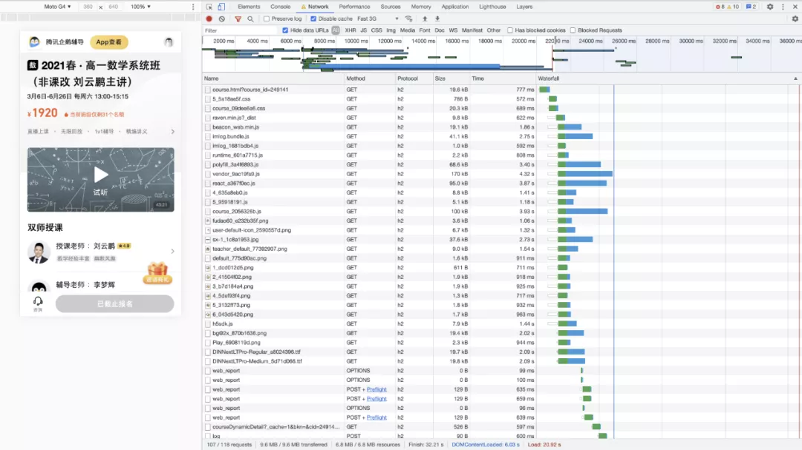

可以看到 DOMContentLoaded 的时间在 6.03s ，但 onload 的时间却在 20.92s。

先观察 DOMContentLoaded 阶段，发现**最长请求路径在 vendor.js ，JS大小为 170kB，花费时间为 4.32s。**

继续观察 DOMContentLoaded 到 onload 的这段时间：

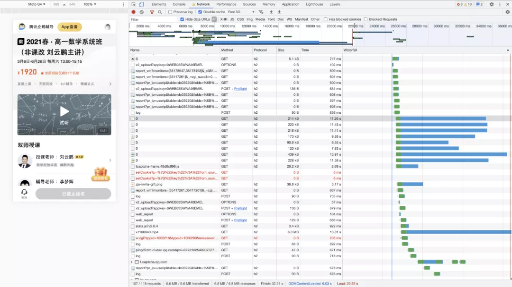

**可以发现 onload 事件被大量媒体资源阻塞了，关于 onload 事件的影响因素，可以参考这篇****[文章](https://mp.weixin.qq.com/s?__biz=MzI1ODE4NzE1Nw==&mid=2247490349&idx=1&sn=139c52fb354eba09c0c3c5a92dc5ffa2&chksm=ea0d51d7dd7ad8c1be5be5b17fd79f5ccc8d84fe013040232a0861290728112c75fb6061499f&scene=178&cur_album_id=1806166719669796864)。**

结论是**浏览器认为资源完全加载完成（HTML解析的资源和动态加载的资源）才会触发 onload。**

结合上图**可以发现加载了图片、视频、iframe 等资源，阻塞了 onload 事件的触发。**

**Network 总结**

1. DOM 的解析受 JS 加载和执行的影响，尽量对 JS 进行压缩、拆分处理（HTTP2环境下），能减少 DOMContentLoaded 时间。
2. 图片、视频、iframe 等资源，会阻塞 onload 事件的触发，需要优化资源的加载时机，尽快触发 onload。

### 2. Performance 分析

使用 Performance 模拟移动端注意手机处理器能力比 PC 差，所以一般将 CPU 设置为 4x slowdown 或 6x slowdown 进行模拟。


观察几个核心的数据：

1. **Web Vitals ( FP / FCP / LCP / Layout Shift ) 核心页面指标 和 Timings 时长**

可以看到 LCP、DCL和 Onload Event 时间较长，且出现了多次 Layout Shift。

要 LCP 尽量早触发，需要减少页面大块元素的渲染时间，观察 Frames 或ScreenShots 的截图，关注页面的元素渲染情况。

可以通过在 Experience 行点击Layout Shift ，在 Summary 面板找到具体的偏移内容。

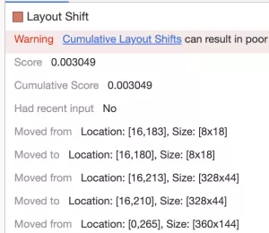

1. **Main Long Tasks 长任务数量和时长**

可以看到页面有大量的 Long Tasks 需要进行优化，其中 couse.js (页面代码)的解析执行时间长达 800ms。

处理 Long Tasks，可以在开发环境进行录制，这样在 Main Timeline 能看到具体的代码执行文件和消耗时长。

**Performance 总结**

1. 页面 LCP 触发时间较晚，且出现多次布局偏移，影响用户体验，需要尽早渲染内容和减少布局偏移。
2. 页面 Long Tasks 较多，需要对 JS 进行合理拆分和加载，减少 Long Tasks 数量，特别是 影响 DCL 和 Onload Event 的 Task。

### 3. Lighthouse 分析

使用 ChromeDevTool 内置 lighthouse 对页面进行跑分：

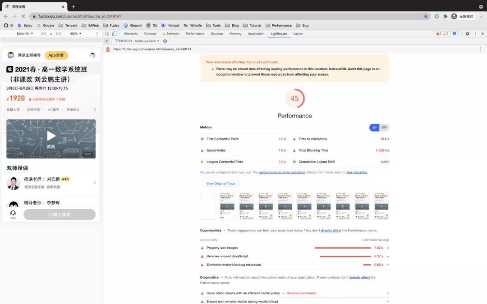

分数较低，可以看到 Metrics 给出了核心的数据指标，这边显示的是 TTI SI TBT 不合格，LCP 需要提升，FCP 和 CLS 达到了良好的标准，可以查看[分数计算标准](https://mp.weixin.qq.com/s?__biz=MzI1ODE4NzE1Nw==&mid=2247490349&idx=1&sn=139c52fb354eba09c0c3c5a92dc5ffa2&chksm=ea0d51d7dd7ad8c1be5be5b17fd79f5ccc8d84fe013040232a0861290728112c75fb6061499f&scene=178&cur_album_id=1806166719669796864)。

同时 Lighthouse 会提供一些优化建议，在 Oppotunities 和 Diagnostics 项，能看到具体的操作指南，如图片大小、移除无用 JS 等，可以根据指南进行项目的优化。

Lighthouse 的评分内容是根据项目整体加载项目进行打分的，审查出的问题同样包含 Network、Performance 的内容，所以也可以看作是对 Network、Performance 问题的优化建议。

**Lighthouse 总结**

1. 根据评分，可以看出 TTI、SI、TBT、LCP这四项指标需要提高，可以参考[lighthouse 文档](https://mp.weixin.qq.com/s?__biz=MzI1ODE4NzE1Nw==&mid=2247490349&idx=1&sn=139c52fb354eba09c0c3c5a92dc5ffa2&chksm=ea0d51d7dd7ad8c1be5be5b17fd79f5ccc8d84fe013040232a0861290728112c75fb6061499f&scene=178&cur_album_id=1806166719669796864)进行优化。
2. Oppotunities 和 Diagnostics 提供了具体的优化建议，可以参考进行改善。

### 4. 环境准备

刚才是对线上网页进行初步的问题分析，要实际进行优化和观察，**需要进行环境的模拟，让优化效果能更真实在测试环境中体现。**

代理使用：whistle、charles、fiddler 等。

本地环境、测试环境模拟：nginx、nohost、stke 等。

数据上报：IMLOG、TAM、RUM 等（这三个工具均为团队内部的日志上报工具，类似业界 log4js、sentry）。

前端代码打包分析：webpack-bundle-analyzer 、rollup-plugin-visualizer 等。

分析问题时使用本地代码，本地模拟线上环境验证优化效果，最后再部署到测试环境验证，提高开发效率。

## 三、性能优化具体实践

### PART1: 加载时间优化

Network 中对页面中加载的资源进行分类：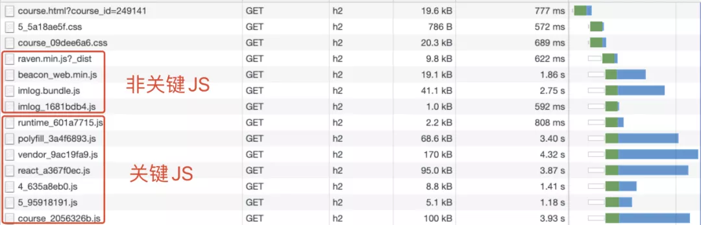

第一部分是影响 DOM 解析的 JS 资源，可以看到这里分类为关键 JS 和非关键 JS，是根据**是否参与首面渲染划分的。**

这里的非关键 JS 我们可以考虑延迟异步加载，关键 JS 进行拆分优化处理。

#### 1. 关键 JS 打包优化

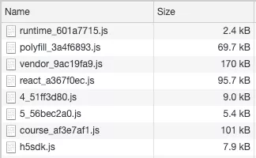

JS 文件数量8个，总体积 460.8kB，最大文件 170KB

##### 1.1 Splitchunks 的正确配置

vendor.js 170kB(gzipd) 是所有页面都会加载的公共文件，打包规则是 **miniChunks: 3**，引用超过3次的模块将被打进这个js。

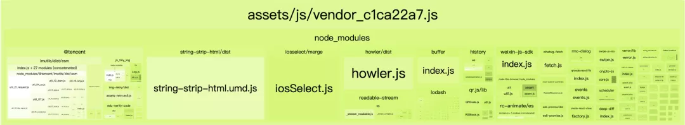

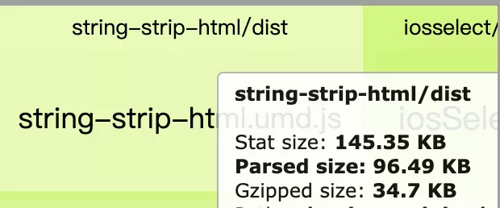

分析vendor.js的具体构成（上图）

以 string-strip-html.umd.js 为例 大小为34.7KB，占了 vendor.js 的 20%体积，但**只有一个页面多次使用到了这个包，触发了 miniChunks 的规则**，被打进了 vendor.js。

同理对 vendor.js 的其他模块进行分析，iosSelect.js、howler.js、weixin-js-sdk 等模块都只有 3、4 个页面/组件依赖，但也同样打进了 vendor.js。

由上面的分析，我们可以得出结论：**不能简单的依靠 miniChunks 规则对页面依赖模块进行抽离打包，要根据具体情况拆分公共依赖。**

修改后的 vendor 根据业务具体的需求，提取不同页面和组件都有的共同依赖（imutils/imlog/qqapi）。

```
vendor: {
  test({ resource }) {
    return/[\\/]node_modules[\\/](@tencent\/imutils|imlog\/)|qqapi/.test(resource);
  },
  name: 'vendor',
  priority: 50,
  minChunks: 1,
  reuseExistingChunk: true,
},
```

而其他未指定的公共依赖，新增一个 common.js，将阈值调高到 20 或更高（当前页面数76），让公共依赖成为大多数页面的依赖，提高依赖缓存利用率，调整完后，vendor.js 的大小减少到 30KB，common.js 大小为 42KB。

**两个文件加起来大小为 72KB，相对于优化前体积减少了 60%（100KB）。**

#### 1.2 公共组件的按需加载

course.js 101kB (gzipd) 这个文件是页面业务代码的文件：

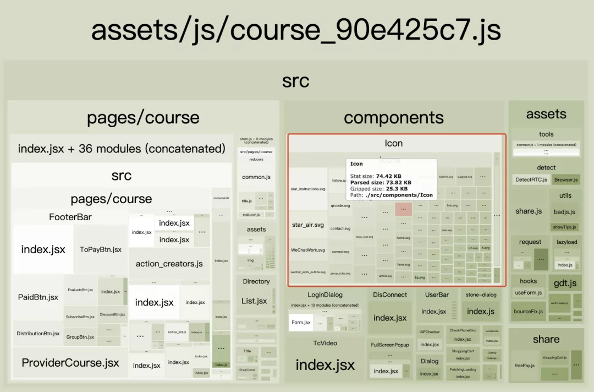

观察上图，基本都是业务代码，除了一个巨大的 **component Icon，占了 25k，页面文件1/4的体积，****但在代码中****使用到的 Icon 总共才8个。**

分析代码，可以看到这里使用 require 加载 svg，**Webpack 将 require 文件夹内的内容一并打包，导致页面 Icon 组件冗余。**

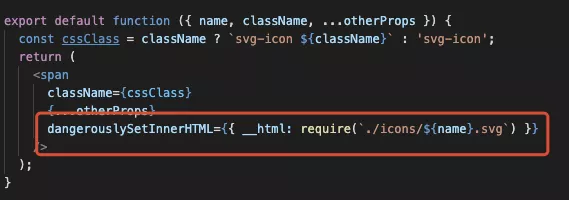

如何解决这类问题实现按需加载？

按需加载的内容应该为独立的组件，我们将之前的单一入口的 Icon 组件（动态 dangerouslySetInnerHTML）**改成单文件组件模式直接引入使用图标。**

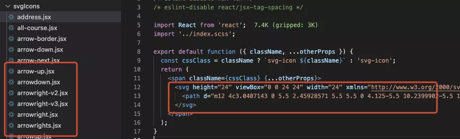

但实际开发中这样会有些麻烦，一般需要统一的 import 路径，指定需要的图标再加载，参考 [babel-plugin-import](https://mp.weixin.qq.com/s?__biz=MzI1ODE4NzE1Nw==&mid=2247490349&idx=1&sn=139c52fb354eba09c0c3c5a92dc5ffa2&chksm=ea0d51d7dd7ad8c1be5be5b17fd79f5ccc8d84fe013040232a0861290728112c75fb6061499f&scene=178&cur_album_id=1806166719669796864)，我们可以配置 babel 的依赖加载路径调整 Icon 的引入方式，这样就实现了图标的按需加载。

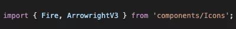

按需加载后，重新编译，查看打包带来的收益，**页面的 Icons 组件 stat size 由 74KB 降到了 20KB，体积减少了 70%。**

#### 1.3 业务组件的代码拆分 (Code Splitting)

观察页面，可以看到”课程大纲“、”课程详情“、”购课须知“这三个模块并不在页面的首屏渲染内容里：


我们可以考虑对页面这几部分组件进行拆分再延迟加载，减少业务代码 JS 大小和执行时长。

拆分的方式很多，可以使用 react-loadable、@loadable/component 等库实现，也可以使用React 官方提供的 React.lazy。

拆分后的代码：

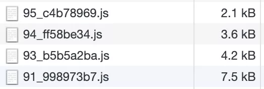

**代码拆分会导致组件会有渲染的延迟，所以在项目中使用应该综合用户体验和性能再做决定，通过拆分也能使部分资源延后加载优化加载时间。**

#### 1.4 Tree Shaking 优化

项目中使用了 TreeShaking 的优化，用时候要注意 [sideEffects 的使用场景](https://mp.weixin.qq.com/s?__biz=MzI1ODE4NzE1Nw==&mid=2247490349&idx=1&sn=139c52fb354eba09c0c3c5a92dc5ffa2&chksm=ea0d51d7dd7ad8c1be5be5b17fd79f5ccc8d84fe013040232a0861290728112c75fb6061499f&scene=178&cur_album_id=1806166719669796864)，以免打包产物和开发不一致。

经过上述优化步骤，整体打包内容：

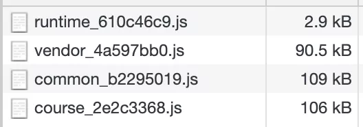

JS 文件数量6个，总体积 308KB，最大文件体积 109KB

关键 JS 优化数据对比：

|          | 文件总体积     | 最大文件体积         |
| :------- | :------------- | :------------------- |
| 优化前   | 460.8 kb       | 170 kb               |
| 优化后   | 308 kb         | 109 kb               |
| 优化效果 | 总体积减少 50% | 最大文件体积减少 56% |

### 2.非关键 JS 延迟加载

页面中包含了一些上报相关的 JS 如 sentry，beacon（灯塔 SDK）等，对于这类资源，如果在弱网情况，可能会成为影响 DOM 解析的因素。

为了减少这类非关键 JS 的影响，可以在页面完成加载后再加载非关键 JS，如 sentry 官方也提供了[延迟加载的方案](https://mp.weixin.qq.com/s?__biz=MzI1ODE4NzE1Nw==&mid=2247490349&idx=1&sn=139c52fb354eba09c0c3c5a92dc5ffa2&chksm=ea0d51d7dd7ad8c1be5be5b17fd79f5ccc8d84fe013040232a0861290728112c75fb6061499f&scene=178&cur_album_id=1806166719669796864)。

在项目中还发现了一部分非关键 JS，如验证码组件，为了在下一个页面中能利用缓存尽快加载，**所以在上一个页面提前加载一次生成缓存。**

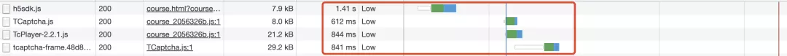

如果不访问下一个页面，可以认为这是一次无效加载，这类的提前缓存方案反而会影响到页面性能。

针对这里资源，我们可以使用 Resource Hints，针对资源做 Prefetch 处理。

检测浏览器是否支持 Prefech，**支持的情况下我们可以创建 Prefetch 链接**，不支持就使用旧逻辑直接加载，这样能更大程度保证页面性能，为下一个页面提供提前加载的支持。

```
const isPrefetchSupported = () => {
  const link = document.createElement('link');
  const { relList } = link;
 
  if (!relList || !relList.supports) {
    returnfalse;
  }
  return relList.supports('prefetch');
};
const prefetch = () => {
    const isPrefetchSupport = isPrefetchSupported();
    if (isPrefetchSupport) {
      const link = document.createElement('link');
      link.rel = 'prefetch';
      link.as = type;
      link.href = url;
      document.head.appendChild(link);
    } elseif (type === 'script') {
            // load script
    }
  };
```

优化效果：非关键JS不影响页面加载


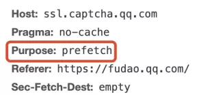

###  

### 3.媒体资源加载优化

#### 3.1 加载时序优化

可以观察到 onload 被大量的图片资源和视频资源阻塞了，但是页面上并没有展示对应的图片或视频，这部分内容应该进行懒加载处理。

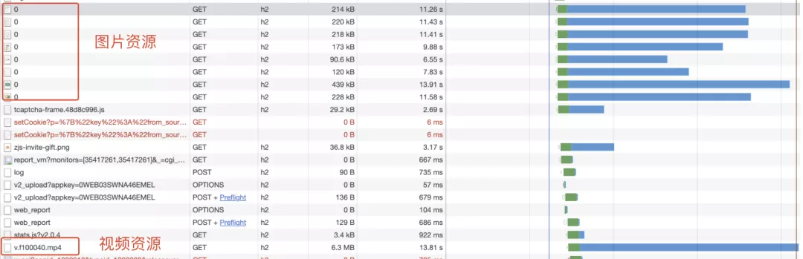

处理方式主要是要控制好图片懒加载的逻辑（如 onload 后再加载），可以借助各类 lazyload 的库去实现。H5项目用的是位置检测（getBoundingClientRect ）图片到达页面可视区域再展示。

**但要注意懒加载不能阻塞业务的正常展示，应该做好超时处理、重试等兜底措施。**

#### 3.2 大小尺寸优化

课程详情页 每张详情图的宽为 1715px，以 6s 为基准（375px）已经是 4x 图了，大图片在弱网情况下会影响页面加载和渲染速度。

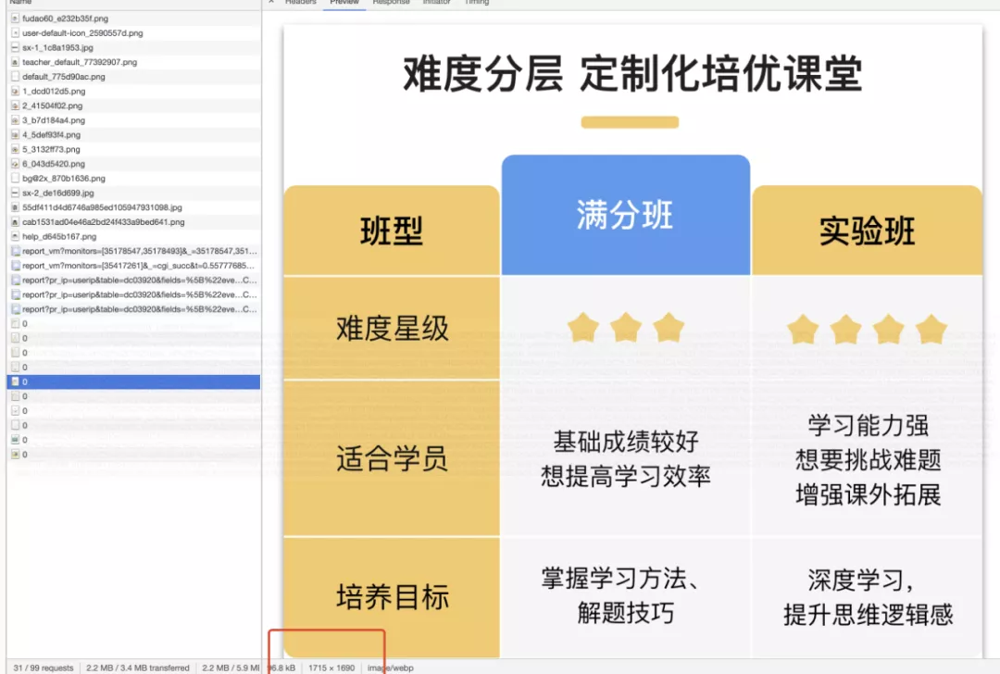

使用 CDN 图床尺寸大小压缩功能，根据不同的设备渲染不同大小的图片调整图片格式，根据网络情况，渲染不同清晰度的图。

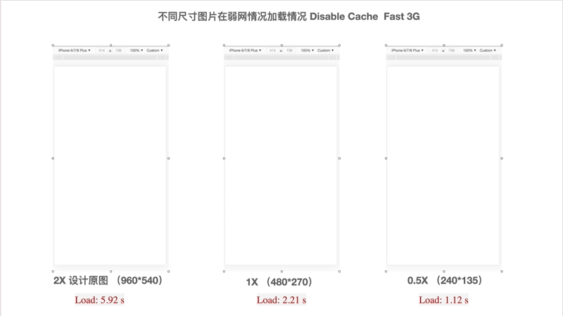

可以看到在弱网（移动 3G 网络）的情况下，同一张图片不同尺寸加载速度最高和最低相差接近 6 倍，给用户的体验截然不同。

CDN 配合业务具体实现：**使用 img 标签 srcset/sizes 属性和 picutre 标签实现响应式图片**，具体可参考[文档](https://mp.weixin.qq.com/s?__biz=MzI1ODE4NzE1Nw==&mid=2247490349&idx=1&sn=139c52fb354eba09c0c3c5a92dc5ffa2&chksm=ea0d51d7dd7ad8c1be5be5b17fd79f5ccc8d84fe013040232a0861290728112c75fb6061499f&scene=178&cur_album_id=1806166719669796864)。

**使用 URL 动态拼接方式构造 URL 请求，根据机型宽度和网络情况，判断当前图片宽度倍数进行调整**（如 iPhone 1x，iPad 2x，弱网 0.5x）。

**优化效果：移动端 正常网络情况下图片体积减小 220%、弱网情况下图片体积减小 13 倍。**

注意实际业务中需要视觉同学参与，评估图片的清晰度是否符合视觉标准，避免反向优化！

#### 3.3 其他类型资源优化

**iframe**

加载 iframe 有可能会对页面的加载产生严重的影响，在 onload 之前加载会阻塞 onload 事件触发，从而阻塞 loading，但是还存在另一个问题。

如下图所示，页面在已经 onload 的情况下触发 iframe 的加载，进度条仍然在不停的转动，直到 iframe 的内容加载完成。

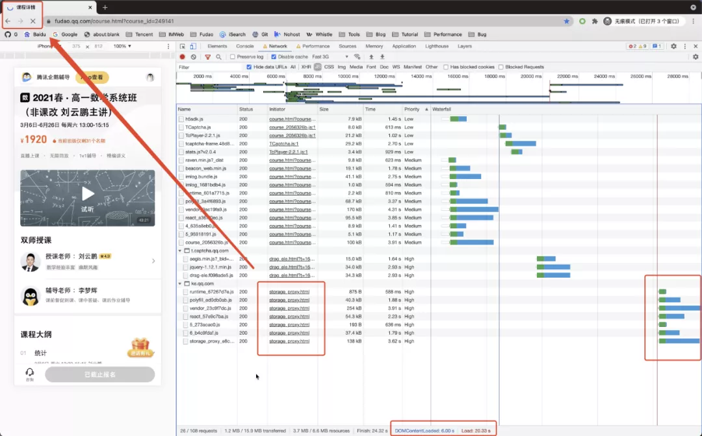

可以将 iframe 的时机放在 onload 之后，并使用 setTimeout 触发异步加载 iframe，可避免 iframe 带来的 loading 影响。

**数据上报**

项目中使用 image 的数据上报请求，在正常网络情况下可能感受不到对页面性能的影响。

但在一些特殊情况，如其中一个图片请求的耗时特别长就会阻塞页面 onload 事件的触发，延长 loading 时间。

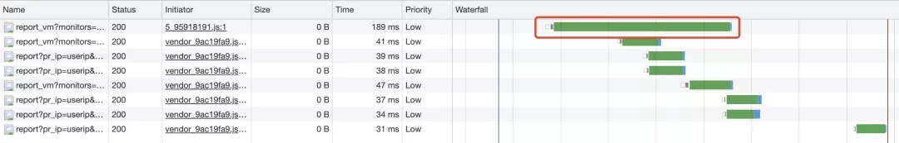

解决上报对性能的影响问题有以下方案：

1. 延迟合并上报
2. 使用 Beacon API
3. 使用 post 上报

H5项目采用了延迟合并上报的方案，业务可根据实际需要进行选择。

**优化效果：全部数据上报在 onload 后处理，避免对性能产生影响。**

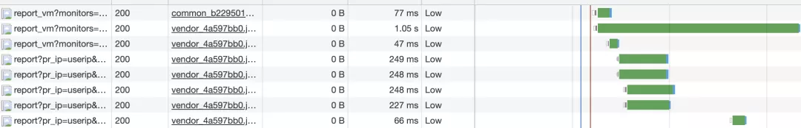

**字体优化**

项目中可能会包含很多视觉指定渲染的字体，当字体文件比较大的时候，也会影响到页面的加载和渲染，可以使用 fontmin 将字体资源进行压缩，生成精简版的字体文件。

优化前：20kB => 优化后：14kB：

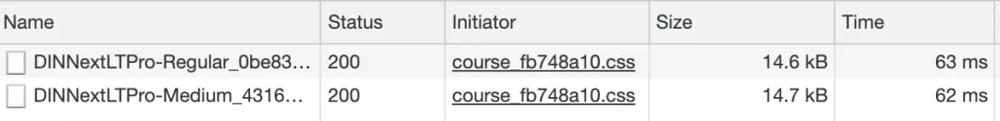

###  

### PART2: 页面渲染优化

#### 1. 直出页面 TTFB 时间优化

*名词解释：*

*NGW：内部网关，基于 Node.js。*

*STKE：公司内部 TKE。*

目前我们在 STKE 部署了直出服务，通过监控发现直出平均耗时在 300+ms。

**TTFB 时间在 100 ～ 200 之间波动，影响了直出页面的渲染。**

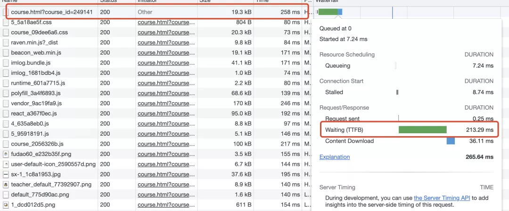

通过日志打点、**查看 Nginx Accesslog 日志、网关监控耗时**，得出以下数据（如图）

- STKE 直出程序耗时是 20ms 左右
- 直出网关 NGW -> STKE 耗时 60ms 左右
- 反向代理网关 Nginx -> NGW 耗时 60ms 左右

登录 所在机器，ping STKE 机器，有以下数据

**平均时延在 32ms，tcp 三次握手+返回数据（最后一次 ack 时发送数据）= 2个 rtt，约 64ms，和日志记录的数据一致**

**查看 NGW 机器所在区域为天津，STKE 机器所在区域为南京，可以初步判断是由机房物理距离导致的网络时延，如下图所示：**


切换 NGW 到南京机器 ping STKE 南京的机器，有以下数据：

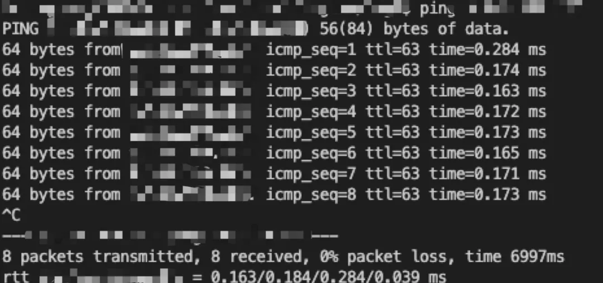

同区域机器 ping 的网络时延只有 0.x毫秒，如下图所示：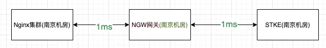

综合上述分析，直出页面TTFB时间过长的根本原因是：**NGW 网关部署和 Nginx、STKE 不在同一区域，导致网络时延的产生。**

解决方案是**让网关和直出服务机房部署在同一区域**，执行了以下操作：

- **NGW扩容**
- **北极星开启就近访问**

优化前：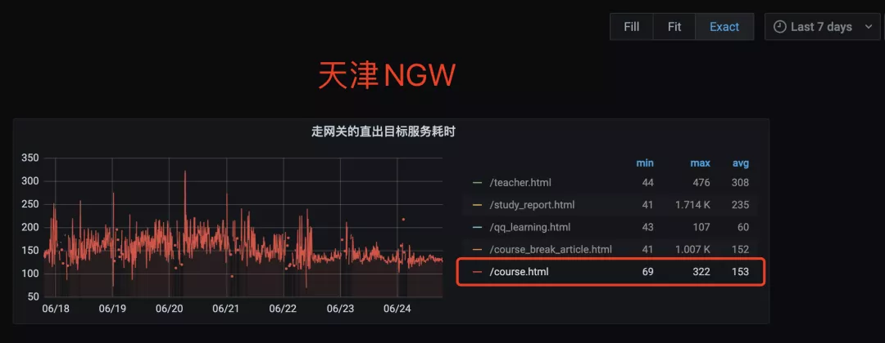

优化后：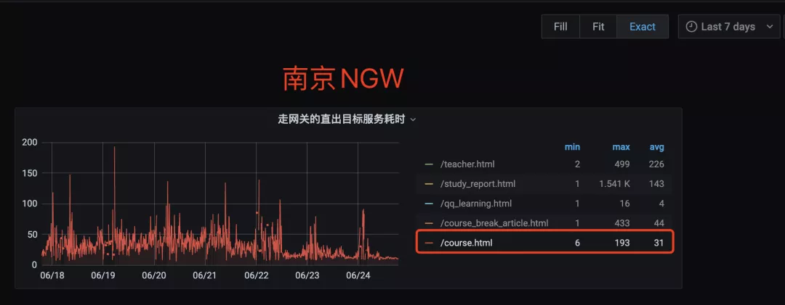

优化效果如上图：

|        | 七天网关平均耗时         |
| :----- | :----------------------- |
| 优化前 | 153 ms                   |
| 优化后 | 31 ms 优化 80%（120 ms） |

####  

#### 2. 页面渲染时间优化

模拟弱网情况（slow 3g）Performance 录制页面渲染情况，从下图 Screenshot 中可以发现：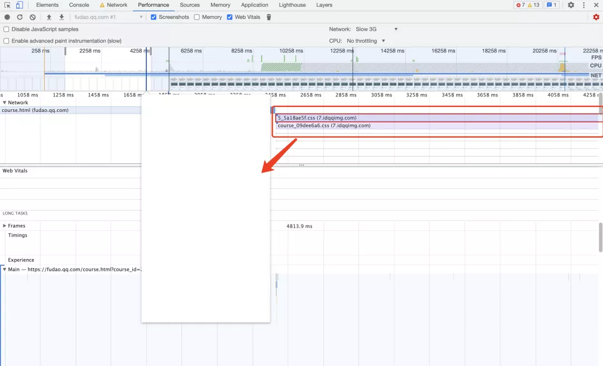

1. DOM 开始解析，但页面还未渲染
2. CSS 文件下载完成后页面才正常渲染

**CSS 不会阻塞页面解析，但会阻塞页面渲染，如果 CSS 文件较大或弱网情况，会影响到页面渲染时间，影响用户体验。**

借助 ChromeDevTool 的 Coverage 工具（More Tools 里面），录制页面渲染时 CSS 的使用率：

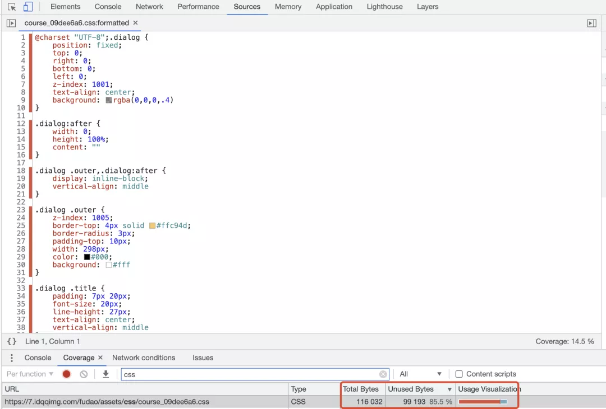

发现首屏的 CSS 使用率才 15%，可以考虑**对页面首屏的关键 CSS 进行内联**，**让页面渲染不被CSS 阻塞，再把完整 CSS 加载进来。**

实现 Critial CSS 的优化可以考虑使用 [critters](https://mp.weixin.qq.com/s?__biz=MzI1ODE4NzE1Nw==&mid=2247490349&idx=1&sn=139c52fb354eba09c0c3c5a92dc5ffa2&chksm=ea0d51d7dd7ad8c1be5be5b17fd79f5ccc8d84fe013040232a0861290728112c75fb6061499f&scene=178&cur_album_id=1806166719669796864)。

优化后效果：

**CSS 资源正在下载时，页面已经能正常渲染显示了，对比优化前，渲染时间上提升了 1～2 个 CSS 文件加载的时间。**

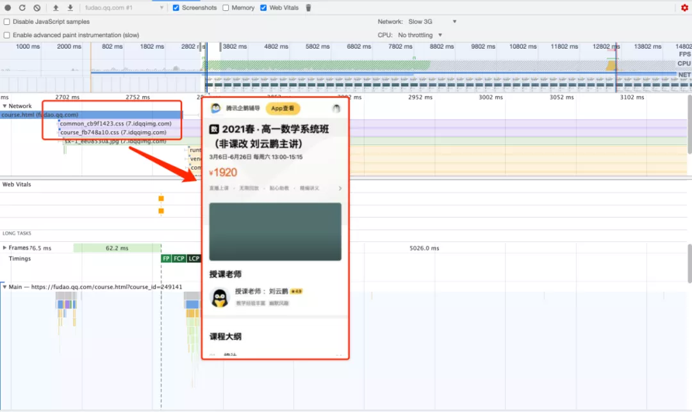

#### 3. 页面布局抖动优化

观察页面的元素变化：

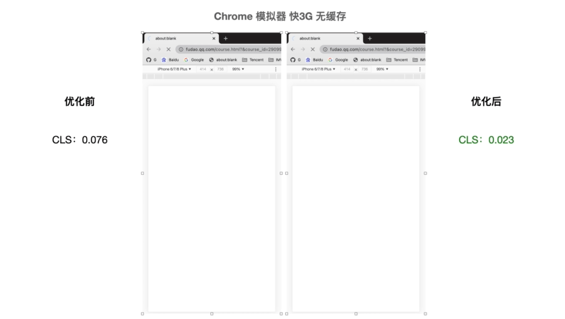

优化前（左图）：图标缺失、背景图缺失、字体大小改变导致页面抖动、出现非预期页面元素导致页面抖动。

优化后：内容相对固定， 页面元素出现无突兀感。

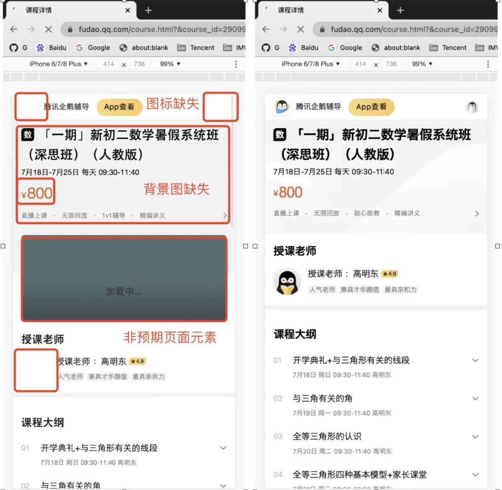

主要优化内容：

1. **确定直出页面元素出现位置，根据直出数据做好布局**
2. **页面小图可以通过 base64 处理，页面解析的时候就会立即展示**
3. **减少动态内容对页面布局的影响，使用脱离文档流的方式或定好宽高**

## 四、性能优化效果展示

**优化效果由以下指标量化：**

- 首次内容绘制时间FCP（First Contentful Paint）：标记浏览器渲染来自 DOM 第一位内容的时间点。
- 视窗最大内容渲染时间LCP（Largest Contentful Paint）：代表页面可视区域接近完整渲染。
- 加载进度条时间：浏览器 onload 事件触发时间，触发后导航栏进度条显示完成。

**Chrome 模拟器 4G 无缓存对比（左优化前、右优化后）：**

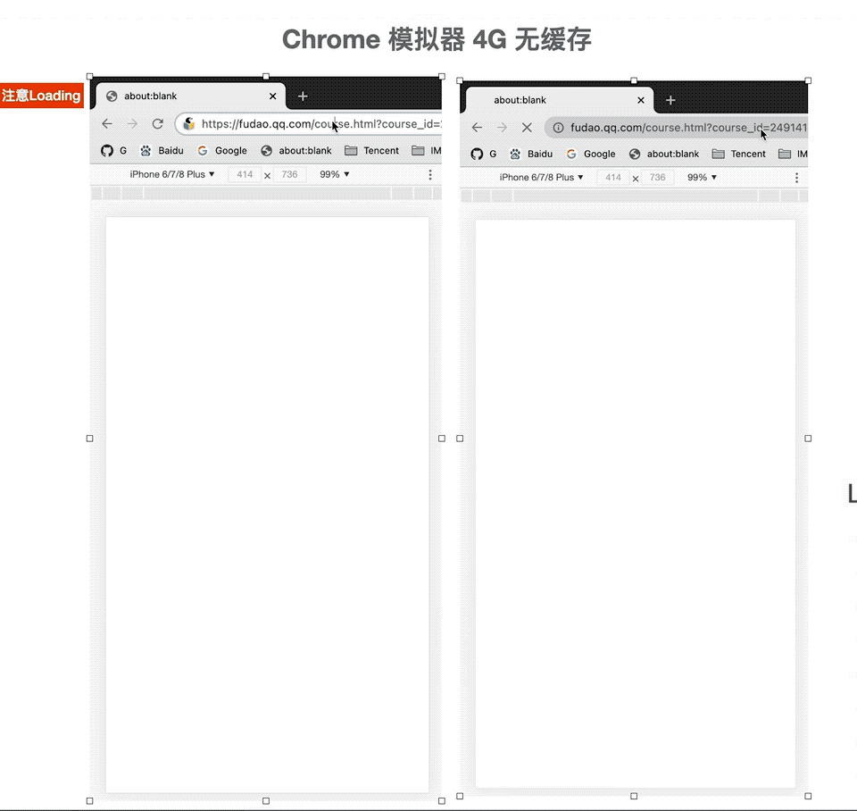

|        | 首屏最大内容绘制时间     | 进度条加载（onload）时间 |
| :----- | :----------------------- | :----------------------- |
| 优化前 | 1067 ms                  | 6.18s                    |
| 优化后 | 31 ms 优化 80%（120 ms） | 1.19s 优化 81%           |

**
**

**Lighthouse 跑分对比：**

优化前：

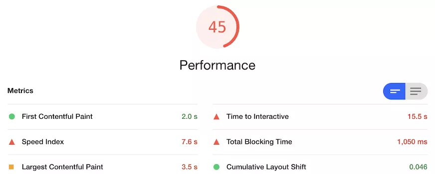

优化后：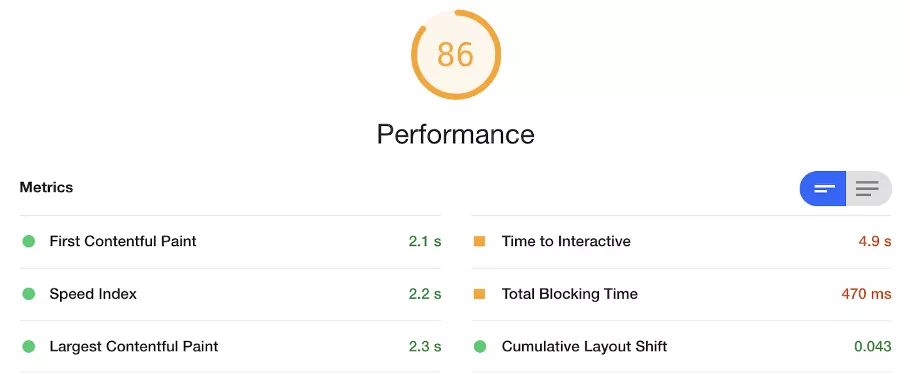

|        | 性能得分               |
| :----- | :--------------------- |
| 优化前 | 平均 40 ～ 50          |
| 优化后 | 平均 75 ～ 85 提升 47% |

**srobot 性能检测一周数据**

*srobot 是团队内的性能检测工具，使用 TRobot 指令一键创建页面健康检测，定时自动化检测页面性能及异常。*

优化前：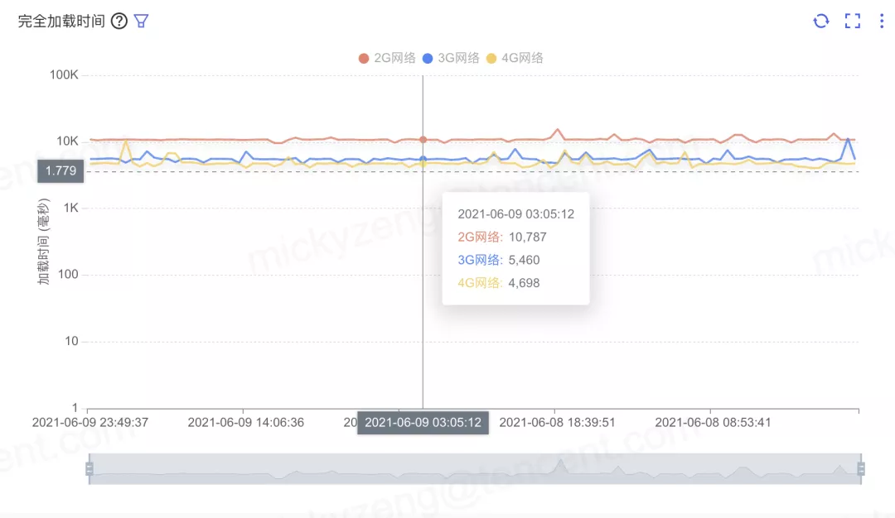

优化后：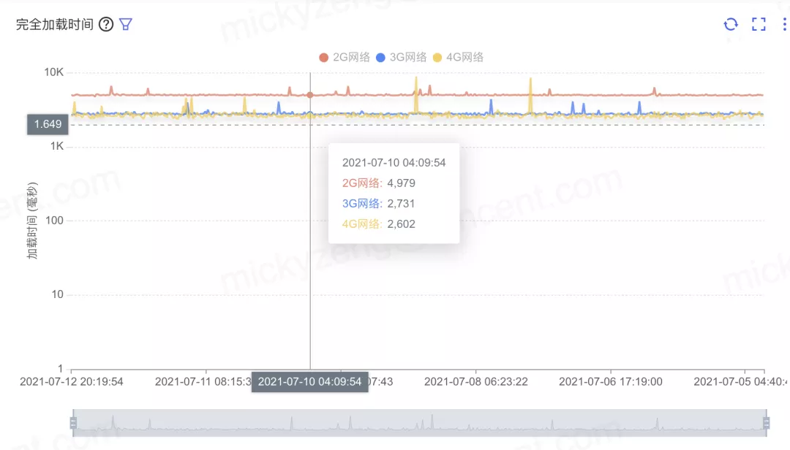

|        | 进度条平均加载（onload）时间（4G） |
| :----- | :--------------------------------- |
| 优化前 | 4632ms                             |
| 优化后 | **2581ms 提升45%**                 |

五、优化总结和未来规划

1. 以上优化手段主要是围绕首次加载页面的耗时和渲染优化，但二次加载还有很大的优化空间 如 **PWA 的使用、非直出页面骨架屏处理、CSR 转 SSR等**。
2. 对比竞品发现我们 CDN 的下载耗时较长，近期准备启动 CDN 上云，期待上云后 CDN 的效果提升。
3. 项目迭代一直在进行，需要思考在工程上如何持续保障页面性能
4. 上文是围绕课程详情页进行的分析和优化处理，虽然对项目整体做了优化处理，但性能优化没有银弹，不同页面的优化要根据页面具体需求进行，需要开发同学主动关注。
