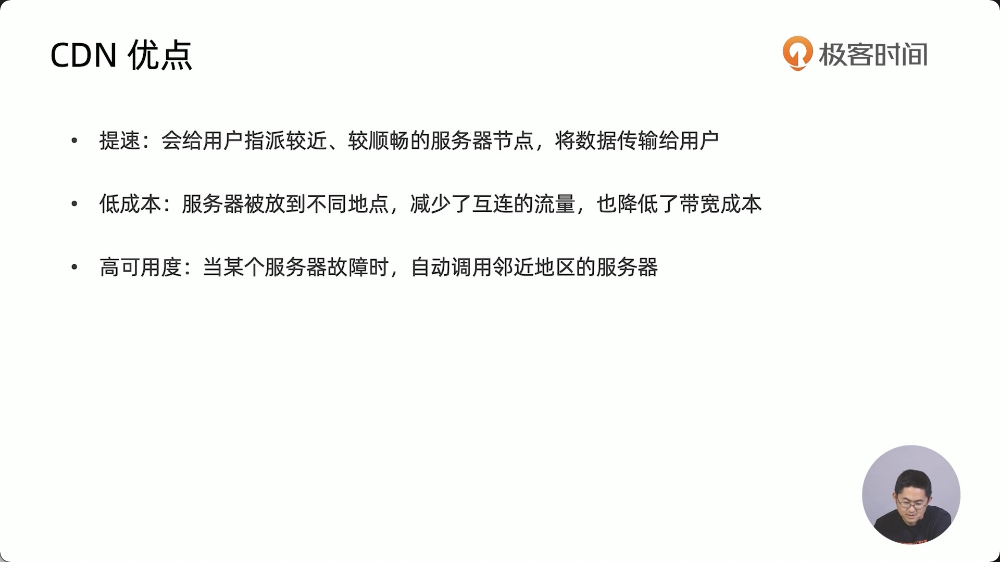
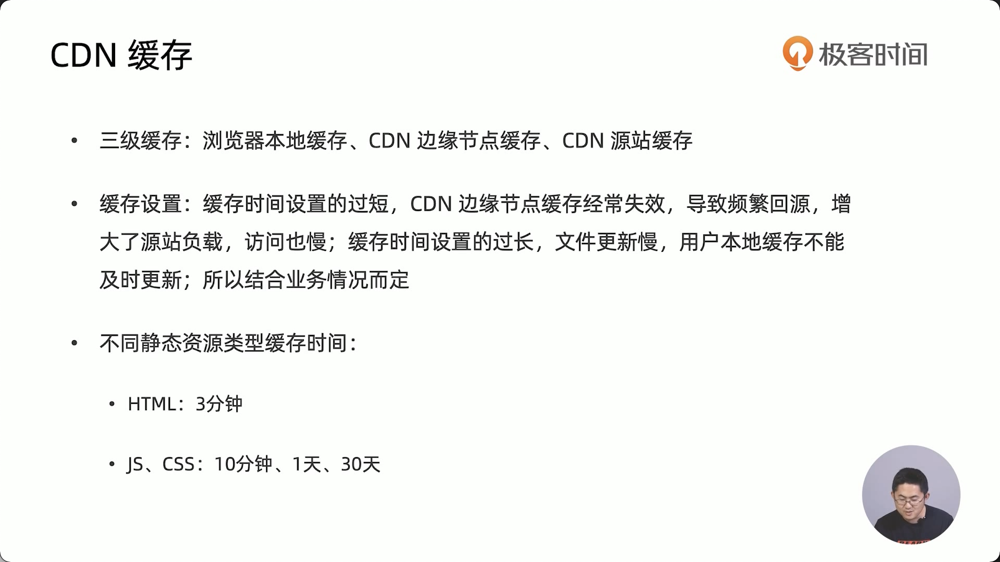
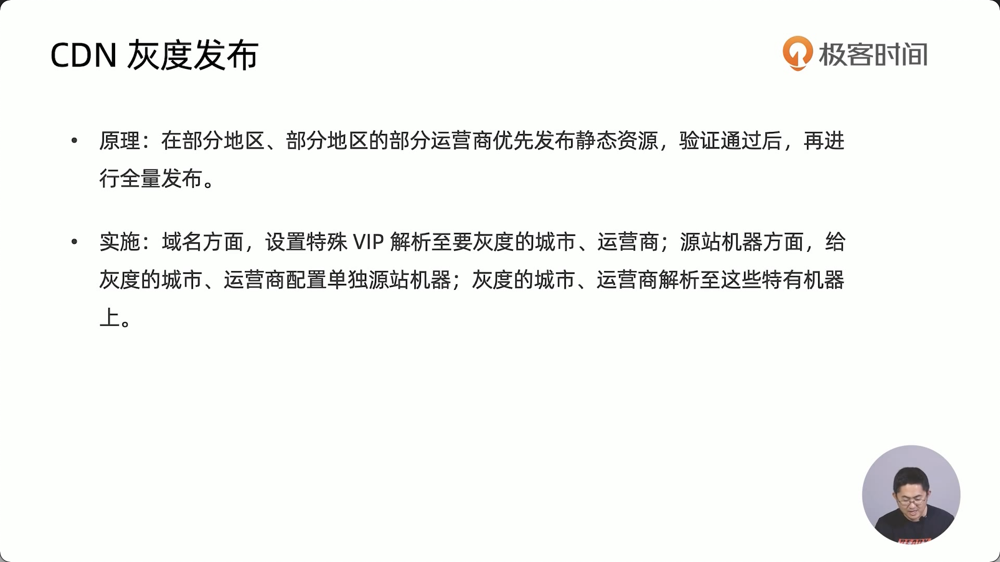
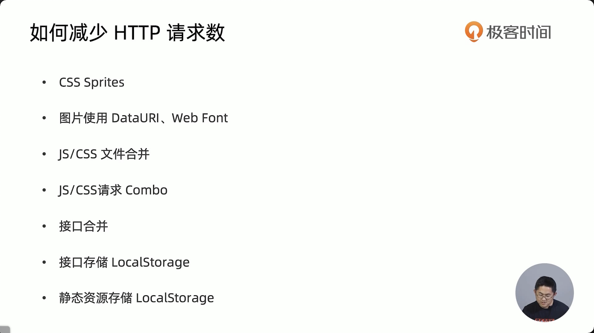

### GZIP压缩 

### 启用keep alive

默认http1.1以后默认开启

- keepalive-timeout  保持时间 s
-  keepalive-requests 链接数 

### http 缓存

- cache control 1.1 / expires 1.0
- Last-modified  if-modified-since 1.0
- Etag  if-none-match  1.1

一般设置：html 不缓存, css、js缓存过期时间可以设置的很长，因为一般使用hash命名文件

图片、字体不经常更换的话，缓存时间设置长一点

> **server-work和HTTP2 都依赖https**，可以生成自签名的证书

### http2

- 二进制传输（http1.1是基于文本的，传输效率慢且不安全）
- 请求响应多路复用
- server push （服务器直接推送，没有请求过程）
- 只能部署在https
- 适合较高的请求量

### 资源优先级

- 浏览器默认安排资源加载优先级
- 使用preload，prefetch调整优先级
- preload 提前加载较晚出现，但对于当前页面非常重要的资源
- prefetch 提前加载后继路由需要的资源，优先级低

[pre系列讲解](https://www.jianshu.com/p/61298b51a5fb)

### 接口缓存策略

1. ajax/fetch缓存
   - 前端请求的时间带上cache，依赖浏览器本身缓存机制
2. 本地缓存
   - 异步接口数据优先使用本地localStorage中的缓存数据
3. 多次请求
   - 接口数据本地无localStorage缓存数据，重新再次发出ajax请求

 ### 使用CDN

#### cdn回源

回源是指浏览器访问cdn集群上静态文件时，文件缓存过期，直接穿透cdn集群而访问源站机器的行为。（发生这种情况后，cdn会更新文件及缓存标记）

#### cdn缓存

### 减少http请求

