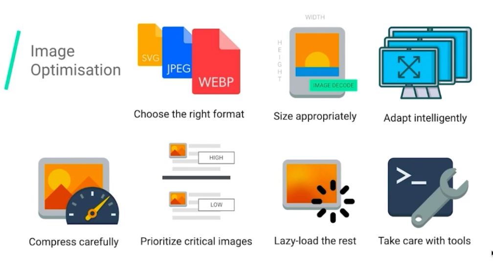
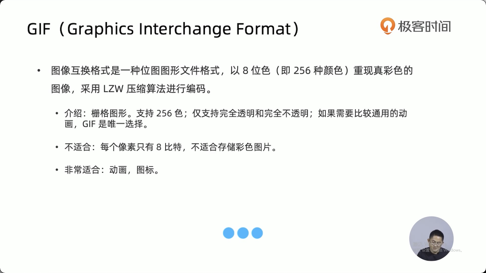
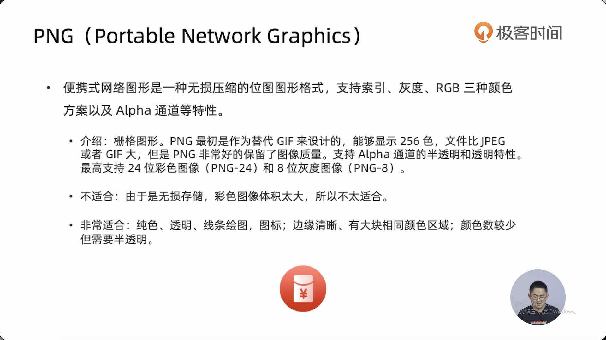
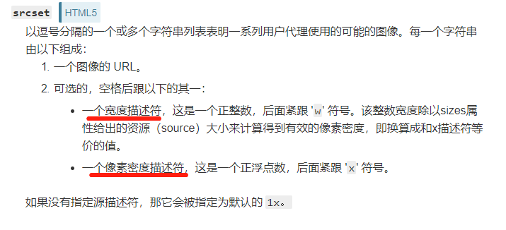

### 图片优化方案



#### 图片格式比较

jpg/jpeg 很高的压缩比，较高的图片质量，纹理边缘表现差

png 支持透明，图片质量较高，纹理边缘表现好，图片大小较大

webp 谷歌推出的格式，兼容性不太好，兼具png 、jpg的优点







#### 图片的懒加载

##### 原生的图片懒加载方案

 ```
loading="lazy"
 ```

##### 第三方图片懒加载方案

verlok/lazyload

Yall.js

Blazy

vue-lazyload

#### 使用渐进式图片

渐进式 jpeg progressive jpeg

#### 使用响应式图片

```

```

**sizes**

　　这个属性可以写一些css，例如“100px”，“50vm”，‘20rem"，"30vm"，甚至是媒体查询 "(min-width: 600px) 25vw, (min-width: 500px) 50vw, 100vm"。

**srcset**

　　顾名思义，就是一堆图片来源的预设。例如：“100.png 100w”, 表示预设 100.png 这张图片，并且告诉浏览器，这张图片的宽度是100。

　　我们来看看mdn的描述：


