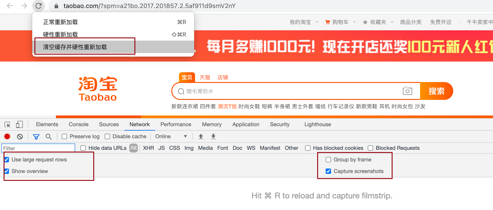
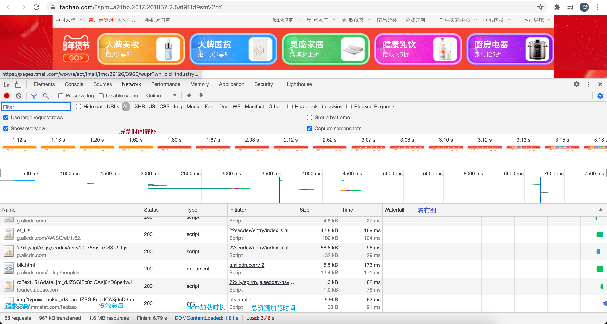
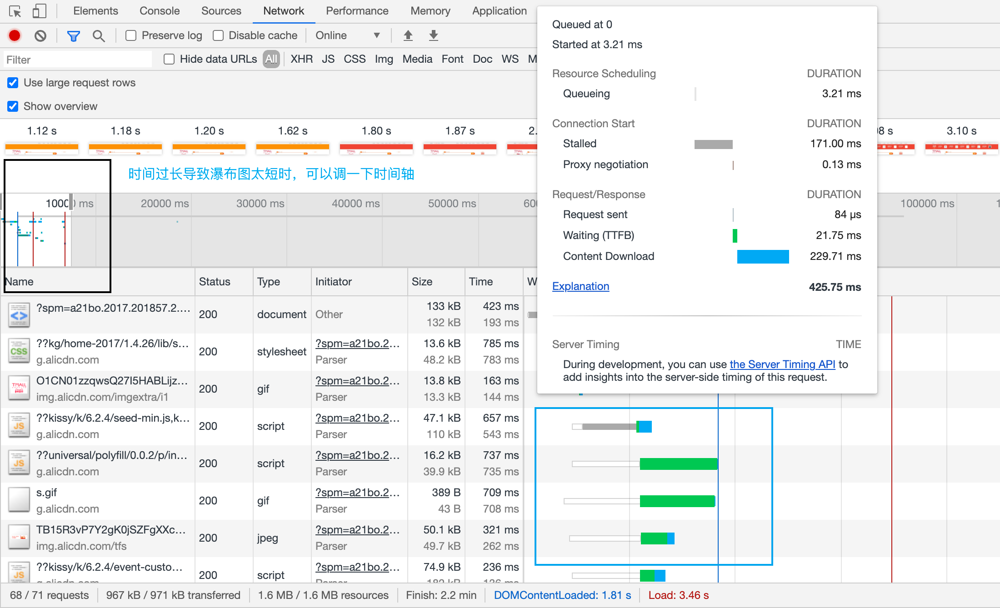
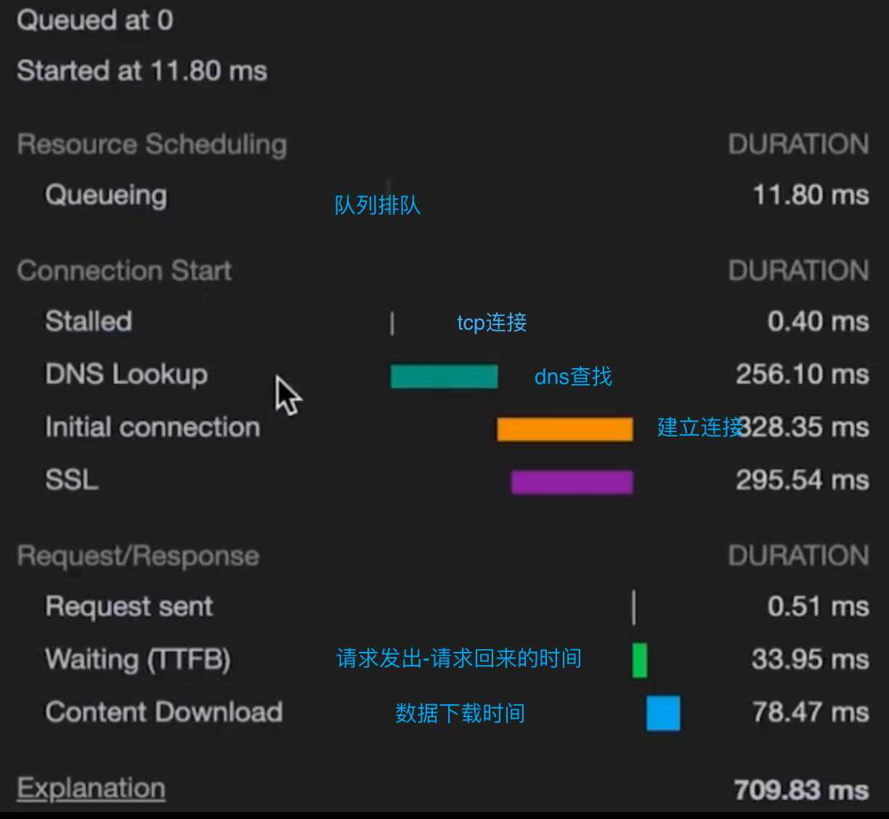
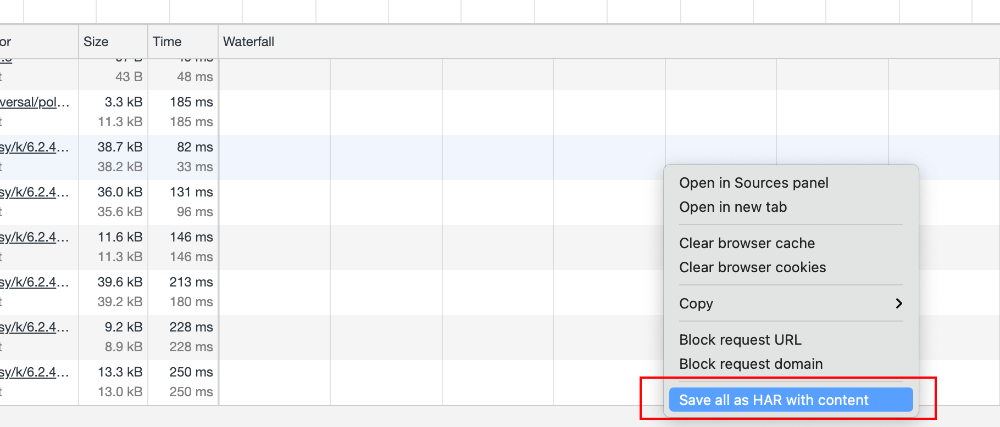
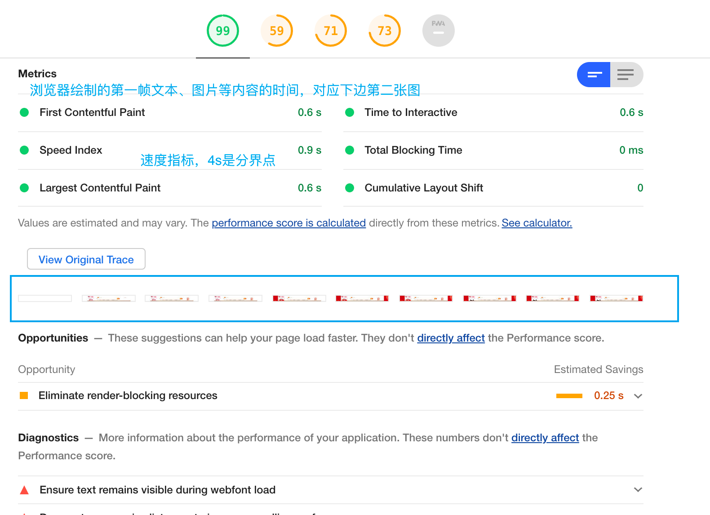

## chrome 浏览器调试工具的使用

### network性能测试

打开调试工具 -> network 注意打钩选项 然后按住刷新，选择清空缓存并硬性重新加载

> network底部有 transferred over network和 resources loaded by the page. 这两个大小有何区别？后边那个指的是解压后的大小，前边那个指的是源文件

下面重点研究瀑布图

  瀑布图由长短不一的条状图构成，处于同一竖线起点的请求，就是并行请求，并行请求数量浏览器有上限，其他的请求必须等上一个请求完成后，才可以发出，瀑布图上可以看到

​ 瀑布图上蓝色竖线表示dom加载完成的时间，红色表示所有资源加载完成的时间。

​ 把鼠标放在到瀑布图上，还可以展示具体的时间构成

> TTFB(Time To First Byte)

可以把结果保存至本地

### lighthouse

主要看两个属性

### 帧数

`command`+`shift`+`p`  输入frame 选择展示帧数
