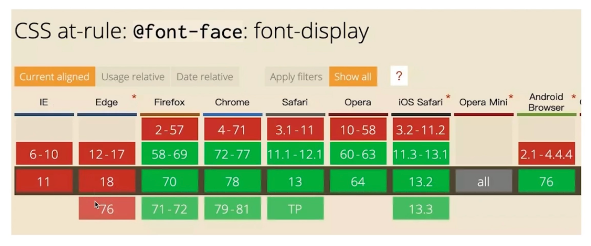
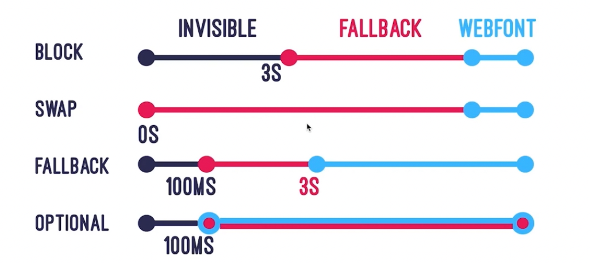

### 字体优化

#### 什么是FOIT 和 FOUT(不可避免的问题)

- 字体未下载完成时，浏览器隐藏或自动降级，导致字体闪烁
- Flash Of Invisible Text 
- Flash Of Unstyle Text 

####  font-display（推荐使用）

兼容性见下图



font-display有五个属性

- auto

  字体显示策略由用户代理定义。

- block

  `block`给予字体一个较短的阻塞时间（大多数情况下推荐使用 3s）和无限大的交换时间。换言之，如果字体未加载完成，浏览器将首先绘制“隐形”文本；一旦字体加载完成，立即切换字体。为此，浏览器将创建一个匿名字体，其类型与所选字体相似，但所有字形都不含“墨水”。使用特定字体渲染文本之后页面方才可用，只有这种情况下才应该使用 `block`。

- swap

  `block`给予字体一个较短的阻塞时间（大多数情况下推荐使用 3s）和无限大的交换时间。换言之，如果字体未加载完成，浏览器将首先绘制“隐形”文本；一旦字体加载完成，立即切换字体。为此，浏览器将创建一个匿名字体，其类型与所选字体相似，但所有字形都不含“墨水”。使用特定字体渲染文本之后页面方才可用，只有这种情况下才应该使用 `block`。

- **fallback**

  `block`给予字体一个较短的阻塞时间（大多数情况下推荐使用 3s）和无限大的交换时间。换言之，如果字体未加载完成，浏览器将首先绘制“隐形”文本；一旦字体加载完成，立即切换字体。为此，浏览器将创建一个匿名字体，其类型与所选字体相似，但所有字形都不含“墨水”。使用特定字体渲染文本之后页面方才可用，只有这种情况下才应该使用 `block`。

- **optional**

  `block`给予字体一个较短的阻塞时间（大多数情况下推荐使用 3s）和无限大的交换时间。换言之，如果字体未加载完成，浏览器将首先绘制“隐形”文本；一旦字体加载完成，立即切换字体。为此，浏览器将创建一个匿名字体，其类型与所选字体相似，但所有字形都不含“墨水”。使用特定字体渲染文本之后页面方才可用，只有这种情况下才应该使用 `block`。

属性区分



例子

```
@ font-face {
  font-family：ExampleFont;
  src：url（/path/to/fonts/examplefont.woff）format（'woff'），
       url（/path/to/fonts/examplefont.eot）format（'eot'）;
  font-weight：400;
  font-style：normal;
  font-display：fallback;
}
```

#### 字体拆分

**unicode-range** 的作用是为@font-face所设置的字体限定一个应用范围，使用unicode编码来设置范围

可以解决：需求：提供了两种字体文件，要求页面中中文使用方正兰亭黑体，英文使用BlaBlaSans，从而实现中英文使用不同字体。

**tips**：你希望数字英文是Helvetica字体，中文是苹方或微软雅黑，直接把英文字体放在前面就可以了！

```
.font {
    font-family: Helvetica, 'Pingfang SC', 'microsoft yahei';
}
```

据我所知，这些英文字体是没有中文字符集映射的，也就是，英文字体实际上对中文是没有任何作用的。考虑到`font-family`的字体解析是从前往后依次的，所以，自然而然上面的代码数字英文是Helvetica字体，中文是苹方或微软雅黑，完全不需要使用`unicode-range`做吃力不讨好的事情。

那`unicode-range`适合使用的场景究竟是什么呢？

在我看来，是对中文内容中的某部分中文字符做特殊字体处理，或者是英文字体中部分字符做特殊字体处理，这个才是适合的。比方说，上面使用宋体引号的案例，因为都是中文字体，因此，才有使用`unicode-range`的价值。

[中文汉字unicode编码范围整理demo](http://www.zhangxinxu.com/study/201611/chinese-language-unicode-range.html)

#### Ajax + base64 （不如上述方式，了解）

- 可以解决兼容性问题
- 缺点：缓存问题