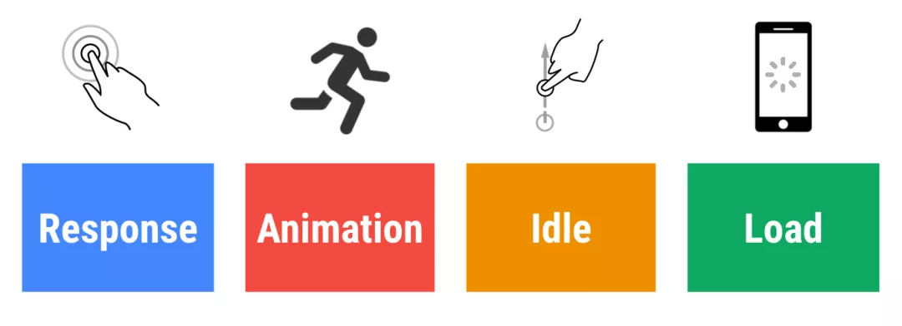
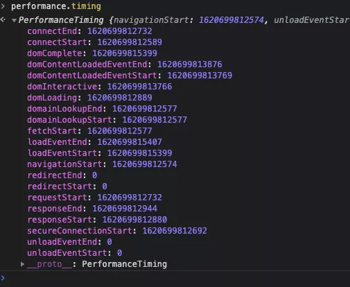
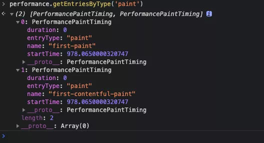

## 性能指标

在chrome的devtools里有很多性能指标，下面简单介绍一下这些指标

首先是可以在chrome的performance中标识的指标

- DCL (DOMContentLoaded Event)
  - 当初始的 **HTML** 文档被完全加载和解析完成之后，**`DOMContentLoaded`** 事件被触发，而无需等待样式表、图像和子框架的完全加载。(MDN的概念)
  - 更加清晰的结论是，DOMContentLoaded 事件在 html文档加载完毕，并且 html 所引用的内联 js、以及外链 js 的同步代码都执行完毕后触发。
- L (Onload Event)
  - **load** 应该仅用于检测一个完全加载的页面 当一个资源及其依赖资源已完成加载时，将触发load事件
  - 更加清晰的结论是，当页面 DOM 结构中的 js、css、图片，以及 js 异步加载的 js、css 、图片都加载完成之后，才会触发 load 事件。
  > 页面中引用的 js 代码如果有异步加载的 js、css、图片，是会影响 load 事件触发的。
  video、audio、flash 不会影响 load 事件触发。
- FP (First Paint)
  - `首次绘制`: 标记浏览器渲染任何在视觉上不同于导航前屏幕内容之内容的时间点，**简而言之就是浏览器第一次发生变化的时间**
- FCP (First Contentful Paint)
  - `首次内容绘制` 标记浏览器渲染来自 DOM 第一位内容的时间点，该内容可能是文本、图像、SVG 甚至 元素.
- LCP (Largest Contentful Paint)
  - `最大内容渲染`: 代表在viewport中最大的页面元素加载的时间. LCP的数据会通过PerformanceEntry对象记录, 每次出现更大的内容渲染, 则会产生一个新的PerformanceEntry对象.(2019年11月新增)

然后是在性能分析 lighthouse中出现的六个指标,前两个在performance中也存在

- FCP (First Contentful Paint)
- LCP (Largest Contentful Paint)
- SI (Speed Index)
  - 指标用于显示页面可见部分的显示速度, 单位是时间
- TTI (Time to Interactive)
  - `可交互时间`: 指标用于标记应用已进行视觉渲染并能可靠响应用户输入的时间点.
- TBT (Total Blocking Time)
  - `页面阻塞总时长`: TBT汇总所有加载过程中阻塞用户操作的时长，在FCP和TTI之间任何long task中阻塞部分都会被汇总（超过50ms的长任务）
- CLS (Cumulative Layout Shift)
  - `累积布局偏移`: 总结起来就是一个元素初始时和其hidden之间的任何时间如果元素偏移了, 则会被计算进去，说简单点就是用户不期望的元素位置偏移。
  - 根据 Google 的介绍，CLS 问题产生的原因一般包括：
    - 图片没有宽高
    - 无尺寸的广告、嵌入式和iframes
    - 动态注入的内容
    - 导致FOIT/FOUT的Web字体
    - 在更新DOM之前等待网络响应的操作

### LCP

LCP (Largest Contentful Paint) 是一个以用户为中心的性能指标，可以测试用户感知到的页面加载速度，是一个相当重要的性能指标

#### **如何确定元素类型**?

跟 [Largest Contentful Paint API](https://link.zhihu.com/?target=https%3A//wicg.github.io/largest-contentful-paint/) 里面定义的一致，包含以下几种元素类型:

- `` 元素
- `<svg>` 中的 `<image>` 元素
- `<video>` 元素（如果定义了封面图，会影响LCP）
- 带 `url()` 背景图的元素
- 块级元素带有文本节点或者内联文本子元素

要注意的是，限制元素在这些范围内只是为了一开始简单一点，以后可能会加入更多的元素。

#### **如何确定元素的大小**？

LCP中元素尺寸的定义就是用户视窗所见到的尺寸。如果元素在视窗外面，或者如果元素被overflow裁剪了，这些部分不计算入LCP的元素尺寸。

- 对于已经被设置过大小的图片元素而言，LCP的尺寸就是设置的尺寸，并非图片原始尺寸。
- 对于文本元素而言，只有包含所有文本节点的最小矩形才是LCP的尺寸。
- 对于其他元素而言，css样式里的margin、padding和border都不算。

#### **LCP什么时候上报**？

由于Web页面都是分阶段加载的，所以最大元素可能随时会发生变化。

为了捕获这种变化，浏览器会派发一个类型是 `largest-contentful-paint` 的 `PerformanceEntry` 对象，**表示浏览器绘制第一帧的时候最大的元素**。在后来的渲染帧中，如果最大元素发生变化，会再次派发一个 `PerformanceEntry` 对象。

### DCL

DCL，当初始的 **HTML** 文档被完全加载和解析完成之后，**`DOMContentLoaded`** 事件被触发，而无需等待样式表、图像和子框架的完全加载。

简单的说几个注意点，

- 无需等待样式表的加载仅适用于head中的css，body的css会阻塞DCL
- DCL始终等待js解析加载完成后触发

### LOAD

[参考](http://eux.baidu.com/blog/fe/%E6%B7%B1%E5%85%A5%E7%90%86%E8%A7%A3window.onload)

**先放结论**

- **onload的触发时机：** JS 加载并执行完毕且页面中所有外链资源加载完成之后大约 3 - 4ms（这个值跟机型和浏览器有关）

- **最佳实践：** JS代码的执行要放到onload里。如果是服务端渲染带图片的列表，图片最好由JS异步加载， 避免阻塞onload。

#### 1、onload不是立即触发的

请问下面哪个alert先触发？

```javascript
window.onload = function() {
    alert('onload');
}
setTimeout(function(){
    alert('timeout');
}, 2)
```

答案是 `timeout` 先触发。而在我的电脑上，把 `timeout` 的值调成 5 或 5 以上，就是 `onload` 先触发了。

#### 2、JS的执行对onload有影响

```js
window.onload = function() {
    alert('onload');
}
var a
for (var i = 0; i < 100000000; i++) {
    a = a + i;
}
```

你会发现 onload 会等很久才触发，因此JS的执行最好放在onload之后。

#### 3、动态加载的资源可能对onload产生影响

```html
<body></body>
<script>
  window.onload = function() {
    alert('onload');
  }
  document.body.innerHTML = ' .... ';
</script>
```

我们把网速调的慢一点，我们会很清晰的发现这种 JS 动态加进去的图片也会阻塞 `onload`，只有 a-z 图片都加载完成，onload 才会触发。而我们改成下面：

```js
window.onload = function() {
    setTimeout(function() {
       document.body.innerHTML = ' .... ';
    }, 10)
    alert('onload');
}
```

这时就会发现，onload 马上就触发了，不必等待图片加载完成。

#### 4、再讲一个更实际的例子

```html

<script>
window.onload = function() {
    alert('onload');
}
$.ajax({
    url: imgList,
   success: function(arr) {
        arr.forEach(function() {
            $('body').append('')
        })
    }
})
</script>
```

假设 aaa.png 加载时间为 100ms，ajax 接口返回时间为 50ms，那么假设 imgList 中有 100 张图片，那么 onload 的时间就会被推迟到这 100 张图片都加载完成之后。

而如果 aaa.png 加载时间为 50ms，接口请求为 100ms 的时候，就不会有这个问题。但是我们没法保证接口请求一定慢于图片请求。

因此**带图片的列表请求需要放在 window.onload 之后执行**。

### CLS

写的很不错，第一个网址是对第二个网址的总结

<https://www.bilibili.com/read/cv7415934/>

<https://web.dev/optimize-cls/>

### google性能模型RAIL

了解下谷歌提出的性能模型 RAIL：



> 1.响应：输入延迟时间（从点按到绘制）小于 100 毫秒。用户点按按钮（例如打开导航）。
>
> 2.动画：每个帧的工作（从 JS 到绘制）完成时间小于 16 毫秒。用户滚动页面，拖动手指（例如，打开菜单）或看到动画。拖动时，应用的响应与手指位置有关（例如，拉动刷新、滑动轮播）。此指标仅适用于拖动的持续阶段，不适用于开始阶段。
>
> 3.空闲：主线程 JS 工作分成不大于 50 毫秒的块。用户没有与页面交互，但主线程应足够用于处理下一个用户输入。
>
> 4.加载：页面可以在 1000 毫秒内就绪。用户加载页面并看到关键路径内容。

### **performance介绍**

performance 对象是专门用来用于性能监控的对象，内置了一些前端需要的性能参数。

**performance.now()方法**

`performance.now()`返回`performance.navigationStart`至当前的毫秒数。`performance.navigationStart`是下文将介绍到的可以说是浏览器访问最初的时间测量点。

**performance.timing**



**performance.getEntries()方法**

浏览器获取网页时，会对网页中每一个对象（脚本文件、样式表、图片文件等等）发出一个 HTTP 请求。performance.getEntries() 方法以数组形式，返回一个 PerformanceEntry 列表，这些请求的时间统计信息，有多少个请求，返回数组就会有多少个成员。

name ：资源名称，是资源的绝对路径或调用mark方法自定义的名称 startTime :开始时间 duration ：加载时间 entryType ：资源类型，entryType 类型不同数组中的对象结构也不同！具体见下 initiatorType ：谁发起的请求，具体见下：

| **值**  | **描述**                             |
| -------- | ------------------------------------- |
| mark     | 通过 mark() 方法添加到数组中的对象    |
| paint    | 通过 measure() 方法添加到数组中的对象 |
| measure  | first-contentful-paint 首次内容绘制   |
| resource | 所有资源加载时间，用处最多            |


