// TODO
半成品 半成品 先别看了
下面结合实例代码探索html、js、css的阻塞关系,浏览器chrome 版本92

- html监听了DCL和load事件，拥有两个具有文字内容(可以观测到FCP、LCP)的div
- js css 带有sleep3000-的前缀，表示服务器会阻塞3000毫秒后返回，方便观测

> js css并存 测试变量太多3*4=12种情况，感觉意义不大、、

首先是html内容

```
<!DOCTYPE html>
<html lang="en">
<head>
 <meta charset="UTF-8">
 <title>Title</title>
 <script>
  document.addEventListener('DOMContentLoaded',function(){
   console.log('DOMContentLoaded');
  });
  window.addEventListener('load',function(){
   console.log('load');
  });
 </script>
 <style>
  div {
   width: 100px;
   height: 100px;
   background: green;
  }
 </style>
</head>
<body>
 <div>的时光飞逝东莞市地方刮大风</div>
 <div>asfklasjf</div>
</body>
</html>
```

css 将div背景设置为blue，html中为green

```
div {
  background: blue!important;
}
```

js1 打印获取的div

```
const div1 = document.querySelector('div');
console.log(div1);
```

Js2 执行复杂操作后 打印div

```
const arr = [];
for (let i = 0; i < 10000000; i++) {
  arr.push(i);
  arr.splice(i % 3, i % 7, i % 5);
}
const div = document.querySelector('div');
console.log(div);
```

### 首先仅测试css

#### 外链css放在head内

图上dcl只是被挡住了，几乎是立刻执行，然后等待css下载完成后，触发load时间，然后进行fp、fcp、lcp

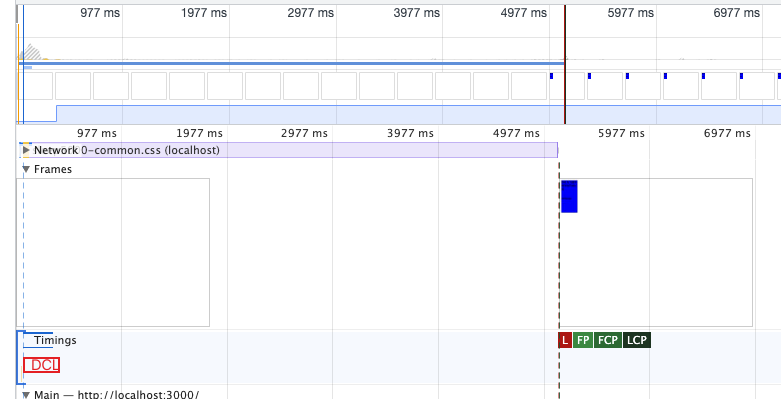

页面上前五秒并未显示div，但是此时在dom中已经存在div，css并不能阻塞dom的解析，五秒后显示蓝色div


#### 外链css放在body最前部

放在body最前部，浏览器会等待css下载完毕后，才会触发dcl及一系列绘制

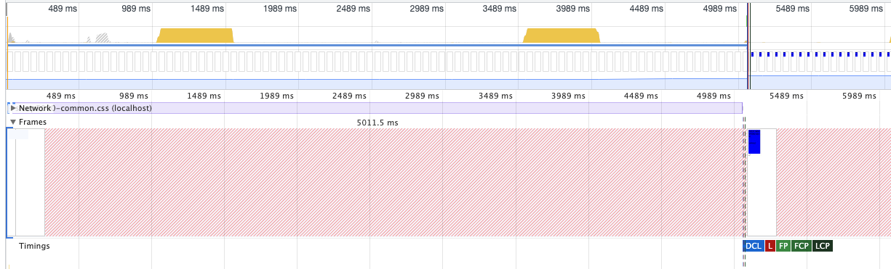

很明显，放在body前的外链css阻塞的dom的解析，当css下载完毕后，触发了一系列关键事件


#### 外链css放在body内，两个div之间

浏览器会先绘制并渲染css之前的div，待css下载完毕后，会渲染另一个div，并显示蓝色背景，触发dcl及load

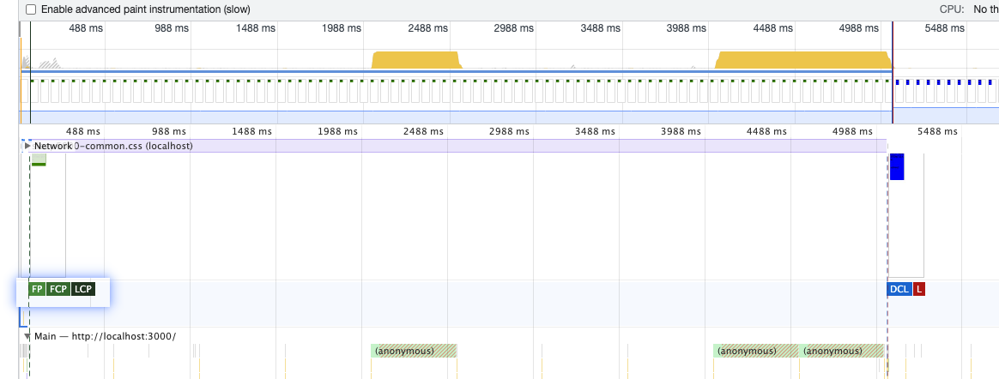


#### css外链放在body内最后

performance和放在div之间一样，实际页面表现有一些差异


#### 外链css放在body之后

会被浏览器修复到body内最后

### 仅测试js

#### js放在head内、body头部

很明显，js的下载和解析（执行）都会阻塞dom元素的解析和渲染，直到js下载解析之后，才会继续解析渲染dom，触发dcl、fp等等

#### 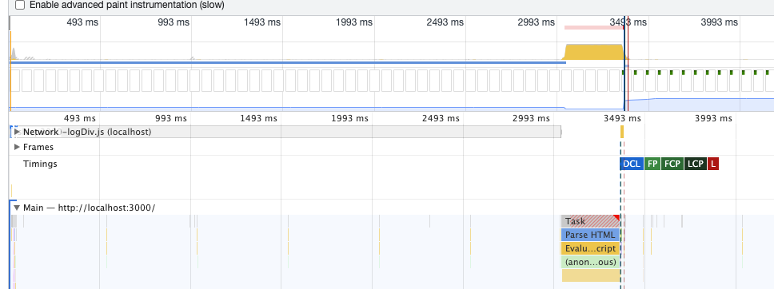


#### js放在div之间

js会阻塞js之后的dom解析和渲染，对于js之前的dom会正常解析渲染，并触发fp等，但是dcl需要等待js下载解析（执行）完成后

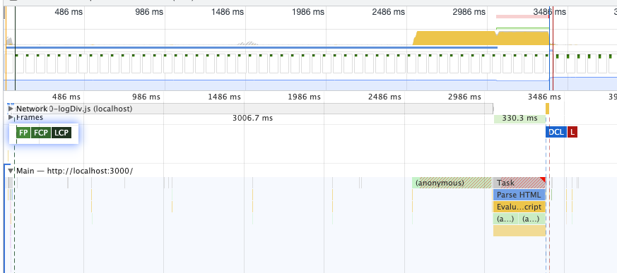


#### js放body尾部

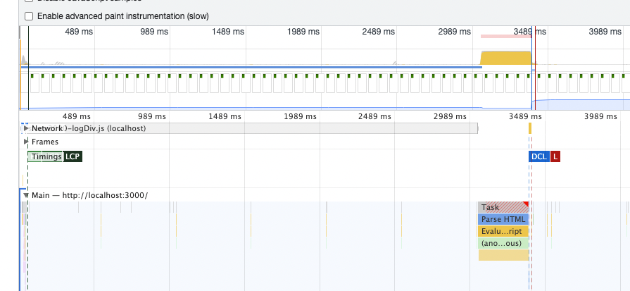


### js、css并存

#### css处于head

##### js处于dom前

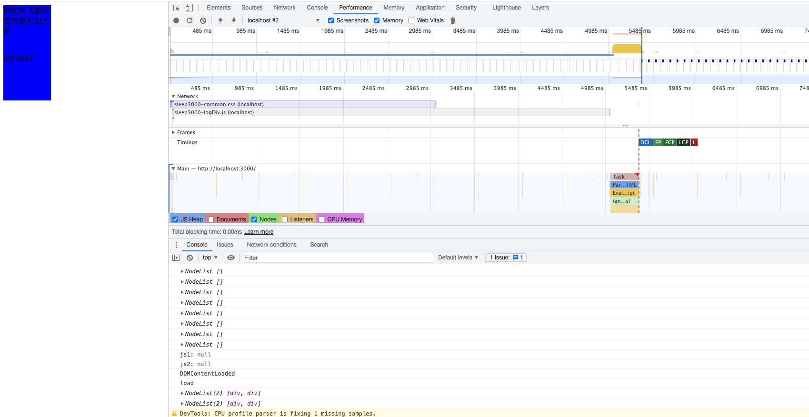

##### js处于dom中

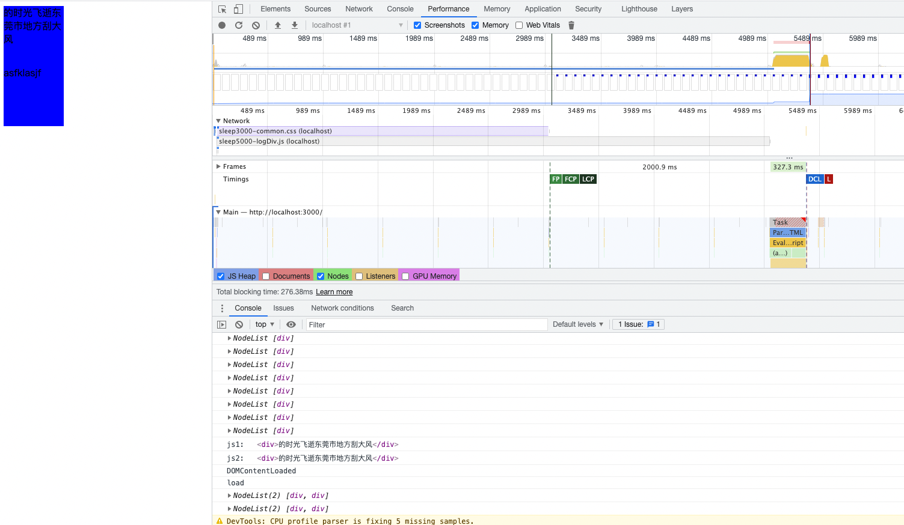

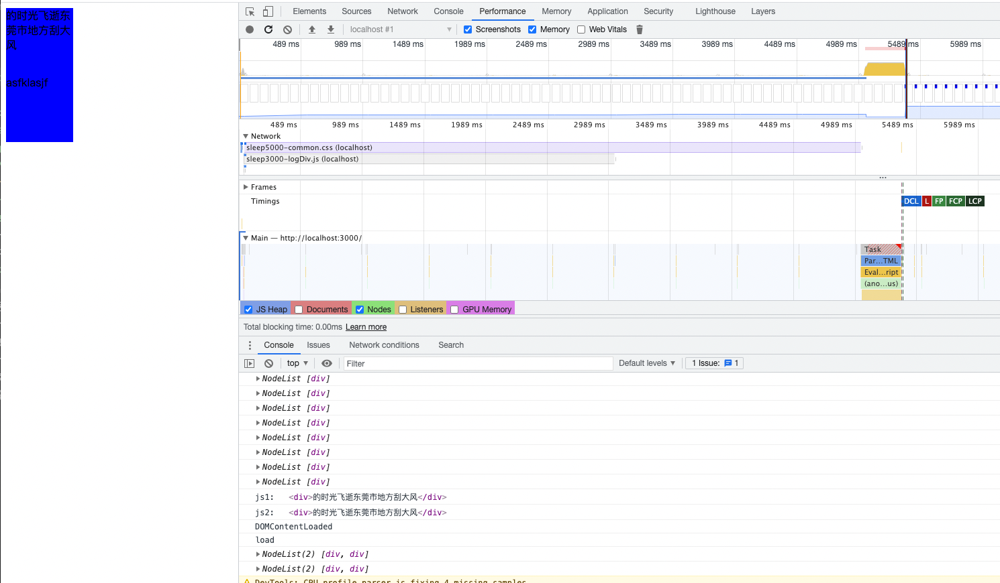

##### js处于dom后

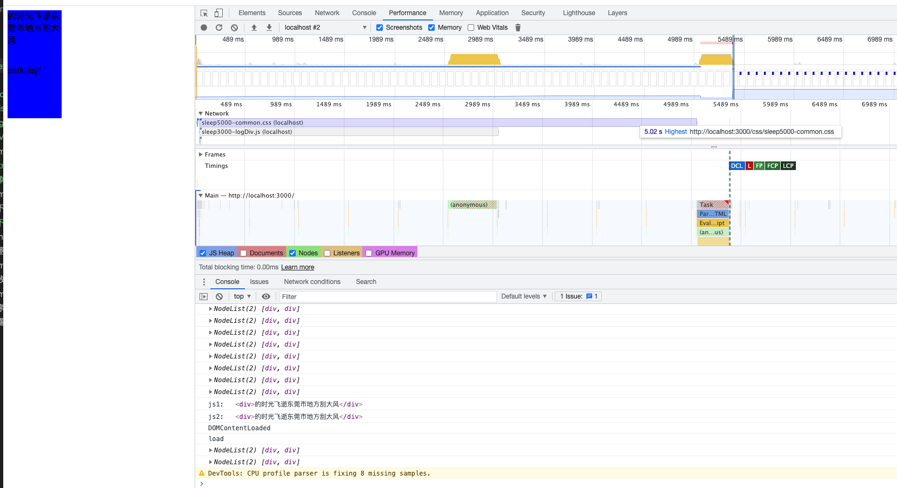

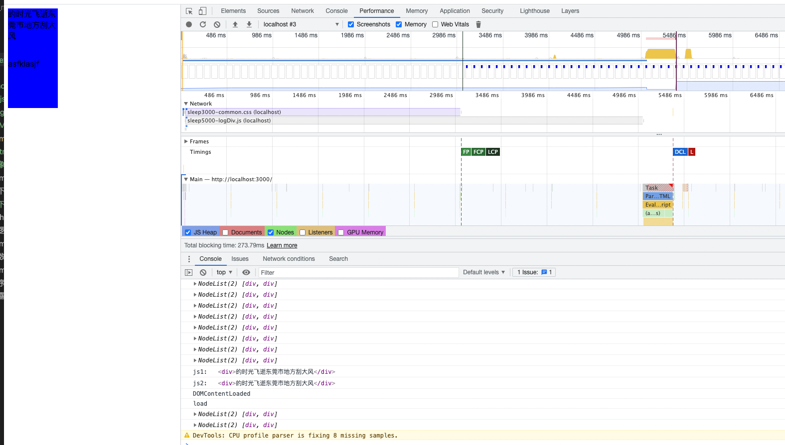

## css和js文件对html的阻塞

- `CSS` 不会（仅限head内）阻塞 `DOM` 的解析(document存在)，但会阻塞其后的 `DOM` 渲染。

- 在js前的css会阻塞js的解析（不会阻止下载），继而阻止dom的解析和渲染
- `JS` 阻塞 `DOM` 解析，但浏览器会"偷看"`DOM`，预先下载相关资源。

## DCL的结论

除了放在head里的css，html中的js、css都会阻塞dcl事件
