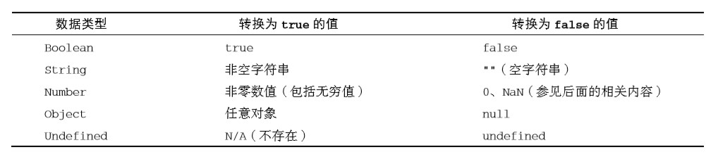
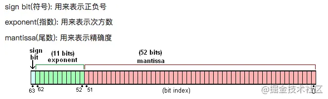

# 数据类型

- 基本数据类型
  - Undefined
  - Null
  - Boolean
  - Number
  - String
  - Symbol
- 复杂类型：
  - Object

# typeof操作符

对一个值使用 typeof 操作符会返回下列字符串之一：

- "undefined"表示值未定义
- "boolean"表示值为布尔值
- "string"表示值为字符串
- "number"表示值为数值
- "object"表示值为对象（而不是函数）或 null
- "function"表示值为函数
- "symbol"表示值为符号

```
let message = "some string"; 
console.log(typeof message);    // "string" 
console.log(typeof(message));   // "string" 
console.log(typeof 95);         // "number" 
```

> typeof 是一个操作符而不是函数，所以不需要参数（但可以使用参数）

# 数据类型简介

## Undefined

Undefined 类型只有一个值，就是特殊值 undefined。
包含 undefined 值的变量跟未定义变量是有区别的

```
let message;    // 这个变量被声明了，只是值为 undefined 
// 确保没有声明过这个变量 // let age 
console.log(message); // "undefined" 
console.log(age);     // 报错
```

> 但是 `typeof` 操作符返回的结果是没有区别的,都是"undefined"

## Null

Null 类型同样只有一个值，即特殊值 null。逻辑上讲，null 值表示一个空对象指针，这也是给 typeof 传一个 null 会返回"object"的原因
undefined 值是由 null 值派生而来的，因此 ECMA-262将它们定义为表面上相等，如下面的例子所示：

```
console.log(null == undefined);  // true 
console.log(null === undefined);  // false 
```

## Boolean

Boolean（布尔值）类型有两个字面值：true 和 false。
虽然布尔值只有两个，但所有其他 ECMAScript类型的值都有相应布尔值的等价形式。要将一个其他类型的值转换为布尔值，可以调用特定的 Boolean()转型函数：
转换规则如下：  



## number

Number 类型使用的是双精度浮点型，也就是其他语言中的double类型。而双精度浮点数使用64 bit来进行存储



[双精度浮点数详细介绍](https://juejin.cn/post/6844903557326454791)

### 三种基本类型

#### 整数

最基本的数值字面量格式是**十进制整数**，直接写出来即可：

```
let intNum = 55; // 整数 
```

整数也可以用**八进制**（以 8 为基数）或**十六进制**（以 16 为基数）字面量表示。

如下所示：

```
let octalNum1 = 070; // 八进制的 56  
let octalNum2 = 079; // 无效的八进制值，当成 79 处理 
let octalNum3 = 08; // 无效的八进制值，当成 8 处理 
```

八进制字面量在严格模式下是无效的，会导致 JavaScript 引擎抛出语法错误。

要创建十六进制字面量，必须让真正的数值前缀 0x（区分大小写），

```
let hexNum1 = 0xA; // 十六进制 10  
let hexNum2 = 0x1f; // 十六进制 31  
```

使用八进制和十六进制格式创建的数值在所有数学操作中都被视为十进制数值。

#### 浮点数

要定义浮点值，数值中必须包含小数点，而且小数点后面必须至少有一个数字。

因为存储浮点值使用的内存空间是存储整数值的两倍，所以 ECMAScript 总是想方设法把值转换为 整数。

**如下例所示：**

```
let floatNum1 = 1.; // 小数点后面没有数字，当成整数 1 处理
let floatNum2 = 10.0; // 小数点后面是零，当成整数 10 处理
```

浮点值的精确度最高可达 17 位小数，但在算术计算中远不如整数精确。例如，0.1 加 0.2 得到的不 是 0.3，而是 0.300 000 000 000 000 04。

#### NaN

有一个特殊的数值叫 NaN，意思是“不是数值”（Not a Number），用于表示本来要返回数值的操作 失败了（而不是抛出错误）。

NaN 有几个独特的属性：

- 任何涉及 NaN 的操作始终返回 NaN（如 NaN/10）

- NaN 不等于包括 NaN 在内的任何值

  - ECMAScript 提供了 isNaN()函数

  > 把一个值传给 isNaN()后，该函数会尝试把它转换为数值。（使用哪种转换规则未知）**待补充**
  >
  > ```
  > console.log(isNaN(NaN)); // true 
  > console.log(isNaN(10)); // false，10 是数值
  > console.log(isNaN("10")); // false，可以转换为数值 10 
  > console.log(isNaN("blue")); // true，不可以转换为数值
  > console.log(isNaN(true)); // false，可以转换为数值 1 
  > ```

### 数值转换

`Number()`、`parseInt()`和 `parseFloat()`

**Number()是 转型函数，可用于*任何数据类型*。后两个函数主要用于将*字符串*转换为数值**

#### Number()

Number()是 转型函数，可用于任何数据类型。

Number()函数基于如下规则执行转换(**一元加操作符**与 Number()函数遵循相同的转换规则)。

- 布尔值，true 转换为 1，false 转换为 0。
- 数值，直接返回。
- null，返回 0。
- undefined，返回 NaN。
- 字符串，应用以下规则。
  - 如果字符串包含数值字符，包括数值字符前面带加、减号的情况，则转换为一个十进制数值。 因此，Number("1")返回 1，Number("123")返回 123，Number("011")返回 11（忽略前面 的零）。
  - 如果字符串包含有效的浮点值格式如"1.1"，则会转换为相应的浮点值（同样，忽略前面的零）。
  - 如果字符串包含有效的十六进制格式如"0xf"，则会转换为与该十六进制值对应的十进制整 数值。
  - 如果是空字符串（不包含字符），则返回 0。
  - **如果字符串包含除上述情况之外的其他字符，则返回 NaN。**
  -
  -

  - ```
    Number("a1"); NaN
    let num1 = Number("Hello world!"); // NaN 
    let num2 = Number(""); // 0 
    let num3 = Number("000011"); // 11 
    let num4 = Number(true); // 1 
    ```

- 对象，调用 valueOf()方法，并按照上述规则转换返回的值。如果转换结果是 NaN，则调用 toString()方法，再按照转换字符串的规则转换。

#### parseInit()

parseInt()函数更专注于字符串是否包含数值模式，接收第二个参数，用于指定**底数（进制数）**。。

parseInt()函数基于如下规则执行转换

- 字符串最前面的空格会被 忽略，从第一个非空格字符开始转换
- 如果第一个字符不是数值字符、加号或减号，parseInt()立即 返回 NaN
- 如果第一个字符是数值字符、加号或减号，则继续依次检测每个字符，**直到字符串末尾，或碰到非数值字符**
- 字符串以"0x"开头，就会被解释为十六进制整数。如果字符串以"0" 开头，且紧跟着数值字符，在**非严格模式**下会被**某些实现**解释为八进制整数

```
let num1 = parseInt("1234blue"); // 1234 
let num2 = parseInt(""); // NaN 
let num3 = parseInt("0xA"); // 10，解释为十六进制整数
let num4 = parseInt(22.5); // 22 
let num5 = parseInt("70"); // 70，解释为十进制值
let num6 = parseInt("0xf"); // 15，解释为十六进制整数
let num1 = parseInt("AF", 16); // 175 
let num2 = parseInt("AF"); // NaN 
```

#### parseFloat()

parseFloat()函数的工作方式跟 parseInt()函数类似，但是**只能解析十进制值**

- 始终忽略字符串开头的零

- 解析到字符串末尾或者解析到一个无效的浮点数值字符为止

  > 第一次出现的小数点是有 效的，但第二次出现的小数点就无效 "22.34.5"将转换 成 22.34

```
let num1 = parseFloat("1234blue"); // 1234，按整数解析
let num2 = parseFloat("0xA"); // 0 
let num3 = parseFloat("22.5"); // 22.5 
let num4 = parseFloat("22.34.5"); // 22.34 
let num5 = parseFloat("0908.5"); // 908.5 
let num6 = parseFloat("3.125e7"); // 31250000 
```

## Srting

String（字符串）数据类型表示零或多个 16 位 Unicode 字符序列。

> ECMAScript 中的字符串是不可变的，要修改 某个变量中的字符串值，必须先销毁原始的字符串，然后将包含新值的另一个字符串保存到该变量,**所有字符串方法都不会影响原字符串，无一例外**

### 转换为字符串

几乎所有值都有的 `toString()`方法。这个方法唯 一的用途就是返回当前值的字符串等价物。

> 用加号操作符给一个值加上一个空字符串""也可以将其转换为字符串

toString()方法可见于数值、布尔值、对象和字符串值。null 和 undefined 值没有 toString()方法（直接返回这两个值的字面量文本）

> 没错，字符串值也有 toString()方法， 该方法只是简单地返回自身的一个副本。

> 多数情况下，toString()不接收任何参数。不过，在对数值调用这个方法时，toString()可以接受以什么底数来输出数值的字符串表示
>
> ```
> let num = 10; 
> console.log(num.toString()); // "10" 
> console.log(num.toString(2)); // "1010" 
> console.log(num.toString(8)); // "12" 
> console.log(num.toString(10)); // "10" 
> console.log(num.toString(16)); // "a" 
> ``
> ```

> 详细见js高程第四版 5.3.3
