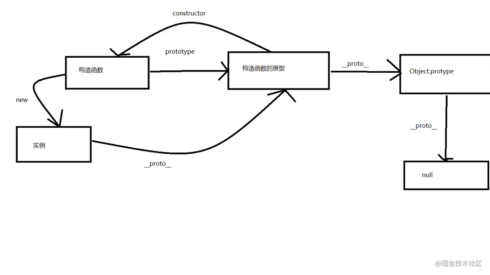

## 前言

JavaScript 是一种`弱类型`或者说`动态类型`，这就意味着你不需要提前声明变量的类型，在程序运行的过程中，类型会被自动确定。这就意味着你可以使用同一个变量保存不同类型的数据：

```javascript
var data = 5 // data is Number now
data = '5' // data is String now
data = true // data is Boolean now
.......
```

相信不管是在学习还是平常写业务的过程中，或多或少的都会碰到类似于--- `如何判断数据类型` 的这种问题。尤其是在面试中，经常被问到 --- `请说出判断数组的几种方法` `你知道判断数据类型有哪几种方法`等等。

虽然看起来仅仅只是判断数据类型的方法，但是涉及到`数据类型`，`原型链`等各种js基础，话不多说，直接开始吧。

## 数据类型

最新的 ECMAScript 标准定义了 8 种数据类型:

- 7种原始类型：
  - Boolean
  - Null
  - Undefined
  - Number
  - BigInt
  - String
  - Symbol
- Object

### 原始值

`除Object 以外的所有类型(基本类型)都是不可以变的（值本身无法被改变）` 例如：js中字符串是不可变的（js对字符串的操作返回了一个新字符串，但是原始字符串并没有被改变），我们称这些类型的值为“原始值”。

#### Boolean

对于布尔类型，永远只有`true`和`false`两个值。

#### Null

null 是一个字面量，不像 undefined ，它不是一个全局对象的一个属性。null 是表示缺少的标识，指示变量未指向任何对象。把 null 作为尚未创建的对象，也许更好理解。

在 API 中，null 常在返回类型应是一个对象，但没有关联的值的地方使用。

#### Undefined

一个没有被赋值的变量会有个默认值 undefined; undefined是全局对象的一个属性。

#### Number

根据 ECMAScript 标准，JavaScript 中只有一种数字类型：基于 IEEE 754 标准的双精度 64 位二进制格式的值（-(2^53 -1) 到 2^53 -1）。它并没有为整数给出一种特定的类型。除了能够表示浮点数外，还有一些带符号的值：+Infinity，-Infinity 和 NaN (非数值，Not-a-Number)。

#### BigInt

使用 BigInt，可以安全地存储和操作大整数. 常常通过在整数末尾附加 n 或调用构造函数来创建的。

```
const a = BigInt('43243242424242424242342432')
// 43243242424242424242342432n

const b = 43243242424242424242342432n
// 43243242424242424242342432n
复制代码
```

#### String

字符串的长度是它的元素的数量。字符串一旦被创建，就不能被修改。但是，可以基于原始字符串的操作来创建新的字符串。例如：

- String.concat() 拼接字符串

插一个问题：`'1'.toString()为什么可以调用?`

```
let a = new Object('1');
a.toString();
console.log('-----a',a); // [String: '1']
a = null
console.log('-----a最终',a); // null
```

- 第一步：创建Object类实例。注意为什么不是String ？由于Symbol和BigInt的出现，对它们调用new都会报错，目前ES6规范也不建议用new来创建基本类型的包装类。
- 第二步：调用实例方法。
- 第三步：执行完方法立即销毁这个实例。

#### Symbol

Symbol 是ES6新增的一种基本数据类型。我们可以通过调用内置函数 Symbol() 创建，这个函数会动态的生成一个匿名、全局唯一的值。

```
const a = Symbol();
const b = Symbol();
a === b // false

const c = Symbol('c'); // Symbol(c)
复制代码
```

------

Symbol 函数栈不能用 new 命令，因为 Symbol 是原始数据类型，不是对象。可以接受一个字符串作为参数，为新创建的 Symbol 提供描述，用来显示在控制台或者作为字符串的时候使用，便于区分。

------

Symbol最大的用处就是：`避免对象的键被覆盖。`

#### 基本数据和引用数据的区别

##### 基本数据类型

- 按值访问，可操作保存在变量中实际的值
- 值被保存在 `栈内存` 中，占据固定大小的空间

##### 引用数据类型

- 引用类型的值是按引用访问的
- 保存在堆内存中的对象，不能直接访问操作对象的内存空间

回归正题，下面来说说判断数据类型的方法👇

------

## typeof

```
typeof '5' // string
typeof 5 // number
typeof null // object
typeof undefined // undefined
typeof true // boolean
typeof Symbol('5') // symbol
typeof 5n // bigint
typeof new Object(); // object
typeof new Function(); // function

复制代码
```

上面的例子，对于基本数据类型来说，除了null返回的是object，其他都可返回正确的类型。 调用null为空，是因为

- null被认为是一个空对象，因此返回了object
- 因为任何对象都会被转化为二进制，null转为二进制则表示全为0，如果前三个均为0，js就会把它当作是对象，这是js早期遗留下来的bug

所以**typeof**：

- `适用于判断（除null）基础类型,`
- `判断引用类型，除了function 全返回object类型`

## instanceof

- 只能用来判断`变量的原型链上是否有构造函数的prototype属性（两个对象是否属于原型链的关系）`，不一定能获取对象的具体类型
- Instanceof 不适用判断原始类型的值，只能用于判断对象是否从属关系

```
[] instanceof Array; // true
[] instanceof Object; // true

function Person() {};
const person = new Person();

person instanceof Person; // true
person instanceof Object; // true
复制代码
```

首先来分析一下，为什么 `[] instanceof Array` 为true。

- 首先，[].**proto** 的原型 是指向Array.prototype 的，说明两个对象是属于同一条原型链的，返回true
- 同理，从代码中可以得知`person instanceof Person`也是返回true的，那么为什么`person instanceof Object`也为true呢？
- 基于原型链的原理：从实例对象的构造函数的原型开始向上寻找，构造函数的原型又有其原型，一直向上找，直到找到原型链的顶端Object.prototype为止。如果没有，则返回null
- 可以看出，person和Object是属于原型链的关系，所以返回true



```
注意：空对象{}的判断问题
let obj1 = {}
console.log(obj1 instanceof Object) // true

let obj2 = Object.create(null)
console.log(obj2 instanceof Object) // false

let obj3 = Object.create({})
console.log(obj3 instanceof Object) // true

复制代码
```

## constructor

原理：`每一个实例对象都可通过constructor来访问它的构造函数`,其实也是根据原型链的原理来的。

```
'5'.__proto__.constructor === String // true
[5].__proto__.constructor === Array // true

undefined.__proto__.constructor // Cannot read property '__proto__' of undefined

null.__proto__.constructor // Cannot read property '__proto__' of undefined

复制代码
```

由于undefined和null是无效的对象，因此是没有constructor属性的,这两个值不能用这种方法判断.

## toString

- Object.prototype.toString方法返回对象的类型字符串，因此可用来判断一个值的类型。
- 因为实例对象有可能会自定义toString方法，会覆盖Object.prototype.toString，所以在使用时，最好加上call
- 所有的数据类型都可以使用此方法进行检测，且非常精准

[关于原理](https://zhuanlan.zhihu.com/p/118793721)

```
Object.prototype.toString.call('5') // [object String]
Object.prototype.toString.call(5) // [object Number]
Object.prototype.toString.call([5]) // [object Array]
Object.prototype.toString.call(true) // [object Boolean]
Object.prototype.toString.call(undefined) // [object Undefined]
Object.prototype.toString.call(null) // [object Null]
Object.prototype.toString.call(new Function()); // [object Function]
Object.prototype.toString.call(new Date()); // [object Date]
Object.prototype.toString.call(new RegExp()); // [object RegExp]
Object.prototype.toString.call(new Error()); // [object Error]
Object.prototype.toString.call({df:1}); // [object Object]

复制代码
```

## 总结

- typeof 适合基本类型和function类型的检测，无法判断null与object
- instanceof 适合自定义对象，也可以用来检测原生对象，在不同的iframe 和 window间检测时失效，还需要注意Object.create(null)对象的问题
- constructor 基本能判断所有类型，除了null和undefined，但是constructor容易被修改，也不能跨iframe使用
- tostring能判断所有类型，可将其封装为全能的DataType()判断所有数据类型
