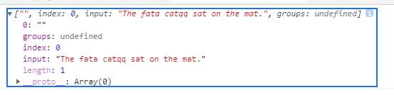
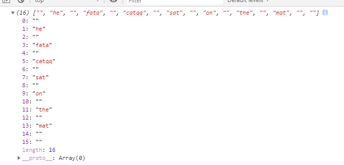
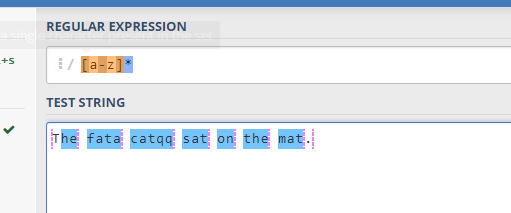
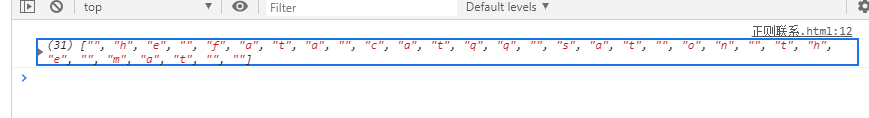

# 正则疑难点记录

## 贪婪、非贪婪与独占模式

```
// 贪婪匹配
"c.*t" => The fat cat sat on the mat.
//匹配： cat sat on the mat
```
**在字符后加上一个问号（?）则可以开启懒惰模式，在该模式下，正则引擎尽可能少的重复匹配字符，匹配成功之后它会继续匹配剩余的字符串**
```
// 非贪婪匹配  则可以开启懒惰模式，在该模式下，正则引擎尽可能少的重复匹配字符，匹配成功之后它会继续匹配剩余的字符串
"c.*?t" => The fat cat sat on the mat.
//匹配： cat
```
**在表达式后加上一个加号（+），则会开启独占模式。同贪婪模式一样，独占模式一样会匹配最长。不过在独占模式下，正则表达式尽可能长地去匹配字符串，一旦匹配不成功就会结束匹配而不会回溯。**
```
"c.*+t" => The fat cat sat on the mat.
//匹配： 空
```
[淘宝大佬笔记-贪婪、懒惰与独占-回溯问题](https://www.cnblogs.com/study-everyday/p/7426862.html)  

## 0次匹配 * ？
- *	匹配>=0个重复的在*号之前的字符。
- +	匹配>=1个重复的+号前的字符。
- ?	标记?之前的字符为可选(代表0次或者1次).
***
看一下下列代码,匹配模式是`/[a-z]*/`
```
var str = "The fata catqq sat on the mat.";
var reg = /[a-z]*/;
console.log(str.match(reg));
```
结果如下,替换为`/[a-z]?/`结果也是一样的
  
匹配到了一个`""`
***
现在添加一个全局搜索符 g 
```
var str = "The fata catqq sat on the mat.";
var reg = /[a-z]*/g;
console.log(str.match(reg));
```
结果如下图：
  
我非常疑惑为什么会匹配到 `""` 下面是来自[正则匹配](https://regex101.com/r/7m8me5/1)的示意图  
 
蓝色虚线表示`""`
***
如果把正则换成`/[a-z]?/g`结果如下所示  
   
这是因为`?`开启了懒惰模式，正则引擎尽可能少的重复匹配字符，匹配成功之后它会继续匹配剩余的字符串

