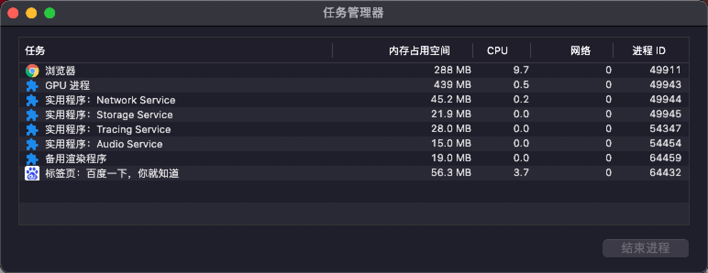
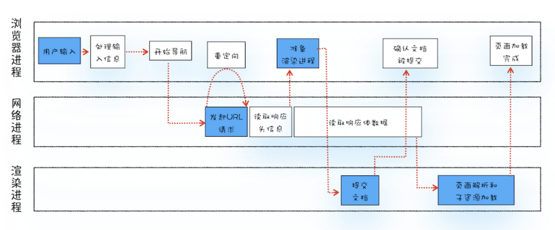
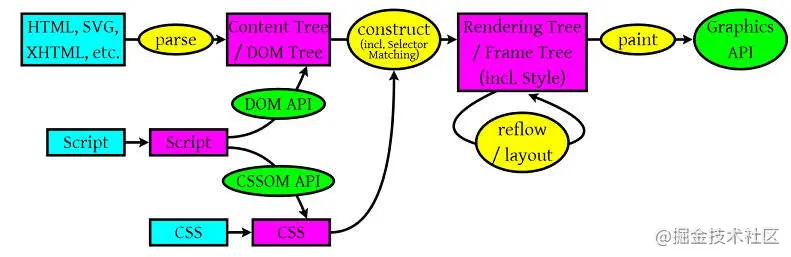
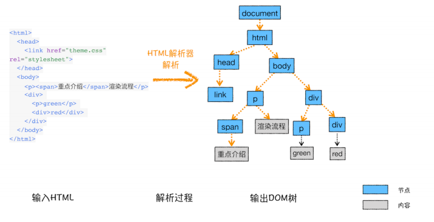
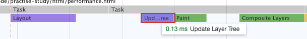
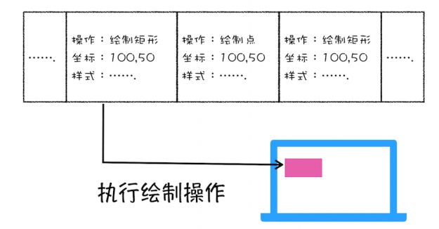
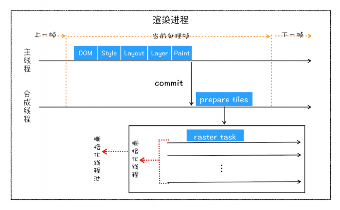
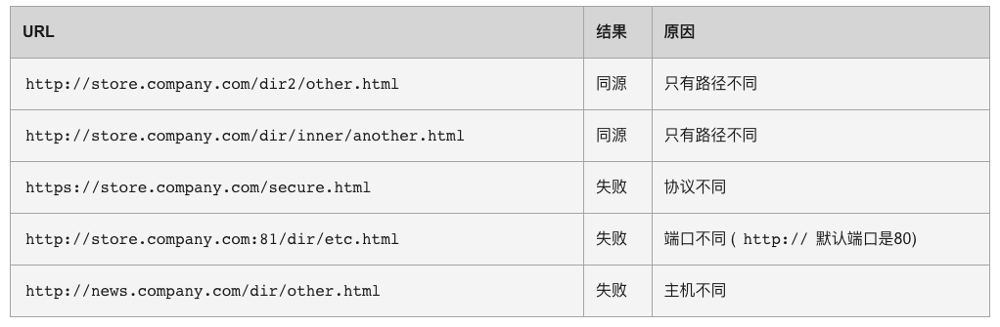

## chrome架构

打开一个chrome网页，如图所示会出现很多线程

首先需要讲解一下 进程和线程

### 进程和线程

- **一个进程就是一个程序的运行实例**
- **线程是不能单独存在的，它是由进程来启动和管理的**
- **线程是依附于进程的，而进程中使用多线程并行处理能提升运算效率**

总结来说，进程和线程之间的关系有以下 4 个特点。

- **1. 进程中的任意一线程执行出错，都会导致整个进程的崩溃。**
- **2. 线程之间共享进程中的数据。**
- **3. 当一个进程关闭之后，操作系统会回收进程所占用的内存(包括泄漏的内存)。**
- **4. 进程之间的内容相互隔离。(通信依靠IPC进程间通信)**

### 浏览器架构发展史

#### 单进程浏览器

**单进程浏览器是指浏览器的所有功能模块都是运行在同一个进程里**

缺点很明显

- 不稳定

  一个插件的意外崩溃会引起整个浏览器的崩溃，除了插件之外，**渲染引擎模块（复杂代码）**也是不稳定的

- 不流畅

  所有页面的渲染模块、JavaScript 执行环境以及插件都是运行在同一个线程中的，这就意味着同一时刻只能有一个模块可以执行

- 不安全

  插件可以使用c++编写，可以轻易访问操作系统

#### 多进程浏览器

多进程浏览器**解决了**单进程浏览器的几个问题

- 不稳定：由于进程是相互隔离的，所以当一个页面或者插件崩溃时，影响到的仅仅是当前的页面进程或者插件进程，并不会影响到浏览器和其他页面
- 不流畅：每个tab页均有一个渲染进程，JavaScript 也是运行在渲染进程中的，所以即使 JavaScript 阻塞了渲染进程，影响到的也只是当前的渲染页面
- 不安全：安全沙箱，Chrome 把插件进程和渲染进程锁在沙箱里面

多进程浏览器也会有一些问题

- **更高的资源占用：**因为每个进程都会包含公共基础结构的副本（如 JavaScript 运行环

  境），这就意味着浏览器会消耗更多的内存资源。

- **更复杂的体系架构：**浏览器各模块之间耦合性高、扩展性差等问题，会导致现在的架构已

  经很难适应新的需求了。

多进程浏览器包括（浏览器架构持续优化中，仅供参考）:

- **浏览器进程**。主要负责界面显示、用户交互、子进程管理，同时提供存储等功能。
  
- ***渲染进程***。核心任务是将 HTML、CSS 和 JavaScript 转换为用户可以与之交互的网页，排版引擎 Blink 和 JavaScript 引擎 V8 都是运行在该进程中。默认情况下，**Chrome 会为每个 Tab 标签创建一个渲染进程**。出于安全考虑，渲染进程都是运行在沙箱模式下。
  - 主线程（**也就是我们常说的js单线程**）
    - 渲染事件（如解析 DOM、计算布局、绘制）
    - 用户交互事件（如鼠标点击、滚动页面、放大缩小等）
    - JavaScript 脚本执行事件
    - 网络请求完成、文件读写完成事件
    - 垃圾回收
    - 等等
  - 合成线程(动画优化)
  - 光栅化线程池
  - IO 线程

- **GPU 进程**
- **网络进程**
- **插件进程**

## 从输入URL到页面展示，这中间发生了什么

从图中可以看出，**整个过程需要各个进程之间的配合**，首先介绍一下各进程的主要职责

- 浏览器进程主要负责用户交互、子进程管理和文件储存等功能。

- 网络进程是面向渲染进程和浏览器进程等提供网络下载功能。

- 渲染进程的主要职责是把从网络下载的 HTML、JavaScript、CSS、图片等资源解析为可以显示和交互的页面。

### 渲染流程之前的流程

 这个过程可以大致描述为如下。

- 首先，浏览器进程接收到用户输入的 URL 请求，浏览器进程便将该 URL 转发给网络进程。然后，在网络进程中发起真正的 URL 请求。

- 接着网络进程接收到了响应头数据，便解析响应头数据，并将数据转发给浏览器进程。

- 浏览器进程接收到网络进程的响应头数据之后，发送“提交导航 (CommitNavigation)”消息到渲染进程；

- 渲染进程接收到“提交导航”的消息之后，便开始准备接收 HTML 数据，接收数据的方式是直接和网络进程建立数据管道；

- 最后渲染进程会向浏览器进程“确认提交”，这是告诉浏览器进程：“已经准备好接受和解析页面数据了”。

- 浏览器进程接收到渲染进程“提交文档”的消息之后，便开始移除之前旧的文档，然后更新浏览器进程中的页面状态。

### 渲染流程

美团文章的图

 按照渲染的时间顺序，流水线可分为如下几个子阶段：

#### 构建 DOM 树

 构建 DOM 树的**输入内容**是一个非常简单的 HTML 文件，然后经由HTML 解析器解析，最终输出树状结构的 DOM

#### 样式计算

 样式计算的目的是为了计算出 DOM 节点中每个元素的具体样式，这个阶段大体可分为三步来完成：

1. 把CSS转换为浏览器能够理解的结构

   > 和 HTML 文件一样，浏览器也是无法直接理解这些纯文本的 CSS 样式，所以**当渲染引擎接**
   >
   > **收到 CSS 文本时，会执行一个转换操作，将 CSS 文本转换为浏览器可以理解的结构——**
   >
   > **styleSheets**。

2. 转换样式表中的属性值，使其标准化

   

   > **需要将所有值转换为渲染引擎容易理解的、标准化的计算值**

3. 计算出 DOM 树中每个节点的具体样式

#### 布局阶段

 我们有 DOM 树和 DOM 树中元素的样式，但这还不足以显示页面，因为我们还不知道 DOM 元素的几何位置信息。**那么接下来就需要计算出 DOM 树中可见元素的几何位置，我们把这个计算过程叫做布局**。

​    Chrome 在布局阶段需要完成两个任务：创建布局树和布局计算。

##### 创建布局树

 在显示之前，我们还要额外地构建一棵只包含可见元素布局树。

##### 布局计算

 **在执行布局操作的时候，会把布局运算的结果重新写回布局树中**，所以布局树既是输入内容也是输出内容，这是布局阶段一个不合理的地方

> 所以在调试台中 经常看到layout之后 在再次update layer tree
>
> 

#### 分层

 渲染引擎还需要为特定的节点生成专用的图层，并生成一棵对应的**图层树（LayerTree）**

 那么需要满足什么条件，渲染引擎才会为特定的节点创建新的层呢？

- 拥有[层叠上下文](https://developer.mozilla.org/zh-CN/docs/Web/CSS/CSS_Positioning/Understanding_z_index/The_stacking_context)属性的元素会被提升为单独的一层

- 需要剪裁（clip）的地方也会被创建为图层

  > 层叠上下文在css中也是一个很重要的概念，在blog中也有一些相关文章

#### 图层绘制

##### 分析出绘制列表

 在完成图层树的构建之后，渲染引擎会对图层树中的每个图层进行绘制。渲染引擎会把一个图层的绘制拆分成很多小的**绘制指令**，然后再把这些指令按照顺序组成一个待绘制列表，如下图所示：

 绘制列表只是用来记录绘制顺序和绘制指令的列表，而实际上绘制操作是由渲染引擎中的**合成线程**来完成的。当图层的绘制列表准备好之后，主线程会把该绘制列表**提交（commit）**给合成线程

##### 分块

 通常一个页面可能很大，但是用户只能看到其中的一部分，我们把用户可以看到的这个部分叫做**视口**（viewport）。通过视口，用户只能看到页面的很小一部分，所以在这种情况下，要绘制出所有图层内容的话，就会产生太大的开销，而且也没有必要。

 基于这个原因，**合成线程会将图层划分为图块（tile）**，这些图块的大小通常是 **256x256** 或者 **512x512**

##### 光栅化raster

 合成线程会按照视口附近的图块来优先生成位图，实际生成位图的操作是由栅格化来执行的。所谓**栅格化，是指将图块转换为位图**。

 而图块是栅格化执行的最小单位。渲染进程维护了一个栅格化的线程池，所有的图块栅格化都是在线程池内执行的

##### 合成和显示

 一旦所有图块都被光栅化，合成线程就会生成一个绘制图块的命令——“DrawQuad”，然后将该命令提交给浏览器进程。

 浏览器进程里面有一个叫 viz 的组件，用来接收合成线程发过来的 DrawQuad 命令，然后根据 DrawQuad 命令，将其页面内容绘制到内存中，最后再将内存显示在屏幕上。

#### 渲染流水线大总结

结合上图，一个完整的渲染流程大致可总结为如下：

- 渲染进程将 HTML 内容转换为能够读懂的**DOM 树**结构。
- 渲染引擎将 CSS 样式表转化为浏览器可以理解的**styleSheets**，计算出 DOM 节点的样式。
- 创建**布局树**，并计算元素的布局信息。
- 计算结果**重新写入布局树**（我觉得这一步挺重要）
- 对布局树进行分层，并生成**分层树**。
- 为每个图层生成**绘制列表**，并将其提交到合成线程。
- 合成线程将图层分成**图块**，并在**光栅化线程池**中将图块转换成位图。
- 合成线程发送绘制图块命令**DrawQuad**给浏览器进程。
- 浏览器进程根据 DrawQuad 消息**生成页面**，并**显示**到显示器上。

### css和js对dom解析渲染的影响

直接说结论

- css不会阻塞DOM的解析(**document中已存在，只是没有渲染在屏幕上**)，但会阻塞其渲染

  > 样式树 和 dom树 共同决定渲染树，两者可以并行解析，但是dom树必须等样式树解析后才可以合成

- css会阻塞后面JS的的执行

  > 因为js有修改cssom的能力

- JS会阻塞DOM解析和渲染

  > js有修改dom的能力

### 减少白屏时间

 如果白屏时间过久，就会影响到用户体验。

 为了缩短白屏时间，我们来挨个分析这个阶段的主要任务，包括了**解析 HTML、下载 CSS、下载 JavaScript、生成 CSSOM、执行 JavaScript、生成布局树、绘制页面**一系列操作。

 通常情况下的瓶颈主要体现在**下载 CSS 文件、下载 JavaScript 文件和执行 JavaScript**。

 所以要想缩短白屏时长，可以有以下策略：

- 通过内联 JavaScript、内联 CSS 来移除这两种类型的文件下载，这样获取到 HTML 文件之后就可以直接开始渲染流程了。
- 但并不是所有的场合都适合内联，那么还可以尽量减少文件大小，比如通过 webpack 等工具移除一些不必要的注释，并压缩 JavaScript 文件。
- 还可以将一些不需要在解析 HTML 阶段使用的 JavaScript 标记上 async 或者 defer。
- 对于大的 CSS 文件，可以通过媒体查询属性，将其拆分为多个不同用途的 CSS 文件，这样只有在特定的场景下才会加载特定的 CSS 文件。
- 骨架屏和loading css

### 回流、重绘、合成

需要补充

[回流重绘](https://juejin.cn/post/6844904083212468238#heading-12)

## 浏览器安全

浏览器安全可以分为三大块——**Web 页面安全、浏览器网络安全**和**浏览器系统安全**

### web页面安全

在没有安全保障的 Web 世界中，我们是没有隐私的，因此需要安全策略来保障我们的隐私和数据的安全。

#### 同源策略

在页面中最基础、最核心的安全策略：**[同源策略](https://developer.mozilla.org/zh-CN/docs/Web/Security/Same-origin_policy)（Same-origin policy），**如果两个 URL 的协议、域名和端口都相同，我们就称这两个 URL 同源，两个不同的源之间若想要**相互访问资源或者操作 DOM**，那么会有一套基础的安全策略的制约，我们把这称为同源策略。

下表给出了与 URL `http://store.company.com/dir/page.html` 的源进行对比的示例:

具体来讲，同源策略主要表现在 DOM、Web 数据和网络这三个层面：

- **DOM 层面**。同源策略限制了来自不同源的 JavaScript 脚本对当前 DOM 对象读和写的操作。

- **数据层面**。同源策略限制了不同源的站点读取当前站点的 Cookie、IndexDB、LocalStorage 等数据

- **网络层面**。同源策略限制了通过 XMLHttpRequest 等方式将站点的数据发送给不同源的站点

#### **安全和便利性的权衡**

 安全性和便利性是相互对立的，让不同的源之间绝对隔离，无疑是最安全的措施，但这也会使得 Web 项目难以开发和使用，因此浏览器就要在这之间做出权衡，出让一些安全性来满足灵活性：

- **页面中可以嵌入第三方资源**
- **跨域资源共享和跨文档消息机制**
  - **跨域资源共享（CORS）**
  - **跨文档消息机制** **postMessage**

#### xss csrf

在前端安全中有详细介绍

[前端安全](/零散知识/前端安全)
