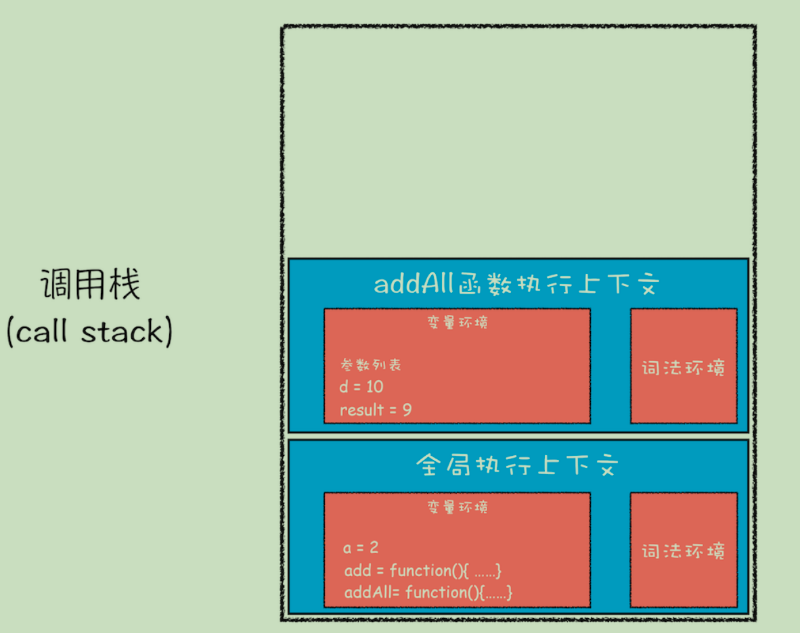

## chrome架构

打开一个chrome网页，如图所示会出现很多线程


首先需要讲解一下 进程和线程

### 进程和线程

- **一个进程就是一个程序的运行实例**
- **线程是不能单独存在的，它是由进程来启动和管理的**
- **线程是依附于进程的，而进程中使用多线程并行处理能提升运算效率**


总结来说，进程和线程之间的关系有以下 4 个特点。

- **1. 进程中的任意一线程执行出错，都会导致整个进程的崩溃。**
- **2. 线程之间共享进程中的数据。**
- **3. 当一个进程关闭之后，操作系统会回收进程所占用的内存(包括泄漏的内存)。**
- **4. 进程之间的内容相互隔离。(通信依靠IPC进程间通信)**

### 浏览器架构发展史

#### 单进程浏览器

**单进程浏览器是指浏览器的所有功能模块都是运行在同一个进程里**


缺点很明显

- 不稳定

  一个插件的意外崩溃会引起整个浏览器的崩溃，除了插件之外，**渲染引擎模块（复杂代码）**也是不稳定的

- 不流畅

  所有页面的渲染模块、JavaScript 执行环境以及插件都是运行在同一个线程中的，这就意味着同一时刻只能有一个模块可以执行

- 不安全

  插件可以使用c++编写，可以轻易访问操作系统

#### 多进程浏览器


多进程浏览器解决了单进程浏览器的几个问题

- 不稳定：由于进程是相互隔离的，所以当一个页面或者插件崩溃时，影响到的仅仅是当前的页面进程或者插件进程，并不会影响到浏览器和其他页面
- 不流畅：每个tab页均有一个渲染进程，JavaScript 也是运行在渲染进程中的，所以即使 JavaScript 阻塞了渲染进程，影响到的也只是当前的渲染页面
- 不安全：安全沙箱，Chrome 把插件进程和渲染进程锁在沙箱里面

多进程浏览器也会有一些问题

- **更高的资源占用：**因为每个进程都会包含公共基础结构的副本（如 JavaScript 运行环

  境），这就意味着浏览器会消耗更多的内存资源。

- **更复杂的体系架构：**浏览器各模块之间耦合性高、扩展性差等问题，会导致现在的架构已

  经很难适应新的需求了。

多进程浏览器包括（浏览器架构持续优化中，仅供参考）:

- **浏览器进程**。主要负责界面显示、用户交互、子进程管理，同时提供存储等功能。
  - 主线程
    - 渲染事件（如解析 DOM、计算布局、绘制）
    - 用户交互事件（如鼠标点击、滚动页面、放大缩小等）
    - JavaScript 脚本执行事件
    - 网络请求完成、文件读写完成事件
    - 垃圾回收
    - 等等
  - 合成线程(动画优化)
  - 光栅化线程池
  - IO 线程
  
- **渲染进程**。核心任务是将 HTML、CSS 和 JavaScript 转换为用户可以与之交互的网页，排版引擎 Blink 和 JavaScript 引擎 V8 都是运行在该进程中，默认情况下，**Chrome 会为每个 Tab 标签创建一个渲染进程**。出于安全考虑，渲染进程都是运行在沙箱模式下。
- **GPU 进程**
- **网络进程**
- **插件进程**

#### tips  合成线程和主线程

[转载](https://www.cnblogs.com/goloving/p/14979318.html)

现代浏览器通常由两个重要的线程组成，这两个线程一起工作完成绘制页面的任务：

- 主线程
- 合成线程

1、主线程需要做的任务如下：

- 运行Javascript
- 计算HTML元素的CSS样式
- layout (relayout)
- 将页面元素绘制成一张或多张位图
- 将位图发送给合成线程

2、合成线程主要任务是：

- 利用GPU将位图绘制到屏幕上
- 让主线程将可见的或即将可见的位图发给自己
- 计算哪部分页面是可见的
- 计算哪部分页面是即将可见的（当你的滚动页面的时候）
- 在你滚动时移动部分页面

　　在很长的一段时间内，主线程都在忙于运行Javascript和绘制大型元素，当它忙碌的时候，它就没空响应用户的输入了。

　　换个角度说，合成线程一直在尝试保证对用户输入的响应。它会在页面改变时每秒绘制60次页面，即使页面还不完整。

　　例如，当用户滚动一个页面时，合成线程会让主线程提供最新的可见部分的页面位图，然而主线程不能及时的响应，这时合成线程不会等待，它会绘制已有的页面位图，对于没有的部分则绘制白屏。

## 网络协议

### 常见网页协议

- **TCP/IP**  是互联网相关的各类协议族的总称
- **IP**（Internet Protocol）网际协议（**网络层协议**）IP 协议的作用是把各种数据包传送给对方。而要保证确实传送到对方 那里，则需要满足各类条件。其中两个重要的条件是 IP 地址和 MAC 地址（Media Access Control Address）
- **HTTP** 超文本传输协议是一个用于传输超媒体文档（例如 HTML）的**应用层协议**。它是为 Web 浏览器与 Web 服务器之间的通信而设计的，但也可以用于其他目的
- **TCP**（Transmission Control Protocol，传输控制协议）是一种面向连接的、可靠的、基于字节流的**传输层通信协议**
- **UDP**（User Data Protocol，用户数据报协议）一个非连接的协议，传输数据之前源端和终端不建立连接， 当它想传送时就简单地去抓取来自应用程序的数据，并尽可能快地把它扔到网络上

### **TCP/IP** 的分层管理

**利用 TCP/IP 协议族进行网络通信时，会通过分层顺序与对方进行通信**


这些层基本上被分为4层：

- 应用层

  - 1、超文本传输协议（**HTTP**):万维网的基本协议
  - 2、文件传输（**FTP**文件传输协议）；
  - 3、远程登录（**Telnet**），提供远程访问其它主机功能, 它允许用户登录internet主机，并在这台主机上执行命令
  - 4、网络管理（**SNMP**简单网络管理协议），该协议提供了监控网络设备的方法， 以及配置管理,统计信息收集,性能管理及安全管理等
  - 5、域名系统（**DNS**），该系统用于在internet中将域名及其公共广播的网络节点转换成IP地址

- 传输层

  - 1、**TCP**
  - 2、**UDP**

- 网络层

  - 1、Internet协议（IP）
  - 2、Internet控制信息协议（ICMP）
  - 3、地址解析协议（ARP）ARP 是一种用以解析地址的协议，根据通信方的 IP 地址就可以反查出对应的 MAC 地址。
  - 4、反向地址解析协议（RARP）

- 链路层

  用来处理连接网络的硬件部分。包括控制操作系统、硬件的设备驱动、NIC（Network Interface Card，网络适配器，即网卡），及光纤等物理可见部分（还包括连接器等一切传输媒介）。硬件上的范畴均在链路层的作用范围之内。
  
  > OSI 七层模型
  
  
  
  > 附图 tcp段，IP分段 HTTP权威指南80页
  
  

### **TCP/IP** 通信传输流

​ 利用 TCP/IP 协议族进行网络通信时，会通过分层顺序与对方进行通信。发送端从应用层往下走，接收端则往应用层往上走。 发送端在层与层之间传输数据时，每经过一层时必定会被打上一个该层所属的首部信息。反之，接收端在层与层传输数据时，每经过一层时会把对应的首部消去。

​ 这种把数据信息包装起来的做法称为**封装**（encapsulate），如下图所示


### TCP


​ 待整理

#### TCP协议的特点

- 面向连接

  面向连接，是指发送数据之前必须在两端建立连接。建立连接的方法是“三次握手”，这样能建立可靠的连接。建立连接，是为数据的可靠传输打下了基础。

- 仅支持单播传输

​  每条TCP传输连接只能有两个端点，只能进行点对点的数据传输，不支持多播和广播传输方式。

- 面向字节流

​  TCP不像UDP一样那样一个个报文独立地传输，而是在不保留报文边界的情况下以字节流方式进行传输。

- 可靠传输

  对于可靠传输，判断丢包，误码靠的是TCP的段编号以及确认号。TCP为了保证报文传输的可靠，就给每个包一个序号，同时序号也保证了传送到接收端实体的包的按序接收。然后接收端实体对已成功收到的字节发回一个相应的确认(ACK)；如果发送端实体在合理的往返时延(RTT)内未收到确认，那么对应的数据（假设丢失了）将会被重传。

- 提供拥塞控制

​  当网络出现拥塞的时候，TCP能够减小向网络注入数据的速率和数量，缓解拥塞

- TCP提供全双工通信

​  TCP允许通信双方的应用程序在任何时候都能发送数据，因为TCP连接的两端都设有缓存，用来临时存放双向通信的数据。当然，TCP可以立即发送一个数据段，也可以缓存一段时间以便一次发送更多的数据段（最大的数据段大小取决于MSS）

### UDP

UDP协议全称是用户数据报协议，在网络中它与TCP协议一样用于处理数据包，是一种无连接的协议。在OSI模型中，在第四层——传输层，处于IP协议的上一层。UDP有不提供数据包分组、组装和不能对数据包进行排序的缺点，也就是说，当报文发送之后，是无法得知其是否安全完整到达的。

它有以下几个特点：

#### 1. 面向无连接

首先 UDP 是不需要和 TCP一样在发送数据前进行三次握手建立连接的，想发数据就可以开始发送了。并且也只是数据报文的搬运工，不会对数据报文进行任何拆分和拼接操作。

具体来说就是：

- 在发送端，应用层将数据传递给传输层的 UDP 协议，UDP 只会给数据增加一个 UDP 头标识下是 UDP 协议，然后就传递给网络层了
- 在接收端，网络层将数据传递给传输层，UDP 只去除 IP 报文头就传递给应用层，不会任何拼接操作

#### 2. 有单播，多播，广播的功能

UDP 不止支持一对一的传输方式，同样支持一对多，多对多，多对一的方式，也就是说 UDP 提供了单播，多播，广播的功能。

#### 3. UDP是面向报文的

发送方的UDP对应用程序交下来的报文，在添加首部后就向下交付IP层。UDP对应用层交下来的报文，既不合并，也不拆分，而是保留这些报文的边界。因此，应用程序必须选择合适大小的报文

#### 4. 不可靠性

首先不可靠性体现在无连接上，通信都不需要建立连接，想发就发，这样的情况肯定不可靠。

并且收到什么数据就传递什么数据，并且也不会备份数据，发送数据也不会关心对方是否已经正确接收到数据了。

再者网络环境时好时坏，但是 UDP 因为没有拥塞控制，一直会以恒定的速度发送数据。即使网络条件不好，也不会对发送速率进行调整。这样实现的弊端就是在网络条件不好的情况下可能会导致丢包，但是优点也很明显，在某些实时性要求高的场景（比如电话会议）就需要使用 UDP 而不是 TCP。


从上面的动态图可以得知，UDP只会把想发的数据报文一股脑的丢给对方，并不在意数据有无安全完整到达。

#### 5. 头部开销小，传输数据报文时是很高效的


UDP 头部包含了以下几个数据：

- 两个十六位的端口号，分别为源端口（可选字段）和目标端口
- 整个数据报文的长度
- 整个数据报文的检验和（IPv4 可选 字段），该字段用于发现头部信息和数据中的错误

因此 UDP 的头部开销小，只有八字节，相比 TCP 的至少二十字节要少得多，在传输数据报文时是很高效的

### TCP与UDP的区别

|              | UDP                                        | TCP                                    |
| ------------ | ------------------------------------------ | -------------------------------------- |
| 是否连接     | 无连接                                     | 面向连接                               |
| 是否可靠     | 不可靠传输，不使用流量控制和拥塞控制       | 可靠传输，使用流量控制和拥塞控制       |
| 连接对象个数 | 支持一对一，一对多，多对一和多对多交互通信 | 只能是一对一通信                       |
| 传输方式     | 面向报文                                   | 面向字节流                             |
| 首部开销     | 首部开销小，仅8字节                        | 首部最小20字节，最大60字节             |
| 适用场景     | 适用于实时应用（IP电话、视频会议、直播等） | 适用于要求可靠传输的应用，例如文件传输 |

### TCP 拥塞控制

拥塞处理和流量控制不同，后者是作用于接收方，保证接收方来得及接受数据。而前者是作用于网络，防止过多的数据拥塞网络，避免出现网络负载过大的情况。

拥塞处理包括了四个算法，分别为：慢开始，拥塞避免，快速重传，快速恢复。

#### 慢开始算法

慢开始算法，顾名思义，就是在传输开始时将发送窗口慢慢指数级扩大，从而避免一开始就传输大量数据导致网络拥塞。

慢开始算法步骤具体如下

1. 连接初始设置拥塞窗口（Congestion Window） 为 1 MSS（一个分段的最大数据量）
2. 每过一个 RTT 就将窗口大小乘二
3. 指数级增长肯定不能没有限制的，所以有一个阈值限制，当窗口大小大于阈值时就会启动拥塞避免算法。

#### 拥塞避免算法

拥塞避免算法相比简单点，每过一个 RTT 窗口大小只加一，这样能够避免指数级增长导致网络拥塞，慢慢将大小调整到最佳值。

在传输过程中可能定时器超时的情况，这时候 TCP 会认为网络拥塞了，会马上进行以下步骤：

- 将阈值设为当前拥塞窗口的一半
- 将拥塞窗口设为 1 MSS
- 启动拥塞避免算法

#### 快速重传

快速重传一般和快恢复一起出现。一旦接收端收到的报文出现失序的情况，接收端只会回复最后一个顺序正确的报文序号（没有 Sack 的情况下）。如果收到三个重复的 ACK，无需等待定时器超时再重发而是启动快速重传。具体算法分为两种：

**TCP Taho 实现如下**

- 将阈值设为当前拥塞窗口的一半
- 将拥塞窗口设为 1 MSS
- 重新开始慢开始算法

**TCP Reno 实现如下**

- 拥塞窗口减半
- 将阈值设为当前拥塞窗口
- 进入快恢复阶段（重发对端需要的包，一旦收到一个新的 ACK 答复就退出该阶段）
- 使用拥塞避免算法

#### TCP New Ren 改进后的快恢复

**TCP New Reno** 算法改进了之前 **TCP Reno** 算法的缺陷。在之前，快恢复中只要收到一个新的 ACK 包，就会退出快恢复。

在 **TCP New Reno** 中，TCP 发送方先记下三个重复 ACK 的分段的最大序号。

假如我有一个分段数据是 1 ~ 10 这十个序号的报文，其中丢失了序号为 3 和 7 的报文，那么该分段的最大序号就是 10。发送端只会收到 ACK 序号为 3 的应答。这时候重发序号为 3 的报文，接收方顺利接收并会发送 ACK 序号为 7 的应答。这时候 TCP 知道对端是有多个包未收到，会继续发送序号为 7 的报文，接收方顺利接收并会发送 ACK 序号为 11 的应答，这时发送端认为这个分段接收端已经顺利接收，接下来会退出快恢复阶段。

## 从输入URL到页面展示，这中间发生了什么


从图中可以看出，**整个过程需要各个进程之间的配合**，首先介绍一下各进程的主要职责

- 浏览器进程主要负责用户交互、子进程管理和文件储存等功能。

- 网络进程是面向渲染进程和浏览器进程等提供网络下载功能。

- 渲染进程的主要职责是把从网络下载的 HTML、JavaScript、CSS、图片等资源解析为可

以显示和交互的页面。

### 渲染流程之前的流程

​ 这个过程可以大致描述为如下。

- 首先，浏览器进程接收到用户输入的 URL 请求，浏览器进程便将该 URL 转发给网络进程。然后，在网络进程中发起真正的 URL 请求。

- 接着网络进程接收到了响应头数据，便解析响应头数据，并将数据转发给浏览器进程。

- 浏览器进程接收到网络进程的响应头数据之后，发送“提交导航 (CommitNavigation)”消息到渲染进程；

- 渲染进程接收到“提交导航”的消息之后，便开始准备接收 HTML 数据，接收数据的方式是直接和网络进程建立数据管道；

- 最后渲染进程会向浏览器进程“确认提交”，这是告诉浏览器进程：“已经准备好接受和解析页面数据了”。

- 浏览器进程接收到渲染进程“提交文档”的消息之后，便开始移除之前旧的文档，然后更新浏览器进程中的页面状态。

### 渲染流程

​ 按照渲染的时间顺序，流水线可分为如下几个子阶段：

#### 构建 DOM 树


​ 构建 DOM 树的**输入内容**是一个非常简单的 HTML 文件，然后经由HTML 解析器解析，最终输出树状结构的 DOM

#### 样式计算

​ 样式计算的目的是为了计算出 DOM 节点中每个元素的具体样式，这个阶段大体可分为三步来完成：

1. 把CSS转换为浏览器能够理解的结构

   > 和 HTML 文件一样，浏览器也是无法直接理解这些纯文本的 CSS 样式，所以**当渲染引擎接**
   >
   > **收到 CSS 文本时，会执行一个转换操作，将 CSS 文本转换为浏览器可以理解的结构——**
   >
   > **styleSheets**。

2. 转换样式表中的属性值，使其标准化

   

   > **需要将所有值转换为渲染引擎容易理解的、标准化的计算值**

3. 计算出 DOM 树中每个节点的具体样式

#### 布局阶段

​ 我们有 DOM 树和 DOM 树中元素的样式，但这还不足以显示页面，因为我们还不知道 DOM 元素的几何位置信息。**那么接下来就需要计算出 DOM 树中可见元素的几何位置，我们把这个计算过程叫做布局**。

​    Chrome 在布局阶段需要完成两个任务：创建布局树和布局计算。

##### 创建布局树n

​ 在显示之前，我们还要额外地构建一棵只包含可见元素布局树。


##### 布局计算

​ **在执行布局操作的时候，会把布局运算的结果重新写回布局树中**，所以布局树既是输入内容也是输出内容，这是布局阶段一个不合理的地方

> 所以在调试台中 经常看到layout之后 在再次update layer tree
>
> 

#### 分层

​ 渲染引擎还需要为特定的节点生成专用的图层，并生成一棵对应的**图层树（LayerTree）**


​ 那么需要满足什么条件，渲染引擎才会为特定的节点创建新的层呢？

- 拥有[层叠上下文](https://developer.mozilla.org/zh-CN/docs/Web/CSS/CSS_Positioning/Understanding_z_index/The_stacking_context)属性的元素会被提升为单独的一层

- 需要剪裁（clip）的地方也会被创建为图层

  > 层叠上下文在css中也是一个很重要的概念，在blog中也有一些相关文章

#### 图层绘制

##### 分析出绘制列表

​ 在完成图层树的构建之后，渲染引擎会对图层树中的每个图层进行绘制。渲染引擎会把一个图层的绘制拆分成很多小的**绘制指令**，然后再把这些指令按照顺序组成一个待绘制列表，如下图所示：


​ 绘制列表只是用来记录绘制顺序和绘制指令的列表，而实际上绘制操作是由渲染引擎中的**合成线程**来完成的。当图层的绘制列表准备好之后，主线程会把该绘制列表**提交（commit）**给合成线程

##### 分块

​ 通常一个页面可能很大，但是用户只能看到其中的一部分，我们把用户可以看到的这个部分叫做**视口**（viewport）。通过视口，用户只能看到页面的很小一部分，所以在这种情况下，要绘制出所有图层内容的话，就会产生太大的开销，而且也没有必要。

​ 基于这个原因，**合成线程会将图层划分为图块（tile）**，这些图块的大小通常是 **256x256** 或者 **512x512**

##### 光栅化raster

​ 合成线程会按照视口附近的图块来优先生成位图，实际生成位图的操作是由栅格化来执行的。所谓**栅格化，是指将图块转换为位图**。

​ 而图块是栅格化执行的最小单位。渲染进程维护了一个栅格化的线程池，所有的图块栅格化都是在线程池内执行的


##### 合成和显示

​ 一旦所有图块都被光栅化，合成线程就会生成一个绘制图块的命令——“DrawQuad”，然后将该命令提交给浏览器进程。

​ 浏览器进程里面有一个叫 viz 的组件，用来接收合成线程发过来的 DrawQuad 命令，然后根据 DrawQuad 命令，将其页面内容绘制到内存中，最后再将内存显示在屏幕上。

#### 渲染流水线大总结


结合上图，一个完整的渲染流程大致可总结为如下：

- 1. 渲染进程将 HTML 内容转换为能够读懂的**DOM 树**结构。
- 2. 渲染引擎将 CSS 样式表转化为浏览器可以理解的**styleSheets**，计算出 DOM 节点的样式。
- 3. 创建**布局树**，并计算元素的布局信息。
  3. 计算结果**重新写入布局树**（我觉得这一步挺重要）
- 4. 对布局树进行分层，并生成**分层树**。
- 5. 为每个图层生成**绘制列表**，并将其提交到合成线程。
- 6. 合成线程将图层分成**图块**，并在**光栅化线程池**中将图块转换成位图。
- 7. 合成线程发送绘制图块命令**DrawQuad**给浏览器进程。
- 8. 浏览器进程根据 DrawQuad 消息**生成页面**，并**显示**到显示器上。

### css和js对dom解析渲染的影响

直接说结论

- css不会阻塞DOM的解析(**document中已存在，只是没有渲染在屏幕上**)，但会阻塞其渲染

  > 样式树 和 dom树 共同决定渲染树，两者可以并行解析，但是dom树必须等样式树解析后才可以合成

- css会阻塞后面JS的的执行

  > 因为js有修改cssom的能力

- JS会阻塞DOM解析和渲染

  > js有修改dom的能力

### 减少白屏时间

​ 如果白屏时间过久，就会影响到用户体验。

​ 为了缩短白屏时间，我们来挨个分析这个阶段的主要任务，包括了**解析 HTML、下载 CSS、下载 JavaScript、生成 CSSOM、执行 JavaScript、生成布局树、绘制页面**一系列操作。

​ 通常情况下的瓶颈主要体现在**下载 CSS 文件、下载 JavaScript 文件和执行 JavaScript**。

​ 所以要想缩短白屏时长，可以有以下策略：

- 通过内联 JavaScript、内联 CSS 来移除这两种类型的文件下载，这样获取到 HTML 文件之后就可以直接开始渲染流程了。
- 但并不是所有的场合都适合内联，那么还可以尽量减少文件大小，比如通过 webpack 等工具移除一些不必要的注释，并压缩 JavaScript 文件。
- 还可以将一些不需要在解析 HTML 阶段使用的 JavaScript 标记上 async 或者 defer。
- 对于大的 CSS 文件，可以通过媒体查询属性，将其拆分为多个不同用途的 CSS 文件，这样只有在特定的场景下才会加载特定的 CSS 文件。

### 回流、重绘、合成

需要补充

[回流重绘](https://juejin.cn/post/6844904083212468238#heading-12)

## 变量提升的本质

### 变量提升

```
showName()
console.log(myname)
var myname = '极客时间'
function showName() {
 console.log('函数 showName 被执行');
}
// 函数 showName 被执行
// undefined
```

最后输出的结果不太符合预期，其中的本质与js的执行过程有关，这种现象被称为变量提升

**所谓的变量提升，是指在 JavaScript 代码执行过程中，JavaScript 引擎把变量的声明部分和函数的声明部分提升到代码开头的“行为”。变量被提升后，会给变量设置默认值，这个默认值就是我们熟悉的 undefined。**

> 声明部分 指 var myname = 这部分 以及 完整的函数声明
>
> var bar = function(){} 这种与var bar = 1 并无大的区别，与function bar(){} 从编译过程来说截然不同

**实际上变量和函数声明在代码里的位置是不会改变的，而且是在编译阶段被 JavaScript 引擎放入内存中**

### 编译过程


从上图可以看出，输入一段代码，经过编译后，会生成两部分内容：**执行上下文（Execution context）和可执行代码**。

> 执行上下文也是一个特别重要的概念，会在后边具体分析

由此不难分析出打印的结果，但是如果存在**相同的命名**怎么处理，可以参考下述规则：

- 如果是同名的函数，JavaScript编译阶段会选择最后声明的那个。
- 如果变量和函数同名，那么在编译阶段，变量的声明会被忽略

总结出两点

- 函数优先级最高
- 靠后的优先级最高

### 执行上下文

#### 基本概念

执行上下文（以下简称“上下文”）的概念在 JavaScript 中是颇为重要的。变量或函数的上下文决定了它们可以访问哪些数据，以及它们的行为。每个上下文都有一个关联的**变量对象**（variable object），而这个上下文中定义的所有变量和函数都存在于这个对象上。

**上下文基本上有三类(包括ES6)**：

- 全局上下文 在浏览器环境下即为window
- 函数上下文（当代码执行流进入函数时，函数的上下文被推到一个上下文栈上。在函数执行完之后，上下文栈会弹出该函数上下文，将控制权返还给之前的执行上下文）
- eval上下文 （不考虑）

> ES6 中的箭头函数并不会创建其自身的执行上下文

上下文中的代码在执行的时候，会创建**变量对象**的一个**作用域链**。

> 作用域链中的下一个变量对象来自包含上下文，再下一个对象来自再下一个包含上下文。以此类推直至全局上下文；全局上下文的变量对象始终是作用域链的最后一个变量对象

#### 函数上下文

**如果上下文是函数，则其活动对象（activation object）用作变量对象，下面以函数为例具体分析一下**

> 为什么称其为活动对象呢，因为只有到当进入一个执行上下文中，这个执行上下文的变量对象才会被激活，并且只有被激活的变量对象，其属性才能被访问。

```
var scope = 'global scope';
function checkscope(s) {  
 var scope = 'local scope';  
 function f() {    
  return scope;
  }  
  return f();
}
checkscope('scope');
```

在执行checkscope函数时，会为其创建执行上下文，并初始化变量对象，此时的变量对象为：

```
VO = {
  arguments: {
    0: 'scope',
    length: 1,
  },
  s: 'scope', // 传入的参数
  f: pointer to function f(),
  scope: undefined, // 此时声明的变量为undefined
}
```

随着checkscope函数的执行，变量对象被激活，变相对象内的属性随着代码的执行而改变：

```
VO = {
  arguments: {
    0: 'scope',
    length: 1,
  },
  s: 'scope', // 传入的参数
  f: pointer to function f(),
  scope: 'local scope', // 变量赋值
}
```

#### 执行上下文的维护

说在执行 JavaScript 时，可能会存在多个执行上下文，那么 JavaScript 引擎是如何管理这些执行上下文的呢？

答案是**通过一种叫栈的数据结构来管理的**。

JavaScript 引擎正是利用栈的这种结构来管理执行上下文的。在执行上下文创建好后，JavaScript 引擎会将执行上下文压入栈中，通常把这种用来管理执行上下文的栈称为**执行上下文栈，又称调用栈**。

看如下代码

```
var a = 2
function add(b,c){
 return b+c
} 
function addAll(b,c){
 var d = 10
 result = add(b,c)
 return a+result+d
}
addAll(3,6)
```

**第一步，创建全局上下文，并将其压入栈底**。


**第二步是调用 addAll 函数**。当调用该函数时，JavaScript 引擎会编译该函数，并为其创建一个执行上下文，最后还将该函数的执行上下文压入栈中，如下图所示：


**第三步，当执行到 add 函数**调用语句时，同样会为其创建执行上下文，并将其压入调用栈，如下图所示：


当 add 函数返回时，该函数的执行上下文就会从栈顶弹出，并将 result 的值设置为 add函数的返回值，也就是 9。如下图所示：



紧接着 addAll 执行最后一个相加操作后并返回，addAll 的执行上下文也会从栈顶部弹出，此时调用栈中就只剩下全局上下文了。最终如下图所示：


至此，整个 JavaScript 流程执行结束了。

> 调用栈的跟踪可以借助chrome调试工具中的call stack 或者借助 console.trace()

#### 解决变量提升的弊端

ES6 通过 let const 解决了变量提升的问题，那么 ES6 又是如何在函数级作用域的基础之上，实现对块级作用域的支持呢？

下面我们来看如下代码

```
function foo() {
  var a = 1
  let b = 2
  {
    let b = 3
    var c = 4
    let d = 5
    console.log(a)
    console.log(b)
  }
  console.log(b)
  console.log(c)
  console.log(d)
}
foo()
```

**第一步是编译并创建执行上下文**，下面是我画出来的执行上下文示意图，你可以参考下：


通过上图，我们可以得出以下结论：

- 函数内部通过 var 声明的变量，在编译阶段全都被存放到**变量环境**里面了。

- 通过 let 声明的变量，在编译阶段会被存放到**词法环境（Lexical Environment）**中。

- 在函数的作用域内部，通过 let 声明的变量并（**暂时**）没有被存放到词法环境中。

接下来，**第二步继续执行代码**，当执行到代码块里面时，变量环境中 a 的值已经被设置成了 1，词法环境中 b 的值已经被设置成了 2，这时候函数的执行上下文就如下图所示：


​ 从图中可以看出，当进入函数的作用域块时，作用域块中通过 let 声明的变量，会被存放在词法环境的一个单独的区域中，这个区域中的变量并不影响作用域块外面的变量，比如在作用域外面声明了变量 b，在该作用域块内部也声明了变量 b，当执行到作用域内部时，它们都是独立的存在。

​ 其实，**在词法环境内部，维护了一个小型栈结构**，栈底是函数最外层的变量，进入一个作用域块后，就会把该作用域块内部的变量压到栈顶；当作用域执行完成之后，该作用域的信息就会从栈顶弹出，这就是词法环境的结构。需要注意下，我这里所讲的变量是指通过 let 或者 const 声明的变量。

​ 再接下来，当执行到作用域块中的console.log(a)这行代码时，就需要在词法环境和变量环境中查找变量 a 的值了，具体查找方式是：沿着词法环境的栈顶向下查询，如果在词法环境中的某个块中查找到了，就直接返回给 JavaScript 引擎，如果没有查找到，那么继续在变量环境中查找。


当作用域块执行结束之后，其内部定义的变量就会从词法环境的栈顶弹出，最终执行上下文

如下图所示：


通过上面的分析，想必你已经理解了词法环境的结构和工作机制，**块级作用域就是通过词法环境的栈结构来实现的，而变量提升是通过变量环境来实现**，通过这两者的结合，JavaScript 引擎也就同时支持了变量提升和块级作用域了。

## 作用域链

### 词法作用域

关于作用域链，和前面的知识关系紧密，这里只要简单的说一些就可以了，看下面的例子

```
function bar() {
 console.log(myName)
}
function foo() {
 var myName = " 极客邦 "
 bar()
} 
var myName = " 极客时间 "
foo()
// 极客时间
```

刚开始学习的时候，我比较疑惑为什么拿不到极客邦，其实重点在于作用域链是基于**词法作用域**

**词法作用域就是指作用域是由代码中函数声明的位置来决定的，和在哪里运行没有什么关系**

### 闭包

老生常谈的概念，在这里仅说一些特殊情形，如有其它，后续补充

#### this会存在闭包吗？

```
var name = "The Window"; 
var object = {     
    name : "My Object", 
    getNameFunc : function(){
        return function(){
            return this.name;
        };     
    } 
}; 
alert(object.getNameFunc()());  //"The Window"（在非严格模式下）
```

> 上述代码，看似利用闭包得到了想要的this指向，实际上并不是
> 每个函数在被调用时都会自动取得两个特殊变量：this 和 arguments。内部函数在搜索这两个变量时，**只会搜索到其活动对象为止**，因此永远不可能直接访问外部函数中的这两个变量

#### 控制台看闭包

一图胜千言


## HTTP的发展史

### http 0.9

​ HTTP/0.9 是于 1991 年提出的，主要用于学术交流，需求很简单——用来在网络之间传递 HTML 超文本的内容，所以被称为**超文本传输协议**

​ 总的来说，当时的需求很简单，就是用来传输体积很小的 HTML 文件，所以 HTTP/0.9 的实现有以下三个特点。

- 第一个是只有一个请求行，并没有**HTTP 请求头和请求体**，因为只需要一个请求行就可以完整表达客户端的需求了。

- 第二个是服务器也没有返回头信息，这是因为服务器端并不需要告诉客户端太多信息，只需要返回数据就可以了。

- 第三个是返回的文件内容是以 ASCII 字符流来传输的，因为都是 HTML 格式的文件，所以使用 ASCII 字节码来传输是最合适的。

### http 1.0

万维网的高速发展带来了很多新的需求，而 HTTP/0.9 已经不能适用新兴网络的发展，所以这时就需要一个新的协议来支撑新兴网络，这就是 HTTP/1.0 诞生的原因。

- 引入了请求头和响应头
  - 多类型数据
  - 压缩方式
  - 用户代理 user-agent
- 引入了状态码
- 引入了cache机制

### http 1.1

不过随着技术的继续发展，需求也在不断迭代更新，很快 HTTP/1.0 也不能满足需求了，所以 HTTP/1.1 又在 HTTP/1.0 的基础之上做了大量的更新

- **改进持久连接**（默认开启），**它的特点是在一个 TCP 连接上可以传输多个 HTTP 请求，只要浏览器或者服务器没有明确断开连接，那么该 TCP 连接会一直保持**。

  > 每个域名最多同时维护 6 个 TCP 持久连接

- **不成熟的 HTTP 管线化**，如果 TCP 通道中的某个请求因为某些原因没有及时返回，那么就会阻塞后面的所有请求，这就是著名的**队头阻塞**的问题

  - HTTP/1.1 中试图通过管线化的技术来解决**队头阻塞**的问题。HTTP/1.1 中的管线化是指将多个 HTTP 请求整批提交给服务器的技术，虽然可以整批发送请求，不过服务器依然需要根据请求顺序来回复浏览器的请求。

    > FireFox、Chrome 都做过管线化的试验，但是由于各种原因，它们最终都放弃了管线化技术。

- **提供虚拟主机的支持**
- **对动态生成的内容提供了完美支持**，HTTP/1.1 通过引入**Chunk transfer 机制**来解决这个问题，最后使用一个零长度的块作为发送数据完成的标志
- **客户端 Cookie、安全机制**

### http 2.0

#### **多路复用**

​ 前面我们分析了 HTTP/1.1 所存在的一些主要问题：慢启动和 TCP 连接之间相互竞争带宽是由于 TCP 本身的机制导致的，而队头阻塞是由于 HTTP/1.1 的机制导致的。

​ HTTP/2 的思路就是**一个域名只使用一个 TCP 长连接来传输数据**，这样整个页面资源的下载过程只需要一次慢启动，同时也避免了多个 TCP 连接竞争带宽所带来的问题

​ 另一个问题就是队头阻塞的问题，等待请求完成后才能去请求下一个资源，这种方式无疑是最慢的，所以 **HTTP/2 需要实现资源的并行请求**，解决了**应用层面的队头阻塞**，也就是任何时候都可以将请求发送给服务器，而并不需要等待其他请求的完成，然后服务器也可以随时返回处理好的请求资源给浏览器


#### http2分帧

##### 帧结构

```
 +-----------------------------------------------+
 |                 Length (24)                   |
 +---------------+---------------+---------------+
 |   Type (8)    |   Flags (8)   |
 +-+-------------+---------------+-------------------------------+
 |R|                 Stream Identifier (31)                      |
 +=+=============================================================+
 |                   Frame Payload (0...)                      ...
 +---------------------------------------------------------------+
复制代码
```

| 名称              | 长度     | 描述                                                         |
| ----------------- | -------- | ------------------------------------------------------------ |
| Length            | 3 字节   | 表示帧负载的长度，取值范围为 （2 的 14 次方）至 （2 的 24 次方 - 1）。（2 的 14 次方） 16384 字节是默认的最大帧大小，如果需要更大的帧，必须在 SETTINGS 帧中设置 |
| Type              | 1 字节   | 当前帧类型（见下表）                                         |
| Flags             | 1 字节   | 具体帧类型的标识                                             |
| R                 | 1 位     | 保留位，不要设置，否则可能会带来严重的后果                   |
| Stream Identifier | 31 位    | 每个流的唯一 ID                                              |
| Frame Payload     | 长度可变 | 真实的帧内容，长度是在 Length 字段中设置的                   |

由于  HTTP/2 是分帧的，请求和响应都可以多路复用，有助于解决类似类似队头阻塞的问题。

##### 帧类型

| 名称          | ID   | 描述                                     |
| ------------- | ---- | ---------------------------------------- |
| DATA          | 0x0  | 传输流的核心内容                         |
| HEADERS       | 0x1  | 包含 HTTP 首部，和可选的优先级参数       |
| PRIORITY      | 0x2  | 指示或更改流的优先级和依赖               |
| RST_STREAM    | 0x3  | 允许一端停止流（通常由于错误导致的）     |
| SETTINGS      | 0x4  | 协商连接级参数                           |
| PUSH_PROMISE  | 0x5  | 提示客户端，服务器要推送些东西           |
| PING          | 0x6  | 测试连接可用性和往返时延（RTT）          |
| GOAWAY        | 0x7  | 告诉另一端，当前的端已结束               |
| WINDOW_UPDATE | 0x8  | 协商一端将要接收多少字节（用于流量控制） |
| CONTINUATION  | 0x9  | 用以扩展 HEADERS 模块                    |

#### **HTTP/2** **其他特性**

- 可以设置请求优先级
- 服务器推送
- 头部压缩

### 队头阻塞

#### 应用层面

在 **HTTP/1.1** 中使用持久连接时，虽然能公用一个 TCP 管道，但是在一个管道中同一时刻只能处理一个请求，在当前的请求没有结束之前，其他的请求只能处于阻塞状态。

http 2通过对请求和响应进行编号的方式，实现资源并行请求解决了这个问题

#### TCP层面

##### http 1.1


通过上图你会发现，从一端发送给另外一端的数据会被拆分为一个个按照顺序排列的数据包，这些数据包通过网络传输到了接收端，接收端再按照顺序将这些数据包组合成原始数据，这样就完成了数据传输。

不过，如果在数据传输的过程中，有一个数据因为网络故障或者其他原因而丢包了，那么整个 TCP 的连接就会处于暂停状态，需要等待丢失的数据包被重新传输过来。你可以把 TCP连接看成是一个按照顺序传输数据的管道，管道中的任意一个数据丢失了，那之后的数据都需要等待该数据的重新传输。为了直观理解，你可以参考下图：


我们就把**在 TCP 传输过程中，由于单个数据包的丢失而造成的阻塞称为 TCP 上的队头阻塞**。

##### http 2.0

那队头阻塞是怎么影响 HTTP/2 传输的呢？首先我们来看正常情况下 HTTP/2 是怎么传输多路请求的，为了直观理解，你可以参考下图：


**通过该图，我们知道在 HTTP/2 中，多个请求是跑在一个 TCP 管道中的，如果其中任意一路数据流中出现了丢包的情况，那么就会阻塞该 TCP 连接中的所有请求。这不同于HTTP/1.1，使用 HTTP/1.1 时，浏览器为每个域名开启了 6 个 TCP 连接，如果其中的 1个 TCP 连接发生了队头阻塞，那么其他的 5 个连接依然可以继续传输数据。**

所以随着丢包率的增加，HTTP/2 的传输效率也会越来越差。有测试数据表明，当系统达到了 2% 的丢包率时，HTTP/1.1 的传输效率反而比 HTTP/2 表现得更好。

## 浏览器安全

浏览器安全可以分为三大块——**Web 页面安全、浏览器网络安全**和**浏览器系统安全**

### web页面安全

在没有安全保障的 Web 世界中，我们是没有隐私的，因此需要安全策略来保障我们的隐私和数据的安全。

#### 同源策略

在页面中最基础、最核心的安全策略：**[同源策略](https://developer.mozilla.org/zh-CN/docs/Web/Security/Same-origin_policy)（Same-origin policy），**如果两个 URL 的协议、域名和端口都相同，我们就称这两个 URL 同源，两个不同的源之间若想要相互访问资源或者操作 DOM，那么会有一套基础的安全策略的制约，我们把这称为同源策略。

下表给出了与 URL `http://store.company.com/dir/page.html` 的源进行对比的示例:


具体来讲，同源策略主要表现在 DOM、Web 数据和网络这三个层面：

- **DOM 层面**。同源策略限制了来自不同源的 JavaScript 脚本对当前 DOM 对象读和写的操作。

- **数据层面**。同源策略限制了不同源的站点读取当前站点的 Cookie、IndexDB、LocalStorage 等数据

- **网络层面**。同源策略限制了通过 XMLHttpRequest 等方式将站点的数据发送给不同源的站点

#### **安全和便利性的权衡**

​ 安全性和便利性是相互对立的，让不同的源之间绝对隔离，无疑是最安全的措施，但这也会使得 Web 项目难以开发和使用，因此浏览器就要在这之间做出权衡，出让一些安全性来满足灵活性：

- **页面中可以嵌入第三方资源**
- **跨域资源共享和跨文档消息机制**
  - **跨域资源共享（CORS）**
  - **跨文档消息机制** postMessage

#### xss csrf

在前端安全中有详细介绍
