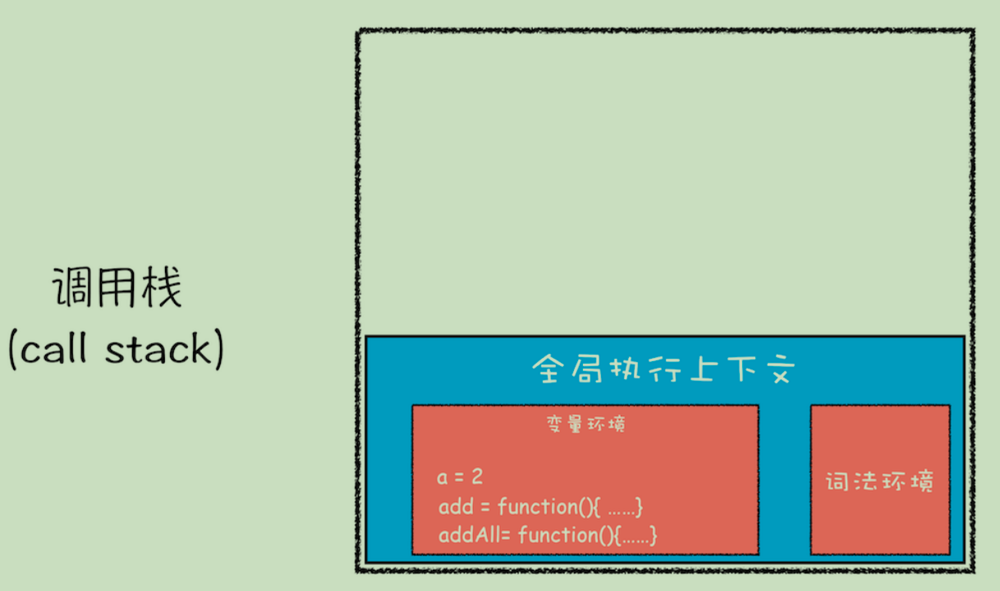
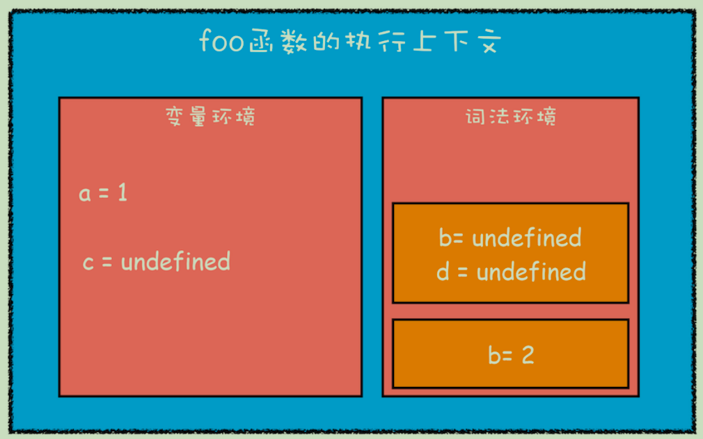

## chrome架构

打开一个chrome网页，如图所示会出现很多线程


首先需要讲解一下 进程和线程

### 进程和线程

- **一个进程就是一个程序的运行实例**
- **线程是不能单独存在的，它是由进程来启动和管理的**
- **线程是依附于进程的，而进程中使用多线程并行处理能提升运算效率**


总结来说，进程和线程之间的关系有以下 4 个特点。

- **1. 进程中的任意一线程执行出错，都会导致整个进程的崩溃。**
- **2. 线程之间共享进程中的数据。**
- **3. 当一个进程关闭之后，操作系统会回收进程所占用的内存(包括泄漏的内存)。**
- **4. 进程之间的内容相互隔离。(通信依靠IPC进程间通信)**

### 浏览器架构发展史

#### 单进程浏览器

**单进程浏览器是指浏览器的所有功能模块都是运行在同一个进程里**


缺点很明显

- 不稳定

  一个插件的意外崩溃会引起整个浏览器的崩溃，除了插件之外，**渲染引擎模块（复杂代码）**也是不稳定的

- 不流畅

  所有页面的渲染模块、JavaScript 执行环境以及插件都是运行在同一个线程中的，这就意味着同一时刻只能有一个模块可以执行

- 不安全

  插件可以使用c++编写，可以轻易访问操作系统

#### 多进程浏览器


多进程浏览器解决了单进程浏览器的几个问题

- 不稳定：由于进程是相互隔离的，所以当一个页面或者插件崩溃时，影响到的仅仅是当前的页面进程或者插件进程，并不会影响到浏览器和其他页面
- 不流畅：每个tab页均有一个渲染进程，JavaScript 也是运行在渲染进程中的，所以即使 JavaScript 阻塞了渲染进程，影响到的也只是当前的渲染页面
- 不安全：安全沙箱，Chrome 把插件进程和渲染进程锁在沙箱里面

多进程浏览器也会有一些问题

- **更高的资源占用：**因为每个进程都会包含公共基础结构的副本（如 JavaScript 运行环

  境），这就意味着浏览器会消耗更多的内存资源。

- **更复杂的体系架构：**浏览器各模块之间耦合性高、扩展性差等问题，会导致现在的架构已

  经很难适应新的需求了。

多进程浏览器包括（浏览器架构持续优化中，仅供参考）:

- **浏览器进程**。主要负责界面显示、用户交互、子进程管理，同时提供存储等功能。

- **渲染进程**。核心任务是将 HTML、CSS 和 JavaScript 转换为用户可以与之交互的网页，排版引擎 Blink 和 JavaScript 引擎 V8 都是运行在该进程中，默认情况下，**Chrome 会为每个 Tab 标签创建一个渲染进程**。出于安全考虑，渲染进程都是运行在沙箱模式下。

- **GPU 进程**

- **网络进程**

- **插件进程**

## 网络协议

### 常见网页协议

	-  **TCP/IP**  是互联网相关的各类协议族的总称
	-  **IP**（Internet Protocol）网际协议（**网络层协议**）IP 协议的作用是把各种数据包传送给对方。而要保证确实传送到对方 那里，则需要满足各类条件。其中两个重要的条件是 IP 地址和 MAC 地址（Media Access Control Address）
	-  **HTTP** 超文本传输协议是一个用于传输超媒体文档（例如 HTML）的**应用层协议**。它是为 Web 浏览器与 Web 服务器之间的通信而设计的，但也可以用于其他目的
	-  **TCP**（Transmission Control Protocol，传输控制协议）是一种面向连接的、可靠的、基于字节流的**传输层通信协议**
	-  **UDP**（User Data Protocol，用户数据报协议）一个非连接的协议，传输数据之前源端和终端不建立连接， 当它想传送时就简单地去抓取来自应用程序的数据，并尽可能快地把它扔到网络上

###  **TCP/IP** 的分层管理 

**利用 TCP/IP 协议族进行网络通信时，会通过分层顺序与对方进行通信**


这些层基本上被分为4层：

- 应用层

  - 1、超文本传输协议（**HTTP**):万维网的基本协议
  - 2、文件传输（FTP文件传输协议）；
  - 3、远程登录（Telnet），提供远程访问其它主机功能, 它允许用户登录internet主机，并在这台主机上执行命令
  - 4、网络管理（SNMP简单网络管理协议），该协议提供了监控网络设备的方法， 以及配置管理,统计信息收集,性能管理及安全管理等
  - 5、域名系统（**DNS**），该系统用于在internet中将域名及其公共广播的网络节点转换成IP地址

- 传输层

  - 1、**TCP**
  - 2、**UDP**

- 网络层

  - 1、Internet协议（**IP**）
  - 2、Internet控制信息协议（ICMP）
  - 3、地址解析协议（*ARP*）ARP 是一种用以解析地址的协议，根据通信方的 IP 地址就可以反查出对应的 MAC 地址。
  - 4、反向地址解析协议（RARP）

- 链路层

  用来处理连接网络的硬件部分。包括控制操作系统、硬件的设备驱 动、NIC（Network Interface Card，网络适配器，即网卡），及光纤等 物理可见部分（还包括连接器等一切传输媒介）。硬件上的范畴均在 链路层的作用范围之内。 

### **TCP/IP** 通信传输流 

​	利用 TCP/IP 协议族进行网络通信时，会通过分层顺序与对方进行通信。发送端从应用层往下走，接收端则往应用层往上走。 发送端在层与层之间传输数据时，每经过一层时必定会被打上一个该 层所属的首部信息。反之，接收端在层与层传输数据时，每经过一层时会把对应的首部消去。 

​	这种把数据信息包装起来的做法称为**封装**（encapsulate），如下图所示


### TCP与UDP的区别

**需要补充**

## 从输入URL到页面展示，这中间发生了什么


从图中可以看出，**整个过程需要各个进程之间的配合**，首先介绍一下各进程的主要职责

- 浏览器进程主要负责用户交互、子进程管理和文件储存等功能。

- 网络进程是面向渲染进程和浏览器进程等提供网络下载功能。

- 渲染进程的主要职责是把从网络下载的 HTML、JavaScript、CSS、图片等资源解析为可

以显示和交互的页面。

### 渲染流程之前的流程

​	这个过程可以大致描述为如下。

- 首先，浏览器进程接收到用户输入的 URL 请求，浏览器进程便将该 URL 转发给网络进程。然后，在网络进程中发起真正的 URL 请求。

- 接着网络进程接收到了响应头数据，便解析响应头数据，并将数据转发给浏览器进程。

- 浏览器进程接收到网络进程的响应头数据之后，发送“提交导航 (CommitNavigation)”消息到渲染进程；

- 渲染进程接收到“提交导航”的消息之后，便开始准备接收 HTML 数据，接收数据的方式是直接和网络进程建立数据管道；

- 最后渲染进程会向浏览器进程“确认提交”，这是告诉浏览器进程：“已经准备好接受和解析页面数据了”。

- 浏览器进程接收到渲染进程“提交文档”的消息之后，便开始移除之前旧的文档，然后更新浏览器进程中的页面状态。

### 渲染流程

​	按照渲染的时间顺序，流水线可分为如下几个子阶段：

#### 构建 DOM 树


​	构建 DOM 树的**输入内容**是一个非常简单的 HTML 文件，然后经由HTML 解析器解析，最终输出树状结构的 DOM

#### 样式计算

​	样式计算的目的是为了计算出 DOM 节点中每个元素的具体样式，这个阶段大体可分为三步来完成：

1. 把CSS转换为浏览器能够理解的结构

   > 和 HTML 文件一样，浏览器也是无法直接理解这些纯文本的 CSS 样式，所以**当渲染引擎接**
   >
   > **收到 CSS 文本时，会执行一个转换操作，将 CSS 文本转换为浏览器可以理解的结构——**
   >
   > **styleSheets**。

2. 转换样式表中的属性值，使其标准化

   

   > **需要将所有值转换为渲染引擎容易理解的、标准化的计算值**

3. 计算出 DOM 树中每个节点的具体样式

#### 布局阶段

​	我们有 DOM 树和 DOM 树中元素的样式，但这还不足以显示页面，因为我们还不知道 DOM 元素的几何位置信息。**那么接下来就需要计算出 DOM 树中可见元素的几何位置，我们把这个计算过程叫做布局**。

​    Chrome 在布局阶段需要完成两个任务：创建布局树和布局计算。

##### 创建布局树

​	在显示之前，我们还要额外地构建一棵只包含可见元素布局树。


##### 布局计算

​	在执行布局操作的时候，会把布局运算的结果重新写回布局树中，所以布局树既是输入内容也是输出内容，这是布局阶段一个不合理的地方

#### 分层

​	渲染引擎还需要为特定的节点生成专用的图层，并生成一棵对应的**图层树（LayerTree）**


​	那么需要满足什么条件，渲染引擎才会为特定的节点创建新的层呢？

- 拥有[层叠上下文](https://developer.mozilla.org/zh-CN/docs/Web/CSS/CSS_Positioning/Understanding_z_index/The_stacking_context)属性的元素会被提升为单独的一层

- 需要剪裁（clip）的地方也会被创建为图层

  > 层叠上下文在css中也是一个很重要的概念，在blog中也有一些相关文章

#### 图层绘制

##### 	分析出绘制列表

​	在完成图层树的构建之后，渲染引擎会对图层树中的每个图层进行绘制。渲染引擎会把一个图层的绘制拆分成很多小的**绘制指令**，然后再把这些指令按照顺序组成一个待绘制列表，如下图所示：


​	绘制列表只是用来记录绘制顺序和绘制指令的列表，而实际上绘制操作是由渲染引擎中的**合成线程**来完成的。当图层的绘制列表准备好之后，主线程会把该绘制列表**提交（commit）**给合成线程

##### 分块

​	通常一个页面可能很大，但是用户只能看到其中的一部分，我们把用户可以看到的这个部分叫做**视口**（viewport）。通过视口，用户只能看到页面的很小一部分，所以在这种情况下，要绘制出所有图层内容的话，就会产生太大的开销，而且也没有必要。

​	基于这个原因，**合成线程会将图层划分为图块（tile）**，这些图块的大小通常是 **256x256** 或者 **512x512**

##### 光栅化raster

​	合成线程会按照视口附近的图块来优先生成位图，实际生成位图的操作是由栅格化来执行的。所谓**栅格化，是指将图块转换为位图**。

​	而图块是栅格化执行的最小单位。渲染进程维护了一个栅格化的线程池，所有的图块栅格化都是在线程池内执行的


##### 合成和显示

​	一旦所有图块都被光栅化，合成线程就会生成一个绘制图块的命令——“DrawQuad”，然后将该命令提交给浏览器进程。

​	浏览器进程里面有一个叫 viz 的组件，用来接收合成线程发过来的 DrawQuad 命令，然后根据 DrawQuad 命令，将其页面内容绘制到内存中，最后再将内存显示在屏幕上。

#### 渲染流水线大总结


结合上图，一个完整的渲染流程大致可总结为如下：

- 1. 渲染进程将 HTML 内容转换为能够读懂的**DOM 树**结构。
- 2. 渲染引擎将 CSS 样式表转化为浏览器可以理解的**styleSheets**，计算出 DOM 节点的样式。
- 3. 创建**布局树**，并计算元素的布局信息。
- 4. 对布局树进行分层，并生成**分层树**。 
- 5. 为每个图层生成**绘制列表**，并将其提交到合成线程。
- 6. 合成线程将图层分成**图块**，并在**光栅化线程池**中将图块转换成位图。
- 7. 合成线程发送绘制图块命令**DrawQuad**给浏览器进程。
- 8. 浏览器进程根据 DrawQuad 消息**生成页面**，并**显示**到显示器上。

### 回流、重绘、合成

需要补充

## 变量提升的本质

### 变量提升

```
showName()
console.log(myname)
var myname = '极客时间'
function showName() {
	console.log('函数 showName 被执行');
}
// 函数 showName 被执行
// undifined
```

最后输出的结果不太符合预期，其中的本质与js的执行过程有关，这种现象被称为变量提升

**所谓的变量提升，是指在 JavaScript 代码执行过程中，JavaScript 引擎把变量的声明部分和函数的声明部分提升到代码开头的“行为”。变量被提升后，会给变量设置默认值，这个默认值就是我们熟悉的 undefined。**

> 声明部分 指 var myname = 这部分 以及 完整的函数声明
>
> var bar = function(){} 这种与var bar = 1 并无大的区别，与funtion bar(){} 从编译过程来说截然不同

**实际上变量和函数声明在代码里的位置是不会改变的，而且是在编译阶段被 JavaScript 引擎放入内存中**

### 编译过程


从上图可以看出，输入一段代码，经过编译后，会生成两部分内容：**执行上下文（Execution context）和可执行代码**。

> 执行上下文也是一个特别重要的概念，会在后边具体分析

由此不难分析出打印的结果，但是如果存在**相同的命名**怎么处理，可以参考下述规则：

- 如果是同名的函数，JavaScript编译阶段会选择最后声明的那个。

- 如果变量和函数同名，那么在编译阶段，变量的声明会被忽略

### 执行上下文

#### 基本概念

执行上下文（以下简称“上下文”）的概念在 JavaScript 中是颇为重要的。变量或函数的上下文决定了它们可以访问哪些数据，以及它们的行为。每个上下文都有一个关联的**变量对象**（variable object），而这个上下文中定义的所有变量和函数都存在于这个对象上。

**上下文基本上有三类(包括ES6)**：

- 全局上下文 在浏览器环境下即为window
- 函数上下文（当代码执行流进入函数时，函数的上下文被推到一个上下文栈上。在函数执行完之后，上下文栈会弹出该函数上下文，将控制权返还给之前的执行上下文）
- eval上下文 （不考虑）

> ES6 中的箭头函数并不会创建其自身的执行上下文

上下文中的代码在执行的时候，会创建**变量对象**的一个**作用域链**。

> 作用域链中的下一个变量对象来自包含上下文，再下一个对象来自再下一个包含上下文。以此类推直至全局上下文；全局上下文的变量对象始终是作用域链的最后一个变量对象

#### 函数上下文

**如果上下文是函数，则其活动对象（activation object）用作变量对象，下面以函数为例具体分析一下**

> 为什么称其为活动对象呢，因为只有到当进入一个执行上下文中，这个执行上下文的变量对象才会被激活，并且只有被激活的变量对象，其属性才能被访问。

```
var scope = 'global scope';
function checkscope(s) {  
	var scope = 'local scope';  
	function f() {    
		return scope;
  }  
  return f();
}
checkscope('scope');
```

在执行checkscope函数之前，会为其创建执行上下文，并初始化变量对象，此时的变量对象为：

```
VO = {
  arguments: {
    0: 'scope',
    length: 1,
  },
  s: 'scope', // 传入的参数
  f: pointer to function f(),
  scope: undefined, // 此时声明的变量为undefined
}
```

随着checkscope函数的执行，变量对象被激活，变相对象内的属性随着代码的执行而改变：

```
VO = {
  arguments: {
    0: 'scope',
    length: 1,
  },
  s: 'scope', // 传入的参数
  f: pointer to function f(),
  scope: 'local scope', // 变量赋值
}
```

#### 执行上下文的维护

说在执行 JavaScript 时，可能会存在多个执行上下文，那么 JavaScript 引擎是如何管理这些执行上下文的呢？

答案是**通过一种叫栈的数据结构来管理的**。

JavaScript 引擎正是利用栈的这种结构来管理执行上下文的。在执行上下文创建好后，JavaScript 引擎会将执行上下文压入栈中，通常把这种用来管理执行上下文的栈称为**执行上下文栈，又称调用栈**。

看如下代码

```
var a = 2
function add(b,c){
	return b+c
} 
function addAll(b,c){
	var d = 10
	result = add(b,c)
	return a+result+d
}
addAll(3,6)
```

**第一步，创建全局上下文，并将其压入栈底**。


**第二步是调用 addAll 函数**。当调用该函数时，JavaScript 引擎会编译该函数，并为其创建一个执行上下文，最后还将该函数的执行上下文压入栈中，如下图所示：


**第三步，当执行到 add 函数**调用语句时，同样会为其创建执行上下文，并将其压入调用栈，如下图所示：


当 add 函数返回时，该函数的执行上下文就会从栈顶弹出，并将 result 的值设置为 add函数的返回值，也就是 9。如下图所示：


紧接着 addAll 执行最后一个相加操作后并返回，addAll 的执行上下文也会从栈顶部弹出，此时调用栈中就只剩下全局上下文了。最终如下图所示：



至此，整个 JavaScript 流程执行结束了。

> 调用栈的跟踪可以借助chorme调试工具中的call stack 或者借助 console.trace()

#### 解决变量提升的弊端

ES6 通过 let const 解决了变量提升的问题，那么 ES6 又是如何在函数级作用域的基础之上，实现对块级作用域的支持呢？

下面我们来看如下代码

```
function foo() {
  var a = 1
  let b = 2
  {
    let b = 3
    var c = 4
    let d = 5
    console.log(a)
    console.log(b)
  }
  console.log(b)
  console.log(c)
  console.log(d)
}
foo()
```

**第一步是编译并创建执行上下文**，下面是我画出来的执行上下文示意图，你可以参考下：


通过上图，我们可以得出以下结论：

- 函数内部通过 var 声明的变量，在编译阶段全都被存放到**变量环境**里面了。

- 通过 let 声明的变量，在编译阶段会被存放到**词法环境（Lexical Environment）**中。

- 在函数的作用域内部，通过 let 声明的变量并（**暂时**）没有被存放到词法环境中。

接下来，**第二步继续执行代码**，当执行到代码块里面时，变量环境中 a 的值已经被设置成了 1，词法环境中 b 的值已经被设置成了 2，这时候函数的执行上下文就如下图所示：



​	从图中可以看出，当进入函数的作用域块时，作用域块中通过 let 声明的变量，会被存放在词法环境的一个单独的区域中，这个区域中的变量并不影响作用域块外面的变量，比如在作用域外面声明了变量 b，在该作用域块内部也声明了变量 b，当执行到作用域内部时，它们都是独立的存在。

​	其实，**在词法环境内部，维护了一个小型栈结构**，栈底是函数最外层的变量，进入一个作用域块后，就会把该作用域块内部的变量压到栈顶；当作用域执行完成之后，该作用域的信息就会从栈顶弹出，这就是词法环境的结构。需要注意下，我这里所讲的变量是指通过 let 或者 const 声明的变量。

​	再接下来，当执行到作用域块中的console.log(a)这行代码时，就需要在词法环境和变量环境中查找变量 a 的值了，具体查找方式是：沿着词法环境的栈顶向下查询，如果在词法环境中的某个块中查找到了，就直接返回给 JavaScript 引擎，如果没有查找到，那么继续在变量环境中查找。


当作用域块执行结束之后，其内部定义的变量就会从词法环境的栈顶弹出，最终执行上下文

如下图所示：


通过上面的分析，想必你已经理解了词法环境的结构和工作机制，**块级作用域就是通过词法环境的栈结构来实现的，而变量提升是通过变量环境来实现**，通过这两者的结合，JavaScript 引擎也就同时支持了变量提升和块级作用域了。

## 作用域链

### 词法作用域

关于作用域链，和前面的知识关系紧密，这里只要简单的说一些就可以了，看下面的例子

```
function bar() {
	console.log(myName)
}
function foo() {
	var myName = " 极客邦 "
	bar()
} 
var myName = " 极客时间 "
foo()
// 极客时间
```

刚开始学习的时候，我比较疑惑为什么拿不到极客邦，其实重点在于作用域链是基于**词法作用域**

**词法作用域就是指作用域是由代码中函数声明的位置来决定的，和在哪里运行没有什么关系**

### 闭包

老生常谈的概念，在这里仅说一些特殊情形，如有其它，后续补充

#### this会存在闭包吗？

```
var name = "The Window"; 
var object = {     
    name : "My Object", 
    getNameFunc : function(){
        return function(){
            return this.name;
        };     
    } 
}; 
alert(object.getNameFunc()());  //"The Window"（在非严格模式下）
```
> 上述代码，看似利用闭包得到了想要的this指向，实际上并不是
> 每个函数在被调用时都会自动取得两个特殊变量：this 和 arguments。内部函数在搜索这两个变量时，**只会搜索到其活动对象为止**，因此永远不可能直接访问外部函数中的这两个变量

#### 控制台看闭包

一图胜千言


