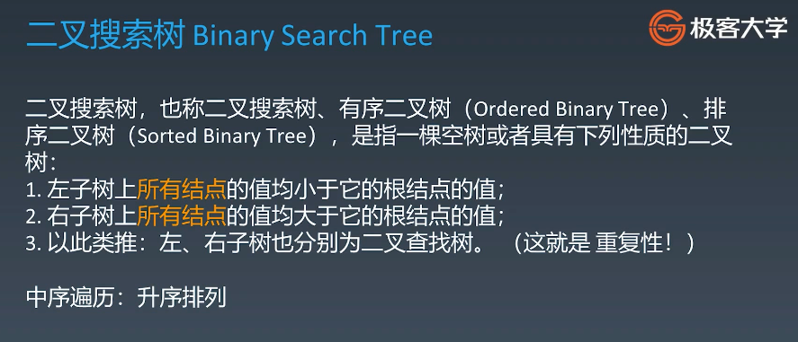
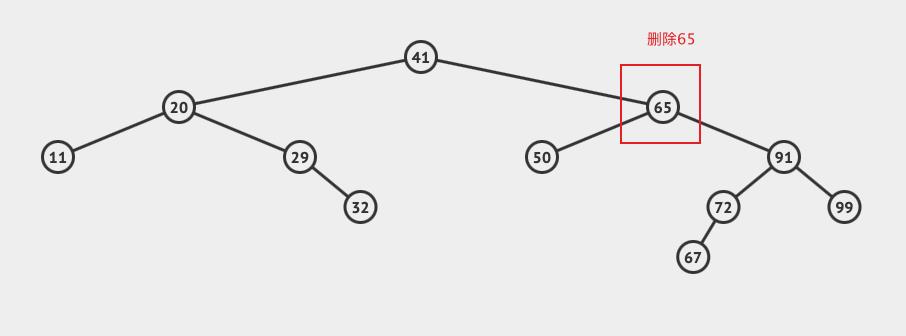
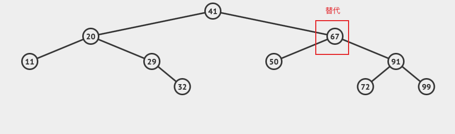
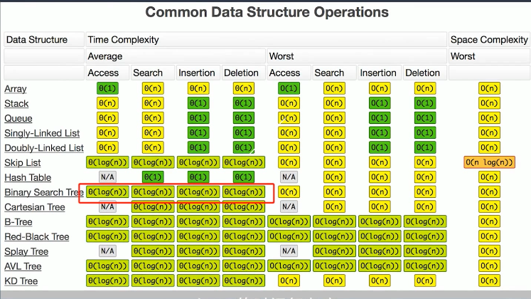

### 二叉搜索树

### 常见操作

​	模拟操作示意网站[二叉搜索树](https://visualgo.net/zh/bst)

- 查询

- 插入

  首先需要搜索是否有重复节点，如果有 count++ ，如果没有，查询到的最后节点也就是插入需要操作的节点

- 删除

  - 删除 叶子节点(即最底层的节点，仅有一个关联节点)很简单，直接删除就可以，如果是关联节点(有子节点)，则会找出该节点右侧最小的节点替换它的位置（即比它大的最小值），**需要注意指针的替换和删除**

  

  

### 时间复杂度

时间复杂度log2 N 也就是 2的X次方 = N  x是查询次数

插入 一个数 首先需要搜索是否有重复节点，如果有 count++ ，如果没有，查询到的最后节点也就是插入需要操作的节点

删除 叶子节点(即最底层的节点，仅有一个关联节点)很简单，直接删除就可以，如果是