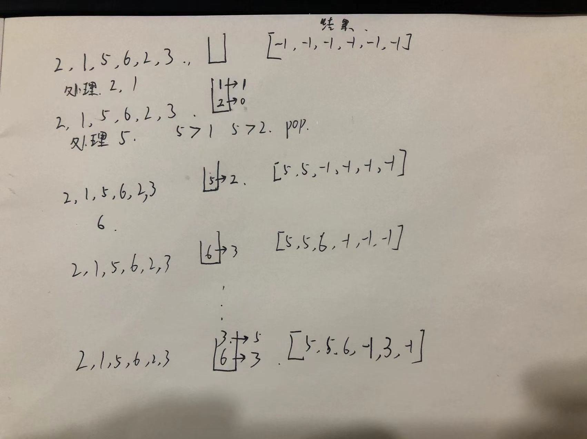
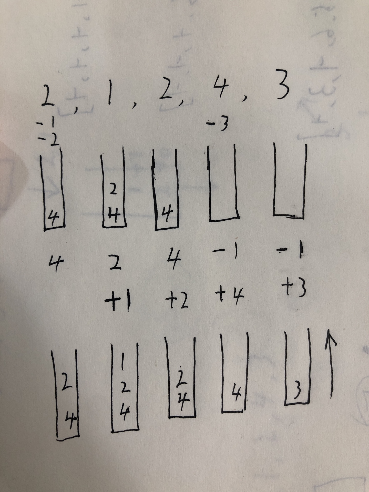

单调栈实际上就是栈，只是利用了一些巧妙的逻辑，使得每次新元素入栈后，栈内的元素都保持有序（单调递增或单调递减）。

听起来有点像堆（heap）？不是的，单调栈用途不太广泛，只处理一种典型的问题，叫做 Next Greater Element。

### 先来一道基础题

```
给一个数组，返回一个大小相同的数组。返回的数组的第i个位置的值应当是，对于原数组中的第i个元素，至少往右走多少步，才能遇到一个比自己大的元素（如果之后没有比自己大的元素，或者已经是最后一个元素，则在返回数组的对应位置放上-1）。

例如给定数组为：[2,1,5,6,2,3]
返回数组应该为：[2,1,1,-1,1,-1]
```

#### 正序

建议自己再画一遍示意图，根据代码画，还是比较容易理解的

```
const arr1 = [2, 1, 5, 6, 2, 3];
function countSteps(arr) {
  // 用栈存储下标
  const stack = [];
  const result = Array(arr.length).fill(-1);
  for (let i = 0; i < arr.length; i++) {
    while (stack.length && arr[i] > arr[stack[stack.length - 1]]) {
      result[stack.pop()] = arr[i];
    }
    stack.push(i);
  }
  return result;
}

console.log(countSteps(arr1));
[ 5, 5, 6, -1, 3, -1 ]
```



#### 倒叙

这个讲的比较好，[labuladong](https://mp.weixin.qq.com/s?__biz=MzAxODQxMDM0Mw==&mid=2247484525&idx=1&sn=3d2e63694607fec72455a52d9b15d4e5&chksm=9bd7fa65aca073734df90b45054448e09c14e6e35ad7b778bff62f9bd6c2b4f6e1ca7bc4f844&scene=21#wechat_redirect)

倒叙好像是不用记录下标，因为倒叙处理，每到一个元素，**它的结果都会在此轮遍历中确定，和正序不同**，再多理解理解

```
const arr2 = [2, 1, 2, 4, 3];
function nextBigElement(arr) {
  const stack = []
  const result = []
  for (let i = arr.length-1; i >=0; i--) {
    while (stack.length && arr[i] >= stack[stack.length-1]) {
      stack.pop()
    }
    result[i] = stack.length ? stack[stack.length - 1] : -1
    stack.push(arr[i])
  }
  return result
}
console.log(nextBigElement(arr2));
```



#### 正序和倒序的一些区别

- 确定值的时机不同
  - 倒序在每一轮循环中都可以确认
  - 正序只会在pop时确认
  - 由此造成书写结构和逻辑有些许差异

### 496.下一个更大元素I

给你两个 没有重复元素 的数组 nums1 和 nums2 ，其中nums1 是 nums2 的子集。

请你找出 nums1 中每个元素在 nums2 中的下一个比其大的值。

nums1 中数字 x 的下一个更大元素是指 x 在 nums2 中对应位置的右边的第一个比 x 大的元素。如果不存在，对应位置输出 -1 。

示例 1

```
输入: nums1 = [4,1,2], nums2 = [1,3,4,2].
输出: [-1,3,-1]
解释:
    对于 num1 中的数字 4 ，你无法在第二个数组中找到下一个更大的数字，因此输出 -1 。
    对于 num1 中的数字 1 ，第二个数组中数字1右边的下一个较大数字是 3 。
    对于 num1 中的数字 2 ，第二个数组中没有下一个更大的数字，因此输出 -1 。
```

示例 2:

```
输入: nums1 = [2,4], nums2 = [1,2,3,4].
输出: [3,-1]
解释:
    对于 num1 中的数字 2 ，第二个数组中的下一个较大数字是 3 。
    对于 num1 中的数字 4 ，第二个数组中没有下一个更大的数字，因此输出 -1 。
```

来源：力扣（LeetCode）
链接：https://leetcode-cn.com/problems/next-greater-element-i
著作权归领扣网络所有。商业转载请联系官方授权，非商业转载请注明出处。

#### 我的解法

这道题和基础题基本上一致，多了一个映射的过程

```
var nextGreaterElement = function(nums1, nums2) {
  const map = new Map();
  // 存储数值 而不是位置 因为没有重复元素
  const stack = [];
  for(let i=0;i<nums2.length;i++){
    // 出栈条件
    while(stack.length && nums2[i] > stack[stack.length-1]) {
      map.set(stack.pop(), nums2[i])
    }
    stack.push(nums2[i])
  }
  return nums1.map(item => {
    const r = map.get(item);
    return r?r:-1
  })
};
```

### 739.每日温度

```
请根据每日 气温 列表 temperatures ，请计算在每一天需要等几天才会有更高的温度。如果气温在这之后都不会升高，请在该位置用 0 来代替。

示例 1:
输入: temperatures = [73,74,75,71,69,72,76,73]
输出: [1,1,4,2,1,1,0,0]

```

这里以正序和倒序各写一次，方便理解记忆

正序

```
var dailyTemperatures = function(temperatures) {
	// 需要预先设置查找不到的情况
	const r = Array(temperatures.length).fill(0)
	// 栈底到栈顶单调递减 **可以等于**
  const stack = []
  // 正序
  for(let i=0;i<temperatures.length;i++){
  	// 当栈不为空 且 当前温度大于栈顶温度
    while(stack.length && temperatures[i] > temperatures[stack[stack.length-1]]){
    	// 当前温度大于栈顶温度，即找到了栈顶元素 对应的 符合条件的元素
    	// 弹出栈顶 并记录下标
      const index = stack.pop()
      // 记录栈顶元素的对应的天数
      r[index] = i - index
    }
    // 当栈为空 或者 当前元素**小于等于** 栈顶元素时 入栈
    stack.push(i)
  }
  return r
};
```

倒序

```
var dailyTemperatures = function(temperatures) {
  const r = []
  const s = []
  // 倒序
  for(let i=temperatures.length-1;i>=0;i--){
  	// 当栈不为空 且 当前元素**大于等于**栈顶元素
    while(s.length && temperatures[i] >= temperatures[s[s.length-1]]){
      s.pop()
    }
    r[i] = s.length ? s[s.length-1] - i : 0
    s.push(i)
  }
  return r
};
```

**差异性**

- 赋值
  - **倒序**遍历在while外，每轮遍历赋值一次
  - **正序**每次pop赋值，需要提前准备默认值
- 大小比较
  - 倒序**大于等于**
  - 正序**大于**

### 503.下一个更大元素 II 循环数组

给定一个循环数组（最后一个元素的下一个元素是数组的第一个元素），输出每个元素的下一个更大元素。数字 x 的下一个更大的元素是按数组遍历顺序，这个数字之后的第一个比它更大的数，这意味着你应该循环地搜索它的下一个更大的数。如果不存在，则输出 -1。

```
示例 1:

输入: [1,2,1]
输出: [2,-1,2]
解释: 第一个 1 的下一个更大的数是 2；
数字 2 找不到下一个更大的数； 
第二个 1 的下一个最大的数需要循环搜索，结果也是 2。

```

#### 最简单的方式，拼接一个数组在后边

```
var nextGreaterElements = function(nums) {
  const arr = nums.concat(nums)
  const res = []
  const stack = []
  for(let i=arr.length-1;i>=0;i--){
    while(stack.length && arr[i] >= stack[stack.length-1]){
      stack.pop()
    }
    res[i] = stack.length ? stack[stack.length-1] : -1
    stack.push(arr[i])
  }
  return res.slice(0, nums.length)
};
```

这种方式，时间复杂度和空间复杂度都比较高

#### 利用取余 `%`

减少了空间复杂度，利用 **`%`** 模拟循环数组

```
var nextGreaterElements = function(nums) {
  const result = []
  const stack = []
  const n = nums.length
  for(let i=2*n-1;i>=0;i--){
    while(stack.length && nums[i%n] >= stack[stack.length-1]){
      stack.pop()
    }
    result[i%n] = stack.length ? stack[stack.length-1] : -1
    stack.push(nums[i%n])
  }
  return result
};
```

### 316.去除重复字符串

建议参考 [labuladong](https://mp.weixin.qq.com/s?__biz=MzAxODQxMDM0Mw==&mid=2247486946&idx=1&sn=94804eb15be33428582544a1cd90da4d&chksm=9bd7f3eaaca07afc6fdfa94d05fa3007d9ecc54914a238e6deabeafd5032a299155505b40f2d&scene=21#wechat_redirect)

```
// 困难题
var s = "bcabc"
function handle(string) {
  const stack = []
  const map = new Map()
  const countMap = Object.create(null, {})
  for (let i = 0; i < string.length; i++) {
    const s = string[i];
    if (countMap[s]) {
      countMap[s]++
    } else {
      countMap[s] = 1
    }
  }
  for (let i = 0; i < string.length; i++) {
    const s = string[i]
    // 何时减法 很重要 重点理解
    countMap[s]--
    // 后边可以删除的
    if (map.has(s)) {
      continue
    }
    // 如果charcode码较小 会把栈顶元素(后面存在重复的) pop掉  
    // 既保证了顺序 也不会删除只有一个的元素
    while (stack.length && stack[stack.length - 1].charCodeAt(0) > string.charCodeAt(i)) {
      if (countMap[stack[stack.length - 1]] === 0) {
        break;
      }
      map.delete(stack.pop())
    }
    map.set(s, true)
    stack.push(s)   
  }
  return stack
}
console.log(handle(s));
```

