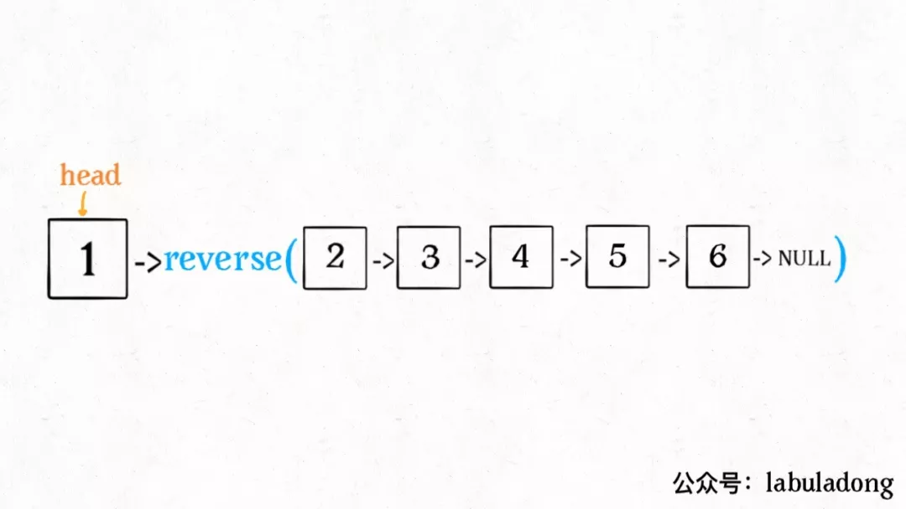
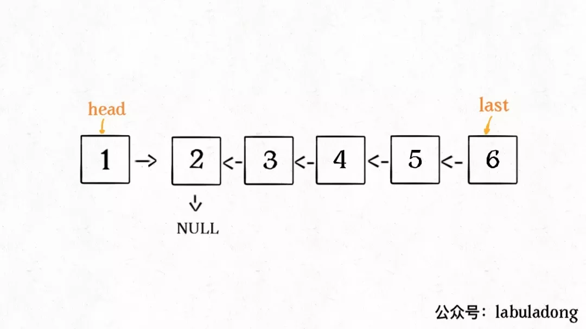
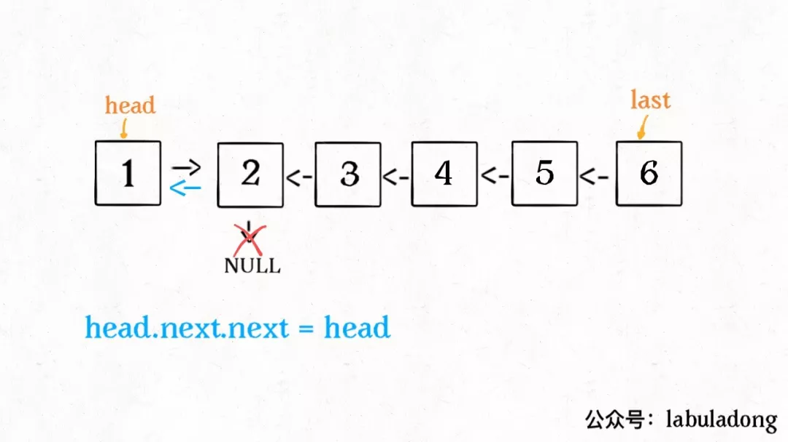
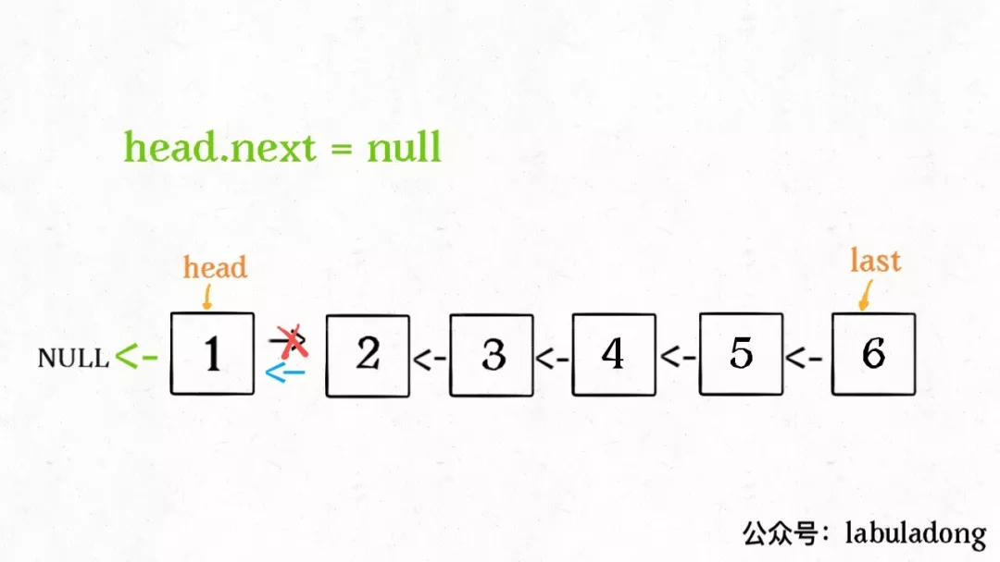

### 206.反转链表 -简单

#### 迭代方法

使用迭代方法，我可以做出来，但是不太完美，代码不够精简

##### 自己的代码

````
var reverseList = function(head) {
    if(!head){ // 这个判断多余了
        return head
    }
    let prev = null // 这个利用了哨兵，简化了判断
    while(head){ // 判断条件很重要
        const next = head.next
        head.next = prev
        if(!next){
            return head
        }
        prev = head
        head = next
    }
    return head // return pre 就不用判断next了
};
````

##### 优秀代码

```
var reverseList = function (head) {
    var pre = null, cur = head, next;
    while (cur) { // 用cur取代head 迭代过程更加清晰
      next = cur.next;
      cur.next = pre;
      
      pre = cur;
      cur = next;
    }
    return pre;
  }; 
```

少了两步判断，注意细节

#### 递归方法

##### 自己的代码

条件重复了

```
var reverseList = function(head) {
    if(!head){ // 这个其实和下边的条件重复了
        return head
    }
    return df(null, head)
    function df(prev, cur){
        if(!cur){
            return prev
        }else{
            const next = cur.next
            cur.next = prev
            return df(cur, next)
        }
    }
};
```

##### 优秀代码

```
var reverseList = function (head) {
  function df(pre, cur) {
    if (cur === null) {
      return pre;
    } else {
      var temp = cur.next;
      cur.next = pre;
      return df(cur, temp);
    }
  }
  return df(null, head);
};
```

##### 单参数递归-==需要重点理解==

可以被称为前置递归，而上边那种可以叫做后置递归

这种递归处理 从尾部开始处理，一步步向头部靠近，不太容易理解，需要重点关注

```
var reverseList = function (head) {
 function df(head) {
    if (!head || head.next === null) {
      return head;
    }
    const last = df(head.next)
    head.next.next = head
    head.next = null
    return last
  }
  return df(head);
};
```

> 这个算法常常拿来显示递归的巧妙和优美

###### 重点理解

这个方法很难理解，一篇文章写的很好[labuladong](https://mp.weixin.qq.com/s?__biz=MzAxODQxMDM0Mw==&mid=2247484467&idx=1&sn=beb3ae89993b812eeaa6bbdeda63c494&chksm=9bd7fa3baca0732dc3f9ae9202ecaf5c925b4048514eeca6ac81bc340930a82fc62bb67681fa&scene=21#wechat_redirect)，在这里摘抄一部分重要的内容

###### 原文如下

这个算法可能很多读者都听说过，这里详细介绍一下，先直接看实现代码：

```
ListNode reverse(ListNode head) {
    if (head.next == null) return head;
    ListNode last = reverse(head.next);
    head.next.next = head;
    head.next = null;
    return last;
}
```

看起来是不是感觉不知所云，完全不能理解这样为什么能够反转链表？这就对了，这个算法常常拿来显示递归的巧妙和优美，我们下面来详细解释一下这段代码。

**==对于递归算法，最重要的就是明确递归函数的定义==**。

除原文之外，还有几个容易遗漏而且比较**重要的点**

- **last的指向一直未变**
- **函数的截止条件和只有一个listNode的情况一样**（也许这也是递归的魅力吧）
- **head的指向由于是栈结构，所以前置运行的时候head是倒着的**
- **前置递归能不能看成是一种倒叙迭代呢？，利用栈的特效进行倒叙操作**

具体来说，我们的`reverse`函数定义是这样的：

**输入一个节点`head`，将「以`head`为起点」的链表反转，并返回反转之后的头结点**。

明白了函数的定义，再来看这个问题。比如说我们想反转这个链表：


那么输入`reverse(head)`后，会在这里进行递归：

```
ListNode last = reverse(head.next);
```

不要跳进递归（你的脑袋能压几个栈呀？），而是要根据刚才的函数定义，来弄清楚这段代码会产生什么结果：



按照定义，这个`reverse(head.next)`执行完成后，整个链表应该变成了这样：



并且根据函数定义，`reverse`函数会返回反转之后的头结点，我们用变量`last`接收了。

现在再来看下面的代码：

```
head.next.next = head;
```



接下来进行的操作：

```
head.next = null;
return last;
```



神不神奇，这样整个链表就反转过来了！递归代码就是这么简洁优雅，不过其中有两个地方需要注意：

**1、递归函数要有 base case**，也就是这句：

```
if (head.next == null) return head;
```

意思是如果链表只有一个节点的时候反转也是它自己，直接返回即可。

**2、当链表递归反转之后，新的头节点是`last`，而之前的`head`变成了最后一个节点，别忘了链表的末尾要指向 null：**

```
head.next = null;
```

###### 总结一下

虽然按照他的说法，代码理解起来确实简单了一些，但是怎么把代码写出来是个问题。

针对过程做一个代码示意

```
// 1->2->3->4->5->null
var reverseList = function (head) {
 function df(head) {
    if (!head || head.next === null) {
      return head;
    }
    const last = df(head.next)
    head.next.next = head
    head.next = null
    return last
  }
  return df(head);
};
// 模拟代码运行步骤
df(1)
df(2)
df(3)
df(4)
df(5) // 满足条件 开始return 开始运行df函数后面的代码
// 第一次执行df后代码
// last 5
// head 4->5->null 
head.next.next = head // 5->4 
head.next = null // 4->null
// 执行完成后
// last 5->4->null
return last 

// 第二次执行
// last 5->4->null
// head 3->4
head.next.next = head // 4->3
head.next = null // 3->null
// 执行完成后
// last 5->4->3->null
return last

// 第三次执行
// last 5->4->3->null
// head 2->3
head.next.next = head // 3->2
head.next = null // 2->null
// 执行完成后
// last 5->4->3->2->null
return last

// 第四次执行
// last 5->4->3->2->null
// head 1->2
head.next.next = head // 2->1
head.next = null // 1->null
// 执行完成后
// last 5->4->3->2->1->null
return last
// 整体结束
```

### 92.反转链表2 困难

官方头穿法容易理解，labuladong 公众号文章 较难理解

#### 自己的代码

虽然头穿法理解起来容易，但是写起来需要仔细和不断试错，还需要照顾边界情况

代码中需要注意一下几点

- 使用了哨兵，方便left为1的情况，使用了哨兵，返回的时候需要注意处理
- cur情况不同 赋值的方式也不同

```
var reverseBetween = function(head, left, right) {
    const dmNode = new ListNode(-1, head)
    let cur = dmNode
    let pre = null
    let leftNode = null
    let index = 0
    while(cur){
      if(index === right+1){
        break;
      }
      if(index===left-1){
        leftNode = cur
        pre = cur.next

        cur = cur.next
      }else if(index > left){
        const leftNodeNext = leftNode.next
        pre.next = cur.next
        leftNode.next = cur
        cur.next = leftNodeNext
        cur = pre.next
      }else{
        cur = cur.next
      }
      index++
      
    }
    return dmNode.next
};
```

#### 优秀代码

官方代码 采取的分断式处理-for循环分段，逻辑较为清晰，ye

```
var reverseBetween = function(head, left, right) {
    // 设置 dummyNode 是这一类问题的一般做法
    const dummy_node = new ListNode(-1);
    dummy_node.next = head;
    let pre = dummy_node;
    for (let i = 0; i < left - 1; ++i) {
        pre = pre.next;
    }

    let cur = pre.next;
    for (let i = 0; i < right - left; ++i) {
        const next = cur.next;
        cur.next = next.next;
        next.next = pre.next;
        pre.next = next;
    }
    return dummy_node.next;
};

作者：LeetCode-Solution
链接：https://leetcode-cn.com/problems/reverse-linked-list-ii/solution/fan-zhuan-lian-biao-ii-by-leetcode-solut-teyq/
来源：力扣（LeetCode）
著作权归作者所有。商业转载请联系作者获得授权，非商业转载请注明出处。
```

### 234.如何判断回文链表

#### 自己的代码

缺点无法提前结束

时间 空间都是O n

```
var isPalindrome = function (head) {
  let left = right = head;
  let flag = true
  function df(head){
    if(!head){
      return head
    }
    df(head.next)
    if(head.val !== left.val){
      flag = false
      return 
    }
    left = left.next
  }
  df(right)
  return flag
};
```

#### 双指针

通过双指针判断中间节点，翻转后半段并进行比较

时间 空间都是O n

```
var isPalindrome = function (head) {
 // 特殊情况
  if(!head || !head.next){
    return true
  }
  let slow = fast = head;
  while (fast && fast.next) {
    slow = slow.next
    fast = fast.next.next
  }
  // 区别单双链表
  if (fast !== null) {
    slow = slow.next
  }
  let right = reserve(slow)
  // 注意结束条件 right比较短
  while (right) {
    if (right.val !== head.val) {
      return false
    }
    right = right.next
    head = head.next
  }
  return true
};

function reserve(head) {
  if (!head.next) {
    return head
  }
  const newHead = reserve(head.next)
  head.next.next = head
  head.next = null
  return newHead
}
```

### 142.环形链表 2

#### 利用hash可以很方便的解决

```
var detectCycle = function(head) {
    const set = new Set();
    while(head && !set.has(head)){
      set.add(head)
      head = head.next
    }
    return head
};
```

> 这里和回文链表不一样，没有比较listNode.val

#### 利用快慢指针

条件放的位置需要格外注意

```
var detectCycle = function(head) {
    let slow = fast = head;
    while(fast && fast.next){
      slow = slow.next
      fast = fast.next.next
      // 刚开始位置放错了
      if(slow === fast){
        break;
      }
    }
    if(!fast || !fast.next){
      return null
    }
    slow = head
    while(slow !== fast){
      slow = slow.next
      fast = fast.next
    }
    return slow
};
```

#### 快慢指针可行性推导

<https://leetcode-cn.com/problems/linked-list-cycle-ii/solution/huan-xing-lian-biao-ii-by-leetcode-solution/>

```
解释：为何慢指针第一圈走不完一定会和快指针相遇, 很精彩的推论
 首先，第一步，快指针先进入环 
 第二步：当慢指针刚到达环的入口时，快指针此时在环中的某个位置(也可能此时相遇) 
 第三步：设此时快指针和慢指针距离为x，若在第二步相遇，则x = 0； 
 第四步：设环的周长为n，那么看成快指针追赶慢指针，需要追赶n-x； 
 第五步：快指针每次都追赶慢指针1个单位，设慢指针速度1/s，快指针2/s，那么追赶需要(n-x)s 
 第六步：在n-x秒内，慢指针走了n-x单位，因为x>=0，则慢指针走的路程小于等于n，即走不完一圈就和快指针相遇
```

### 剑指offer II 023

自己的代码,暴力法 Om*n，这里需要注意一个细节，内层while需要重置条件，可能是for循环用多了

```
var getIntersectionNode = function(headA, headB) {
    let pA = headA,pB;
    while(pA){
      pB = headB
      while(pB){
        if(pB === pA){
          console.log(pA)
          return pA;
        }
        pB = pB.next
      }
      pA = pA.next
    }
    return null
}
```

官方解法，建议看[题解](https://leetcode-cn.com/problems/3u1WK4/solution/tu-jie-shuang-zhi-zhen-javascript-by-lzx-i6yo/)

```
const getIntersectionNode = (A, B) => {
    let pA = A,
        pB = B;
    while (pA !== pB) {
        pA = pA === null ? B : pA.next;
        pB = pB === null ? A : pB.next;
    }
    return pA;
};
```
