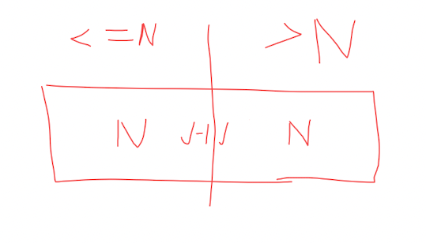
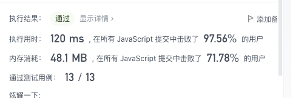
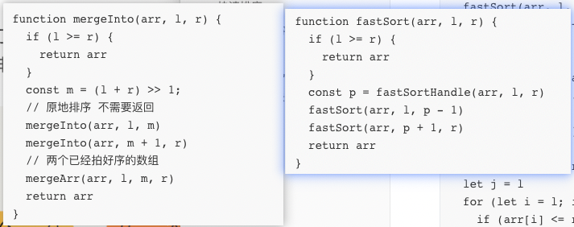
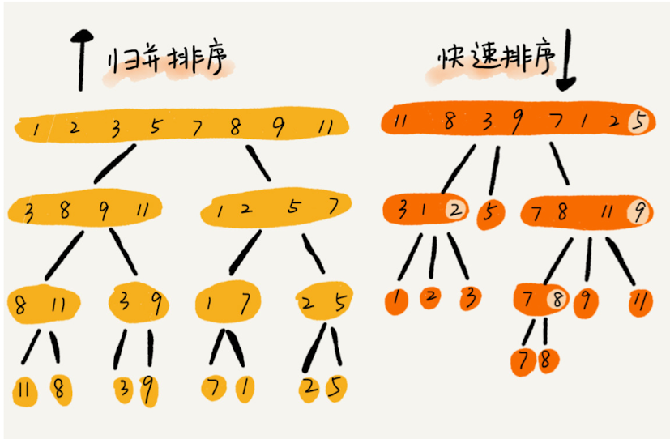

简单记录学习极客时间-数据与结构之美-排序相关的知识记录

### tips

排序动画演示 可用手机app

## 时间复杂度 On2

### 冒泡排序

冒泡排序只会操作相邻的两个数据。每次冒泡操作都会对相邻的两个元素进行比较，看是否 满足大小关系要求。如果不满足就让它俩互换。一次冒泡会让至少一个元素移动到它应该在 的位置，重复 n 次，就完成了 n 个数据的排序工作。

冒泡排序最不容易出错。

```
const arr = [4,5,2,3,8,7,6,1,10]
function bubble(arr) {
  const l = arr.length
  for (let i = 0; i < l - 1; i++) {
    // 没有交换发生 其实代表数组已经是有序的了
    let flag = true;
    for (let j = i + 1; j < arr.length; j++) {
      if (arr[i] > arr[j]) {
        const temp = arr[i]
        arr[i] = arr[j]
        arr[j] = temp
        // 有交换发生
        flag = false;
      }
    }
    if (flag) {
      break;
    }
  }
}
bubble(arr)
console.log(arr);
```

### 插入排序

首先，我们将数组中的数据分为两个区间，已排序区间和未排序区间。初始已排序区间只有 一个元素，就是数组的第一个元素。插入算法的核心思想是取未排序区间中的元素，在已排 序区间中找到合适的插入位置将其插入，并保证已排序区间数据一直有序。重复这个过程， 直到未排序区间中元素为空，算法结束。

**插入排序写起来比较费劲，要注意的地方比较多**

我自己的写的

```
function insert(arr) {
  const l = arr.length
  for (let i = 0; i < l - 1; i++) {
    let j = i + 1
    while (arr[j-1] > arr[j] && j>=0) {
      const temp = arr[j]
      arr[j] = arr[j-1]
      arr[j-1] = temp
      j--
    }
  }
}
insert(arr)
```

教程写的，已经换成JavaScript，并加了注释

```
function insert2(arr) {
  const l = arr.length;
  for (let i = 1; i < l; ++i) {
    // 缓存当前处理的元素，减少交换次数 
    let value = arr[i];
    // 对比前方排序区，查找插入的位置
    let j = i - 1;
    for ( ; j >= 0; --j) {
      if (arr[j] > value) {
        // 相当于把arr[j]向右移一位
        // 第一次被覆盖掉的元素是当前处理元素，已在顶部缓存
        // 第一次以后被覆盖的元素，实际上已经保存在右侧了
        arr[j + 1] = arr[j]; // 数据移动
      } else {
        // 当前元素已经满足条件，不需要交换
        break;
      }
    }
    // 只在最后交换 j+1 
    arr[j + 1] = value; // 插入数据
  }
}
```


### 选择排序

```
function select(arr) {
  const l = arr.length
  let min, minIndex
  for (let i = 0; i < l - 1; i++) {
  	// 起始位置
    min = arr[i]
    minIndex = i
    for (let j = i+1; j < l; j++) {
      if (arr[j] < min) {
        min = arr[j]
        minIndex = j
      }
    }
    const temp = arr[i]
    arr[i] = min
    arr[minIndex] = temp
  }
}
// select(arr)
console.log(arr);
```

## 时间复杂度 O nlogn

### 归并排序

自己的代码，未优化的版本，找了好久的错误

```
// 归并排序
function merginInto(arr, l, r) {
  if (l === r) {
    return arr
  }
  const m = (l + r) >> 1
  const left = arr.slice(l, m + 1)
  const right = arr.slice(m + 1, r + 1)
  return sortOrderArr(
    left.length <= 1 ? left: merginInto(
    	// 忘了把边界改成新数组的了
      left, 0, m
    ),
    right.length <= 1 ? right : merginInto(
      // 忘了把边界改成新数组的了
      right, 0, r - (m + 1)
    )
  )
}
// 将两个有序数组合并
function sortOrderArr(arr1, arr2) {
  const res = []
  let i1 = i2 = 0, l1 = arr1.length, l2 = arr2.length
  while (i1<l1 || i2<l2) {
    if (i1 === l1) {
      res.push(arr2[i2++])
    } else if(i2===l2) {
      res.push(arr1[i1++])
    }else if (arr1[i1] <= arr2[i2]) {
      res.push(arr1[i1++])
    }else(
      res.push(arr2[i2++])
    )
  }
  return res
}
```

比较大众的写法，**这个类似于二叉树的后续遍历**

```
function mergeInto(arr, l, r) {
  if (l >= r) {
    return arr
  }
  const m = (l + r) >> 1;
  // 原地排序 不需要返回
  mergeInto(arr, l, m)
  mergeInto(arr, m + 1, r)
  // 两个已经拍好序的数组
  mergeArr(arr, l, m, r)
  return arr
}
function mergeArr(arr, l, m, r) {
  const res = []
  let i1 = l, i2 = m + 1, l1 = m+1, l2 = r+1
  while (i1<l1 || i2<l2) {
    if (i1 === l1) {
      res.push(arr[i2++])
    } else if(i2===l2) {
      res.push(arr[i1++])
    }else if (arr[i1] <= arr[i2]) {
      res.push(arr[i1++])
    }else(
      res.push(arr[i2++])
    )
  }
  for (let i = l,j=0; i < r+1; i++,j++) {
    arr[i] = res[j]
  }
}
```

### 快速排序

**把比参考位置小的数移到左侧，大的移到右侧，如果不额外占用空间的话，比较难写**

空间复杂度 O n 比较容易写出来

```
function fastSort(arr, l, r) {
  if (l >= r) {
    return arr
  }
  const p = fastSortHandle(arr, l, r)
  fastSort(arr, l, p - 1)
  fastSort(arr, p + 1, r)
  return arr
}
// 快排辅助函数 分区 排序
function fastSortHandle(arr, l, r) {
	// 占用了 On的空间
  const res = []
  //随机会好一点
  const rdm = Math.floor(Math.random()*(r-l+1)+l)
  const ref = arr[rdm]
  let li = l, ri = r
  for (let i = l; i < r + 1; i++) {
    if (i === rdm) {
      continue
    }
    if (arr[i] <= ref) {
      res[li] = arr[i]
      li++
    } else {
      res[ri] = arr[i]
      ri--
    }
  }
  res[ri] = ref
  for (let i = l; i < r+1; i++) {
    arr[i] = res[i]
  }
  return ri
}
```


#### O1空间复杂度左右归类的算法解释

```
function fastSortHandle(arr, l, r) {
  // const rdm = Math.floor(Math.random()*(r-l+1)+l)
  const rdm = 1
  const ref = arr[rdm]
  let j = l
  for (let i = l; i < r + 1; i++) {
    // 跳过
    if (i === rdm) {
      continue;
    }
    // 跳过
    if (j === rdm) {
      j++
    }
    if (arr[i] <= ref) {
      [arr[i], arr[j]] = [arr[j], arr[i]]
      j++
    }
  }
  if (rdm < j) {
    j--
  }
  [arr[rdm], arr[j]] = [arr[j], arr[rdm]]
  return j
}
```

当选择一个随机数N，下标INDEX作为参照点的话，程序运行到关键点的情况应该如下图所示

左侧是小于等于N的数，右侧是大于N的数，但是N可能在左侧或者右侧



最好的情况就是 把N的位置放进 j-1 和 j之间，但是这样**时间复杂度较高，采取交换替代**

如果N在左侧就和`J-1`交换，N在右侧就和`J`置换，如果不需要随机选择位置的话，N取最右侧元素，就不需要判断了

```
if (rdm < j) {
    j--
  }
  
  [arr[rdm], arr[j]] = [arr[j], arr[rdm]]
  return j
```

#### 更好的随机数左右归类

[力扣官方](https://leetcode-cn.com/problems/sort-an-array/solution/pai-xu-shu-zu-by-leetcode-solution/)采取先用随机数与最后一位交换位置在进行常规方法，方法容易理解，也不容易出错

```
		int partition(vector<int>& nums, int l, int r) {
        int pivot = nums[r];
        int i = l - 1;
        for (int j = l; j <= r - 1; ++j) {
            if (nums[j] <= pivot) {
                i = i + 1;
                swap(nums[i], nums[j]);
            }
        }
        swap(nums[i + 1], nums[r]);
        return i + 1;
    }
    int randomized_partition(vector<int>& nums, int l, int r) {
        int i = rand() % (r - l + 1) + l; // 随机选一个作为我们的主元
        swap(nums[r], nums[i]);
        return partition(nums, l, r);
    }
```

最后总结出JavaScript版本的快速排序



```
function fastSort(arr, l, r) {
  if (l >= r) {
    return arr
  }
  const p = fastSortHandle(arr, l, r)
  // -1 +1 可别忘 会死循环的
  fastSort(arr, l, p - 1)
  fastSort(arr, p + 1, r)
  return arr
}
function fastSortHandle(arr, l, r) {
  const rdm = Math.floor(Math.random() * (r - l + 1) + l)
  // 与最后元素交换
  swap(arr, rdm, r)

  const ref = arr[r]
  let j = l
  for (let i = l; i < r; i++) {
    if (arr[i] <= ref) {
      swap(arr, i, j)
      j++
    }
  }
  swap(arr, r, j)
  return j
}
function swap(arr, p, q) {
  const temp = arr[p]
  arr[p] = arr[q]
  arr[q] = temp
}
```

### 归并排序和快速排序的区别与联系



快排和归并用的都是分治思想，递推公式和递归代码也非常相似，那它们的区别在哪里呢?

可以发现，归并排序的处理过程是由下到上的，先处理子问题，然后再合并。

而快排正好相反，它的处理过程是由上到下的，先分区，然后再处理子问题。

归并排序虽然是稳定的、时 间复杂度为 O(nlogn) 的排序算法，但是它是非原地排序算法。我们前面讲过，归并之所以 是非原地排序算法，主要原因是合并函数无法在原地执行。快速排序通过设计巧妙的原地分区函数，可以实现原地排序，解决了归并排序占用太多内存的问题。

