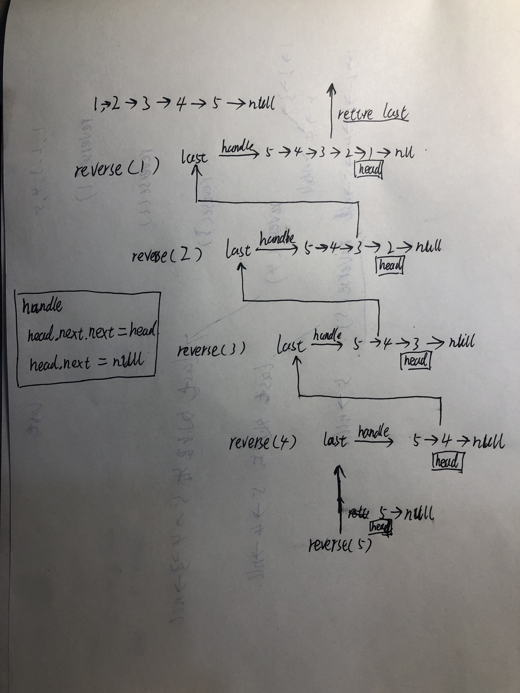
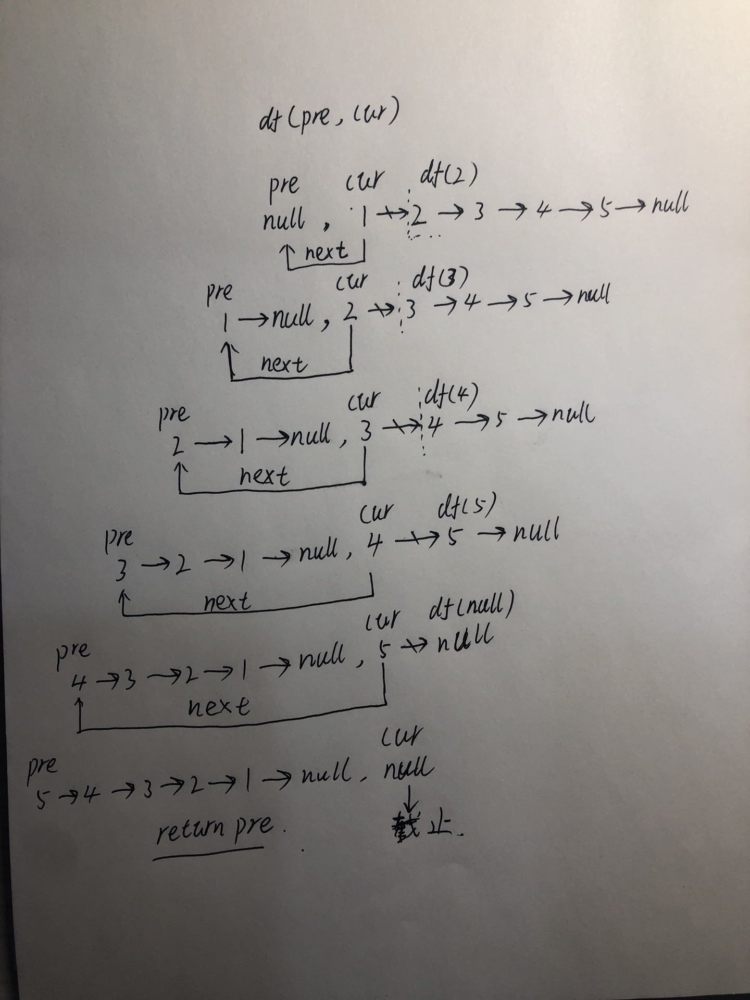
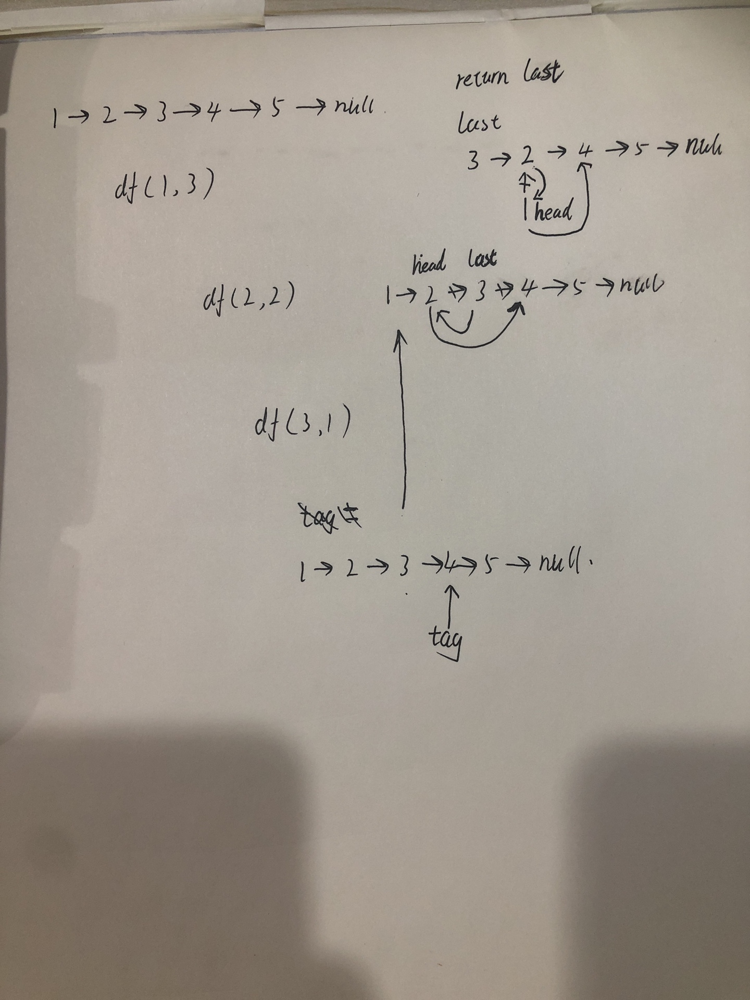

## 递归链表翻转
给定单链表的头节点 head ，请反转链表，并返回反转后的链表的头节点。

示例 1：

```
输入：head = [1,2,3,4,5]
输出：[5,4,3,2,1]
```

示例 2：

```
输入：head = [1,2]
输出：[2,1]
```

示例 3：

```
输入：head = []
输出：[]
```

**基础递归公式如下**

### 前置递归

```
		function reverse(head){
        if(!head || head.next === null){
            console.log("last--", head)
            return head;
        }
        const last = reverse(head.next)
        console.log("head--", head)
        head.next.next = head
        head.next = null
        
        console.log("last--", last)
        return last
    }
```

**使用[1,2,3,4,5]作为测试用例**，输出结果如下

```
last--  [5]
head--  [4,5]
last--  [5,4]
head--  [3,4]
last--  [5,4,3]
head--  [2,3]
last--  [5,4,3,2]
head--  [1,2]
last--  [5,4,3,2,1]
```

做一个灵魂画手，帮助记忆。



由于是前置递归，代码由下而上进行运行，每一步都会将head节点与上一个节点进行翻转，并将head节点指向null

head节点信息由调用栈的函数持有

### 后置递归

```
// 后置递归
  function df(pre, cur) {
    if (cur === null) {
      return pre;
    } else {
      var temp = cur.next;
      cur.next = pre;
      return df(cur, temp);
    }
  }
  return df(null, head);
```

灵魂画手又来了



### 迭代

```
// 迭代
var reverseList = function (head) {
  var pre = null, cur = head, next;
  while (cur) {
    next = cur.next;
    cur.next = pre;
    pre = cur;
    cur = next;
  }
  return pre;
};
```

## 翻转链表前N个节点

```
输入 [1,2,3,4,5] 3
输出 [3,2,1,4,5]
```

### 前置递归

```
function ListNode(val, next) {
  this.val = (val===undefined ? 0 : val)
  this.next = (next===undefined ? null : next)
}
const list = new ListNode(1)
list.next = new ListNode(2)
list.next.next = new ListNode(3)
list.next.next.next = new ListNode(4)
list.next.next.next.next = new ListNode(5)
list.next.next.next.next.next = null


let middleHead = null
function reverseN(head, n) {
  if (n === 1) {
    middleHead = head.next 
    return head
  }
  
  const last = reverseN(head.next, n - 1)
  head.next.next = head
  head.next = middleHead
  return last
}
console.log(reverseN(list, 3))
```

灵魂画图，有点难以理解啊


