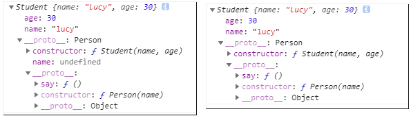
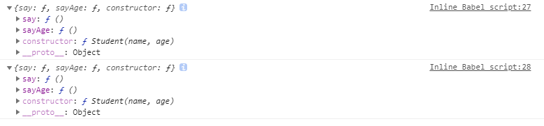
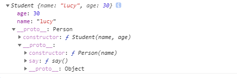

## ES5的继承
首先我们创建一个简单的父类
```
function Person(name){
  this.name = name
}
Person.prototype.say = function(){
  return 'hi'
}
```
继承父类
- 组合继承
```
function Student(name, age){
  //拓展一个实例属性 
  Person.call(this, name); //其实很简单直接，就是调用一遍父类的this.x = x
  this.age = age
}
//将子类的原型对象指向Person的实例
Student.prototype = new Person(); 
//将子类的原型对象的构造函数正确指回
Student.prototype.constructor = Student;
//新增一个实例方法
Student.prototype.sayAge = function(){
  return this.age
};
```
- 寄生组合继承
```
function Student(name, age){
  Person.call(this, name);
  this.age = age
}

Student.prototype = Object.assign(Object.create(Person.prototype), Student.prototype)
Student.prototype.constructor = Student;

Student.prototype.sayAge = function(){
  return this.age
};

const student = new Student('lucy',30)
console.log(student);
```
下图是控制台输出，左边是组合继承，右边是寄生组合继承  
  

***  

> 我们为什么要把子类的prototype**指向父类的实例而不是父类的prototype**呢
> 如果我们把子类的原型对象直接指向父类的原型对象，扩展子类会影响到父类  

将子类的原型对象直接指向父类的原型对象，给子类添加额外的原型方法
```
function Student(name, age){
  Person.call(this, name); 
  this.age = age
}
Student.prototype = Person.prototype; 
Student.prototype.constructor = Student;

Student.prototype.sayAge = function(){
  return this.age
};
console.log(Person.prototype);
console.log(Student.prototype);
```
  
我们可以看到父类的prototype已经被子类改变了，这明显不符合我们的目的

## ES5继承的帮助记忆
子类的prototype必须是某个对象(这个对象的__proto__必须指向父类的prototype)  

满足这个条件的某个对象：
- 父类的实例  组合继承
- Object.create(父类.prototype) 寄生组合继承

满足条件后子类的实例可以通过两个__proto__查找，访问到父类原型对象，即  

```
graph LR
A[子类实例] -->|__proto__| B[子类prototype] -->|__proto__| C[父类prototype]
   
```

## ES6的继承
```
class Person {
  constructor(name){
    this.name = name //实例属性
  }
  say(){ //原型方法
    return 'hi'
  }
}
class Student extends Person{
  constructor(name, age){
    super(name) 
    this.age = age
  }
}
const student = new Student('lucy',30)
console.log(student);
```
控制台输出与ES5寄生组合继承一致
  