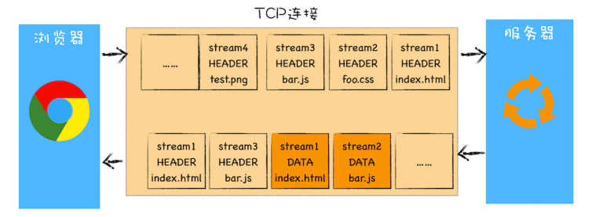
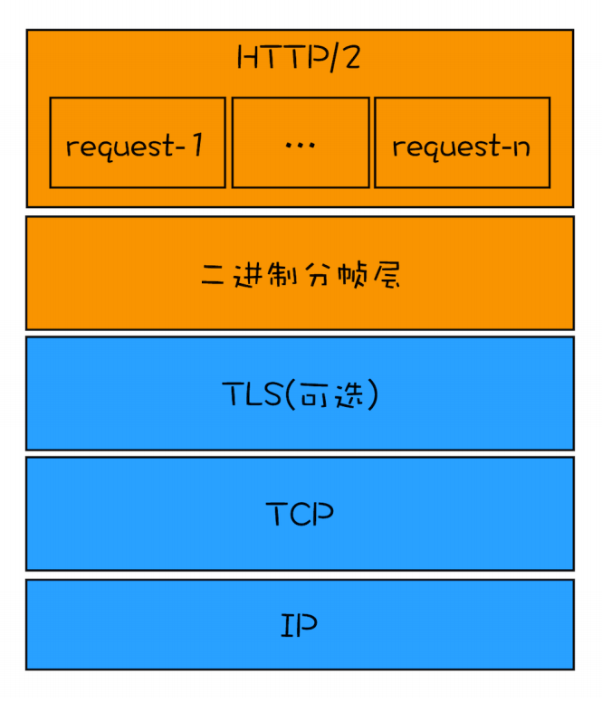
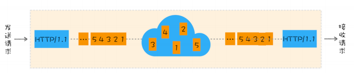

### http 0.9

 HTTP/0.9 是于 1991 年提出的，主要用于学术交流，需求很简单——用来在网络之间传递 HTML 超文本的内容，所以被称为**超文本传输协议**

 总的来说，当时的需求很简单，就是用来传输体积很小的 HTML 文件，所以 HTTP/0.9 的实现有以下三个特点。

- 第一个是只有一个请求行，并没有**HTTP 请求头和请求体**，因为只需要一个请求行就可以完整表达客户端的需求了。

- 第二个是服务器也没有返回头信息，这是因为服务器端并不需要告诉客户端太多信息，只需要返回数据就可以了。

- 第三个是返回的文件内容是以 ASCII 字符流来传输的，因为都是 HTML 格式的文件，所以使用 ASCII 字节码来传输是最合适的。

### http 1.0

万维网的高速发展带来了很多新的需求，而 HTTP/0.9 已经不能适用新兴网络的发展，所以这时就需要一个新的协议来支撑新兴网络，这就是 HTTP/1.0 诞生的原因。

- 引入了请求头和响应头
  - 多类型数据
  - 压缩方式
  - 用户代理 user-agent
- 引入了状态码
- 引入了cache机制

### http 1.1

不过随着技术的继续发展，需求也在不断迭代更新，很快 HTTP/1.0 也不能满足需求了，所以 HTTP/1.1 又在 HTTP/1.0 的基础之上做了大量的更新

- **改进持久连接**（默认开启），**它的特点是在一个 TCP 连接上可以传输多个 HTTP 请求，只要浏览器或者服务器没有明确断开连接，那么该 TCP 连接会一直保持**。

  > 每个域名最多同时维护 6 个 TCP 持久连接

- **不成熟的 HTTP 管线化**，如果 TCP 通道中的某个请求因为某些原因没有及时返回，那么就会阻塞后面的所有请求，这就是著名的**队头阻塞**的问题

  - HTTP/1.1 中试图通过管线化的技术来解决**队头阻塞**的问题。HTTP/1.1 中的管线化是指将多个 HTTP 请求整批提交给服务器的技术，虽然可以整批发送请求，不过服务器依然需要根据请求顺序来回复浏览器的请求。

    > FireFox、Chrome 都做过管线化的试验，但是由于各种原因，它们最终都放弃了管线化技术。

- **提供虚拟主机的支持**

- **对动态生成的内容提供了完美支持**，HTTP/1.1 通过引入**Chunk transfer 机制**来解决这个问题，最后使用一个零长度的块作为发送数据完成的标志

- **客户端 Cookie、安全机制**

### http 2.0

#### **多路复用**

 前面我们分析了 HTTP/1.1 所存在的一些主要问题：慢启动和 TCP 连接之间相互竞争带宽是由于 TCP 本身的机制导致的，而队头阻塞是由于 HTTP/1.1 的机制导致的。

 HTTP/2 的思路就是**一个域名只使用一个 TCP 长连接来传输数据**，这样整个页面资源的下载过程只需要一次慢启动，同时也避免了多个 TCP 连接竞争带宽所带来的问题

 另一个问题就是队头阻塞的问题，等待请求完成后才能去请求下一个资源，这种方式无疑是最慢的，所以 **HTTP/2 需要实现资源的并行请求**，解决了**应用层面的队头阻塞**，也就是任何时候都可以将请求发送给服务器，而并不需要等待其他请求的完成，然后服务器也可以随时返回处理好的请求资源给浏览器





#### http2分帧

帧是数据传输的最小单位，以二进制传输代替原本的明文传输，原本的报文消息被划分为更小的数据帧

##### 帧结构

```
 +-----------------------------------------------+
 |                 Length (24)                   |
 +---------------+---------------+---------------+
 |   Type (8)    |   Flags (8)   |
 +-+-------------+---------------+-------------------------------+
 |R|                 Stream Identifier (31)                      |
 +=+=============================================================+
 |                   Frame Payload (0...)                      ...
 +---------------------------------------------------------------+
复制代码
```

| 名称              | 长度     | 描述                                                         |
| ----------------- | -------- | ------------------------------------------------------------ |
| Length            | 3 字节   | 表示帧负载的长度，取值范围为 （2 的 14 次方）至 （2 的 24 次方 - 1）。（2 的 14 次方） 16384 字节是默认的最大帧大小，如果需要更大的帧，必须在 SETTINGS 帧中设置 |
| Type              | 1 字节   | 当前帧类型（见下表）                                         |
| Flags             | 1 字节   | 具体帧类型的标识                                             |
| R                 | 1 位     | 保留位，不要设置，否则可能会带来严重的后果                   |
| Stream Identifier | 31 位    | 每个流的唯一 ID                                              |
| Frame Payload     | 长度可变 | 真实的帧内容，长度是在 Length 字段中设置的                   |

由于  HTTP/2 是分帧的，请求和响应都可以多路复用，有助于解决类似类似队头阻塞的问题。

##### 帧类型

| 名称          | ID   | 描述                                     |
| ------------- | ---- | ---------------------------------------- |
| DATA          | 0x0  | 传输流的核心内容                         |
| HEADERS       | 0x1  | 包含 HTTP 首部，和可选的优先级参数       |
| PRIORITY      | 0x2  | 指示或更改流的优先级和依赖               |
| RST_STREAM    | 0x3  | 允许一端停止流（通常由于错误导致的）     |
| SETTINGS      | 0x4  | 协商连接级参数                           |
| PUSH_PROMISE  | 0x5  | 提示客户端，服务器要推送些东西           |
| PING          | 0x6  | 测试连接可用性和往返时延（RTT）          |
| GOAWAY        | 0x7  | 告诉另一端，当前的端已结束               |
| WINDOW_UPDATE | 0x8  | 协商一端将要接收多少字节（用于流量控制） |
| CONTINUATION  | 0x9  | 用以扩展 HEADERS 模块                    |

#### **HTTP/2** **其他特性**

- 可以设置请求优先级
- 服务器推送
- 头部压缩

### 队头阻塞

#### 应用层面

在 **HTTP/1.1** 中使用持久连接时，虽然能公用一个 TCP 管道，但是在一个管道中同一时刻只能处理一个请求，在当前的请求没有结束之前，其他的请求只能处于阻塞状态。

http 2通过对请求和响应进行编号的方式，实现资源并行请求解决了这个问题

#### TCP层面

##### http 1.1



通过上图你会发现，从一端发送给另外一端的数据会被拆分为一个个按照顺序排列的数据包，这些数据包通过网络传输到了接收端，接收端再按照顺序将这些数据包组合成原始数据，这样就完成了数据传输。

不过，如果在数据传输的过程中，有一个数据因为网络故障或者其他原因而丢包了，那么整个 TCP 的连接就会处于暂停状态，需要等待丢失的数据包被重新传输过来。你可以把 TCP连接看成是一个按照顺序传输数据的管道，管道中的任意一个数据丢失了，那之后的数据都需要等待该数据的重新传输。为了直观理解，你可以参考下图：


我们就把**在 TCP 传输过程中，由于单个数据包的丢失而造成的阻塞称为 TCP 上的队头阻塞**。

##### http 2.0

那队头阻塞是怎么影响 HTTP/2 传输的呢？首先我们来看正常情况下 HTTP/2 是怎么传输多路请求的，为了直观理解，你可以参考下图：


**通过该图，我们知道在 HTTP/2 中，多个请求是跑在一个 TCP 管道中的，如果其中任意一路数据流中出现了丢包的情况，那么就会阻塞该 TCP 连接中的所有请求。这不同于HTTP/1.1，使用 HTTP/1.1 时，浏览器为每个域名开启了 6 个 TCP 连接，如果其中的 1个 TCP 连接发生了队头阻塞，那么其他的 5 个连接依然可以继续传输数据。**

所以随着丢包率的增加，HTTP/2 的传输效率也会越来越差。有测试数据表明，当系统达到了 2% 的丢包率时，HTTP/1.1 的传输效率反而比 HTTP/2 表现得更好。

HTTP/2 是通过分帧并且给每个帧打上流的 ID 去避免依次响应的问题，对方接收到帧之后根据 ID 拼接出流，这样就可以做到乱序响应从而避免请求时的队首阻塞问题。但是 TCP 层面的队首阻塞是 HTTP/2 无法解决的（HTTP 只是应用层协议，TCP 是传输层协议），**TCP 的阻塞问题是因为传输阶段可能会丢包，一旦丢包就会等待重新发包，阻塞后续传输，这个问题虽然有滑动窗口（Sliding Window）这个方案，但是只能增强抗干扰，并没有彻底解决。**
