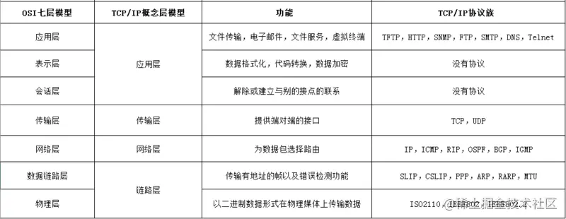

### 常见网页协议

- **TCP/IP**  是互联网相关的各类协议族的总称
- **IP**（Internet Protocol）网际协议（**网络层协议**）IP 协议的作用是把各种数据包传送给对方。而要保证确实传送到对方那里，则需要满足各类条件。其中两个重要的条件是 IP 地址和 MAC 地址（Media Access Control Address）
- **HTTP** 超文本传输协议是一个用于传输超媒体文档（例如 HTML）的**应用层协议**。它是为 Web 浏览器与 Web 服务器之间的通信而设计的，但也可以用于其他目的
- **TCP**（Transmission Control Protocol，**传输控制协议**）是一种面向连接的、可靠的、基于字节流的**传输层通信协议**
- **UDP**（User Data Protocol，**用户数据报协议**）一个非连接的协议，传输数据之前源端和终端不建立连接， 当它想传送时就简单地去抓取来自应用程序的数据，并尽可能快地把它扔到网络上

### **TCP/IP** 的分层管理

**利用 TCP/IP 协议族进行网络通信时，会通过分层顺序与对方进行通信**

这些层基本上被分为4层：

- 应用层

  - 1、超文本传输协议（**HTTP**):万维网的基本协议
  - 2、文件传输（**FTP**文件传输协议）；
  - 3、远程登录（**Telnet**），提供远程访问其它主机功能, 它允许用户登录internet主机，并在这台主机上执行命令
  - 4、网络管理（**SNMP**简单网络管理协议），该协议提供了监控网络设备的方法， 以及配置管理,统计信息收集,性能管理及安全管理等
  - 5、域名系统（**DNS**），该系统用于在internet中将域名及其公共广播的网络节点转换成IP地址

- 传输层

  - 1、**TCP**
  - 2、**UDP**

- 网络层

  - 1、Internet协议（IP）
  - 2、Internet控制信息协议（ICMP）
  - 3、地址解析协议（ARP）ARP 是一种用以解析地址的协议，根据通信方的 IP 地址就可以反查出对应的 MAC 地址。
  - 4、反向地址解析协议（RARP）

- 链路层

  用来处理连接网络的硬件部分。包括控制操作系统、硬件的设备驱动、NIC（Network Interface Card，网络适配器，即网卡），及光纤等物理可见部分（还包括连接器等一切传输媒介）。硬件上的范畴均在链路层的作用范围之内。

  > OSI 七层模型

  

  > 附图 tcp段，IP分段 HTTP权威指南80页

  

### **TCP/IP** 通信传输流

 利用 TCP/IP 协议族进行网络通信时，会通过分层顺序与对方进行通信。发送端从应用层往下走，接收端则往应用层往上走。 发送端在层与层之间传输数据时，每经过一层时必定会被打上一个该层所属的首部信息。反之，接收端在层与层传输数据时，每经过一层时会把对应的首部消去。

 这种把数据信息包装起来的做法称为**封装**（encapsulate），如下图所示

### TCP

 头部至少20个字节

待整理

#### TCP协议的特点

##### 面向连接

  面向连接，是指发送数据之前必须在两端建立连接。建立连接的方法是“三次握手”，这样能建立可靠的连接。建立连接，是为数据的可靠传输打下了基础。

##### 仅支持单播传输

  每条TCP传输连接只能有两个端点，只能进行点对点的数据传输，不支持多播和广播传输方式。

##### 面向字节流

  TCP不像UDP一样那样一个个报文独立地传输，而是在不保留报文边界的情况下以字节流方式进行传输。

##### 可靠传输

  对于可靠传输，判断丢包，误码靠的是TCP的段编号以及确认号。TCP为了保证报文传输的可靠，就给每个包一个序号，同时序号也保证了传送到接收端实体的包的**按序接收**。然后接收端实体对已成功收到的字节发回一个相应的确认(ACK)；如果发送端实体在合理的往返时延(RTT)内未收到确认，那么对应的数据（假设丢失了）将会被重传。

##### 提供拥塞控制

  当网络出现拥塞的时候，TCP能够减小向网络注入数据的速率和数量，缓解拥塞

##### TCP提供全双工通信

  TCP允许通信双方的应用程序在任何时候都能发送数据，因为TCP连接的两端都设有缓存，用来临时存放双向通信的数据。当然，TCP可以立即发送一个数据段，也可以缓存一段时间以便一次发送更多的数据段（最大的数据段大小取决于MSS）

### UDP

  UDP协议全称是用户数据报协议，在网络中它与TCP协议一样用于处理数据包，是一种无连接的协议。在OSI模型中，在第四层——传输层，处于IP协议的上一层。UDP有不提供数据包分组、组装和不能对数据包进行排序的缺点，也就是说，当报文发送之后，是无法得知其是否安全完整到达的。

它有以下几个特点：

#### 1. 面向无连接

首先 UDP 是不需要和 TCP一样在发送数据前进行三次握手建立连接的，想发数据就可以开始发送了。并且也只是数据报文的搬运工，**不会对数据报文进行任何拆分和拼接操作**。

具体来说就是：

- 在发送端，应用层将数据传递给传输层的 UDP 协议，UDP 只会给数据增加一个 UDP 头标识下是 UDP 协议，然后就传递给网络层了
- 在接收端，网络层将数据传递给传输层，UDP 只去除 IP 报文头就传递给应用层，不会任何拼接操作

#### 2. 有单播，多播，广播的功能

UDP 不止支持一对一的传输方式，同样支持一对多，多对多，多对一的方式，也就是说 UDP 提供了单播，多播，广播的功能。

#### 3. UDP是面向报文的

发送方的UDP对应用程序交下来的报文，在添加首部后就向下交付IP层。UDP对应用层交下来的报文，既不合并，也不拆分，而是保留这些报文的边界。因此，应用程序必须选择合适大小的报文

#### 4. 不可靠性

首先不可靠性体现在无连接上，通信都不需要建立连接，想发就发，这样的情况肯定不可靠。

并且收到什么数据就传递什么数据，并且也不会备份数据，发送数据也不会关心对方是否已经正确接收到数据了。

再者网络环境时好时坏，但是 UDP 因为没有拥塞控制，一直会以恒定的速度发送数据。即使网络条件不好，也不会对发送速率进行调整。这样实现的弊端就是在网络条件不好的情况下可能会导致丢包，但是优点也很明显，在某些实时性要求高的场景（比如电话会议）就需要使用 UDP 而不是 TCP。

从上面的动态图可以得知，UDP只会把想发的数据报文一股脑的丢给对方，并不在意数据有无安全完整到达。

#### 5. 头部开销小，传输数据报文时是很高效的

UDP 头部包含了以下几个数据：

- 两个十六位的端口号，分别为源端口（可选字段）和目标端口 （4字节？）
- 整个数据报文的长度
- 整个数据报文的检验和（IPv4 可选 字段），该字段用于发现头部信息和数据中的错误

**因此 UDP 的头部开销小，只有八字节，相比 TCP 的至少二十字节要少得多，在传输数据报文时是很高效的**

### TCP与UDP的区别

|              | UDP                                        | TCP                                    |
| ------------ | ------------------------------------------ | -------------------------------------- |
| 是否连接     | 无连接                                     | 面向连接                               |
| 是否可靠     | 不可靠传输，不使用流量控制和拥塞控制       | 可靠传输，使用流量控制和拥塞控制       |
| 连接对象个数 | 支持一对一，一对多，多对一和多对多交互通信 | 只能是一对一通信                       |
| 传输方式     | 面向报文                                   | 面向字节流                             |
| 首部开销     | 首部开销小，仅8字节                        | 首部最小20字节，最大60字节             |
| 适用场景     | 适用于实时应用（IP电话、视频会议、直播等） | 适用于要求可靠传输的应用，例如文件传输 |

### TCP 拥塞控制

拥塞处理和流量控制不同，后者是作用于接收方，保证接收方来得及接受数据。而前者是作用于网络，防止过多的数据拥塞网络，避免出现网络负载过大的情况。

拥塞处理包括了四个算法，分别为：慢开始，拥塞避免，快速重传，快速恢复。

#### 慢开始算法

慢开始算法，顾名思义，就是在传输开始时将发送窗口慢慢指数级扩大，从而避免一开始就传输大量数据导致网络拥塞。

慢开始算法步骤具体如下

1. 连接初始设置拥塞窗口（Congestion Window） 为 1 MSS（一个分段的最大数据量）
2. 每过一个 RTT 就将窗口大小乘二
3. 指数级增长肯定不能没有限制的，所以有一个阈值限制，当窗口大小大于阈值时就会启动拥塞避免算法。

#### 拥塞避免算法

拥塞避免算法相比简单点，每过一个 RTT 窗口大小只加一，这样能够避免指数级增长导致网络拥塞，慢慢将大小调整到最佳值。

在传输过程中可能定时器超时的情况，这时候 TCP 会认为网络拥塞了，会马上进行以下步骤：

- 将阈值设为当前拥塞窗口的一半
- 将拥塞窗口设为 1 MSS
- 启动拥塞避免算法

#### 快速重传

快速重传一般和快恢复一起出现。一旦接收端收到的报文出现失序的情况，接收端只会回复最后一个顺序正确的报文序号（没有 Sack 的情况下）。如果收到三个重复的 ACK，无需等待定时器超时再重发而是启动快速重传。具体算法分为两种：

**TCP Taho 实现如下**

- 将阈值设为当前拥塞窗口的一半
- 将拥塞窗口设为 1 MSS
- 重新开始慢开始算法

**TCP Reno 实现如下**

- 拥塞窗口减半
- 将阈值设为当前拥塞窗口
- 进入快恢复阶段（重发对端需要的包，一旦收到一个新的 ACK 答复就退出该阶段）
- 使用拥塞避免算法

#### TCP New Ren 改进后的快恢复

**TCP New Reno** 算法改进了之前 **TCP Reno** 算法的缺陷。在之前，快恢复中只要收到一个新的 ACK 包，就会退出快恢复。

在 **TCP New Reno** 中，TCP 发送方先记下三个重复 ACK 的分段的最大序号。

假如我有一个分段数据是 1 ~ 10 这十个序号的报文，其中丢失了序号为 3 和 7 的报文，那么该分段的最大序号就是 10。发送端只会收到 ACK 序号为 3 的应答。这时候重发序号为 3 的报文，接收方顺利接收并会发送 ACK 序号为 7 的应答。这时候 TCP 知道对端是有多个包未收到，会继续发送序号为 7 的报文，接收方顺利接收并会发送 ACK 序号为 11 的应答，这时发送端认为这个分段接收端已经顺利接收，接下来会退出快恢复阶段。
