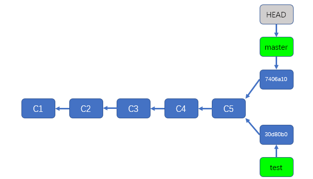
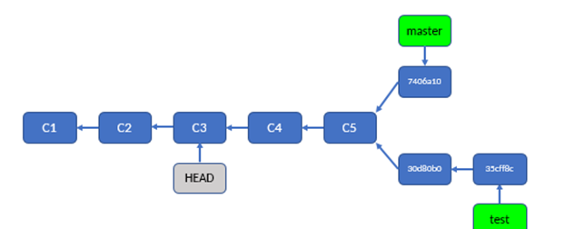

git 简记，主要参考掘金小册和以前的视频笔记，构建一个简单的记忆结构

### add

- 提交所有被删除和修改的文件到数据暂存区

```
git add -u 或 git add –update
```

- 提交所有修改的和新建的到数据暂存区

```
git add .
```

- 提交所有被删除、被替换、被修改和新增的文件到数据暂存区

```
git add -A 或 git add –all
```

### 撤销 add

```

# 恢复暂存区的所有文件到工作区 => vscode git工具中的 取消暂存所有更改

$ git reset HEAD 如果后面什么都不跟的话 就是上一次add 里面的全部撤销了 相当于git restore -staged .

$ git reset HEAD XXX/XXX/XXX.php 就是对某个php文件进行撤销了
```

### commit

将暂存区内容添加到仓库中

```
git commit -m '一些描述'
```

再简单提一些常见场景， 比如说`commit`完之后，突然发现一些错别字需要修改，又不想为改几个错别字而新开一个`commit`到`history`区，那么就可以使用下面这个命令：

```
git commit --amend
```

这样就是把错别字的修改和之前的那个`commit`中的修改合并 并覆盖上次的commit。

### 撤销 修改 commit

#### 丢弃上次的提交

```
git reset HEAD^
```

> 说明：在 Git 中，有两个「偏移符号」： `^` 和 `~`。
>
> `^` 的用法：在 `commit` 的后面加一个或多个 `^` 号，可以把 `commit` 往回偏移，偏移的数量是 `^` 的数量。例如：`master^` 表示 `master` 指向的 `commit` 之前的那个 `commit`； `HEAD^^` 表示 `HEAD` 所指向的 `commit` 往前数两个 `commit`。
>
> `~` 的用法：在 `commit` 的后面加上 `~` 号和一个数，可以把 `commit` 往回偏移，偏移的数量是 `~` 号后面的数。例如：`HEAD~5` 表示 `HEAD` 指向的 `commit`往前数 5 个 `commit`。

#### 如果已经推送到远端

- 1 确定无风险可以执行，git push -f 可以强制推送，无视冲突，远端的那次commit也会消失

- 2 安全操作，你希望撤销哪个 `commit`，就把它填在后面：

  ```
  git revert HEAD^
  ```

  上面这行代码就会增加一条新的 `commit`，它的内容和倒数第二个 `commit` 是相反的，从而和**倒数第二个** `commit` 相互抵消，达到撤销的效果。

  在 `revert` 完成之后，把新的 `commit` 再 `push` 上去，这个 `commit` 的内容就被撤销了。它和前面所介绍的撤销方式相比，最主要的区别是，这次改动只是被「反转」了，并没有在历史中消失掉，你的历史中会存在两条 `commit` ：一个原始 `commit` ，一个对它的反转 `commit`。

  ```
  git revert HEAD                撤销最新一次 commit
  git revert HEAD^               撤销前一次 commit
  git revert commitid            撤销指定commitid的commit 
  ```

- 撤销commit，同时将代码恢复到对应ID的版本(中间的commit都没了)

```
git reset --hard commitId
```

**reset后接参数**

1. --hard：重置位置的同时，清空工作目录和暂存区的所有内容；
2. --soft：重置位置的同时，保留工作目录和暂存区的内容，并把重置 HEAD 的位置所导致的新的文件差异放进暂存区。
3. --mixed（默认）：重置位置的同时，保留工作目录的内容，把暂存区和重置 HEAD 的位置所导致的新的文件差异都放入工作目录

#### 修改前几次的commit 不新增commit

详见#rebase章节


### restore 撤销

`git restore --staged <file>...`  撤销add，将暂存区的文件从暂存区撤出，但不会更改文件的内容

`git restore <file>...` 撤销工作区改动，已经在暂存区的改动不会撤销 相当于 `git checkout -- filepathname `

### push

实质上，`push` 做的事是：**把当前 `branch` 的位置（即它指向哪个 `commit`）上传到远端仓库，并把它的路径上的 `commit`s 一并上传**。

也就是每次仅上传当前的分支上的commit

### 分支

#### 创建一个分支

```
git branch feature1
```

#### 切换到分支

```
git checkout feature1
```

#### 切换分支 如果不存在就创建一个分支

```
git checkout -b feature1
```

#### 删除分支

```
git branch -d feature1 
```

> 没有合并到master，删除会失败，强行删除 -d 换成 -D

#### 查看分支

```
git branch 列出本地已经存在的分支,并且当前分支会用*标记
git branch -r 查看远程版本库的分支列表
```

#### 推送远端不存在的分支

```
git checkout feature1
去推送本地分支到远程分支 的同时，为他俩建立联系(默认联系)
以后push这个分支 默认就推送到现在建立联系的远端分支上
git push --set-upstream origin feature1
```

> 在 Git 中（2.0 及它之后的版本），默认情况下，你用不加参数的 `git push` 只能上传那些之前从远端 `clone` 下来或者 `pull` 下来的分支，而如果需要 `push` 你本地的自己创建的分支，则需要手动指定目标仓库和目标分支（并且目标分支的名称必须和本地分支完全相同），就像上面这样

#### 删除远端仓库的分支

```
git push origin -d feature1 # 用 -d 参数把远程仓库的 branch 也删了
```

#### 找回被删除的分支

```
git reflog 查看删除分支前的commit 
```


从图中可以看出，`HEAD` 的最后一次移动行为是「从 `branch1` 移动到 `master`」。而在这之后，`branch1` 就被删除了。所以它之前的那个 `commit` 就是 `branch1` 被删除之前的位置了，也就是第二行的 `c08de9a`。

所以现在就可以切换回 `c08de9a`，然后重新创建 `branch1` ：

```
git checkout c08de9a
git checkout -b branch1
```

这样，你刚删除的 `branch1` 就找回来了。

#### 合并分支

两种方式，一种利用merge，一种利用rebase

```
git merge branch
```

```
1 git checkout branch1
2 git rebase master
3 git checkout master
4 git merge(rebase) branch1

下图1 描述1-2 下图2 描述3-4
```


### merge

`merge` 的意思是「合并」，它做的事也是合并：指定一个 `commit`，把它合并到当前的 `commit` 来。具体来讲，`merge` 做的事是：

**从目标 `commit` 和当前 `commit` （即 `HEAD` 所指向的 `commit`）分叉的位置起，把目标 `commit` 的路径上的所有 `commit` 的内容一并应用到当前 `commit`，然后自动生成一个新的 `commit`。**

merge有时产生冲突:

- git pull时，远端仓库包含本地没有的 `commit`，而且本地仓库也包含远端没有的 `commit` 时
- ```git pull = git fetch + git merge origin/HEAD```
- git merge 合并的时候，文件有冲突

处于冲突解决状态时

 解决冲突，解决完冲突后进行commit时，会自动填入commit信息"这是一个merge信息"

 放弃解决  `git merge --abort`输入这行代码，你的 Git 仓库就会回到 `merge` 前的状态

### checkout

`git checkout`命令用于切换分支或恢复工作树文件，也可以指定HEAD指针的位置。

`checkout` 本质上的功能其实是：签出（ checkout ）指定的 `commit`

```
此命令用来放弃掉所有还没有加入到缓存区（就是 git add 命令）的修改

# 放弃单个文件修改,注意不要忘记中间的"--",不写就成了检出分支了!
git checkout -- filepathname

# 放弃所有的文件修改
git checkout . 

# 切换到分支

git checkout feature1

# 切换分支 如果不存在就创建一个分支

git checkout -b feature1

# 签出commit
```

首先介绍一下`HEAD`，可以把HEAD理解成一个指针，HEAD指针通常会指向一个分支，如下图所示



HEAD-->master-->commitID，通常情况下，HEAD会一直跟随着当前分支，并指向分支，而分支则指向当前最新的commit

还有一种 `detached HEAD`的状态，使用`git checkout C3`即可以把HEAD指针指向C3

> 经过我的测试，在工作区和暂存区有改动的情况下，无法进行git checkout commitID or branch
>
> 

> 还有一种相对引用的方式，`git checkout main^`*3 或者  `git checkout main^^^` 或者 `git checkout main~3`  或者使用 `git checkout HEAD^^^`,这几种方法都是向父节点方向移动



如果此时进行commit，git的返回信息会提示我们，You are in ‘detached HEAD’ state.（你现在处于’分离头’状态）。然后会从C3节点出现一个新的节点，HEAD会指向新的节点，可以简单的理解为匿名分支（图和上边不一样，仅做示意）


我们现在有两个选择，如下：

- 丢弃这个匿名分支
  - 直接检出到任何一个别的分支，就相当于放弃了这些提交

- 保留这个匿名分支
  - 创建一个名为newtest的分支来保存这些提交
    - `git branch newtest c7`  这种方式HEAD并未指向newtest，而是指向了C7，仍是指针分离状态
    - `git checkout -b newtest`   HEAD指向了newtest，newtest指向了C7

- 与现存分支合并，参考分支命令章节

### stash

- `git stash save "save message"` : 执行存储时，添加备注，方便查找，只有git stash 也要可以的，但查找时不方便识别。
  - 增加参数可以存储没有追踪的文件  `git stash save -u`   ===  `git stash save --include-untracked`

- `git stash list` ：查看stash了哪些存储

- `git stash show` ：显示做了哪些改动，默认show第一个存储,如果要显示其他存贮，后面加stash@{$num}，比如第二个 git stash show stash@{1}

- `git stash show -p` : 显示第一个存储的改动，如果想显示其他存存储，命令：git stash show stash@{$num} -p ，比如第二个：git stash show stash@{1} -p

- `git stash apply`:应用某个存储,但不会把存储从存储列表中删除，默认使用第一个存储,即stash@{0}，如果要使用其他个，git s tash apply stash@{$num} ， 比如第二个：git stash apply stash@{1}

- `git stash pop` ：命令恢复之前缓存的工作目录，将缓存堆栈中的对应stash删除，并将对应修改应用到当前的工作目录下,默认为第一个stash,即stash@{0}，如果要应用并删除其他stash，命令：git stash pop stash@{$num} ，比如应用并删除第二个：git stash pop stash@{1}

- `git stash drop stash@{$num}`：丢弃stash@{$num}存储，从列表中删除这个存储192.168.1.110 

- `git stash clear`：删除所有缓存的stash

### 查看改动

查看改动内容的方法，大致有这么几类：

1. 查看历史中的多个commit：log

   1. 查看详细改动： `git log -p`
   2. 查看大致改动：`git log --stat`

2. 查看具体某个commit：show

   1. 要看最新 `commit` ，直接输入 `git show` ；要看指定 `commit` ，输入 `git show commit的引用或SHA-1`
   2. 如果还要指定文件，在 `git show` 的最后加上文件名

3. 查看未提交的内容：diff

   1. 查看暂存区和上一条 `commit` 的区别：`git diff --staged`（或 `--cached`）也就是暂存区 tobe commit的内容

   2. 查看工作目录和暂存区的区别：`git diff` 不加选项参数

   3. 查看工作目录和上一条 `commit` 的区别：`git diff HEAD(commitID)` **vscode默认展示的**,也就是工作目录和暂存区所有的改动相较于最新commit的区别

> git reflog  查看**本地所有**的所有操作记录（包括分支、包括已经被删除的 commit 记录和 reset 的操作）,适合找回

### rebase

git rebase 可以理解为嫁接、编辑（包括删除）commit链条，可以完成很多功能，包括但不限于合并分支、编辑任意数量commit节点、删除任意数量的commit节点、插入任意数量的节点

#### git rebase commitID || branch

> 没有commit分叉点的话，除了快速移动外应该没有作用

见合并分支一节，如果是commitID的话，效果如下图所示


如果在这里执行：

```
git rebase 第3个commit
```

那么 Git 会自动选取 `3` 和 `5` 的历史交叉点 `2` 作为 `rebase` 的起点，依次将 `4` 和 `5` 重新提交到 `3` 的路径上去。

#### git rebase -i

`git rebase -i HEAD^^`

可以编辑（ 倒数第三个commit, HEAD ] 之间的commit ，按下 i 进行编辑模式，操作命令写的很清楚，一般会用到edit和drop

如果使用了edit，会是HEAD进入游离状态，并指向edit对应的commit

这个时候可以进行各种操作，比如修改工作区并新增一个commit或者直接使用 `git commit -amend` 来修改这条commit message

操作完成后 使用 `git rebase --continue` 结束回归正常

也可以放弃 `rebase` `git rebase --abort`

> 建议熟练后在进行骚操作


#### Git rebase --onto

```
git rebase --onto 目标commit 起点commit(不包括起点) 终点commit
```

`--onto` 参数后面有三个附加参数：目标 `commit`、起点 `commit`（注意：rebase 的时候会把起点排除在外）、终点 `commit`。

```
git rebase --onto 第3个commit 第4个commit branch1
```


同样的，你也可以用 `rebase --onto` 来撤销提交：

```
git rebase --onto HEAD^^ HEAD^ branch1
```

上面这行代码的意思是：以倒数第二个 `commit` 为起点（起点不包含在 `rebase` 序列里哟），`branch1` 为终点，`rebase` 到倒数第三个 `commit` 上。

也就是这样：


### reset

实质上，`reset` 这个指令虽然可以用来撤销 `commit` ，但它的实质行为并不是撤销，而是移动 `HEAD` ，并且「捎带」上 `HEAD` 所指向的 `branch`（如果有的话）。

reset后接参数

1. --hard：重置位置的同时，清空工作目录和暂存区的所有内容；
2. --soft：重置位置的同时，保留工作目录和暂存区的内容，并把重置 HEAD 的位置所导致的新的文件差异放进暂存区。
3. --mixed（默认）：重置位置的同时，保留工作目录的内容，把暂存区和重置 HEAD 的位置所导致的新的文件差异都放入工作目录

```
git reset --hard C3
```

> Git 的历史只能往回看，不能向未来看，所以把 `HEAD` 和 `branch` 往回移动，就能起到撤回 `commit` 的效果。
>
> 在relog里可以回溯哦，前提在git没回收commit节点之前


所以同理，`reset --hard` 不仅可以撤销提交，还可以用来把 `HEAD` 和 `branch` 移动到其他的任何地方。

```
git reset --hard branch2
```


### tag

#### git打tag

通常在发布软件的时候打一个tag，tag会记录版本的commit号，方便后期回溯。

#### 列出已有的tag

```
git tag
```

加上`-l`命令可以使用通配符来过滤`tag`


#### 新建tag

使用`git tag`命令跟上tag名字，直接创建一个tag。

```
git tag v1.0
```

上面创建一个名为`v1.0`的tag。使用`git tag`命令可以看到新增加的tag。

还可以加上`-a`参数来创建一个带备注的tag，备注信息由`-m`指定。如果你未传入`-m`则创建过程系统会自动为你打开编辑器让你填写备注信息。

```
git tag -a tagName -m "my tag"
```

#### 查看tag详细信息

`git show`命令可以查看tag的详细信息，包括commit号等。

```
git show tagName
```


tag最重要的是有git commit号，后期我们可以根据这个commit号来回溯代码。

#### 给指定的某个commit号加tag

打tag不必要在head之上，也可在之前的版本上打，这需要你知道某个提交对象的校验和（通过git log获取，取校验和的前几位数字即可）。

```
git tag -a v1.2 9fceb02 -m "my tag"
```

#### 将tag同步到远程服务器

同提交代码后，使用`git push`来推送到远程服务器一样，`tag`也需要进行推送才能到远端服务器。

##### 推送单个分支

```
git push origin v1.0
```

##### 推送本地所有tag

```
git push origin --tags
```

#### 切换到某个tag

```
git checkout tagName
```

跟分支一样，可以直接切换到某个tag去。这个时候不位于任何分支，处于游离状态，可以考虑基于这个tag创建一个分支。

#### 删除某个tag

- 本地删除

```
git tag -d v0.1.2 
```

- 远端删除
  git push origin :refs/tags/<tagName>

```
git push origin :refs/tags/v0.1.2
```

### cherry-pick

[详见阮一峰](http://www.ruanyifeng.com/blog/2020/04/git-cherry-pick.html)

`git cherry-pick`命令的作用，就是将指定的提交（commit）应用于其他分支。

会将指定的提交`commitHash`，应用于当前分支。这会在当前分支产生一个新的提交，**当然它们的哈希值会不一样**。

举例来说，代码仓库有`master`和`feature`两个分支。

 ```bash
     a - b - c - d   Master
          \
            e - f - g Feature
 ```

现在将提交`f`应用到`master`分支。

 ```bash
 # 切换到 master 分支
 $ git checkout master
 
 # Cherry pick 操作
 $ git cherry-pick f
 ```

上面的操作完成以后，代码库就变成了下面的样子。

 ```bash
     a - b - c - d - f   Master
          \
            e - f - g Feature
 ```

从上面可以看到，`master`分支的末尾增加了一个提交`f`。

`git cherry-pick`命令的参数，不一定是提交的哈希值，分支名也是可以的，表示转移该分支的最新提交。

 ```bash
 git cherry-pick feature
 ```

上面代码表示将`feature`分支的**最近一次提交**，转移到当前分支。

Cherry pick 支持一次转移多个提交。

```
git cherry-pick <HashA> <HashB>
```

上面的命令将 A 和 B 两个提交应用到当前分支。这会在当前分支生成两个对应的新提交。

如果想要转移一系列的连续提交，可以使用下面的简便语法。

```
git cherry-pick A..B 
```

上面的命令可以转移从 A 到 B 的所有提交。它们必须按照正确的顺序放置：提交 A 必须早于提交 B，否则命令将失败，但不会报错。

 一定要注意**不包括节点 A**

### git config

#### 查看配置 - git config -l

使用git config -l 可以查看现在的git环境详细配置

查看不同级别的配置文件：

```php
#查看系统config
git config --system --list
　　
#查看当前用户（global）配置
git config --global  --list
 
#查看当前仓库配置信息
git config --local  --list
```

------

#### 设置用户名与邮箱（用户标识，必要）

当你安装Git后首先要做的事情是设置你的用户名称和e-mail地址。这是非常重要的，因为每次Git提交都会使用该信息。它被永远的嵌入到了你的提交中：

```csharp
git config --global user.name "mazhihong"  #名称
git config --global user.email "xxxx@qq.com"   #邮箱
```

------

#### 添加配置项

```csharp
git config [--local|--global|--system]  section.key value
[--local|--global|--system]  #可选的，对应本地，全局，系统不同级别的设置
section.key #区域下的键
value #对应的值
```

--local 项目级
 --global 当前用户级
 --system 系统级

#### 删除配置项

```bash
git config [--local|--global|--system] --unset section.key
```

### tips

#### checkout 和 reset 的不同

`checkout` 和 `reset` 都可以切换 `HEAD` 的位置，它们除了有许多细节的差异外，最大的区别在于：`reset` 在移动 `HEAD` 时会带着它所指向的 `branch` 一起移动，而 `checkout` 不会。当你用 `checkout` 指向其他地方的时候，`HEAD` 和 它所指向的 `branch` 就自动脱离了。

事实上，`checkout` 有一个专门用来只让 `HEAD` 和 `branch` 脱离而不移动 `HEAD` 的用法：

```
git checkout --detach
```

执行这行代码，Git 就会把 `HEAD` 和 `branch` 脱离，直接指向当前 `commit`：


