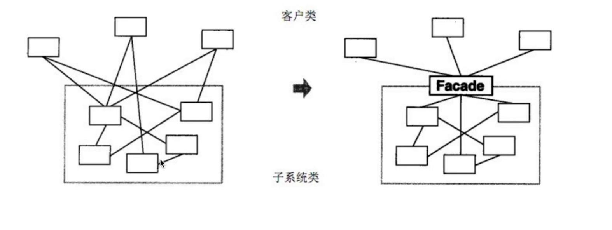

# 五大设计原则

js常用前两种原则，语言特性和后三种原则关联不大。

- 单一职责原则
  - 一个程序只做好一件事
  - 如果功能复杂就拆分开，每个部分保持独立
- 开放封闭原则
  - 对扩展开放，对修改封闭
  - 增加需求时，扩展新代码，而非修改已有代码
  - 这是软件设计的终极目标
- 李氏置换原则
- 接口独立原则
- 依赖导致原则

# 设计模式的基本-面向对象

为何使用面向对象

- 程序执行：顺序、判断、循环 ---- 结构化
- 面对对象 ---- 数据结构化
- 对于计算机，结构化的才是最简单的
- 变成应该 简单&抽象

# js常用设计模式简介及举例

## 工厂模式

### 实际例子

#### jQuery

```
class jQuery {
  construct(selector){
    .....
  }
}
window.$ = function(selector){
  return new jQuery(selector)
}
```

#### React.createElement

```
class Vnode(tag, attrs, children) {
  ....
}
React.createElement = function(tag, attrs, children) {
  return new Vnode(tag, attrs, children)
}
```

## 单例模式

js利用闭包和立即执行函数实现

```
class SingleObj{
  login() {
    console.log('111');
  }
}
SingleObj.getInstance = (function () {
  let instance = null;
  return function () {
    if (!instance) {
      instance = new SingleObj();
    }
    return instance;
  }
})()

const test1 = SingleObj.getInstance();
const test2 = SingleObj.getInstance();

console.log(test1 === test2); // true

// 无法防止错误用法，例如：
const test3 = new SingleObj();
```

## 适配器模式

### 应用场景

- 旧接口格式和使用者不兼容
- 中间加一个适配转换接口

### 实际例子

#### 封装旧接口

解决新旧代码不兼容的问题，尽量避免全局替换

```
// 自己封装的ajax，使用方式如下
ajax({
  url:'/getData',
  type:'post',
  data: {
    id: 2
  }
}).done(function(){})
// 但是由于历史原因，代码全是 $.ajax({...})

// 解决方案，做一层适配器
var $ = {
  ajax: function(option) {
    return ajax(option);
  }
}
```

#### vue computed

```
<div id="example">
  <p>Original message: "{{ message }}"</p>
  <p>Computed reversed message: "{{ reversedMessage }}"</p>
</div>
----------------------------------
var vm = new Vue({
  el: '#example',
  data: {
    message: 'Hello'
  },
  computed: {
    // 计算属性的 getter
    reversedMessage: function () {
      // `this` 指向 vm 实例
      return this.message.split('').reverse().join('')
    }
  }
})
```

## 装饰器模式

### 应用场景

- 为对象添加新功能
- 不改变其原有的结构和功能

### 实现方式

#### es7装饰器提案

```
@testable
class MyTestableClass {
  // ...
}

function testable(target) {
  target.isTestable = true;
}

MyTestableClass.isTestable // true
```

上面代码中，`@testable`就是一个装饰器。它修改了`MyTestableClass`这个类的行为，为它加上了静态属性`isTestable`。`testable`函数的参数`target`是`MyTestableClass`类本身。

基本上，装饰器的行为就是下面这样。

```
@decorator
class A {}

// 等同于

class A {}
A = decorator(A) || A;
```

也就是说，装饰器是一个对类进行处理的函数。装饰器函数的第一个参数，就是所要装饰的目标类。

装饰器实现 `mixin` 功能演示

```
function mixins(...list) {
  return function (target) {
    Object.assign(target.prototype, ...list)
  }
}
const Foo = {
  foo() {
    console.log('foo')
  }
}
@mixins(Foo)
class MyClass {}

const obj = new MyClass();
obj.foo() // 'foo'
```

#### core-decorators

第三方类库，提供了一些常用装饰器
[npm地址](https://www.npmjs.com/package/core-decorators)
只读

```
import { readonly } from 'core-decorators';
 
class Meal {
  @readonly
  entree = 'steak';
}
 
var dinner = new Meal();
dinner.entree = 'salmon';
// Cannot assign to read only property 'entree' of [object Object]
```

即将废弃

```
import { deprecate } from 'core-decorators';
 
class Person {
  @deprecate
  facepalm() {}
 
  @deprecate('We stopped facepalming')
  facepalmHard() {}
 
  @deprecate('We stopped facepalming', { url: 'http://knowyourmeme.com/memes/facepalm' })
  facepalmHarder() {}
}
 
let person = new Person();
 
person.facepalm();
// DEPRECATION Person#facepalm: This function will be removed in future versions.
 
person.facepalmHard();
// DEPRECATION Person#facepalmHard: We stopped facepalming
 
person.facepalmHarder();
// DEPRECATION Person#facepalmHarder: We stopped facepalming
//
//     See http://knowyourmeme.com/memes/facepalm for more details.
//
```

### 常用使用场景

#### 类的装饰

```
class Circle{
  constructor(){

  }
  draw(){
    console.log('画一个圆形')
  }
}
// 装饰器
class Decorator() {
  constructor(circle) {
    this.circle = circle
  }
  draw() {
    this.circle.draw()
    this.setRedBorder(this.circle)
  }
  setRedBorder(circle){
    console.log('设置红色边框')
  }
}
```

#### 方法的装饰

例子1

```
function readonly(target, name, descriptor) {
  // 属性描述符
  descriptor.writable = false;
  return descriptor;
}

class Person {
  constructor() {
    this.first = 'A'
    this.last = 'B'
  }

  @readonly
  name() {
    return `${this.first} ${this.last}`
  }
}

p.name = () => { // 报错
  console.log(1111)
}
```

例子2 函数改造，重点在于 call 和 this 的用法

```
function log(target, name, descriptor){
  const oldFnc = descriptor.value;
  descriptor.value = function(){
    console.log(target, name, descriptor);
    // return 是为了确保不丢失函数返回值
    return oldFnc.call(this, arguments);
  }
}

class Math {
  @log
  add(a, b) {
    return a + b
  }
}
```

## 代理模式

代理类和目标类分离，隔离开目标类和使用者
常用场景

- 网页事件代理
- jQuery $.proxy
- es6 proxy
- set get
代码示意

```
// 本体
class RealImg{
  constructor(fileName) {
    this.fileName = fileName;
    this.loadFromDisk() // 初始化从硬盘加载文件
  }
  diaplay() {
    console.log('...diaplay' + this.fileName);
  }
  loadFromDisk() {
    console.log('...loading' + this.fileName);
  }
}
// 代理
class ProxyImg{
  constructor(fileName) {
    this.realImg = new RealImg(fileName);
  }
  display() {
    this.realImg.diaplay();
  }
}
// 演示
const img1 = new ProxyImg('1.png');
img1.display();
```

## 外观模式

使用场景

- 为子系统中的一组接口提供了一个高层接口
- 使用者使用这个高层接口



## 观察者模式

前端最常用、最重要的模式
代码示意

```
class Subject {
  constructor() {
    this.state = 0;
    this.observers = [];
  }
  getState() {
    return this.state;
  }
  setState(state) {
    this.state = state;
    this.notifyAllObservers();
  }
  notifyAllObservers() {
    this.observers.forEach(observer => {
      observer.update();
      console.log(`${observer.name} -- updata --- ${this.getState()}`);
    })
  }
  attach(observer) {
    this.observers.push(observer);
  }
}
// 观察者
class Observer {
  constructor(name, subject) {
    this.name = name;
    this.subject = subject;
    this.subject.attach(this);
  }
  update() {
    console.log('更新');
  }
}

const subject = new Subject();
const ob1 = new Observer('ob1', subject);
const ob2 = new Observer('ob2', subject);
const ob3 = new Observer('ob3', subject);
subject.setState(1);
subject.setState(2);
subject.setState(3);

```

应用场景

- 网页事件绑定
- promise
- jQuery callback
- nodejs 自定义事件

## 迭代器模式

使用场景

- 顺序访问一个集合
- 使用者无需知道集合的内部结构
代码演示

```
class Interator{
  index = 0
  constructor(container) {
    this.list = container.list
  }
  next() {
    if (this.hasNext()) {
      // 先返回，后加加
      return this.list[this.index++]
    }
  }
  hasNext() {
    if (this.index >= this.list.length) {
      return false
    }
    return true
  }
}
class Container{
  constructor(list) {
    this.list = list;
  }
  getInterator() {
    return new Interator(this);
  }
}
```

实例

- iterator & for of

## 状态模式

使用场景

- 一个对象有状态变化
- 每个状态变化都会触发一个逻辑
- 不能中使用if-else来控制

实际应用

- 状态机 例如html标签解析
- promise 状态

## 其他模式

不常用，暂时略过
