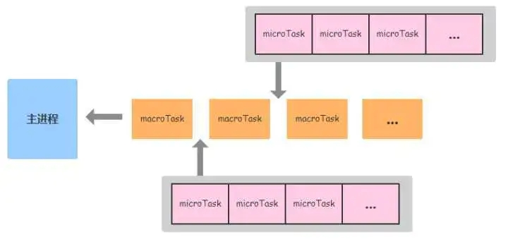

> 这个可以看浏览器原理

micro-task和macro-task就是两种不同的任务队列

- macro-task:
  - script(script标签里面的整体代码)
  - setTimeout
  - setInterval
  - setImmediate
  - MessageChannel（vue nextTick 以前应该是[备选方案](https://cn.vuejs.org/v2/guide/reactivity.html)）
  - I/O
  - UI rendering
  - requestAnimationFrame
- micro-task:
  - process.nextTick
  - Promise
  - Object.observe(已废弃)
  - [MutationObserver](https://developer.mozilla.org/zh-CN/docs/Web/API/MutationObserver) (接口提供了监视对DOM树所做更改的能力)  

JS开发人员应该对这些方法都不会太陌生——都是些常见的异步操作。但这些方法在执行时有什么区别呢？通俗来说，macrotasks和microtasks最大的区别在它们会被放置在不同的任务调度队列中。我在网上找了一张图，如下所示：
  
每一次事件循环中，主进程都会先执行一个macroTask任务，这个任务就来自于所谓的MacroTask Queue队列；当该macroTask执行完后，Event loop会立马**调用microTask队列的任务，直到消费完所有的microtask，再继续下一个事件循环**。
> 管中窥豹，microTask调用优先级较高于macroTask.  
先看一个demo

```
console.log('main start');

setTimeout(() => {
  console.log('setTimeout');
  process.nextTick(() => console.log('process.nextTick 3'));
}, 0);

process.nextTick(() => {
  console.log('process.nextTick 1');
  process.nextTick(() => console.log('process.nextTick 2'));
});

console.log('main end');
```

看看它们的执行顺序是怎么样的：

```
1   main start
2   main end
3   process.nextTick 1
4   process.nextTick 2
5   setTimeout
6   process.nextTick 3
```

大致流程如下所示：

1. 先运行主程序（事实上主程序本身就是一个macroTask），主程序把setTimeout和process.nextTick分别放入MacroTask Queue和MicroTask Queue

2. 主程序结束，这时候我们看到了第一二条的打印结果main start、main end

3. 如上面所提到的，每一个macroTask结束后会开始消费microTask。这时的MicroTask Queue里有一个process.nextTick，然后发现它本身也调用了一个process.nextTick，所以继续把这个内层的任务加入MicroTask Queue。

4. 线程消费掉所有MicroTask Queue里的任务（这时只有两个任务），我们得到了第三四条结果process.nextTick 1和process.nextTick 2

5. 当MicroTask Queue清空后，Event Loop进入下一个循环：执行MacroTask Queue的setTimeout任务，然后得到了第五条输出setTimeout，之后它还会把又一个process.nextTick放入MicroTask Queue

6. 继续如4所示过程，Event Loop在Current MacroTask执行完成后消费MicroTask Queue，这时候我们有了最后一条输出process.nextTick 3

**下面也是一道经常考的面试题,可以更好的理解async await**

```
async function async1() {
  console.log('async1 start'); // 2
  await async2(); // 微任务 1
  console.log('async1 end'); // 微任务 1 6
}
async function async2() {
  console.log('async2'); // 3
}

console.log('script start');  // 1

setTimeout(function() {
  console.log('setTimeout'); // 宏任务 1 8
}, 0)

async1(); 

new Promise(function(resolve) {
  console.log('promise1'); // 4
  resolve(); // 微任务 2
}).then(function() {
  console.log('promise2'); // 微任务 2 7
});
console.log('script end'); // 5
```
