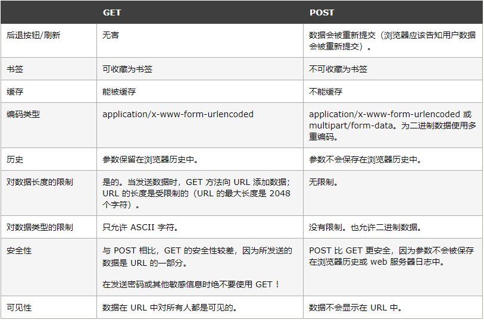

## POST提交数据时四种常见的数据格式

- application/x-www-form-urlencoded
  
  > 浏览器的原生 表单，如果不设置 enctype 属性，那么最终就会以 application/x-www-form-urlencoded方式提交数据。
- multipart/form-data
  
  > 我们使用表单上传文件时，必须让 表单的 enctype 等于 multipart/form-data
- application/json
  
  > JSON 格式支持比键值对复杂得多的结构化数据
- text/xml
  
  > XML-RPC（XML Remote Procedure Call）,它是一种使用 HTTP 作为传输协议，XML 作为编码方式的远程调用规范。

****

## get的编码类型 仅有 application/x-www-form-urlencoded

## W3C列出的HTTP方法 POST和GET的区别

  

## 常见解答 get post的区别

- 1.GET请求的数据会附在URL之后，以?分割URL和传输数据，参数之间以&相连，POST把提交的数据则放置在是HTTP包的包体中。
- 2.GET的长度受限于url的长度，而url的长度限制是特定的浏览器和服务器设置的，理论上GET的长度可以无限长。
- 3.POST是没有大小限制的，HTTP协议规范也没有进行大小限制，起限制作用的是服务器的处理程序的处理能力
- 4.在ASP中，服务端获取GET请求参数用Request.QueryString，获取POST请求参数用Request.Form。
- 5.POST的安全性要比GET的安全性高application json 与form表单的区别?瀏覽器默認的提交方式就是表單。首先，Content-Type 被指定为 application/x-www-form-urlencoded，jQuery的Ajax请求默认方式，其次，数据以键值对形式？key1=value1&key2=value2的方式发送到服务器
- 6.就是语义上的区别，get用于获取数据，post用于提交数据

### post和get的选择？

私密性的信息请求使用post。查询信息和可以想要通过url分享的信息使用get。
