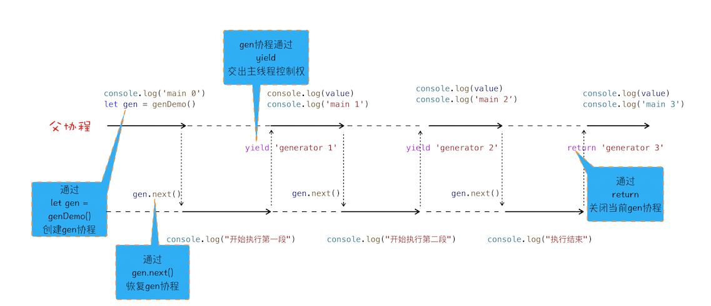
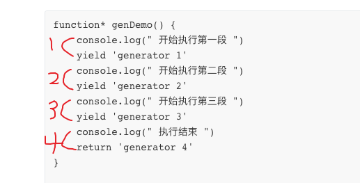
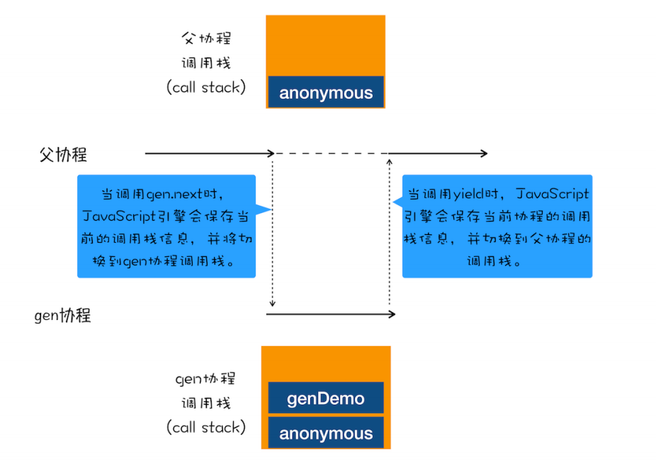
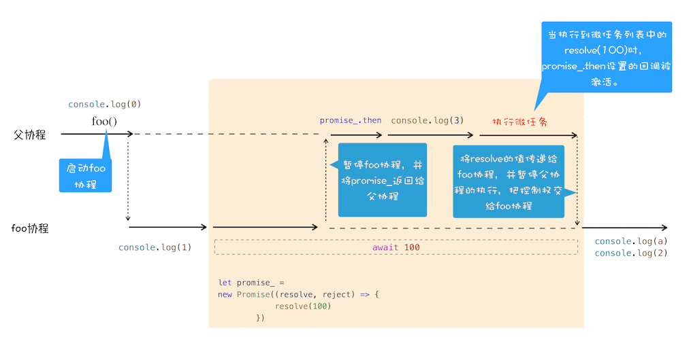
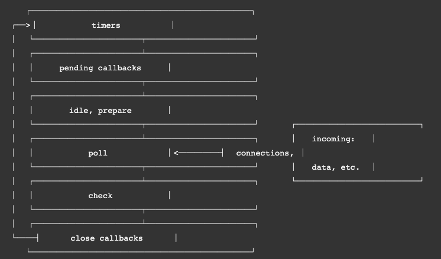

### 导言

​		每个渲染进程都有一个主线程，并且主线程非常繁忙，既要处理 DOM，又要计算样式，还要处理布局，同时还需要处理 JavaScript 任务以及各种输入事件。要让这么多不同类型的任务在主线程中有条不紊地执行，这就需要一个系统来统筹调度这些任务，这个统筹调度系统就是我们今天要讲的**消息队列**和**事件循环系统**。

### 出现原因

- 事件循环

**要想在线程运行过程中，能接收并执行新的任务，就需要采用事件循环机制**

- 消息队列


 从上图可以看出，渲染主线程会频繁接收到来自于 IO 线程的一些任务，接收到这些任务之后，渲染进程就需要着手处理。那么如何设计好一个线程模型，能让其能够接收管理其他线程发送的消息呢？

 一个通用模式是使用**消息队列**。

 **消息队列是一种数据结构，可以存放要执行的任务**。它符合队列“**先进先出**”的特点，也就是说**要添加任务的话，添加到队列的尾部；要取出任务的话，从队列头部去取**。

### 事件循环及消息队列图示


### 消息队列中的任务类型

 	输入事件（鼠标滚动、点击、移动）、微任务、文件读写、WebSocket、JavaScript 定时器等等。

​	 除此之外，消息队列中还包含了很多与页面相关的事件，如 JavaScript 执行、解析DOM、样式计算、布局计算、CSS 动画等。

​	从另一种维度区分，就是**宏任务和微任务**

#### 微任务是为了解决什么问题？

页面线程所有执行的任务都来自于消息队列。消息队列是“先进先出”的属性，也就是说放入队列中的任务，需要等待前面的任务被执行完，才会被执行。鉴于这个属性，就有如下两个问题需要解决。

微任务就是为了**处理高优先级的任务而被创建的。**每个宏任务中都包含了一个**微任务队列**，在执行宏任务的过程中，如果 有微任务产生，那么就会将该变化添加到对应的微任务列表中。当宏任务完成后，程序会直接进入当前宏任务对应的微任务列表中（此时当前的宏任务并没结束）。程序会将微任务队列中所有的微任务执行完毕后才会进入下一个宏任务，如果在微任务执行的过程中产生了新的微任务，仍会被放置进当前的微任务列表等待执行。

#### 微任务、宏任务常见类型

- macro-task:
  - script(script标签里面的整体代码)
  - setTimeout
  - setInterval
  - setImmediate(node环境和部分ie才有)
  - MessageChannel（vue nextTick 以前应该是[备选方案](https://cn.vuejs.org/v2/guide/reactivity.html)）
  - I/O
  - UI rendering
  - requestAnimationFrame
- micro-task:
  - process.nextTick(node环境才有)
  - Promise
  - Object.observe(已废弃，被下边那个取代了)
  - [MutationObserver](https://developer.mozilla.org/zh-CN/docs/Web/API/MutationObserver) (接口提供了监视对DOM树所做更改的能力)

#### setTimeout是如何实现的

 在 Chrome 中除了正常使用的消息队列之外，还有**另外一个消息队列**，这个队列中维护了需要延迟执行的任务列表，**包括了定时器和 Chromium 内部一些需要延迟执行的任务**。

 当通过 JavaScript 调用 setTimeout 设置回调函数的时候，渲染进程将会创建一个回调任务，包含了回调函数 showName、当前发起时间、延迟执行时间，其模拟代码如下所示：

```
struct DelayTask{
 int64 id； 
 CallBackFunction cbf;
 int start_time;
 int delay_time;
};
DelayTask timerTask;
timerTask.cbf = callbackFnc;
timerTask.start_time = getCurrentTime(); // 获取当前时间
timerTask.delay_time = 200;// 设置延迟执行时间
```

 创建好回调任务之后，再将该任务添加到延迟执行队列中。这里我们要重点关注它的执行时机，下面是一段模拟代码，我们可以看出**每完成一个宏任务，程序就回去延迟队列中取出已经到期的定时器任务，执行完成后进行下一轮循环**。

```
void ProcessTimerTask(){
// 从 delayed_incoming_queue 中取出已经到期的定时器任务
// 依次执行这些任务
}
TaskQueue task_queue；
void ProcessTask();
bool keep_running = true;
void MainTherad(){
  for (; ;) {
    // 执行消息队列中的任务
    Task task = task_queue.takeTask();
    ProcessTask(task);

    // 执行延迟队列中的任务
    ProcessDelayTask()

    if (!keep_running) // 如果设置了退出标志，那么直接退出线程循环
      break;
  }
}
```

#### pomise

在promise专题内详细介绍，在这里只需要**记住`promise.resolve` `promise.reject`会产生微任务**就可以了

#### async await

 async/await 使用了 `Generator` 和 `Promise` 两种技术

##### 生成器和协程

生成器函数是一个带星号函数，而且是可以暂停执行和恢复执行的

 要搞懂函数为何能暂停和恢复，那你首先要了解协程的概念。**协程一种比线程更加轻量级的存在**。你可以把协程看成是跑在线程上的任务，一个线程上可以存在多个协程，但是在线程上同时只能执行一个协程

 正如一个进程可以拥有多个线程一样，一个线程也可以拥有多个协程。最重要的是，协程不是被操作系统内核所管理，而完全是由程序所控制

看下面代码

```
function* genDemo() {
    console.log(" 开始执行第一段 ")
    yield 'generator 1'
    console.log(" 开始执行第二段 ")
    yield 'generator 2'
    console.log(" 开始执行第三段 ")
    yield 'generator 3'
    console.log(" 执行结束 ")
    return 'generator 4'
}
 
console.log('main 0')
let gen = genDemo()
console.log(gen.next().value)
console.log('main 1')
console.log(gen.next().value)
console.log('main 2')
console.log(gen.next().value)
console.log('main 3')
console.log(gen.next().value)
console.log('main 4')

```





从图中可以看出来协程的**四点规则*******：

- 通过调用生成器函数 genDemo 来创建一个协程 gen，创建之后，**gen 协程并没有立即执行**。
- 要让 gen 协程执行，需要通过调用 gen.next。
- 当协程正在执行的时候，可以通过 yield 关键字来暂停 gen 协程的执行，并返回主要信息给父协程。
- 如果协程在执行期间，**遇到了 return 关键字，那么 JavaScript 引擎会结束当前协程，并将 return 后面的内容返回给父协程**。

不过，对于上面这段代码，你可能又有这样疑问：父协程有自己的调用栈，gen 协程时也有自己的调用栈，当 gen 协程通过 yield 把控制权交给父协程时，V8 是如何切换到父协程的调用栈？当父协程通过 gen.next 恢复 gen 协程时，又是如何切换 gen 协程的调用栈？

要搞清楚上面的问题，你需要关注以下两点内容。

- 第一点：gen 协程和父协程是在主线程上交互执行的，并不是并发执行的，它们之前的切换是通过 yield 和 gen.next 来配合完成的。

- 第二点：**当在 gen 协程中调用了 yield 方法时，JavaScript 引擎会==保存 gen 协程当前的调用栈信息(包括活动对象和词法作用域)==，并恢复父协程的调用栈信息。同样，当在父协程中执行 gen.next 时，JavaScript 引擎会保存父协程的调用栈信息，并恢复 gen 协程的调用栈信息**。

为了直观理解父协程和 gen 协程是如何切换调用栈的，你可以参考下图：



###### **tips** 加深理解

看一个面试题，可以考察对于切换调用栈的理解

```
var a = 0
var b = async () => {
  a = a + await 10
  console.log('2', a) // -> '2' 10
  a = (await 10) + a
  console.log('3', a) // -> '3' 20
}
b()
a++
console.log('1', a) // -> '1' 1
```

输出

```
1 1
2 10
3 20
```

对于以上代码你可能会有疑惑，这里说明下原理

- 首先函数 `b` 先执行，在执行到 `await 10` 之前变量 `a` 还是 0，因为在 **`async` 内部实现了 `generators`** ，`generators` 会保留堆栈中东西，所以这时候 `a = 0` 被保存了下来
- 因为 `await` 是异步操作，遇到`await`就会***立即返回一个`pending`状态的`Promise`对象***，暂时返回执行代码的控制权，使得函数外的代码得以继续执行，所以会先执行 `console.log('1', a)`
- 这时候同步代码执行完毕，开始执行异步代码，将保存下来的值拿出来使用，这时候 `a = 10`
- 然后后面就是常规执行代码了

##### 加深印象的两个问题

- generator 函数是如何暂停执行程序的？

   答案是通过协程来控制程序执行。

   generator 函数是一个生成器，**执行它会返回一个迭代器**，这个迭代器同时也是一个协程。一个线程中可以有多个协程，但是同时只能有一个协程在执行。线程的执行是在内核态，是由操作系统来控制；协程的执行是在用户态，是完全由程序来进行控制，通过调用生成器的next()方法可以让该协程执行，通过yield关键字可以让该协程暂停，交出主线程控制权，通过return 关键字可以让该协程结束。协程切换是在用户态执行，而线程切换时需要从用户态切换到内核态，在内核态进行调度，协程相对于线程来说更加轻量、高效。

- **async function实现原理**？

   async function 是通过 promise + generator 来实现的。

   generator 是通过协程来控制程序调度的。在协程中执行异步任务时，先用promise封装该异步任务，如果异步任务完成，会将其结果放入微任务队列中，然后通过yield 让出主线程执行权，继续执行主线程js，主线程js执行完毕后，会去扫描微任务队列，如果有任务则取出任务进行执行，这时**通过调用迭代器的next(result)方法，并传入任务执行结果result，将主线程执行权转交给该协程继续执行，并且将result赋值给yield 表达式左边的变量，从而以同步的方式实现了异步编程**。所以说到底async function 还是通过协程+微任务+浏览器事件循环机制来实现的。

##### async、await的等价表示

写这个主要是帮助理解

```
async function foo() {
   return 1
}

等价于:

function foo() {
   return Promise.resolve(1)
}
```

```
async function foo() {
   await 1
   xxxxxxx
}

等价于:

function foo() {
   return Promise.resolve(1).then(() => {
     xxxxxxx
   })
}
```

##### async

async 是一个通过**异步执行并隐式返回 Promise** 作为结果的函数

例如

```
async function foo() {
 return 2
}
console.log(foo()) 
// Promise {<resolved>: 2}
```

##### await

用代码来分析一下吧

```
async function foo() {
  console.log(1)
  let a = await 100
  console.log(a)
  console.log(2)
}
console.log(0)
foo()
console.log(3)
```

在详细介绍之前，我们先站在协程的视角来看看这段代码的整体执行流程图：



**结合上图，我们来一起分析下 async/await 的执行流程**。

> 描述较长，理解记忆

​	首先，执行console.log(0)这个语句，打印出来 0。

​	紧接着就是执行 foo 函数，由于 foo 函数是被 async 标记过的，所以当进入该函数的时候，JavaScript 引擎会保存当前的调用栈等信息，然后执行 foo 函数中`console.log(1)`语句，并打印出 1。

​	接下来就执行到 foo 函数中的`await 100`这个语句了，这里是我们**分析的重点**，因为在执行await 100这个语句时，JavaScript 引擎在背后为我们默默做了太多的事情，那么下面我们就把这个语句拆开，来看看 JavaScript 到底都做了哪些事情。

​	**当执行到await 100时，会默认创建一个 Promise 对象**，代码如下所示：

```
let promise_ = new Promise((resolve,reject){
  resolve(100)
})
```

​	在这个 promise_ 对象创建的过程中，我们可以看到在 executor 函数中调用了 resolve 函数，JavaScript 引擎会将该任务提交给微任务队列。

​	然后 JavaScript 引擎会暂停当前协程的执行，将主线程的控制权转交给父协程执行，同时会将 **promise_ 对象返回给父协程**。

​	主线程的控制权已经交给父协程了，这时候父协程要做的一件事是调用 promise_.then 来监控 promise 状态的改变。

​	接下来继续执行父协程的流程，这里我们执行console.log(3)，并打印出来 3。随后父协程将执行结束，在结束之前，会进入微任务的检查点，然后执行微任务队列，微任务队列中有**resolve(100)的任务等待执行，执行到这里的时候，会触发 promise_.then 中的回调函数**，如下所示：

```
promise_.then((value)=>{
// 回调函数被激活后
// 将主线程控制权交给 foo 协程，并将 vaule 值传给协程
})
该回调函数被激活以后，会将主线程的控制权交给 foo 函数的协程，并同时将 value 值传给该协程。
```

​	该回调函数被激活以后，会将主线程的控制权交给 foo 函数的协程，并同时将 value 值传给该协程。

​	foo 协程激活之后，会把刚才的 value 值赋给了变量 a，然后 foo 协程继续执行后续语句，执行完成之后，将控制权归还给父协程。

​	以上就是 await/async 的执行流程。

### nodejs中的时间循环

> 没必要太过于深究，网上说的也是各不相同

首先上图



#### 先解释一下各个阶段

1. timers: 这个阶段执行setTimeout()和setInterval()设定的回调，可以认为是设置。
2. I/O callbacks: 执行几乎所有的回调，**除了**close回调，timer的回调，和setImmediate()的回调。
3. idle, prepare: 仅内部使用。
4. poll: 获取新的I/O事件；node会在适当条件下阻塞在这里。
5. check: 执行setImmediate()设定的回调。
6. close callbacks: 执行比如socket.on('close', ...)的回调。

> 我们只需要关注**timer poll check** 这三个阶段即可

#### 每个阶段的详情

##### *timer

一个timer指定一个下限时间而不是准确时间，在达到这个下限时间后执行回调。在指定时间过后，timers会尽可能早地执行回调，但系统调度或者其它回调的执行可能会延迟它们。

据我观察。**timer阶段应该会向某个队列放入到时间的定时器，以便poll阶段调用**

> 注意：**技术上来说，poll 阶段控制 timers 什么时候执行**。

##### Pending callbacks

执行延迟到下一个循环迭代的 I/O 回调。此阶段对某些系统操作（如 TCP 错误类型）执行回调。例如，如果 TCP 套接字在尝试连接时接收到 `ECONNREFUSED`，则某些 *nix 的系统希望等待报告错误。这将被排队以在挂起的回调阶段执行。

##### *poll 重点分析

poll 阶段的流程

- 执行 poll 阶段的任务队列。
- 如果为空了，则检查是否存在已达到时间阈值的计时器(timers)，如果有则跳转至timers阶段

**没有被调度的计时器时，将会发生以下情况**

- 如果 poll 队列不为空的话，会执行 poll 队列直到清空或者系统回调数达到了与系统相关的硬性限制
- 如果 poll 队列为空
  - 如果设定了 setImmediate 回调，会直接跳到 check 阶段。
  - 如果没有设定 setImmediate 回调，会阻塞住进程，并等待新的 poll 任务（**定时器或者新的I/O事件**）加入并立即执行。

> 来自于charTGp
>
> 在 Node.js 中，Poll 阶段阻塞时，不会立即进入 Check 阶段。相反，Node.js 会等待事件循环中的 Poll 阶段完成或者达到一定条件时，才会继续执行 Check 阶段。具体的情况如下：
>
> 1. **当 Poll 阶段有事件到达时**：如果在 Poll 阶段有 I/O 事件（例如网络请求或文件读取）到达，事件循环会立即离开 Poll 阶段，处理这些事件的回调函数，并且不会进入 Check 阶段，直接返回到 Timers 阶段，以执行定时器回调函数。
> 2. **当 Poll 阶段没有事件到达，但有 setImmediate 回调函数时**：如果 Poll 阶段没有待处理的事件，事件循环会继续检查是否有设置了 `setImmediate` 的回调函数需要执行，如果有，它会离开 Poll 阶段，进入 Check 阶段执行这些回调函数。
> 3. **在某些情况下，可能需要 Poll 阶段显式让出控制**：有时，开发者可能需要在 Poll 阶段显式让出控制，以便在稍后的事件循环迭代中进入 Check 阶段。这可以通过使用 `process.nextTick` 来实现。`process.nextTick` 的回调函数会在当前事件循环迭代的末尾执行，然后才进入下一个迭代的 Check 阶段。
>
> 总之，在大多数情况下，当 Poll 阶段没有待处理的事件时，事件循环会立即检查是否有 `setImmediate` 回调函数需要执行，然后再进入 Check 阶段。这就是为什么 `setImmediate` 的回调函数有时被描述为 "下一个事件循环迭代中执行" 的原因。但需要注意，`setImmediate` 回调函数也不能保证立即执行，它仍然受到事件循环的进程调度和其他因素的影响。

##### *check

这个阶段在 poll 结束后立即执行，setImmediate 的回调会在这里执行。

一般来说，event loop 肯定会进入 poll 阶段，当没有 poll 任务时，会等待新的任务出现，但如果设定了 setImmediate，会直接执行进入下个阶段而不是继续等。

##### close

如果套接字或处理函数突然关闭（例如 `socket.destroy()`），则`'close'` 事件将在这个阶段发出。否则它将通过 `process.nextTick()` 发出???。

#### 帮助理解的例子

```
var fs = require('fs');

function someAsyncOperation (callback) {
  // 假设这个任务要消耗 95ms
  fs.readFile('/path/to/file', callback);
}

var timeoutScheduled = Date.now();

setTimeout(function () {

  var delay = Date.now() - timeoutScheduled;

  console.log(delay + "ms have passed since I was scheduled");
}, 100);


// someAsyncOperation要消耗 95 ms 才能完成
someAsyncOperation(function () {

  var startCallback = Date.now();

  // 消耗 10ms...
  while (Date.now() - startCallback < 10) {
    ; // do nothing
  }

});
复制代码
```

当event loop进入 poll 阶段，它有个空队列（fs.readFile()尚未结束）。所以它会等待剩下的毫秒， 直到最近的timer的下限时间到了。当它等了95ms，fs.readFile()首先结束了，然后它的回调被加到 poll 的队列并执行——这个回调耗时10ms。之后由于没有其它回调在队列里，所以event loop会查看最近达到的timer的 下限时间，然后回到 timers 阶段，执行timer的回调。

所以在示例里，回调被设定 和 回调执行间的间隔是105ms。

#### setImmediate() vs setTimeout()

现在我们应该知道两者的不同，他们的执行阶段不同，setImmediate() 在 check 阶段，而settimeout 在 poll 阶段执行。但，还不够。来看一下例子。

```
// timeout_vs_immediate.js
setTimeout(function timeout () {
  console.log('timeout');
},0);

setImmediate(function immediate () {
  console.log('immediate');
});
复制代码
$ node timeout_vs_immediate.js
timeout
immediate

$ node timeout_vs_immediate.js
immediate
timeout
复制代码
```

结果居然是不确定的，why？

还是直接给出解释吧。

1. 首先进入timer阶段，如果我们的机器性能一般，那么进入timer阶段时，1毫秒可能已经过去了（setTimeout(fn, 0) 等价于setTimeout(fn, 1)），那么setTimeout的回调会首先执行。
2. 如果没到一毫秒，那么我们可以知道，在check阶段，setImmediate的回调会先执行。

那我们再来一个

```
// timeout_vs_immediate.js
var fs = require('fs')

fs.readFile(__filename, () => {
  setTimeout(() => {
    console.log('timeout')
  }, 0)
  setImmediate(() => {
    console.log('immediate')
  })
})
复制代码
```

输出始终为

```
$ node timeout_vs_immediate.js
immediate
timeout
复制代码
```

这个就很好解释了吧。 fs.readFile 的回调执行是在 poll 阶段。当 fs.readFile 回调执行完毕之后，会直接到 check 阶段，先执行 setImmediate 的回调。

#### process.nextTick()

nextTick 比较特殊，它有自己的队列，并且，独立于event loop。 它的执行也非常特殊，**无论 event loop 处于何种阶段，都会在<u>当前</u>阶段结束的时候清空 nextTick 队列**。

#### promise

​	`promise`和`process.nextTick()`类似，处在任意阶段的末尾，如果有上述两种任务，都会在当前阶段结束前执行

但是优先级比nextTick低。

https://www.udemy.com/course/nodejs-express-mongodb-bootcamp/learn/lecture/15064744#overview

#### 代码示例

```
const fs = require('fs');

setTimeout(() => {
  console.log('setTimeout 1');
}, 0);

setImmediate(() => {
  console.log('setImmediate 1');
});

fs.readFile('./test-file.txt', () => {
  console.log('readFile');
  setTimeout(() => {
    console.log('setTimeout 2');
  }, 0);

  setTimeout(() => {
    console.log('setTimeout 3');
  }, 3000);

  setImmediate(() => {
    console.log('setImmediate 2');
  });

  Promise.resolve().then(() => {
    console.log('promise 1');
  });

  process.nextTick(() => {
    console.log('nextTick 1');
  });

  Promise.resolve().then(() => {
    console.log('promise 2');
  });
});

// nextTick 会在每个阶段结束前运行 
// promise 优先级不如nextTick

// setImmediate 1
// setTimeout 1
// readFile
// nextTick 1
// promise 1
// promise 2
// setImmediate 2
// setTimeout 2
// setTimeout 3
```

#### 简化版

**一句话总结**

timers（定时器） => poll（i/o） => check(setImmediate)，

`promise`和`process.nextTick()`类似，处在任意阶段的末尾，如果有上述两种任务，都会在当前阶段结束前执行


参考：

[腾讯](https://juejin.cn/post/6844903685936381959#heading-8)

[node官网](https://nodejs.org/zh-cn/docs/guides/event-loop-timers-and-nexttick/)

[掘金](https://juejin.cn/post/6844903761949753352#heading-22)
