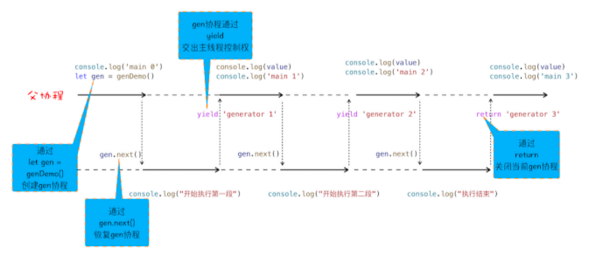
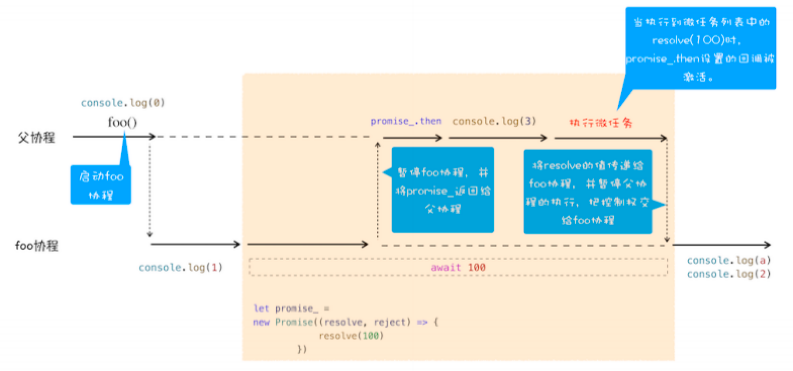

### 导言
每个渲染进程都有一个主线程，并且主线程非常繁忙，既要处理 DOM，又要计算样式，还要处理布局，同时还需要处理 JavaScript 任务以及各种输入事件。要让这么多不同类型的任务在主线程中有条不紊地执行，这就需要一个系统来统筹调度这些任务，这个统筹调度系统就是我们今天要讲的**消息队列**和**事件循环系统**。
### 出现原因
- 事件循环

**要想在线程运行过程中，能接收并执行新的任务，就需要采用事件循环机制**

- 消息队列


​	从上图可以看出，渲染主线程会频繁接收到来自于 IO 线程的一些任务，接收到这些任务之后，渲染进程就需要着手处理。那么如何设计好一个线程模型，能让其能够接收管理其他线程发送的消息呢？

​	一个通用模式是使用**消息队列**。

​	**消息队列是一种数据结构，可以存放要执行的任务**。它符合队列“**先进先出**”的特点，也就是说**要添加任务的话，添加到队列的尾部；要取出任务的话，从队列头部去取**。

### 事件循环及消息队列图示


### 消息队列中的任务类型

​	输入事件（鼠标滚动、点击、移动）、微任务、文件读写、WebSocket、JavaScript 定时器等等。

​	除此之外，消息队列中还包含了很多与页面相关的事件，如 JavaScript 执行、解析DOM、样式计算、布局计算、CSS 动画等。

#### 微任务是为了解决什么问题？

​	页面线程所有执行的任务都来自于消息队列。消息队列是“先进先出”的属性，也就是说放入队列中的任务，需要等待前面的任务被执行完，才会被执行。鉴于这个属性，就有如下两个问题需要解决。

​	微任务就是为了**处理高优先级的任务而被创建的。**每个宏任务中都包含了一个**微任务队列**，在执行宏任务的过程中，如果 有微任务产生，那么就会将该变化添加到对应的微任务列表中。当宏任务完成后，程序会直接进入当前宏任务对应的微任务列表中（此时当前的宏任务并没结束）。程序会将微任务队列中所有的微任务执行完毕后才会进入下一个宏任务，如果在微任务执行的过程中产生了新的微任务，仍会被放置进当前的微任务列表等待执行。

#### 微任务、宏任务常见类型

- macro-task:
  - script(script标签里面的整体代码) 
  - setTimeout
  - setInterval
  - setImmediate
  - MessageChannel（vue nextTick 以前应该是[备选方案](https://cn.vuejs.org/v2/guide/reactivity.html)）
  - I/O
  - UI rendering
  - requestAnimationFrame
- micro-task:
  - process.nextTick
  - Promise
  - Object.observe(已废弃，被下边那个取代了)
  - [MutationObserver](https://developer.mozilla.org/zh-CN/docs/Web/API/MutationObserver) (接口提供了监视对DOM树所做更改的能力) 

#### setTimeout是如何实现的

​	在 Chrome 中除了正常使用的消息队列之外，还有**另外一个消息队列**，这个队列中维护了需要延迟执行的任务列表，包括了定时器和 Chromium 内部一些需要延迟执行的任务。

​	当通过 JavaScript 调用 setTimeout 设置回调函数的时候，渲染进程将会创建一个回调任务，包含了回调函数 showName、当前发起时间、延迟执行时间，其模拟代码如下所示：

```
struct DelayTask{
	int64 id； 
	CallBackFunction cbf;
	int start_time;
	int delay_time;
};
DelayTask timerTask;
timerTask.cbf = callbackFnc;
timerTask.start_time = getCurrentTime(); // 获取当前时间
timerTask.delay_time = 200;// 设置延迟执行时间
```

​	创建好回调任务之后，再将该任务添加到延迟执行队列中。这里我们要重点关注它的执行时机，下面是一段模拟代码，我们可以看出**每完成一个宏任务，程序就回去延迟队列中取出已经到期的定时器任务，执行完成后进行下一轮循环**。

```
void ProcessTimerTask(){
// 从 delayed_incoming_queue 中取出已经到期的定时器任务
// 依次执行这些任务
}
TaskQueue task_queue；
void ProcessTask();
bool keep_running = true;
void MainTherad(){
  for (; ;) {
    // 执行消息队列中的任务
    Task task = task_queue.takeTask();
    ProcessTask(task);

    // 执行延迟队列中的任务
    ProcessDelayTask()

    if (!keep_running) // 如果设置了退出标志，那么直接退出线程循环
      break;
  }
}
```


#### pomise

在promise专题内详细介绍，在这里只需要**记住`promise.resolve` `promise.reject`会产生微任务**就可以了


#### async await

 async/await 使用了 `Generator` 和 `Promise` 两种技术

##### 生成器和协程

生成器函数是一个带星号函数，而且是可以暂停执行和恢复执行的

​	要搞懂函数为何能暂停和恢复，那你首先要了解协程的概念。**协程一种比线程更加轻量级的存在**。你可以把协程看成是跑在线程上的任务，一个线程上可以存在多个协程，但是在线程上同时只能执行一个协程

​	正如一个进程可以拥有多个线程一样，一个线程也可以拥有多个协程。最重要的是，协程不是被操作系统内核所管理，而完全是由程序所控制

看下面代码

```
function* genDemo() {
    console.log(" 开始执行第一段 ")
    yield 'generator 2'
 
    console.log(" 开始执行第二段 ")
    yield 'generator 2'
 
    console.log(" 开始执行第三段 ")
    yield 'generator 2'
 
    console.log(" 执行结束 ")
    return 'generator 2'
}
 
console.log('main 0')
let gen = genDemo()
console.log(gen.next().value)
console.log('main 1')
console.log(gen.next().value)
console.log('main 2')
console.log(gen.next().value)
console.log('main 3')
console.log(gen.next().value)
console.log('main 4')

```



从图中可以看出来协程的**四点规则**：

- 通过调用生成器函数 genDemo 来创建一个协程 gen，创建之后，gen 协程并没有立即执行。
- 要让 gen 协程执行，需要通过调用 gen.next。
- 当协程正在执行的时候，可以通过 yield 关键字来暂停 gen 协程的执行，并返回主要信息给父协程。
- 如果协程在执行期间，遇到了 return 关键字，那么 JavaScript 引擎会结束当前协程，并将 return 后面的内容返回给父协程。

##### async

async 是一个通过**异步执行并隐式返回 Promise** 作为结果的函数

例如

```
async function foo() {
	return 2
}
console.log(foo()) 
// Promise {<resolved>: 2}
```

##### await

用代码来分下一下吧

```
async function foo() {
  console.log(1)
  let a = await 100
  console.log(a)
  console.log(2)
}
console.log(0)
foo()
console.log(3)
```

在详细介绍之前，我们先站在协程的视角来看看这段代码的整体执行流程图：



**结合上图，我们来一起分析下 async/await 的执行流程**。

> 描述较长，理解记忆

首先，执行console.log(0)这个语句，打印出来 0。紧接着就是执行 foo 函数，由于 foo 函数是被 async 标记过的，所以当进入该函数的时候，JavaScript 引擎会保存当前的调用栈等信息，然后执行 foo 函数中的console.log(1)语句，并打印出 1。

接下来就执行到 foo 函数中的`await 100`这个语句了，这里是我们**分析的重点**，因为在执行await 100这个语句时，JavaScript 引擎在背后为我们默默做了太多的事情，那么下面我们就把这个语句拆开，来看看 JavaScript 到底都做了哪些事情。

**当执行到await 100时，会默认创建一个 Promise 对象**，代码如下所示：

```
let promise_ = new Promise((resolve,reject){
	resolve(100)
})
```

在这个 promise_ 对象创建的过程中，我们可以看到在 executor 函数中调用了 resolve 函数，JavaScript 引擎会将该任务提交给微任务队列。

然后 JavaScript 引擎会暂停当前协程的执行，将主线程的控制权转交给父协程执行，同时会将 promise_ 对象返回给父协程。

主线程的控制权已经交给父协程了，这时候父协程要做的一件事是调用 promise_.then 来监控 promise 状态的改变。

接下来继续执行父协程的流程，这里我们执行console.log(3)，并打印出来 3。随后父协程将执行结束，在结束之前，会进入微任务的检查点，然后执行微任务队列，微任务队列中有resolve(100)的任务等待执行，执行到这里的时候，会触发 promise_.then 中的回调函数，如下所示：

```
promise_.then((value)=>{
// 回调函数被激活后
// 将主线程控制权交给 foo 协程，并将 vaule 值传给协程
})
该回调函数被激活以后，会将主线程的控制权交给 foo 函数的协程，并同时将 value 值传给该协程。
```

foo 协程激活之后，会把刚才的 value 值赋给了变量 a，然后 foo 协程继续执行后续语句，执行完成之后，将控制权归还给父协程。

主线程的控制权已经交给父协程了，这时候父协程要做的一件事是调用 promise_.then 来监控 promise 状态的改变。

接下来继续执行父协程的流程，这里我们执行console.log(3)，并打印出来 3。随后父协程将执行结束，在结束之前，会进入微任务的检查点，然后执行微任务队列，微任务队列中有resolve(100)的任务等待执行，执行到这里的时候，会触发 promise_.then 中的回调函数，如下所示：

```
promise_.then((value)=>{
	// 回调函数被激活后
  // 将主线程控制权交给 foo 协程，并将 vaule 值传给协程
})
```

该回调函数被激活以后，会将主线程的控制权交给 foo 函数的协程，并同时将 value 值传

给该协程。

foo 协程激活之后，会把刚才的 value 值赋给了变量 a，然后 foo 协程继续执行后续语句，执行完成之后，将控制权归还给父协程。

以上就是 await/async 的执行流程。

